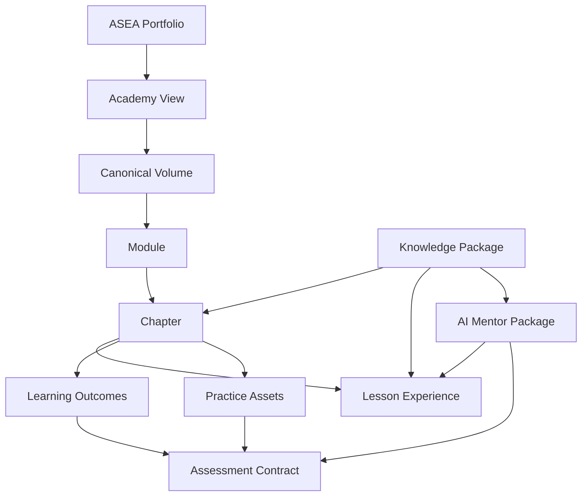

# ASEA Blueprint v2 Curriculum Hierarchy

## Purpose

This document defines the proposed logical hierarchy and authority boundaries
for a multi-Academy ASEA curriculum.

## Scope

It covers Portfolio, Academy view, Volume, Module, Chapter, Lesson experience,
Learning Outcome, assessment, knowledge package, and AI Mentor relationships.

## Ownership

- Standards v2 owns canonical schemas and precedence.
- Volume Blueprints own Volume scope and planned artefacts.
- Authoritative maps own Module and Chapter records.
- The Learning Outcomes Registry owns outcome meaning.
- Assessment records own evidence and passing contracts.
- KOS registries own Sources, Evidence, Claims, Concepts, and graph records.
- Lesson and AI Mentor views own no curriculum meaning.

## Content

### Logical model

The arrows express composition or traceability, not authority inheritance.

### Layer contracts

| Layer | Responsibility | Canonical status |
| --- | --- | --- |
| Portfolio | Repository-wide discovery | Derived |
| Academy view | Group Volumes into a domain pathway | Derived catalog |
| Volume | Own a bounded competency progression | Canonical |
| Module | Group Chapter competency gates | Canonical map record |
| Chapter | Own a teachable learning contract | Canonical |
| Lesson experience | Present one Chapter through one or more views | Derived until integrated as Chapter content |
| Learning Outcome | Define measurable learner performance | Canonical |
| Assessment | Define evidence, scoring, and retry rules | Canonical |
| Knowledge Package | Pin researched knowledge used for production | KOS canonical or derived packet |
| AI Mentor Package | Ground guidance and safety behavior | Derived, reviewed |

### Curriculum relationships

- One Academy view contains one or more Volumes.
- A Volume may appear in multiple Academy views without being duplicated.
- A Volume contains ordered Module records.
- A Module contains one or more Chapters and a competency gate.
- A Chapter maps to at least one Learning Outcome.
- Every outcome maps to instruction, practice, and assessment evidence.
- A Lesson experience resolves to exactly one canonical Chapter contract.
- A Chapter may have multiple delivery views, but only one semantic Chapter
  authority per version.

### Dependency hierarchy

Dependencies are declared at the lowest meaningful canonical level:

- Academy prerequisite summaries derive from Volume dependencies.
- Volume prerequisites use Volume IDs.
- Module gates derive from Chapter and outcome evidence.
- Chapter prerequisites use existing Volume, Chapter, or outcome IDs.
- Lesson navigation derives from the Chapter map.
- AI Mentor readiness derives from prerequisite concepts and outcomes.

### Reuse without duplication

A single Volume can serve multiple Academy views. For example, Programming
Foundations can be a prerequisite in JavaScript, Backend, Data Engineering,
Mobile Development, and Game Development views. Each Academy links to the same
Volume ID and does not copy its Chapters or outcomes.

## Validation

- Every layer has one responsibility.
- Derived layers do not own canonical semantics.
- Existing `V01-*` relationships remain valid.
- The graph permits multi-Academy reuse without duplicate Volumes.
- Assessment and knowledge traceability remain bidirectional.

## References

- [Curriculum Standard v2](../docs/standards/curriculum-standard-v2.md)
- [Volume Standard v2](../docs/standards/volume-standard-v2.md)
- [Chapter Standard v2](../docs/standards/chapter-standard-v2.md)
- [Identifier Design](./03-identifier-standard.md)
