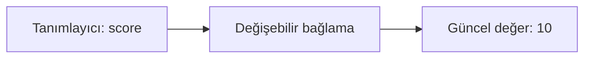
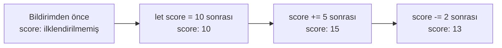
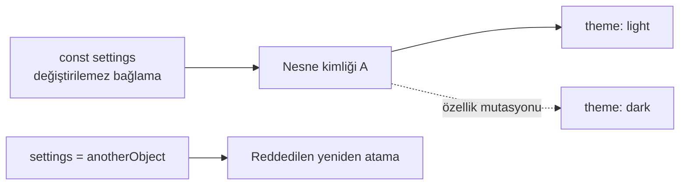
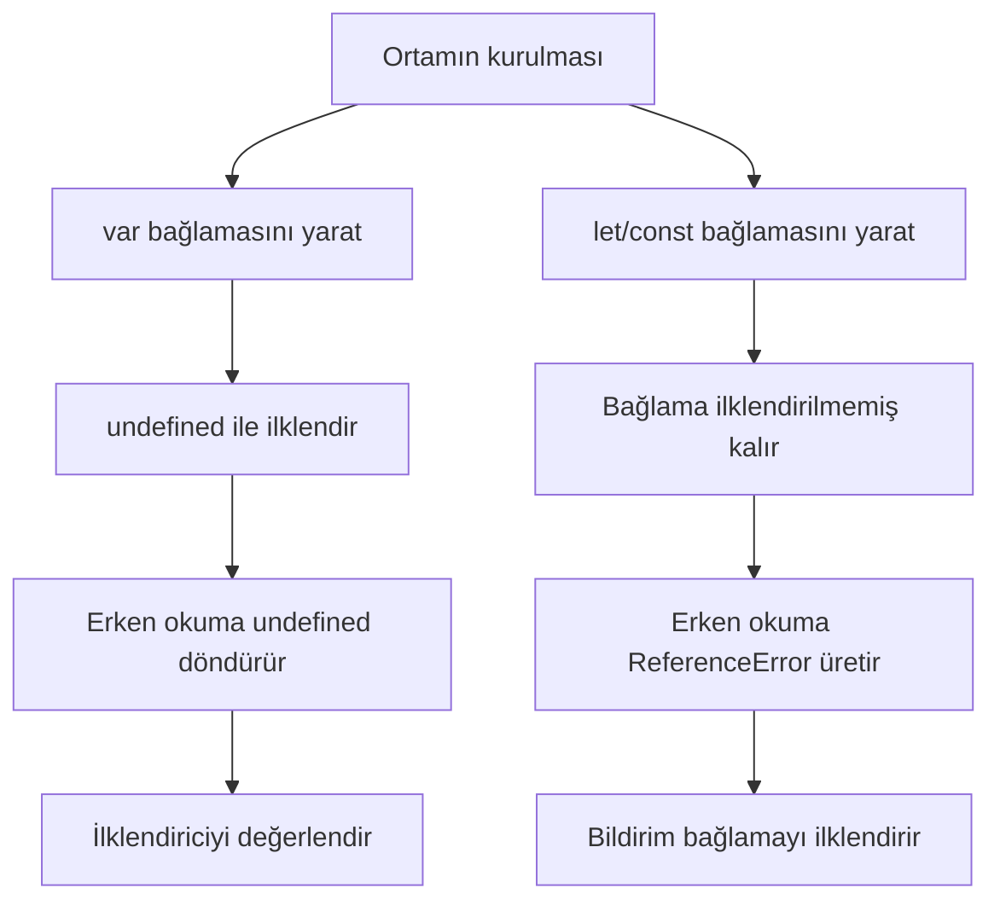
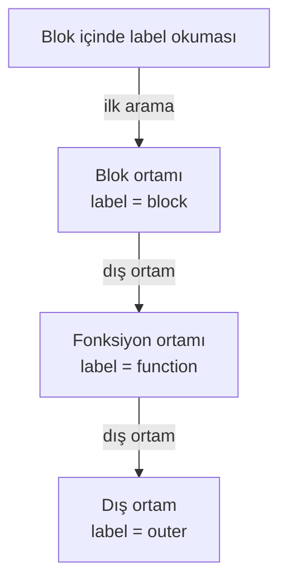
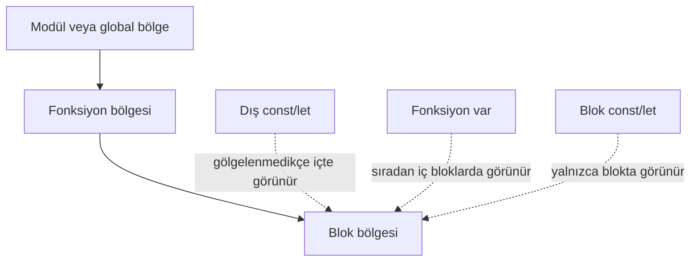
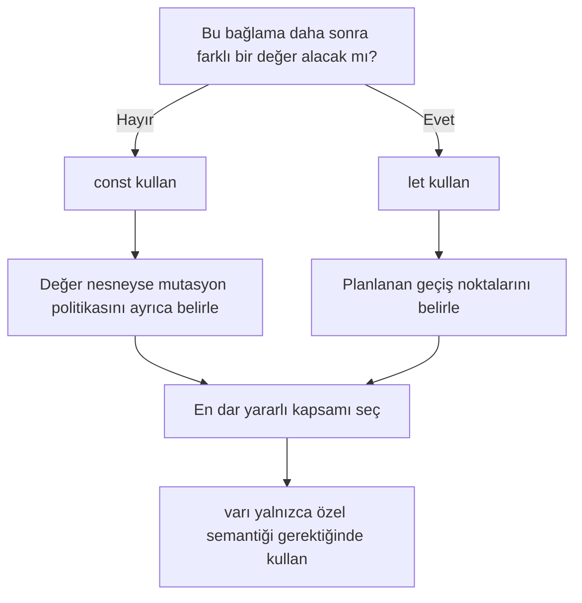
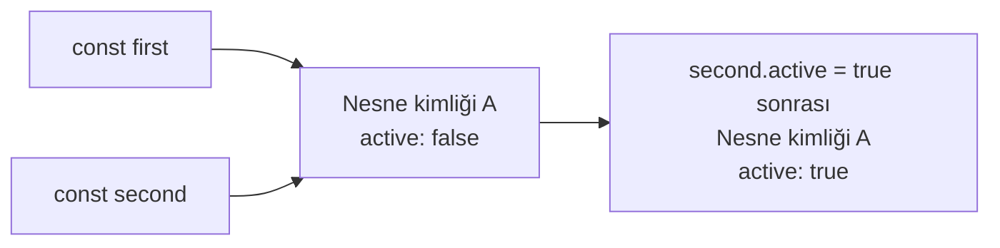

# Değişkenler (Variables) ve Durum (State): Görselleştirme Notları

<!-- markdownlint-disable MD024 -->

Teknik sözlük: bağlama (binding), bildirim (declaration), ilklendirme
(initialization), atama (assignment), yeniden atama (reassignment), mutasyon
(mutation), kapsam (scope), fonksiyon (function), Geçici Ölü Bölge (Temporal
Dead Zone) ve yukarı kaldırma (hoisting).

Bu notlar [Değişkenler ve Durum](./lesson.md) dersi için erişilebilir görsel
üretim sözleşmeleridir. Sunum dosyası değildir.

## Görsel İlkeler

Her görsel:

- tanımlayıcı, bağlama, değer ve nesneyi ayırmalı;
- yalnızca renge değil renk ve metin etiketine birlikte dayanmalı;
- siyah-beyaz görünümde anlaşılabilir olmalı;
- eşdeğer metin içermeli;
- dil semantiğini mi motor uygulamasını mı gösterdiğini belirtmeli;
- evrensel yığın/öbek görselinden kaçınmalı;
- dar ekranlarda okunabilir kalmalı;
- animasyon kullanıyorsa statik alternatif sunmalıdır.

Mermaid içindeki düğüm etiketleri eğitim dili gereği Türkçedir. Mermaid sözdizimi
ve teknik anahtar sözcükler İngilizce kalır.

## Görsel 1: Bağlama Anatomisi

### Öğrenme amacı

Kaynak koddaki adın, güncel değeri değişebilen bağlamayı çözümlediğini göstermek.

### Mermaid kaynağı

### Animasyon durumları

1. `score` adını gösterin.
2. Bağlamayı ortaya çıkarın.
3. `10` değerini bağlayın.
4. `score = 15` komutunu çalıştırın.
5. Tanımlayıcı ve bağlamayı sabit tutup değer etiketini `15` yapın.

### Eşdeğer metin

`score` tanımlayıcısı tek bir değişebilir bağlamayı çözümler. Güncel değer önce
`10`, yeniden atamadan sonra `15` olur.

### Doğruluk uyarısı

Bağlamayı fiziksel RAM adresi olarak çizmeyin. Görseli “soyut dil modeli” diye
etiketleyin.

## Görsel 2: Durum Zaman Çizelgesi

### Öğrenme amacı

Atama komutlarını gözlemlenebilir durum geçişlerine bağlamak.

### Mermaid kaynağı

### Statik alternatif

| Durum | Son çalışan komut | `score` |
| --- | --- | ---: |
| S0 | Yok | İlklendirilmemiş |
| S1 | `let score = 10` | 10 |
| S2 | `score += 5` | 15 |
| S3 | `score -= 2` | 13 |

### Eşdeğer metin

Aynı bağlama, komutlar çalıştıkça ilklendirilmemiş durumdan `10`, `15` ve `13`
değerlerine ilerler.

## Görsel 3: Yeniden Atama ve Mutasyon

### Öğrenme amacı

Değiştirilemez bağlamayı değişebilir nesne durumundan ayırmak.

### Mermaid kaynağı

### Yerleşim notları

- Bağlama-nesne ilişkisi için düz ok kullanın.
- Özellik mutasyonu için kesikli geçiş kullanın.
- Reddedilen yeniden atamayı ayrı şeritte gösterin.
- İki özellik durumunda da “Nesne kimliği A” etiketini koruyun.

### Eşdeğer metin

`settings` bağlaması A nesnesine başvurmaya devam eder. Nesnenin `theme`
özelliği `light`tan `dark`a değişir. `settings`i başka nesneye bağlama girişimi
reddedilir.

### Doğruluk uyarısı

Nesneyi “sabit” diye etiketlemeyin; yalnızca bağlama değiştirilemezdir.

## Görsel 4: Bildirim Yaşam Döngüsü

### Öğrenme amacı

Erken okumayı ve Geçici Ölü Bölgeyi oluşturma/ilklendirme zamanıyla açıklamak.

### Mermaid kaynağı

### Eşdeğer metin

Ardışık komutlardan önce `var` bağlaması yaratılır ve `undefined` ile
ilklendirilir. `let` veya `const` bağlaması yaratılır fakat ilklendirilmez.
Birincinin erken okuması `undefined`, ikincinin erken okuması `ReferenceError`
üretir.

### Doğruluk uyarısı

Kaynak satırlarını yukarı hareket ettirmeyin; yaşam döngüsü durumlarını
canlandırın.

## Görsel 5: İç İçe Kapsam Araması

### Öğrenme amacı

Gölgelemede en yakın erişilebilir bağlamanın seçildiğini göstermek.

### Mermaid kaynağı

### Eşdeğer metin

Blok içindeki `label` okuması önce blok ortamına bakar. Eşleşen bağlama orada
bulunduğu için arama durur; fonksiyon ve dış ortam bağlamaları bu okuma için
gölgelenir.

### Doğruluk uyarısı

Ortam kayıtları dil standardı mekanizmalarıdır. Her ortam için motorun sıradan
bir öbek nesnesi ayırdığını iddia etmeyin.

## Görsel 6: Kapsam Bölgeleri

### Öğrenme amacı

Her süslü parantezin `var`ı kapsadığı izlenimi oluşturmadan global, fonksiyon ve
blok görünürlüğünü karşılaştırmak.

### Mermaid kaynağı

### Eşdeğer metin

Dış sözlüksel bağlamalar gölgelenmedikçe iç bölgelerden okunabilir. Fonksiyon
gövdesindeki `var` sıradan iç bloklarda görünür kalır. Blok `let` veya `const`
bağlaması yalnızca o blok ve iç bölgelerinde kullanılabilir.

### Doğruluk uyarısı

Klasik betik globali, modül kapsamı ve çalışma ortamı sarmalayıcıları farklıdır.
Ortam açıkça belirtilene kadar “modül veya global bölge” ifadesini kullanın.

## Görsel 7: Bağlama Seçim Akışı

### Öğrenme amacı

`const`/`let` seçimini mühendislik kararına dönüştürmek.

### Mermaid kaynağı

### Eşdeğer metin

Bağlama başka değer almayacaksa `const`, alacaksa `let` kullanın ve planlanan
güncellemeleri belirleyin. Nesne değerlerinde mutasyon politikasını ayrıca
kararlaştırın. Sonra en dar kapsamı seçin.

## Görsel 8: Paylaşılan Nesne Kimliği

### Öğrenme amacı

Bir bağlama üzerinden yapılan mutasyonun neden diğeri üzerinden göründüğünü
göstermek.

### Mermaid kaynağı

### Eşdeğer metin

`first` ve `second` bağlamaları A nesnesine başvurur. `active` özelliği
`second` üzerinden güncellendiğinde A nesnesi değişir; `first.active` okuması
`true` üretir.

### Doğruluk uyarısı

`second = first` işlemini nesne kopyalama olarak açıklamayın.

## Varlık Üretim Kontrol Listesi

- Mermaid sözdizimi ayrıştırılabilir.
- Her görsel tek öğrenme amacına sahiptir.
- Etiketler ders terminolojisini kullanır.
- Durum geçişleri sıralı ve belirsizlikten uzaktır.
- Hata yolları yalnızca desteklenen yerde `SyntaxError`, `ReferenceError` veya
  `TypeError` sınıfını kullanır.
- Statik alternatif animasyondaki bütün bilgiyi taşır.
- Eşdeğer metin görsel olmadan anlaşılır.
- Renk karşıtlığı hedef arayüz erişilebilirlik standardını karşılar.
- Hiçbir görsel sabit fiziksel bellek yerleşimi iddia etmez.
- Motor uygulaması ECMAScript semantiği gibi sunulmaz.

## Kaynak Temeli

- [Variables Research Packet](../../../research/programming-fundamentals/variables/research-packet.md)
- [Ders varlıkları](./lesson-assets.md)
- [ECMAScript Language Specification](https://tc39.es/ecma262/)
