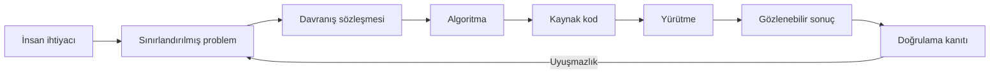
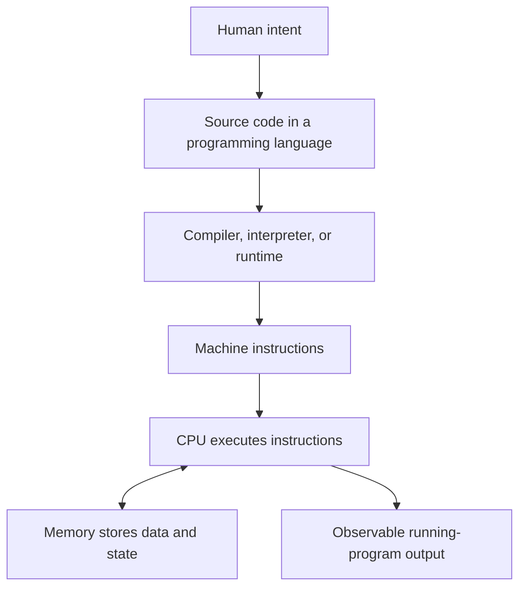
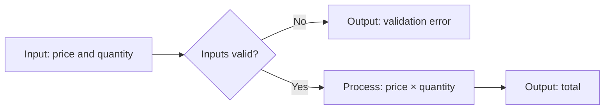
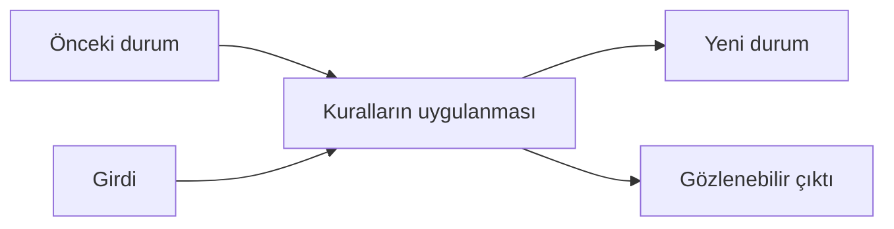
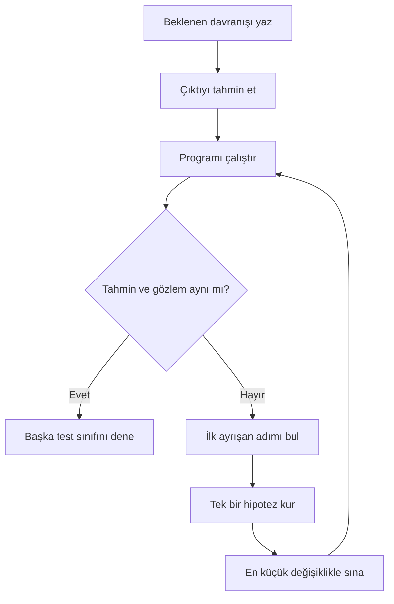
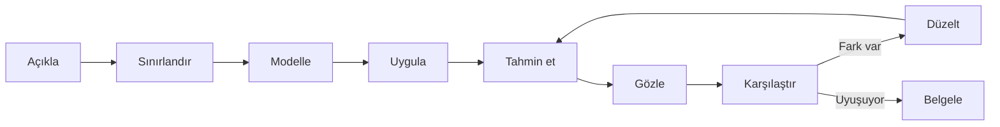
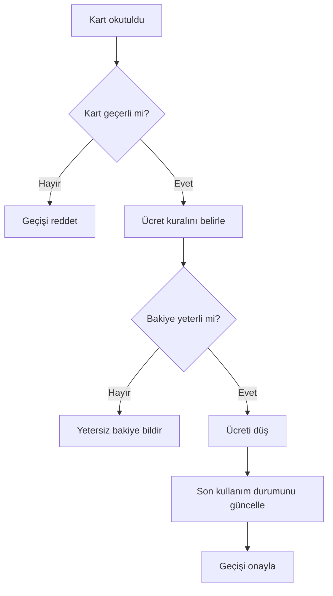

# What Is Programming? — Programlama Nedir?

## Learning Objectives

Bu Chapter tamamlandığında öğrenci:

- **V01-LO001:** program, algoritma, talimat ve hesaplama kavramlarını iki farklı örnek üzerinde doğru biçimde ayırabilir;
- **V01-LO002:** belirsiz bir günlük süreci en az sekiz kesin, sıralı ve test edilebilir talimata dönüştürebilir.

Başarı, tanımları ezberlemekle değil; yeni bir durumda kavram sınırlarını açıklamak ve başka bir kişinin aynı sonucu üretebileceği talimat kanıtı sunmakla gösterilir.

## Prerequisites

Bu Chapter herhangi bir programlama dili bilgisi gerektirmez. Öğrencinin Volume 00 çalışma, kanıt üretme ve yansıtma disiplinini tamamlamış olması beklenir. Bir metin düzenleyici ve modern bir tarayıcı ya da Node.js çalışma ortamı örnekleri denemek için yeterlidir.

Başlamadan önce şu tanılayıcı soruyu yanıtlayın: “Bir işi yaptığımı nasıl kanıtlarım?” Cevabınız yalnızca “sonuç doğru görünüyor” ise bu Chapter boyunca ara durumları, varsayımları ve testleri de kanıt olarak kullanmayı öğreneceksiniz.

## Estimated Study Time

| Etkinlik | Süre |
|---|---:|
| Kavramsal okuma, not çıkarma ve diyagramlar | 120-150 dakika |
| Örnekleri tahmin etme, elle izleme ve çalıştırma | 60-75 dakika |
| [Kademeli alıştırmalar](../programming-fundamentals/content/v01-c01/exercises.md) | 75-90 dakika |
| [Laboratuvar](../programming-fundamentals/content/v01-c01/lab.md) | 90-120 dakika |
| Quiz, yansıtma ve öz değerlendirme | 45-60 dakika |

Toplam süre 7-9 saattir. Bu süreyi en az üç çalışma oturumuna bölmeniz önerilir. Laboratuvarı ayrı bir oturumda tamamlamak öğrenme hedefini değiştirmez.

## Introduction

### Bu Dersi Nasıl Çalışmalısınız?

Bu metin yalnızca okunacak bir makale değildir. Her ana kavramdan sonra kitabı
kapatıp kavramı kendi cümlenizle açıklayın; kodu çalıştırmadan önce çıktıyı
tahmin edin; belirsiz talimat örneklerini yazılı ve test edilebilir hâle getirin.
Yanlış tahmin, başarısızlık değil zihinsel modelinizin hangi noktada
düzeltilmesi gerektiğini gösteren kanıttır.

Çalışmayı üç oturuma bölebilirsiniz:

1. **Kavram oturumu:** program, algoritma, talimat, hesaplama ve yürütme
   sınırlarını öğrenin.
2. **Uygulama oturumu:** örnekleri, alıştırmaları ve hata ayıklama görevini
   tamamlayın.
3. **Kanıt oturumu:** quiz, laboratuvar ve değerlendirme rubriğiyle iki öğrenme
   çıktısını ayrı ayrı kanıtlayın.

Tüm materyallere [C01 referans paketinden](../programming-fundamentals/content/v01-c01/chapter.md)
ulaşabilirsiniz.

### Merak

Bir bilgisayar neden “ne demek istediğinizi” anlamaz? Bir yemek tarifinde “biraz ısıt”, bir yol tarifinde “yakındaki sokaktan dön” diyebilirsiniz. İnsan, bağlamı ve ortak deneyimi kullanarak boşlukları doldurur. Bilgisayar ise hangi sokağın “yakın”, hangi sıcaklığın “biraz” olduğunu kendiliğinden kararlaştıramaz.

Programlamanın başlangıç noktası noktalı virgül, değişken veya belirli bir dil değildir. Başlangıç noktası, belirsiz bir niyeti yürütülebilir ve doğrulanabilir bir davranış sözleşmesine dönüştürmektir.

### Kapsam

Bu Chapter program, algoritma, talimat, hesaplama, girdi, işlem ve çıktı kavramlarını öğretir. Küçük JavaScript örnekleri yalnızca davranışı görünür kılar; JavaScript sözdizimini kapsamlı biçimde öğretmez. Derleyici tasarımı, işletim sistemi ayrıntıları, veri yapıları ve performans analizi sonraki Chapter'ların kapsamındadır.

### Bu Chapter'ın Büyük Sorusu

Bu Chapter boyunca tek bir büyük sorunun farklı yüzlerini inceleyeceğiz:

> Bir insanın belirsiz isteği, bir bilgisayarın güvenilir biçimde uygulayabileceği
> davranışa nasıl dönüştürülür?

Bu dönüşüm tek adımda gerçekleşmez. Önce problem sınırlandırılır; ardından beklenen
davranış tanımlanır, çözüm yöntemi tasarlanır, yöntem bir programlama dilinde ifade
edilir ve ortaya çıkan davranış kanıtlarla sınanır. Kaynak kod bu zincirin önemli
bir parçasıdır, fakat zincirin tamamı değildir.



Bu diyagram doğrusal görünse de gerçek çalışmada geri dönüşler vardır. Bir test,
problem tanımındaki eksikliği açığa çıkarabilir. Kod yazarken fark edilen bir sınır
durumu davranış sözleşmesini değiştirebilir. Programlama bu nedenle yalnızca ileri
doğru kod üretmek değil, kanıta göre modeli düzeltmektir.

### Bu Chapter'da Başarı Neye Benzeyecek?

Chapter sonunda bir kavramı bildiğinizi üç ayrı kanıtla göstermelisiniz:

1. **Ayırt etme:** Program, algoritma, kaynak kod ve yürütme kavramlarını yeni bir
   senaryoda birbirine karıştırmadan sınıflandırabilmelisiniz.
2. **Dönüştürme:** Belirsiz bir günlük isteği, başka bir kişinin aynı biçimde
   uygulayabileceği sıralı talimatlara dönüştürebilmelisiniz.
3. **Doğrulama:** Ürettiğiniz talimatların yeterince kesin olduğunu normal, sınır
   ve geçersiz durumlarla gösterebilmelisiniz.

Sadece “program, bilgisayara verilen komutlar bütünüdür” cümlesini tekrarlamak bu
kanıtların hiçbirini tek başına sağlamaz. Hedef, tanım hatırlamak değil; tanımı karar
verirken kullanabilmektir.

## Core Concepts

### Gerçek Hayat: Kahve Siparişi Bir Program mıdır?

“Bana bir kahve hazırla” bir **niyet** bildirir; fakat tek başına güvenilir bir program değildir. Kahvenin türü, miktarı, su sıcaklığı, süt tercihi ve hata durumları belirtilmemiştir. Deneyimli bir barista eksikleri sorarak veya alışkanlıklardan çıkararak tamamlayabilir. Otomatın aynı işi yapabilmesi için girdiler, izin verilen seçenekler, adımlar ve sonuç açık olmalıdır.

Bu ayrım yazılım projelerinde de vardır. Kullanıcının “hızlı bir kayıt ekranı” istemesi bir gereksinim başlangıcıdır; mühendislik ekibi “hızlı” kelimesini ölçülebilir gecikmeye, “kayıt” işlemini girdilere, doğrulama kurallarına ve gözlenebilir çıktılara dönüştürür.

### Sezgisel Açıklama: Niyet, Tarif ve Çalışan Sistem

Bir **problem**, mevcut durum ile istenen durum arasındaki farktır. Bir **algoritma (algorithm)**, bu farkı kapatmak için sonlu ve sıralı bir çözüm yöntemidir. Bir **program (program)** ise bu yöntemi belirli bir yürütme ortamının anlayabileceği biçimde ifade eden talimatlar ve ilgili veriler bütünüdür.

Bir yemek tarifi algoritmaya benzeyebilir. Tarifin belirli bir mutfakta, belirli araçlarla uygulanabilir sürümü programa; aşçının adımları gerçekten uygulaması ise yürütmeye benzer. Benzetme kusursuz değildir: insanlar belirsizliği yorumlar, bilgisayarlar ise tanımlı kuralları uygular. Benzetmenin değeri, “çözüm yöntemi” ile “çalışan temsil” arasındaki sınırı göstermesidir.

### Teknik Açıklama: Temel Sözlük

- **Talimat (instruction):** Yürütücünün gerçekleştirebildiği tek ve belirli bir eylem.
- **Algoritma (algorithm):** Bir problemi çözmek veya sonuç üretmek için tanımlanmış, sonlu adımlar dizisi.
- **Program (program):** Bir programlama dilinde ifade edilen, bir çalışma ortamınca yürütülebilen talimatlar ve veriler bütünü.
- **Programlama dili (programming language):** Programların sözdizimini ve anlamını tanımlayan biçimsel iletişim sistemi.
- **Girdi (input):** Hesaplamanın başlangıçta aldığı veri.
- **İşlem (process):** Girdiye uygulanan dönüşüm veya kararlar.
- **Çıktı (output):** Hesaplamanın dışarıya sunduğu gözlenebilir sonuç.
- **Hesaplama (computation):** Tanımlı kurallara göre bilginin işlenmesi ve durumun dönüştürülmesi.
- **Yürütme (execution):** Program talimatlarının belirli bir çalışma ortamında gerçekleştirilmesi.
- **Doğruluk (correctness):** Gözlenen davranışın tanımlanmış gereksinim ve sözleşmeyle uyuşması.

Bir algoritma dilden bağımsız olabilir; aynı sıralama yöntemi farklı dillerde programlaştırılabilir. Her program bir amaç için talimatlar içerir, fakat her talimat listesi doğru veya sonlanan bir algoritma değildir. “Aynı adımı sonsuza kadar tekrarla” yürütülebilir olabilir; istenen sonuç sonlu sürede bekleniyorsa doğru çözüm değildir.

### Programlama, Kodlama ve Yazılım Geliştirme

Günlük konuşmada bu üç ifade birbirinin yerine kullanılabilir; mühendislik çalışmasında
aralarındaki sınırı bilmek yararlıdır.

**Kodlama (coding)**, tasarlanmış bir çözümü bir programlama dilinin sözdizimiyle
ifade etme işidir. **Programlama (programming)**; problemi anlama, davranışı
tanımlama, algoritmayı kurma, kodlama, çalıştırma, hata ayıklama ve doğrulama
faaliyetlerinin bütünüdür. **Yazılım geliştirme (software development)** ise bunlara
gereksinim yönetimi, sürüm kontrolü, ekip iletişimi, güvenlik, dağıtım, izleme ve
bakım gibi daha geniş yaşam döngüsü faaliyetlerini ekler.

| Faaliyet | Kodlama | Programlama | Yazılım geliştirme |
|---|:---:|:---:|:---:|
| Bir ifadeyi JavaScript ile yazmak | ✓ | ✓ | ✓ |
| Problemi ve başarı ölçütünü tanımlamak |  | ✓ | ✓ |
| Normal ve hata durumlarını test etmek |  | ✓ | ✓ |
| Değişikliği ekip içinde incelemek |  |  | ✓ |
| Üretimdeki davranışı izlemek |  |  | ✓ |

Bu tablo bir değer sıralaması değildir. Kodlama gerçek ve gerekli bir beceridir.
Ancak yalnızca kod yazma hızını geliştirmek, yanlış problemi çözme veya doğru
sonucu kanıtlayamama riskini ortadan kaldırmaz.

### Problemden Önce Problemin Sınırı

“Bir alışveriş uygulaması yap” ifadesi çözülebilir tek bir problem değildir. Kim
kullanacak? Hangi ürünü? Ödeme var mı? Başarısız ödeme nasıl ele alınacak? Bu
sorular cevaplanmadan yazılan her kod, görünmez varsayımlar üzerine kurulur.

Bir problemi programlanabilir hâle getirirken en az şu beş sınırı yazın:

1. **Amaç:** Kullanıcı veya sistem hangi sonucu elde etmek istiyor?
2. **Girdiler:** Karar için hangi bilgiler alınacak?
3. **Çıktılar:** Başarı ve başarısızlık nasıl gözlenecek?
4. **Kurallar:** Girdiler hangi dönüşüm ve kararlardan geçecek?
5. **Kapsam dışı durumlar:** Bu sürüm özellikle neyi çözmeyecek?

Örneğin “iki kişi arasında hesabı böl” problemini şöyle sınırlandırabiliriz:

- Amaç: Geçerli bir toplam tutarı iki kişi arasında eşit bölmek.
- Girdi: Sıfırdan büyük, sayısal bir toplam tutar.
- Çıktı: Kişi başına düşen tutar veya açıklayıcı hata.
- Kural: Toplamı ikiye böl; para gösteriminde iki ondalık basamak kullan.
- Kapsam dışı: Bahşiş, farklı para birimleri ve eşit olmayan paylaşım.

Kapsam dışı bırakmak eksiklik değildir. Açıkça belirtilmiş küçük bir problem,
belirsiz biçimde vaat edilmiş büyük bir problemden daha güvenilir başlangıçtır.

### İyi Bir Algoritmanın İncelenebilir Özellikleri

Bu Chapter'da algoritmayı, sınırlandırılmış bir görev için kullanılan sonlu ve
sıralı çözüm yöntemi olarak ele alıyoruz. Bir çözüm taslağını aşağıdaki sorularla
inceleyebilirsiniz:

- Başlangıçta hangi girdilerin mevcut olduğu açık mı?
- Her adım tek bir yorumlanabilir eylem mi söylüyor?
- Adımların sırası belli mi?
- Bir karar varsa koşul ve her olası yol tanımlı mı?
- Tekrar varsa ne zaman duracağı belli mi?
- Başarılı sonuç gözlenebilir mi?
- Geçersiz girdiyle ne yapılacağı biliniyor mu?

“Kullanıcı doğru bilgiyi girene kadar tekrar sor” ifadesi, “birkaç kez sor”
ifadesinden daha nettir; fakat hâlâ ürün kararına ihtiyaç duyabilir. Kullanıcı hiç
doğru bilgi girmezse sistem sonsuza kadar mı bekleyecek, yoksa üç denemeden sonra mı
sonlanacak? Kesinlik, her metni gereksiz ayrıntıyla uzatmak değil; davranışı
değiştirecek kararları görünür kılmaktır.

### Talimatın Anatomisi

Uygulanabilir bir talimatta çoğunlukla dört parça bulunur:

1. **Eylem:** Ne yapılacak?
2. **Hedef:** Eylem neyin üzerinde uygulanacak?
3. **Koşul:** Eylem hangi durumda uygulanacak?
4. **Gözlenebilir sonuç:** Adımın tamamlandığı nasıl anlaşılacak?

“Dosyayı kaydet” cümlesinde eylem vardır, fakat hedef dosya, konum, biçim ve aynı
isimde dosya bulunması hâlindeki davranış belirsizdir. Daha kesin bir sürüm şöyle
olabilir:

> Düzenlenen metni `notes.md` adıyla mevcut çalışma klasörüne UTF-8 biçiminde
> kaydet; aynı adlı dosya varsa işlemi durdur ve kullanıcıdan onay iste.

Bu cümle henüz belirli bir dilde kod değildir. Buna rağmen test edilebilecek bir
davranış sözleşmesine yaklaşmıştır.

### Üç Temel Akış: Sıra, Seçim ve Tekrar

Çok sayıda program, üç temel akış fikrinin birleşimiyle açıklanabilir:

- **Sıra (sequence):** Adımları belirlenmiş sırayla uygula.
- **Seçim (selection):** Bir koşula göre farklı yollardan birini uygula.
- **Tekrar (iteration):** Bir koşul sağlandığı sürece veya bir koleksiyon bitene
  kadar adımları yinele.

Bir etkinlik kayıt sürecini doğal dille modelleyelim:

1. Kullanıcıdan yaş bilgisini al. **Sıra**
2. Yaş sayısal değilse hata göster ve işlemi bitir. **Seçim**
3. Yaş 18'den küçükse veli onayı iste. **Seçim**
4. Seçilen her atölye için boş kontenjanı denetle. **Tekrar**
5. Uygun seçimleri kaydet ve onay numarasını göster. **Sıra**

Henüz `if`, `for` veya başka bir dil yapısı öğrenmeden program davranışını
modelleyebilirsiniz. Dil yapıları daha sonra bu düşünceyi yürütülebilir biçime
dönüştürür.

### Aynı Çözümün Dört Temsili

Bir çözüm fikri, kod yazılmadan önce farklı kesinlik düzeylerinde temsil edilebilir.
Örnek problemimiz, geçerli iki sayının büyük olanını bulmak olsun.

**Doğal dil:** “İki sayıdan büyük olanı göster.” Bu ifade eşitlik durumunu söylemez.

**Yapılandırılmış açıklama:**

1. `first` ve `second` adında iki sayısal girdi al.
2. `first`, `second` değerinden büyükse `first` değerini göster.
3. `second`, `first` değerinden büyükse `second` değerini göster.
4. Değerler eşitse “Değerler eşit” sonucunu göster.

**Sözde kod (pseudocode):**

```text
IF first > second
    OUTPUT first
ELSE IF second > first
    OUTPUT second
ELSE
    OUTPUT "Değerler eşit"
END IF
```

**JavaScript kaynak kodu:**

```javascript
const first = 12;
const second = 9;

if (first > second) {
  console.log(first);
} else if (second > first) {
  console.log(second);
} else {
  console.log("Değerler eşit");
}
```

Bu dört temsil aynı değildir. Doğal dil hızlı iletişim sağlar, fakat belirsiz
kalabilir. Sözde kod dil ayrıntılarından uzak biçimde akışı gösterir. Kaynak kod ise
belirli bir dilin kurallarına uymalı ve belirli bir ortamda yürütülebilmelidir.
Temsiller arasında geçiş yapabilmek, ezberlenmiş sözdiziminden bağımsız düşünmenin
temelidir.

### Programın Çalışma Zinciri

Kaynak kodun makineye ulaşması tek biçimli değildir. Bazı diller önceden derlenir, bazı çalışma ortamları yorumlama ve çalışma anında derleme tekniklerini birlikte kullanır. Aşağıdaki diyagram kavramsal akışı gösterir; her dilin birebir uygulama ayrıntısını iddia etmez.



İnsan kaynak kodu yazar. Dil aracı veya runtime bu temsili yürütülebilir talimatlara dönüştürür. CPU talimatları işler; bellek ara değerleri ve program durumunu tutar. Kullanıcı açısından anlamlı olan, bu zincirin ürettiği gözlenebilir davranıştır.

### Girdi–İşlem–Çıktı Modeli



Bu model küçük bir programın sınırlarını görünür kılar. Girdi yalnızca klavyeden gelmek zorunda değildir; dosya, sensör, ağ veya önceki hesaplama da girdi olabilir. Çıktı yalnızca ekrandaki metin değildir; kaydedilen veri, gönderilen mesaj veya değişen cihaz durumu olabilir.

### Durum: Programın O Anda Bildiği Şey

**Durum (state)**, bir programın belirli bir anda davranışını etkileyen mevcut
bilgilerin bütünüdür. Bir asansör için mevcut kat, hareket yönü ve bekleyen çağrılar;
bir alışveriş sepeti için seçilmiş ürünler ve miktarlar durumun parçalarıdır.

Şu iki çağrı aynı görünse de farklı sonuç üretebilir:

1. Asansör üçüncü kattayken “yukarı” düğmesine basılması.
2. Asansör zaten en üst kattayken “yukarı” düğmesine basılması.

Girdi aynıdır; mevcut durum farklıdır. Bu nedenle program davranışını açıklarken
yalnızca girdiyi değil, girdinin hangi durum üzerinde işlendiğini de düşünmek
gerekir.



C02, program talimatlarının bilgisayar tarafından nasıl yürütüldüğünü daha ayrıntılı
ele alacaktır. Bu Chapter için önemli fikir şudur: program, girdiyi boşlukta işlemez;
çoğu zaman mevcut durumu okuyup yeni bir duruma dönüştürür.

### Bir Program Yalnızca Talimatlardan mı Oluşur?

Başlangıç tanımlarında “program, talimatlar bütünüdür” denir. Bu yararlı fakat eksik
bir kısaltmadır. Gerçek bir programın davranışı aşağıdaki bileşenlerin etkileşiminden
doğar:

- kaynak koddaki talimatlar;
- talimatların işlediği veriler;
- dil ve çalışma ortamının kuralları;
- dosya, ağ, saat veya kullanıcı gibi dış girdiler;
- programcının açık ya da gizli varsayımları.

Aynı kaynak kod farklı girdiyle farklı çıktı üretebilir. Ağ bağlantısına dayanan bir
program çevrim dışıyken başarısız olabilir. Tarih ve saat kullanan bir program başka
bir zaman diliminde farklı davranabilir. Bu nedenle “kod aynı” demek her zaman
“davranış aynı” demek değildir.

### Kaynak Kod, Çalışan Program ve Çıktı

Bu üç kavramı birbirinden ayırmak hata ayıklamada büyük kolaylık sağlar:

- **Kaynak kod (source code):** İnsanların okuyup düzenlediği program metnidir.
- **Çalışan süreç (running process):** Program talimatlarının bir çalışma ortamında
  yürütülen örneğidir.
- **Çıktı:** Bu yürütmenin dışarıdan gözlenebilen sonucudur.

Bir `.js` dosyasının diskte bulunması, programın şu anda çalıştığını göstermez.
Konsolda bir çıktı görmek de kaynak kodun bütün gereksinimleri karşıladığını
kanıtlamaz. Dosya, yürütme ve sonuç farklı kanıtlar gerektirir.

### Örnek: En Küçük Gözlenebilir Program

Amaç, iki sayıyı alıp toplamı üretmek ve akışı gözlemlemektir. Örnek JavaScript `ECMAScript 2023+` uyumlu tarayıcı konsolunda veya Node.js 18+ ortamında çalışır.

```javascript
const firstNumber = 7;
const secondNumber = 5;
const total = firstNumber + secondNumber;

console.log(`Total: ${total}`);
```

Beklenen çıktı:

```text
Total: 12
```

Burada `7` ve `5` girdidir; toplama işlemdir; `Total: 12` gözlenebilir çıktıdır. Kaynak kod programın temsilidir. CPU düzeyindeki gerçek yürütme daha ayrıntılıdır, fakat bu Chapter için önemli sözleşme “aynı girdiler ve aynı program koşullarında beklenen çıktının üretilmesi”dir.

Çalıştırmadan önce çıktıyı tahmin etmek kritik bir alışkanlıktır. Tahmin ile gerçek sonuç uyuşmazsa, fark bir öğrenme sinyalidir.

### Örneği Satır Satır Okumak

İlk programınızı yalnızca “12 yazdırıyor” diye okumayın. Her satır için programın
bildiği şeyin nasıl değiştiğini açıklayın:

| Adım | Yürütülen ifade | Yeni bilgi | Gözlenebilir çıktı |
|---:|---|---|---|
| 1 | `const firstNumber = 7;` | `firstNumber` değeri `7` | Yok |
| 2 | `const secondNumber = 5;` | `secondNumber` değeri `5` | Yok |
| 3 | `const total = firstNumber + secondNumber;` | `total` değeri `12` | Yok |
| 4 | `console.log(...)` | Durum değişikliği bu örnek için önemli değil | `Total: 12` |

Bu yönteme **elle izleme (manual tracing)** denir. Daha karmaşık programlarda tabloya
koşulların sonucu ve hangi yolun seçildiği de eklenir. Elle izleme, “kod bana doğru
görünüyor” duygusunu satır düzeyinde incelenebilir kanıta dönüştürür.

Şimdi yalnızca `firstNumber` değerini `-3` yapın. Çalıştırmadan önce her satırdan
sonra oluşacak değerleri ve son çıktıyı yazın. Tahmininiz yanlışsa kodu hemen
değiştirmeyin; önce zihinsel modelinizde hangi işlemi yanlış kurduğunuzu bulun.

### Çalışmak ile Doğru Olmak Arasındaki Fark

Bir program üç farklı eşiği geçebilir:

1. **Ayrıştırılabilirlik:** Kaynak kod dilin sözdizimi kurallarına uygundur.
2. **Yürütülebilirlik:** Program çalışma sırasında tamamlanır veya beklenen biçimde
   çalışmayı sürdürür.
3. **Gereksinim doğruluğu:** Gözlenen davranış, tanımlanan sözleşmeyle uyuşur.

Örneğin `25 + 4` ifadesi geçerli JavaScript'tir ve `29` sonucunu üretir. Fakat amaç
25 liralık dört ürünün toplamını bulmaksa doğru işlem `25 * 4` olmalıdır. Program
çalışır; yanlış gereksinimi uygular.

Bu ayrım profesyonel hayatta kritiktir. “Hata mesajı yok” teknik bir gözlemdir;
“istenen davranış doğrulandı” ise testlerle desteklenmesi gereken daha güçlü bir
iddiadır.

### Davranış Sözleşmesi: Önce, Sonra ve Her Zaman

Küçük bir programı değerlendirmek için üç tür koşul yazabilirsiniz:

- **Ön koşul (precondition):** Program başlamadan önce doğru olması gereken durum.
- **Son koşul (postcondition):** Program başarıyla tamamlandığında doğru olması
  gereken durum.
- **Değişmez (invariant):** İşlem boyunca korunması gereken kural.

Hesap bölme örneğinde:

- Ön koşul: Toplam tutar sayısal ve sıfırdan büyüktür; kişi sayısı pozitif tam
  sayıdır.
- Son koşul: Kişi başına tutar hesaplanmış ve gösterilmiştir.
- Değişmez: Dağıtılan toplam değer, yuvarlama kuralı dışında başlangıç toplamıyla
  uyumludur.

Bu terimler ilerleyen Chapter'larda daha biçimsel kullanılacaktır. Şimdilik amaç,
“program ne yapmalı?” sorusunu gözlenebilir koşullara dönüştürmektir.

### Üç Test Sınıfı

Tek bir örnek, davranışın geneli hakkında zayıf kanıt sunar. En küçük doğrulama
paketiniz şu üç sınıfı içermelidir:

| Sınıf | Sorduğu soru | Hesap bölme örneği |
|---|---|---|
| Normal durum | Beklenen yaygın kullanım çalışıyor mu? | `100 / 2 → 50` |
| Sınır durum | Geçerli alanın kenarında ne oluyor? | `0.01 / 1 → 0.01` |
| Geçersiz durum | Sözleşme dışı girdi nasıl karşılanıyor? | `100 / 0 → hata` |

Sınır durumu her problemde aynı değildir. Boş liste, sıfır, negatif değer, en büyük
izin verilen uzunluk veya tam eşitlik bir sınır oluşturabilir. Önce sözleşmeyi
yazmadan “sınır”ın nerede olduğunu bilemezsiniz.

### Hata Ayıklama Bir Karşılaştırmadır

**Hata ayıklama (debugging)**, rastgele satır değiştirmek değil; beklenen davranışla
gözlenen davranış arasındaki ilk anlamlı farkı bulma sürecidir.



Bu döngüde “hipotez”, hatanın nedenine ilişkin sınanabilir tahmindir. Aynı anda beş
satırı değiştirmek hangi değişikliğin sorunu çözdüğünü gizler. Tek değişkenli küçük
deneyler, hata ayıklamayı şansa değil kanıta dayandırır.

### Belirsiz Talimattan Test Edilebilir Talimata

“Listeyi düzenle” talimatı eksiktir. Hangi liste? “Düzen” alfabetik mi, sayısal mı? Büyük-küçük harf farkı nasıl ele alınacak? Boş liste geçerli mi? Daha açık bir sözleşme şöyledir:

1. Girdi olarak sıfır veya daha fazla addan oluşan bir liste al.
2. Her adın başındaki ve sonundaki boşlukları kaldır.
3. Boş kalan adları listeden çıkar.
4. Karşılaştırmada harf büyüklüğünü yok say.
5. Adları alfabetik artan sıraya koy.
6. Orijinal yazım biçimini çıktıda koru.
7. Sonuç listesini döndür.
8. Girdi liste değilse açıklayıcı bir hata üret.

Bu sözleşme hâlâ uygulama ayrıntılarının tamamını söylemez; fakat normal, sınır ve geçersiz durumların test edilebileceği kadar kesindir.

### Uygulamalı Model: Dosyaları Düzenleme

“İndirilenler klasörünü düzenle” gerçek hayatta sık duyulan ama makine için eksik bir
istektir. Önce kararları açığa çıkaralım:

- Hangi klasör kaynak olacak?
- Alt klasörler taranacak mı?
- Dosyalar uzantıya, tarihe veya içeriğe göre mi ayrılacak?
- Aynı adlı dosyalar ne olacak?
- Dosyalar taşınacak mı, kopyalanacak mı?
- İşlemi geri alma imkânı bulunacak mı?
- Gizli veya sistem dosyalarına dokunulacak mı?

Güvenli bir ilk sürüm için davranış sözleşmesi şöyle kurulabilir:

1. Kaynak klasör yolunu kullanıcıdan al.
2. Yol yoksa hiçbir dosyayı değiştirmeden hata bildir.
3. Yalnızca kaynak klasörün doğrudan içindeki normal dosyaları listele.
4. Her dosyanın uzantısını küçük harfe dönüştürerek sınıflandırma anahtarı üret.
5. Uzantısı olmayan dosyaları `other` sınıfına koy.
6. Yapılacak taşıma işlemlerini kullanıcıya ön izleme olarak göster.
7. Kullanıcı açıkça onaylamazsa işlemi sonlandır.
8. Onaylanan dosyaları ilgili alt klasöre taşı; ad çakışmasında dosyayı atla ve
   rapora ekle.
9. Taşınan, atlanan ve başarısız olan dosya sayılarını göster.

Burada güvenlik kararı özellikle görünürdür: program önce ön izleme yapar, sonra
onay ister. Programlama yalnızca “işi otomatikleştirmek” değil; yanlış çalışmanın
etkisini sınırlamaktır.

### Uygulamalı Model: Asansör Kararı

Bir asansörü tam olarak programlamak bu Chapter'ın kapsamını aşar. Ancak problemi
girdi, durum, kural ve çıktı olarak ayırmak mümkündür:

| Parça | Örnek |
|---|---|
| Girdi | Üçüncü kattaki yukarı çağrı düğmesi |
| Mevcut durum | Asansör birinci katta ve yukarı hareket ediyor |
| Kural | Hareket yönündeki uygun çağrıları sıraya al |
| Yeni durum | Üçüncü kat bekleyen duraklar listesine eklenir |
| Çıktı | Düğme ışığı yanar; daha sonra kapı üçüncü katta açılır |

“En yakın asansörü gönder” cümlesi yine belirsizdir. Fiziksel mesafe mi, tahmini
varış süresi mi kullanılacak? Dolu bir asansör uygun sayılacak mı? Acil durum modu
normal kuralları geçersiz kılacak mı? Gerçek sistem davranışı, bu kararların açık
ve önceliklendirilmiş olmasını gerektirir.

### Her Problem Otomatikleştirilmeli mi?

Bir sürecin talimatlara ayrılabilmesi, onun mutlaka yazılımla otomatikleştirilmesi
gerektiği anlamına gelmez. Mühendis şu soruları da sorar:

- İş yeterince sık tekrarlanıyor mu?
- Otomasyonun geliştirme ve bakım maliyeti nedir?
- Yanlış kararın kullanıcıya veya kuruma etkisi nedir?
- Gerekli veriyi toplamak gizlilik ya da güvenlik riski doğurur mu?
- İnsan değerlendirmesi gereken istisnalar var mı?
- Sistem kararını açıklamak ve gerektiğinde geri almak mümkün mü?

Ayda bir kez iki dakikada tamamlanan düşük riskli bir iş için otomasyon maliyeti
faydasını aşabilir. Buna karşılık binlerce kez tekrarlanan, açık kurallı bir işlem
iyi aday olabilir. Programlama becerisi, ne zaman kod yazılmaması gerektiğini
anlamayı da içerir.

### Tarihsel Perspektif: Talimatın Makineye Dönüşmesi

Programlanabilir makineler fikri modern kişisel bilgisayarlardan daha eskidir.
Charles Babbage'ın Analitik Makine tasarımı ve Ada Lovelace'ın bu makine üzerine
notları, genel amaçlı işlem adımlarının makine tarafından yürütülmesi fikrinin erken
örnekleri arasında incelenir. Makine tamamlanmadığı için bu çalışmalar hakkında
“ilk çalışan program” gibi geniş iddialar dikkatle kullanılmalıdır; tarihsel değer,
makinenin yalnızca sayı hesaplayan sabit bir araçtan daha genel işlemler
yürütebileceğinin düşünülmesindedir.

1948'de Manchester Baby üzerinde çalışan bir programın gösterilmesi ise
**saklı-program (stored-program)** yaklaşımının erken uygulamalarından biridir.
Talimatların da veri gibi bellekte tutulabilmesi, programı fiziksel kablolamadan
ayıran temel bir adımdı. Bu Chapter tarihsel ayrıntıları öğretmez; iki örnek,
“talimatın kesin bir temsile dönüştürülmesi” fikrinin programlama tarihindeki
sürekliliğini gösterir.

### Kavram Kontrol Noktası

Notlarınıza bakmadan aşağıdaki soruları yanıtlayın. Bir soruda takılırsanız ilgili
bölümü yeniden okumadan önce neden takıldığınızı yazın.

1. Bir algoritma ile o algoritmayı uygulayan program arasındaki fark nedir?
2. Kaynak kod diskte dururken neden “program çalışıyor” diyemeyiz?
3. Aynı girdi hangi durumda farklı çıktı üretebilir?
4. Sözdizimsel olarak geçerli bir program nasıl yanlış olabilir?
5. Belirsizliği azaltmak ile her ayrıntıyı baştan belirlemek arasındaki denge nasıl
   kurulur?
6. Bir otomasyon fikrini reddetmek hangi koşullarda mühendislik açısından doğru
   karar olabilir?

### Özet: Kavramların Sınırı

| Kavram | Temel soru | Örnek | Non-example |
|---|---|---|---|
| Niyet | Ne istiyoruz? | “Toplam tutarı göster.” | Yürütülebilir kod |
| Algoritma | Hangi sonlu yöntemle? | Değerleri doğrula, çarp, sonucu döndür | Belirsiz hedef cümlesi |
| Program | Yöntem ortamda nasıl ifade edildi? | JavaScript kaynak dosyası | Yalnızca ekran görüntüsü |
| Yürütme | Talimatlar ne zaman uygulanıyor? | Node.js sürecinin çalışması | Kaynak dosyanın diskte durması |
| Doğruluk | Davranış sözleşmeye uyuyor mu? | Normal ve sınır testlerinin geçmesi | “Benim bilgisayarımda oldu” |

## Engineering Perspective

### Programlama Kod Yazmaktan Daha Geniştir

Profesyonel yazılım mühendisliğinde kod, kararların yürütülebilir kaydıdır. Öncesinde problem tanımı ve gereksinim; sonrasında test, gözlem, bakım ve değişiklik vardır. Yanlış problemi kusursuz sözdizimiyle çözmek başarısızlıktır.

Mühendis şu soruları görünür kılar:

1. İstenen gözlenebilir sonuç nedir?
2. Geçerli ve geçersiz girdiler nelerdir?
3. Hangi varsayımlar yapıldı?
4. Başarı nasıl ölçülecek?
5. Hata oluştuğunda kullanıcı ve sistem ne görecek?
6. Kararı başka biri nasıl doğrulayacak?

### Programlama Döngüsü

Başlangıç seviyesinde çoğu çalışma “soruyu oku, kodu yaz, cevabı gönder” biçiminde
sunulur. Profesyonel yaklaşım daha görünür bir döngü kullanır:

1. **Açıkla:** İhtiyacı kendi cümlenizle yeniden yazın.
2. **Sınırlandır:** Girdileri, çıktıları, kuralları ve kapsam dışını belirleyin.
3. **Modelle:** Çözümü doğal dil, tablo, diyagram veya sözde kodla ifade edin.
4. **Uygula:** Modeli küçük ve gözlenebilir kod adımlarına dönüştürün.
5. **Tahmin et:** Çalıştırmadan önce normal ve sınır durumlarının sonucunu yazın.
6. **Gözle:** Programı çalıştırın; çıktı ve hataları kaydedin.
7. **Karşılaştır:** Gözlenen davranışı sözleşmeyle karşılaştırın.
8. **Düzelt:** İlk ayrışma için bir hipotez kurup en küçük değişikliği sınayın.
9. **Belgele:** Kararı, varsayımı ve kanıtı başka birinin anlayacağı biçimde bırakın.



Bu döngü küçük alıştırmalarda birkaç dakika, büyük sistemlerde haftalar sürebilir.
Ölçek değişse de temel mantık aynıdır: kararlar gözlenebilir kanıtla sınanır.

### Gereksinimden Kabul Ölçütüne

Bir **gereksinim (requirement)**, sistemin karşılaması beklenen ihtiyaç veya
kısıttır. “Kullanıcı toplamı görebilmeli” bir gereksinimdir; fakat tek başına test
için yeterli olmayabilir. **Kabul ölçütü (acceptance criterion)** gereksinimin hangi
gözlenebilir durumda karşılanmış sayılacağını belirtir.

Örnek gereksinim:

> Sepetteki ürünlerin toplam fiyatını göster.

Örnek kabul ölçütleri:

- İki adet 25 TL'lik ürün için toplam `50,00 TL` gösterilir.
- Boş sepette toplam `0,00 TL` gösterilir.
- Miktarı sıfırdan küçük ürün kabul edilmez ve açıklayıcı hata gösterilir.
- Toplam, ürün miktarı değiştirildikten sonra yeniden hesaplanır.

Kabul ölçütleri uygulamanın nasıl kodlanacağını dikte etmez. Beklenen davranışı
uygulamadan bağımsız olarak görünür kılar. Böylece geliştirici, test uzmanı ve ürün
sorumlusu aynı “tamamlandı” tanımı üzerinde konuşabilir.

### Varsayım Bütçesi

Her çözüm bazı varsayımlar içerir. Sorun varsayım yapmak değil, davranışı etkileyen
varsayımı görünmez bırakmaktır. Örneğin bir yaş hesaplama programı şunları varsayabilir:

- tarihlerin Gregoryen takviminde olduğu;
- kullanıcının zaman diliminin doğru bilindiği;
- doğum tarihinin gelecekte olmadığı;
- “yaş”ın tamamlanmış yıl sayısı anlamına geldiği.

Bu varsayımların tamamı her prototipte ayrıntılı olarak çözülemeyebilir. Mühendis,
hangi varsayımın bu sürümde kabul edildiğini ve hangisinin risk oluşturduğunu
belgeler. Buna zihinsel olarak bir “varsayım bütçesi” gibi yaklaşabilirsiniz:
varsayımlar arttıkça beklenmeyen davranış riski de artar.

### Okunabilirlik Bir Ekip Özelliğidir

Kod yalnızca bilgisayar için yazılmaz. Bilgisayar yürütür; insanlar okur, inceler,
değiştirir ve hata ayıklar. Bu nedenle bir programın ikinci kitlesi gelecekteki
geliştiricidir; o geliştirici çoğu zaman siz olursunuz.

Aşağıdaki iki ifade aynı sonucu üretebilir:

```javascript
const t = p * q;
```

```javascript
const totalPrice = unitPrice * quantity;
```

İkinci ifade daha uzundur, fakat iş anlamını taşır. İyi isimlendirme, yorum yazmadan
önce programın niyetini görünür kılar. Yorumlar kodun zaten söylediğini tekrarlamak
için değil, kararın nedenini veya görünmeyen kısıtı açıklamak için kullanılmalıdır.

### Değişiklik Maliyeti

Bugün doğru çalışan program yarın değiştirilecektir. Vergi oranı, ürün kuralı,
kullanıcı beklentisi veya çalışma ortamı değişebilir. Bir çözümü değerlendirirken
yalnızca bugünkü çıktıyı değil şu soruları da sorun:

- Yeni bir kural eklendiğinde değişiklik nerelere yayılacak?
- Bir davranışı bağımsız test edebilir miyiz?
- Hatanın kaynağını gözlemlemek kolay mı?
- Varsayımlar ve sınırlar belgelenmiş mi?

**Bakım yapılabilirlik (maintainability)**, yazılımın anlaşılma, düzeltilme ve
değiştirilme kolaylığıdır. Bu Chapter mimari teknikler öğretmez; ancak kesin problem
tanımı, küçük adımlar ve açık isimler bakım yapılabilirliğin ilk alışkanlıklarıdır.

### Risk ile Kanıtı Eşleştirmek

Her program aynı düzeyde doğrulama gerektirmez. Bir öğrenme alıştırmasının hatalı
çıktısı birkaç dakikalık kayıp yaratabilir. İlaç dozu, para transferi veya erişim
kontrolü yapan bir programın hatası insanlara ve kurumlara ciddi zarar verebilir.

Risk yükseldikçe şunların gücü de yükselmelidir:

- gereksinimlerin açıklığı;
- bağımsız inceleme;
- test kapsamı;
- hata ve geri alma tasarımı;
- gözlem ve kayıt mekanizmaları;
- değişiklik onayı.

Mühendislik, her durumda en ağır süreci kullanmak değildir. Olası etkinin büyüklüğüne
uygun kanıt üretmektir.

### Basitlik ve Açıklık

En kısa program her zaman en iyi program değildir. Aynı davranışı üreten iki çözüm arasında okunabilirlik, test edilebilirlik ve değişiklik maliyeti değerlendirilir. Başlangıçta açık ara değişkenler kullanmak, tek satırlık yoğun bir ifadeden daha uzun olabilir; fakat hata teşhisini kolaylaştırabilir.

Basitlik, yalnızca satır sayısını azaltmak değildir. Gereksiz kararları kaldırmak,
kavram sayısını sınırlamak ve bir adımın ne yaptığını görünür kılmaktır. Erken
genelleme bazen gelecekteki olası ihtiyaçlar için bugünkü çözümü zorlaştırır. Önce
mevcut sözleşmeyi karşılayan en küçük açık çözüm kurulmalı; gerçek değişiklik kanıtı
geldiğinde yapı geliştirilmelidir.

### AI Engineering: Önce Kendi Modelin

Yapay zekâ (artificial intelligence, AI) bir cevap makinesi değil, karşılaştırma ve eleştiri aracıdır. Şu protokolü uygulayın:

1. Problemi AI kullanmadan yazın; girdi, çıktı ve en az iki belirsizliği belirleyin.
2. Kendi sekiz adımlı algoritmanızı ve üç testinizi oluşturun.
3. AI'dan “çözümü verme; yalnızca eksik varsayımları ve test edilmemiş sınırları sorularla göster” diye isteyin.
4. Gelen önerileri resmî kaynak veya çalıştırılabilir test ile doğrulayın.
5. Hangi öneriyi kabul ya da reddettiğinizi kanıtıyla kaydedin.

AI çıktısı sorumluluğu devretmez. Üretilen kod doğru görünebilir, fakat gereksinimi yanlış yorumlayabilir veya bulunmayan bir API uydurabilir. Mühendislik kanıtı, modelin güveninden değil doğrulamadan gelir.

## Real World Examples

### ATM Para Çekme

“Para ver” niyeti; kart doğrulama, hesap seçimi, tutar kontrolü, bakiye ve limit denetimi, para verme, kayıt oluşturma ve hata davranışlarına ayrılır. İşlem sırası önemlidir: hesap güncellenmeden para vermek veya para verilemeden bakiyeyi kalıcı azaltmak farklı arıza riskleri üretir. Bu Chapter işlem bütünlüğünü öğretmez; örnek, belirsiz niyetin program sözleşmesine nasıl dönüştüğünü gösterir.

Bir ATM senaryosunu incelerken “mutlu yol” yeterli değildir. Kart okunamazsa,
bağlantı kesilirse, para ünitesinde istenen banknot yoksa veya kullanıcı işlemi iptal
ederse hangi durumun korunacağı belirtilmelidir. Öğrencinin burada kod yazması
beklenmez; amaç, gerçek bir davranışın neden tek cümlelik komutla tanımlanamayacağını
görmektir.

Örnek gözlenebilir kabul ölçütleri:

- Geçersiz PIN sonrasında para verme adımına geçilmez.
- Yetersiz bakiyede hesap bakiyesi değişmez.
- Para fiziksel olarak verilemezse işlem başarılı olarak gösterilmez.
- Başarılı işlem sonunda tutar, tarih ve sonuç kaydı oluşturulur.

### Web Sayfasındaki Etkileşim

MDN, JavaScript'in web sayfalarında dinamik içerik ve etkileşim sağladığını açıklar. Bir düğmeye basılması girdidir; olay işleyicisinin çalışması işlemdir; metnin değişmesi çıktıdır. Tarayıcı çalışma ortamıdır. Aynı programlama dili sunucu tarafında farklı bir çalışma ortamında farklı girdiler ve çıktılarla kullanılabilir.

Bir “Sepete ekle” düğmesini düşünün. Tıklama tek başına davranışın tamamı değildir.
Ürün satışta mı, stok var mı, kullanıcı kaç adet istedi, ağ isteği başarısız oldu mu,
ekrandaki sayı sunucudaki kayıtla uyuşuyor mu? Kullanıcı yalnızca bir düğme görür;
programcı olay, durum, kurallar ve hata yollarını görmelidir.

Bu senaryoyu modele dönüştürelim:

| Aşama | Soru |
|---|---|
| Girdi | Hangi ürün ve kaç adet seçildi? |
| Doğrulama | Ürün kimliği ve miktar geçerli mi? |
| Durum | Sepette aynı ürün zaten bulunuyor mu? |
| İşlem | Yeni miktar nasıl hesaplanacak? |
| Çıktı | Kullanıcı başarıyı veya hatayı nasıl görecek? |
| Kanıt | Sepet durumu hangi testle doğrulanacak? |

### E-Ticaret İndirim Kuralı

“Sadık müşteriye indirim yap” ifadesi programlanabilir bir kural değildir. “Sadık”
hangi veriye göre belirlenir? İndirim yüzdesi nedir? Diğer kampanyalarla birleşir mi?
İade sırasında ne olur?

Daha test edilebilir bir ilk sürüm:

> Son 12 ayda en az beş tamamlanmış siparişi bulunan müşteriye, kampanya dışı ürün
> toplamı üzerinden yüzde 10 indirim uygula. İndirim tutarı 500 TL'yi aşamaz ve başka
> kuponla birleştirilemez.

Bu sözleşmeden normal, sınır ve geçersiz durumlar çıkarılabilir:

- Altı sipariş ve 1.000 TL uygun toplam: 100 TL indirim.
- Tam beş sipariş: koşul sağlanır.
- Dört sipariş: indirim uygulanmaz.
- 8.000 TL uygun toplam: indirim üst sınır nedeniyle 500 TL.
- Başka kupon etkin: çakışma kuralı uygulanır.

Kod daha yazılmadan test düşüncesi başlamıştır.

### Toplu Taşıma Kartı

“Karttan ücret düş” davranışı mevcut bakiyeye, yolcu tipine, aktarma süresine ve
cihaz bağlantısına bağlı olabilir. Aynı kart okutma girdisi, farklı mevcut durumlarda
farklı meşru sonuçlar üretir.



Bu akış eksiksiz bir ulaşım sistemi değildir. Çevrim dışı çalışma, geri ödeme ve
sahtecilik önleme gibi birçok konu dışarıda bırakılmıştır. İyi model, yalnızca neyi
anlattığını değil neyi anlatmadığını da açık eder.

### Sağlık Randevusu Hatırlatıcısı

Bir hatırlatma programı basit görünebilir: randevudan bir gün önce mesaj gönder.
Fakat yanlış kişiye sağlık bilgisi göndermek gizlilik sorunu doğurabilir; zaman
dilimi hatası mesajı gece gönderebilir; iptal edilmiş randevu için mesaj kullanıcıyı
yanıltabilir.

Bu örnek, risk ile kanıtın neden eşleşmesi gerektiğini gösterir. Programcı yalnızca
mesaj metnini değil kimlik doğrulama, güncel randevu durumu, iletişim izni, zaman
hesabı ve başarısız teslimat davranışını da düşünür. İlk Chapter'da bu sistemleri
kurmuyoruz; problem tanımının teknik olmayan etkileri de kapsaması gerektiğini
öğreniyoruz.

### Standartların Rolü

JavaScript'in çekirdek dil sözleşmesi Ecma International tarafından ECMAScript olarak standardize edilir. Web platformundaki HTML, SVG ve birçok API ise W3C ve ilişkili standart süreçleriyle tanımlanır. Programlama dili, runtime ve platform API'si aynı şey değildir; profesyonel geliştirici davranışın hangi sözleşmeden geldiğini ayırır.

## Common Mistakes

### Sözdizimini Programlama Sanmak

- **Belirti:** Öğrenci kodu kopyalar fakat girdi değişince çıktıyı tahmin edemez.
- **Kök neden:** Dil sembolleri ile çözüm modelinin aynı kabul edilmesi.
- **Etki:** Küçük gereksinim değişiklikleri ezberlenmiş çözümü bozar.
- **Teşhis:** Kodu kapatın ve algoritmayı doğal dilde, testlerle açıklamasını isteyin.

### Belirsiz Talimatı Yürütülebilir Kabul Etmek

- **Belirti:** İki kişi aynı talimattan farklı sonuç üretir.
- **Kök neden:** Gizli bağlam ve varsayımların belgelenmemesi.
- **Etki:** Testlerin “doğru sonuç” üzerinde anlaşması mümkün olmaz.
- **Teşhis:** Normal, sınır ve geçersiz bir örnek verin; beklenen sonuçlar tartışmalıysa sözleşme eksiktir.

### Çıktı Görmeyi Doğruluk Kanıtı Sanmak

- **Belirti:** Program bir değer yazdırınca çalışma tamamlanmış kabul edilir.
- **Kök neden:** Yürütülebilirlik ile gereksinim doğruluğunun karıştırılması.
- **Etki:** Yanlış formül veya eksik koşul, hata üretmeden kullanıcıya ulaşabilir.
- **Teşhis:** Çıktıyı önceden hesaplanmış beklenen değer ve en az iki farklı testle
  karşılaştırın.

### Yalnızca Mutlu Yolu Düşünmek

- **Belirti:** Örnek girdiyle çalışan program boş, sınır veya geçersiz girdide
  anlamsız sonuç üretir.
- **Kök neden:** Sözleşmenin yalnızca yaygın senaryoyla tanımlanması.
- **Etki:** Gerçek kullanıcı davranışı programı beklenmeyen duruma taşır.
- **Teşhis:** “En küçük, en büyük, boş, yanlış tür ve tekrar edilen girdi” sorularını
  sırayla sorun.

### Gizli Varsayımı Gerçek Sanmak

- **Belirti:** Programcının bilgisayarında çalışan çözüm başka ortamda farklı davranır.
- **Kök neden:** Dosya yolu, saat, dil, bağlantı veya veri biçimi gibi koşulların
  evrensel kabul edilmesi.
- **Etki:** Taşınabilirlik ve güvenilirlik azalır.
- **Teşhis:** Çözümünüzün doğru olması için doğru kalması gereken her cümleyi
  “Varsayıyorum ki...” diye listeleyin.

### Aynı Anda Çok Fazla Şeyi Değiştirmek

- **Belirti:** Hata kaybolur fakat hangi değişikliğin çözdüğü bilinmez; yeni hata
  ortaya çıkar.
- **Kök neden:** Hata ayıklamanın deney değil deneme-yanılma olarak görülmesi.
- **Etki:** Sonuç tekrar üretilemez ve zihinsel model gelişmez.
- **Teşhis:** Her denemede tek bir hipotez ve tek küçük değişiklik kaydedin.

### Aracı Kavramın Yerine Koymak

- **Belirti:** “JavaScript programlamadır” veya “AI kod ürettiyse problem çözülmüştür”
  gibi genellemeler yapılır.
- **Kök neden:** Programlama dili ya da üretim aracının problem çözme sürecinin
  tamamı sanılması.
- **Etki:** Başka dile veya yeni probleme geçildiğinde öğrenme transfer edilemez.
- **Teşhis:** Çözümü kullanılan dilin ve aracın adını söylemeden açıklayın.

### Gereksiz Otomasyon

- **Belirti:** Kısa ve nadir bir iş için bakımı uzun sürecek sistem kurulur.
- **Kök neden:** Kod yazabilmenin kod yazmayı zorunlu kıldığı düşüncesi.
- **Etki:** Zaman, güvenlik ve bakım maliyeti üretilen değeri aşar.
- **Teşhis:** İş sıklığını, elle tamamlama süresini, hata etkisini ve bakım sahibini
  yazılı olarak karşılaştırın.

### AI Çıktısını Kanıt Kabul Etmek

- **Belirti:** Açıklama ikna edici olduğu için kod çalıştırılmadan veya kaynak
  denetlenmeden kabul edilir.
- **Kök neden:** Dilsel akıcılığın teknik doğrulukla karıştırılması.
- **Etki:** Uydurulmuş API, eksik sınır durumu veya yanlış gereksinim görünmeden kalır.
- **Teşhis:** Her teknik iddia için çalıştırılabilir test ya da resmî dokümantasyon
  bağlantısı isteyin; sonucu kendiniz doğrulayın.

### Debugging: Bilerek Hatalı Örnekler

Aşağıdaki örneklerde önce beklenen davranışı yazın, sonra kodu çalıştırın. Çözümü kopyalamadan belirtinin ilk oluştuğu satırı, kök nedeni ve bir doğrulama testini kaydedin.

```javascript
const itemPrice = 25;
const itemCount = 4;
const total = itemPrice + itemCount;

console.log(`Total: ${total}`); // Expected business result: 100
```

Kod sözdizimsel olarak geçerlidir fakat iş kuralındaki işlemi yanlış temsil eder. Bu bir **mantık hatası (logic error)** örneğidir.

```javascript
const userName = "Ada";

console.log(`Welcome, ${username}!`);
```

Bu örnek çalışma zamanında hata verir. Hata mesajındaki değişken adını kaynak kodla karşılaştırın; JavaScript büyük-küçük harfe duyarlıdır.

```javascript
const steps = ["open box", "remove device", "connect power"];

console.log(steps[3]);
```

Program çökmez, fakat `undefined` üretir. Listenin uzunluğu ile son geçerli indeks arasındaki ilişkiyi bir tabloyla gösterin ve normal/sınır testleri yazın.

## Best Practices

- Koddan önce beklenen davranışı tek cümleyle yazın.
- Girdi, çıktı, varsayım ve hata durumlarını açıkça ayırın.
- Çalıştırmadan önce tahmin yapın; sonra tahmin–sonuç farkını kaydedin.
- Küçük, gözlenebilir adımlarla ilerleyin.
- En az bir normal, bir sınır ve bir geçersiz durum test edin.
- Bir çözümü yalnızca çalıştığı için değil, gereksinimi karşıladığına dair kanıt bulunduğu için kabul edin.
- Resmî dokümantasyonu temel kaynak; AI ve topluluk yanıtlarını hipotez kaynağı olarak kullanın.

Bu öneriler bağlama bağlıdır. Keşif amaçlı hızlı bir prototipte hata davranışının tamamı ilk dakikada tasarlanmayabilir; ancak prototip üretime yaklaşırken gizli varsayımlar açık sözleşmelere dönüştürülmelidir.

### Koddan Önce Kullanılacak Kontrol Listesi

Bir alıştırmada veya projede ilk satırı yazmadan önce aşağıdakileri doldurun:

```text
Amaç:
Kullanıcı veya sistem için gözlenebilir değer:
Geçerli girdiler:
Geçersiz girdiler:
Beklenen çıktı:
Kurallar:
Varsayımlar:
Kapsam dışı:
Normal test:
Sınır testi:
Geçersiz test:
```

Bu şablon bürokrasi oluşturmak için değil, zihninizdeki gizli kararları düşük
maliyetle yakalamak içindir. Küçük bir alıştırmada her alan tek cümle olabilir.

### Kod Yazarken Kullanılacak Kontrol Listesi

- Bir seferde tek gözlenebilir davranışı uygulayın.
- Çalıştırmadan önce sonucu yazın.
- Hata mesajını bütünüyle okuyun; yalnızca son kelimesine bakmayın.
- İsimlerin iş anlamını taşımasını sağlayın.
- Aynı anda birden fazla hipotezi sınamayın.
- Çalışan ara sürümü sürüm kontrolünde küçük bir değişiklik olarak saklayın.
- Kopyaladığınız hiçbir satırı açıklayamadan bırakmayın.

### Koddan Sonra Kullanılacak Kontrol Listesi

- Kabul ölçütlerinin her biri için kanıt var mı?
- Normal, sınır ve geçersiz testler çalıştırıldı mı?
- Beklenen ve gerçek sonuçlar kaydedildi mi?
- Program beklenmeyen girdide güvenli davranıyor mu?
- Başka biri yalnızca açıklamanızı okuyarak çözümü çalıştırabilir mi?
- Bilinen kısıtlar ve kapsam dışı durumlar yazıldı mı?
- Bir sonraki değişiklikte hangi kararın yeniden incelenmesi gerekir?

### Küçük Bir Program İçin Tamamlanma Tanımı

Bir görevi “tamamlandı” saymak için şu asgari kanıtları kullanabilirsiniz:

1. Problem ve kapsam tek paragrafta açıklanmıştır.
2. En az sekiz adımlı algoritma veya eşdeğer açık model vardır.
3. Kaynak kod sözdizimi hatası olmadan çalışır.
4. En az üç test sınıfının sonucu kaydedilmiştir.
5. Bilinen bir sınır veya eksik açıkça belirtilmiştir.
6. Başka bir kişi çalıştırma adımlarını izleyebilmiştir.
7. Öğrenci, program ile algoritma arasındaki farkı bu çözüm üzerinden
   açıklayabilmiştir.

Bu tanım bütün profesyonel projeler için yeterli değildir. Chapter'ın iki öğrenme
çıktısına yönelik başlangıç standardıdır.

## Hands-on Exercise

Bu bölümdeki görevler yalnızca “okudum” hissi üretmez; öğrenme çıktıları için
saklanabilir kanıt oluşturur. Her görevde önce bağımsız çalışın, sonra referans
paketindeki rubrikle karşılaştırın.

### Guided Walkthrough: Belirsiz Bir İsteği Dönüştürme

Örnek istek: “Ders notlarımı düzenle.”

**Adım 1 — Niyeti yeniden yazın:**

> Öğrenci, dağınık Markdown notlarını ders adına göre klasörlerde bulabilmek istiyor.

**Adım 2 — Soruları çıkarın:**

- Kaynak klasör hangisi?
- Ders adı dosyanın neresinden anlaşılacak?
- Ders adı olmayan dosya ne olacak?
- Dosya taşınacak mı kopyalanacak mı?
- Aynı adlı hedef dosya varsa ne olacak?

**Adım 3 — İlk sürümü sınırlandırın:**

Yalnızca `.md` uzantılı dosyalar işlenecek; ders adı dosya adındaki ilk kısa çizgiden
önceki parçadan alınacak; işlem önce ön izleme üretecek; gerçek taşıma bu görevde
yapılmayacak.

**Adım 4 — Girdi–işlem–çıktı modelini yazın:**

| Parça | Tanım |
|---|---|
| Girdi | Dosya adlarının listesi |
| İşlem | Uzantıyı denetle, ders adını çıkar, hedef yolu oluştur |
| Çıktı | Kaynak ve önerilen hedef yollar tablosu |
| Hata | Kurala uymayan ad için `unclassified` sonucu |

**Adım 5 — Testleri önceden tanımlayın:**

- Normal: `javascript-variables.md` → `javascript/variables.md`
- Sınır: `javascript-.md` → adlandırma hatası
- Geçersiz: `photo.png` → işleme alınmaz

Bu noktaya kadar kod yazılmamıştır; yine de problemin büyük bölümü incelenebilir
hâle gelmiştir. Kendi görevinizde aynı beş adımı izleyin.

### Objective

Belirsiz bir günlük süreci test edilebilir talimatlara dönüştürerek `V01-LO001` ve `V01-LO002` için ilk bağımsız kanıtı üretmek.

### Requirements

- Metin düzenleyici
- Zamanlayıcı
- Sonucunuzu talimatları daha önce görmemiş bir kişiyle test etme imkânı

### Tasks

Beş mini egzersizi sırayla tamamlayın:

1. **Kavram ayrımı:** “Tarif”, “telefon uygulaması”, “uygulamanın çalışan süreci” ve “ekrandaki sonuç” örneklerini algoritma, program, yürütme ve çıktı olarak sınıflandırın.
2. **Girdi–işlem–çıktı:** Bir restoran hesabı bölme sürecinin girdilerini, işlemlerini, çıktısını ve iki geçersiz girdisini yazın.
3. **Belirsizlik avı:** “Dosyaları düzenle” cümlesinde en az beş gizli karar bulun.
4. **Sekiz adım:** Çay hazırlama, toplantı odası ayırtma veya bir ürünü iade etme süreçlerinden birini en az sekiz kesin talimata dönüştürün.
5. **Kör test:** Talimatlarınızı başka bir kişiye yalnızca yazılı metni vererek uygulatın; sapmaları kaydedip talimatları bir kez revize edin.

Ayrıntılı çalışma sayfası için [kademeli alıştırmaları](../programming-fundamentals/content/v01-c01/exercises.md), uygulamalı senaryo için [Human Instruction Interpreter Lab](../programming-fundamentals/content/v01-c01/lab.md) dosyasını kullanın.

### Deliverables

- Kavram sınıflandırma tablosu
- Girdi–işlem–çıktı modeli
- En az sekiz talimatlık ilk ve revize sürüm
- Üç test vakası: normal, sınır, geçersiz
- En fazla 200 kelimelik değişiklik gerekçesi

### Evaluation Criteria

- Talimatların her biri tek, gözlenebilir eylem içerir.
- Gizli varsayımlar açıkça listelenir.
- İki bağımsız uygulayıcı aynı normal sonuçta buluşabilir.
- Testler yalnızca mutlu yolu değil sınır ve hata davranışını da kapsar.
- Revizyon, gözlenen kanıta dayanır.

### Çalışma Protokolü

Her mini egzersizde aynı kayıt düzenini kullanın:

1. **İlk düşüncem:** Göreve başlamadan önce çözüm yaklaşımınızı en fazla beş cümleyle
   yazın.
2. **İlk modelim:** Girdi, durum, işlem ve çıktıyı tabloya yerleştirin.
3. **Tahminlerim:** Üç testin beklenen sonucunu uygulamadan önce yazın.
4. **Gözlemim:** Uygulayıcının veya programın gerçekte ne yaptığını değiştirmeden
   kaydedin.
5. **İlk ayrışma:** Tahmin ile gözlem arasındaki ilk farkı belirleyin.
6. **Revizyonum:** Yalnızca bu farkı giderecek değişikliği yapın.
7. **Kanıtım:** Yeni sürümün üç testi nasıl karşıladığını gösterin.

Bu kayıt, sonucun yanı sıra düşünme sürecinizi de değerlendirilebilir yapar.

### Öz Değerlendirme

Her ifadeyi `Henüz değil`, `Destekle yapabiliyorum` veya `Bağımsız yapabiliyorum`
olarak işaretleyin:

- Yeni bir senaryoda algoritma ile programı ayırabiliyorum.
- Kaynak kod, yürütme ve çıktı arasındaki farkı açıklayabiliyorum.
- Belirsiz bir istekte en az beş gizli karar bulabiliyorum.
- Bir süreci en az sekiz gözlenebilir talimata dönüştürebiliyorum.
- Normal, sınır ve geçersiz testleri sözleşmeden türetebiliyorum.
- Çalışan bir programın neden yanlış olabileceğini örnekle gösterebiliyorum.
- Hata ayıklarken beklenen ve gözlenen davranışın ilk ayrışmasını bulabiliyorum.

`Henüz değil` veya `Destekle yapabiliyorum` işaretlediğiniz her madde için bir kanıt
görevi seçin. Öz değerlendirme bir not değil, sonraki çalışma kararını veren araçtır.

## Reflection Questions

1. İlk sürümünüzde hangi bağlamı herkesin bildiğini varsaydınız?
2. Uygulayıcının yaptığı hangi “hata” aslında talimatınızdaki belirsizliği gösterdi?
3. Aynı algoritmayı farklı bir programlama dilinde ifade etmek neyi değiştirir, neyi değiştirmez?
4. Çalışan bir programın yanlış olabileceği bir durum tasarlayın.
5. AI önerilerinden hangisini reddettiniz ve hangi kanıta dayanarak?
6. Bir sonraki hafta bu Chapter'dan hangi kavramı notlara bakmadan yeniden açıklayacaksınız?

## Chapter Summary

Programlama, niyeti bilgisayarın yürütebileceği kesin ve doğrulanabilir davranışa dönüştürme disiplinidir. Algoritma çözüm yöntemini, program bu yöntemin yürütülebilir temsilini, yürütme ise talimatların çalışma ortamında gerçekleştirilmesini ifade eder. Girdi–işlem–çıktı modeli küçük programların sınırını görünür kılar. Doğruluk, programın yalnızca çalışması değil, tanımlanan sözleşmeyi normal, sınır ve geçersiz durumlarda karşılamasıdır.

İyi başlangıç pratiği; koddan önce sonucu tanımlamak, varsayımları görünür kılmak, çalıştırmadan önce tahmin etmek, küçük testler oluşturmak ve kararları kanıtla açıklamaktır. Bu yaklaşım belirli bir dilin ötesine taşınabilir.

Programlama sürecinin girdisi yalnızca veri değildir; insan ihtiyacı da sürecin ilk
girdisidir. İhtiyaç önce sınırlandırılmış probleme, sonra davranış sözleşmesine,
algoritmaya ve kaynak koda dönüşür. Program yürütüldüğünde oluşan çıktı sözleşmeyle
karşılaştırılır. Uyuşmazlık varsa yalnızca kod değil; problem tanımı, varsayım veya
algoritma da hatalı olabilir.

Bir çözümü güçlü yapan, sözdiziminin karmaşıklığı değil kararların açıklığıdır.
Programcı girdiyi, mevcut durumu, kuralları, hata yollarını ve gözlenebilir sonucu
birbirinden ayırır. Mühendis ise bunlara risk, bakım, ekip iletişimi ve değişiklik
maliyetini ekler. Böylece kaynak kod, anlaşılabilir ve doğrulanabilir bir karar
kaydına dönüşür.

### Tek Sayfalık Zihinsel Model

| Aşama | Üretilen şey | Kontrol sorusu |
|---|---|---|
| İhtiyaç | İnsan amacı | Kimin hangi sorunu çözülüyor? |
| Problem sınırı | Girdi, çıktı, kural, kapsam dışı | Bu sürüm tam olarak neyi çözüyor? |
| Sözleşme | Gözlenebilir davranış | Başarı ve hata nasıl anlaşılacak? |
| Algoritma | Sıralı çözüm yöntemi | Adımlar kesin ve sonlu mu? |
| Kaynak kod | Dile özgü temsil | Ortam bu ifadeyi kabul ediyor mu? |
| Yürütme | Çalışan süreç | Talimatlar hangi durum üzerinde uygulanıyor? |
| Çıktı | Gözlenen sonuç | Beklenenle ilk fark nerede? |
| Doğrulama | Test ve inceleme kanıtı | Sözleşme gerçekten karşılandı mı? |
| Revizyon | Düzeltilmiş model veya uygulama | Değişiklik hangi kanıta dayanıyor? |

Bu tabloyu ilerleyen Chapter'larda yeniden kullanacaksınız. Değişkenler, koşullar,
döngüler ve fonksiyonlar yeni araçlar ekleyecek; fakat problemden kanıta uzanan bu
zincir değişmeyecektir.

### Sonraki Chapter'a Hazırlık

Bu Chapter bir programın **ne** olduğunu ve doğru davranışın nasıl tanımlandığını
kurdu. `V01-C02 — How Computers Execute Programs`, kaynak kodun çalışma ortamı
tarafından nasıl işlenip yürütüldüğüne odaklanacaktır.

C02'ye geçmeden önce aşağıdakileri yapın:

1. “Kaynak kod”, “çalışan süreç” ve “çıktı” kavramlarını bir cümleyle ayırın.
2. En küçük JavaScript örneğini çalıştırın ve her satırdan sonra bildiğiniz durumu
   yazın.
3. “Bilgisayar JavaScript'i doğrudan anlar” cümlesindeki belirsizliği açıklayın.
4. C01 quizinde öğrenme çıktısı bazında en az yüzde 80 başarı gösterin.
5. Laboratuvar kanıtınızı rubrikteki her ölçütle eşleyin.

Bu maddelerde eksik varsa C02'yi ertelemek başarısızlık değildir. Eksik zihinsel
model üzerine yeni ayrıntı eklemek yerine önce temeli güçlendirmek daha hızlı ve
daha kalıcı öğrenme sağlar.

### Navigation

- Paket girişi: [V01-C01 Referans Chapter Paketi](../programming-fundamentals/content/v01-c01/chapter.md)
- Uygula: [Human Instruction Interpreter Lab](../programming-fundamentals/content/v01-c01/lab.md)
- Kendini değerlendir: [Chapter 01 Quiz](../programming-fundamentals/content/v01-c01/quiz.md)
- Derinleş: [Belirsiz Talimat Hata Ayıklama Challenge](../programming-fundamentals/content/v01-c01/debugging.md)
- Sonraki Chapter: `V01-C02` — How Computers Execute Programs

## Key Takeaways

- Program, algoritma ve çalışan süreç aynı kavram değildir.
- Bilgisayarlar niyeti değil, tanımlı talimatları yürütür.
- Girdi–işlem–çıktı modeli davranış sınırını görünür kılar.
- “Çalışıyor” doğruluk için gerekli olabilir, fakat yeterli değildir.
- Tahmin, test ve gözlenebilir kanıt programlama öğreniminin merkezindedir.
- AI çıktısı doğrulanması gereken bir öneridir; mühendislik kararı değildir.

## Further Reading

- [ACM/IEEE-CS — Computer Science Curricula 2023](https://csed.acm.org/wp-content/uploads/2025/11/CS2023-Report.htm): programlama temellerinin daha geniş bilgisayar bilimi ve yazılım geliştirme yetkinlikleri içindeki yerini gösterir.
- [NIST CSRC — Algorithm](https://csrc.nist.gov/glossary/term/algorithm): algoritma terimi için resmî teknik sözlük tanımı sunar.
- [Python Language Reference — Introduction](https://docs.python.org/3/reference/introduction.html): dil tanımı ile belirli bir uygulama arasındaki sınırı başka bir resmî dil kaynağı üzerinden incelemeyi sağlar.
- [Computer History Museum — The Stored Program](https://www.computerhistory.org/revolution/birth-of-the-computer/4/87): talimatların bellekte saklanması fikrinin tarihsel bağlamını açıklar.
- [MDN — What is JavaScript?](https://developer.mozilla.org/en-US/docs/Learn_web_development/Core/Scripting/What_is_JavaScript): programlama dili, çalışma ortamı ve web etkileşimini somutlaştırır.
- [Microsoft Learn — Exploring basic computer concepts](https://learn.microsoft.com/en-us/training/paths/explore-basic-computer-concepts/): bilgisayarların ve programlamanın başlangıç düzeyi bağlamını genişletir.
- [Google Technical Writing](https://developers.google.com/tech-writing): kesin, açık ve test edilebilir teknik anlatım geliştirmek için kullanılır.
- [OpenAI — Prompt engineering](https://developers.openai.com/api/docs/guides/prompt-engineering): AI ile çalışırken açık talimat ve değerlendirme ölçütü kurmayı destekler.
- [W3C Web Standards](https://www.w3.org/standards/): programlama dili ile platform standartlarının neden ayrılması gerektiğini gösterir.

## References

- ACM/IEEE-CS, *Computer Science Curricula 2023*, accessed 2026-07-22: <https://csed.acm.org/wp-content/uploads/2025/11/CS2023-Report.htm>
- National Institute of Standards and Technology, *Algorithm — CSRC Glossary*, accessed 2026-07-22: <https://csrc.nist.gov/glossary/term/algorithm>
- Python Software Foundation, *Python Language Reference: Introduction*, accessed 2026-07-22: <https://docs.python.org/3/reference/introduction.html>
- Computer History Museum, *Babbage Engine: A Brief History*, accessed 2026-07-22: <https://www.computerhistory.org/babbage/history/>
- Computer History Museum, *The Stored Program*, accessed 2026-07-22: <https://www.computerhistory.org/revolution/birth-of-the-computer/4/87>
- Ecma International, *ECMAScript Language Specification*, living edition: <https://tc39.es/ecma262/>
- MDN Web Docs, *JavaScript Guide*, accessed 2026-07-17: <https://developer.mozilla.org/en-US/docs/Web/JavaScript/Guide>
- MDN Web Docs, *What is JavaScript?*, accessed 2026-07-17: <https://developer.mozilla.org/en-US/docs/Learn_web_development/Core/Scripting/What_is_JavaScript>
- Microsoft Learn, *Exploring basic computer concepts*, accessed 2026-07-17: <https://learn.microsoft.com/en-us/training/paths/explore-basic-computer-concepts/>
- Google for Developers, *Technical Writing Courses for Engineers*, accessed 2026-07-17: <https://developers.google.com/tech-writing>
- OpenAI, *Prompt engineering*, accessed 2026-07-17: <https://developers.openai.com/api/docs/guides/prompt-engineering>
- World Wide Web Consortium, *Web Standards*, accessed 2026-07-17: <https://www.w3.org/standards/>
