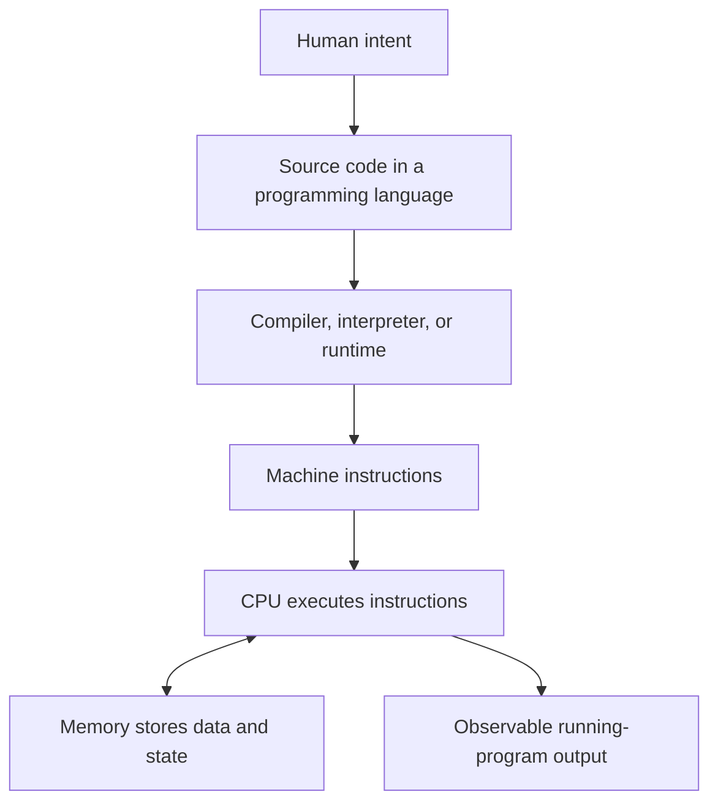
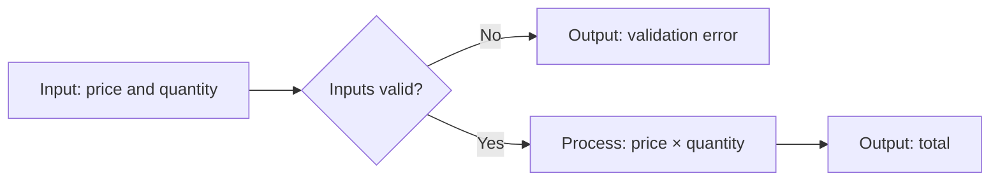

# What Is Programming? — Programlama Nedir?

## Learning Objectives

Bu Chapter tamamlandığında öğrenci:

- **V01-LO001:** program, algoritma, talimat ve hesaplama kavramlarını iki farklı örnek üzerinde doğru biçimde ayırabilir;
- **V01-LO002:** belirsiz bir günlük süreci en az sekiz kesin, sıralı ve test edilebilir talimata dönüştürebilir.

Başarı, tanımları ezberlemekle değil; yeni bir durumda kavram sınırlarını açıklamak ve başka bir kişinin aynı sonucu üretebileceği talimat kanıtı sunmakla gösterilir.

## Prerequisites

Bu Chapter herhangi bir programlama dili bilgisi gerektirmez. Öğrencinin Volume 00 çalışma, kanıt üretme ve yansıtma disiplinini tamamlamış olması beklenir. Bir metin düzenleyici ve modern bir tarayıcı ya da Node.js çalışma ortamı örnekleri denemek için yeterlidir.

Başlamadan önce şu tanılayıcı soruyu yanıtlayın: “Bir işi yaptığımı nasıl kanıtlarım?” Cevabınız yalnızca “sonuç doğru görünüyor” ise bu Chapter boyunca ara durumları, varsayımları ve testleri de kanıt olarak kullanmayı öğreneceksiniz.

## Estimated Study Time

| Etkinlik | Süre |
|---|---:|
| Kavramsal okuma ve diyagramlar | 60-75 dakika |
| Örnekleri tahmin etme ve çalıştırma | 30-40 dakika |
| [Bağımsız egzersiz](../assessments/01-exercise-01-program-instruction-analysis.md) | 25-30 dakika |
| [Laboratuvar](../labs/01-lab-01-human-instruction-interpreter.md) | 60-75 dakika |
| Quiz, reflection ve öz değerlendirme | 25-35 dakika |

Toplam süre 3-4 saattir. Laboratuvarı iki oturuma bölmek öğrenme hedefini değiştirmez.

## Introduction

### Merak

Bir bilgisayar neden “ne demek istediğinizi” anlamaz? Bir yemek tarifinde “biraz ısıt”, bir yol tarifinde “yakındaki sokaktan dön” diyebilirsiniz. İnsan, bağlamı ve ortak deneyimi kullanarak boşlukları doldurur. Bilgisayar ise hangi sokağın “yakın”, hangi sıcaklığın “biraz” olduğunu kendiliğinden kararlaştıramaz.

Programlamanın başlangıç noktası noktalı virgül, değişken veya belirli bir dil değildir. Başlangıç noktası, belirsiz bir niyeti yürütülebilir ve doğrulanabilir bir davranış sözleşmesine dönüştürmektir.

### Kapsam

Bu Chapter program, algoritma, talimat, hesaplama, girdi, işlem ve çıktı kavramlarını öğretir. Küçük JavaScript örnekleri yalnızca davranışı görünür kılar; JavaScript sözdizimini kapsamlı biçimde öğretmez. Derleyici tasarımı, işletim sistemi ayrıntıları, veri yapıları ve performans analizi sonraki Chapter'ların kapsamındadır.

## Core Concepts

### Gerçek Hayat: Kahve Siparişi Bir Program mıdır?

“Bana bir kahve hazırla” bir **niyet** bildirir; fakat tek başına güvenilir bir program değildir. Kahvenin türü, miktarı, su sıcaklığı, süt tercihi ve hata durumları belirtilmemiştir. Deneyimli bir barista eksikleri sorarak veya alışkanlıklardan çıkararak tamamlayabilir. Otomatın aynı işi yapabilmesi için girdiler, izin verilen seçenekler, adımlar ve sonuç açık olmalıdır.

Bu ayrım yazılım projelerinde de vardır. Kullanıcının “hızlı bir kayıt ekranı” istemesi bir gereksinim başlangıcıdır; mühendislik ekibi “hızlı” kelimesini ölçülebilir gecikmeye, “kayıt” işlemini girdilere, doğrulama kurallarına ve gözlenebilir çıktılara dönüştürür.

### Sezgisel Açıklama: Niyet, Tarif ve Çalışan Sistem

Bir **problem**, mevcut durum ile istenen durum arasındaki farktır. Bir **algoritma (algorithm)**, bu farkı kapatmak için sonlu ve sıralı bir çözüm yöntemidir. Bir **program (program)** ise bu yöntemi belirli bir yürütme ortamının anlayabileceği biçimde ifade eden talimatlar ve ilgili veriler bütünüdür.

Bir yemek tarifi algoritmaya benzeyebilir. Tarifin belirli bir mutfakta, belirli araçlarla uygulanabilir sürümü programa; aşçının adımları gerçekten uygulaması ise yürütmeye benzer. Benzetme kusursuz değildir: insanlar belirsizliği yorumlar, bilgisayarlar ise tanımlı kuralları uygular. Benzetmenin değeri, “çözüm yöntemi” ile “çalışan temsil” arasındaki sınırı göstermesidir.

### Teknik Açıklama: Temel Sözlük

- **Talimat (instruction):** Yürütücünün gerçekleştirebildiği tek ve belirli bir eylem.
- **Algoritma (algorithm):** Bir problemi çözmek veya sonuç üretmek için tanımlanmış, sonlu adımlar dizisi.
- **Program (program):** Bir programlama dilinde ifade edilen, bir çalışma ortamınca yürütülebilen talimatlar ve veriler bütünü.
- **Programlama dili (programming language):** Programların sözdizimini ve anlamını tanımlayan biçimsel iletişim sistemi.
- **Girdi (input):** Hesaplamanın başlangıçta aldığı veri.
- **İşlem (process):** Girdiye uygulanan dönüşüm veya kararlar.
- **Çıktı (output):** Hesaplamanın dışarıya sunduğu gözlenebilir sonuç.
- **Hesaplama (computation):** Tanımlı kurallara göre bilginin işlenmesi ve durumun dönüştürülmesi.
- **Yürütme (execution):** Program talimatlarının belirli bir çalışma ortamında gerçekleştirilmesi.
- **Doğruluk (correctness):** Gözlenen davranışın tanımlanmış gereksinim ve sözleşmeyle uyuşması.

Bir algoritma dilden bağımsız olabilir; aynı sıralama yöntemi farklı dillerde programlaştırılabilir. Her program bir amaç için talimatlar içerir, fakat her talimat listesi doğru veya sonlanan bir algoritma değildir. “Aynı adımı sonsuza kadar tekrarla” yürütülebilir olabilir; istenen sonuç sonlu sürede bekleniyorsa doğru çözüm değildir.

### Programın Çalışma Zinciri

Kaynak kodun makineye ulaşması tek biçimli değildir. Bazı diller önceden derlenir, bazı çalışma ortamları yorumlama ve çalışma anında derleme tekniklerini birlikte kullanır. Aşağıdaki diyagram kavramsal akışı gösterir; her dilin birebir uygulama ayrıntısını iddia etmez.



İnsan kaynak kodu yazar. Dil aracı veya runtime bu temsili yürütülebilir talimatlara dönüştürür. CPU talimatları işler; bellek ara değerleri ve program durumunu tutar. Kullanıcı açısından anlamlı olan, bu zincirin ürettiği gözlenebilir davranıştır.

### Girdi–İşlem–Çıktı Modeli



Bu model küçük bir programın sınırlarını görünür kılar. Girdi yalnızca klavyeden gelmek zorunda değildir; dosya, sensör, ağ veya önceki hesaplama da girdi olabilir. Çıktı yalnızca ekrandaki metin değildir; kaydedilen veri, gönderilen mesaj veya değişen cihaz durumu olabilir.

### Örnek: En Küçük Gözlenebilir Program

Amaç, iki sayıyı alıp toplamı üretmek ve akışı gözlemlemektir. Örnek JavaScript `ECMAScript 2023+` uyumlu tarayıcı konsolunda veya Node.js 18+ ortamında çalışır.

```javascript
const firstNumber = 7;
const secondNumber = 5;
const total = firstNumber + secondNumber;

console.log(`Total: ${total}`);
```

Beklenen çıktı:

```text
Total: 12
```

Burada `7` ve `5` girdidir; toplama işlemdir; `Total: 12` gözlenebilir çıktıdır. Kaynak kod programın temsilidir. CPU düzeyindeki gerçek yürütme daha ayrıntılıdır, fakat bu Chapter için önemli sözleşme “aynı girdiler ve aynı program koşullarında beklenen çıktının üretilmesi”dir.

Çalıştırmadan önce çıktıyı tahmin etmek kritik bir alışkanlıktır. Tahmin ile gerçek sonuç uyuşmazsa, fark bir öğrenme sinyalidir.

### Belirsiz Talimattan Test Edilebilir Talimata

“Listeyi düzenle” talimatı eksiktir. Hangi liste? “Düzen” alfabetik mi, sayısal mı? Büyük-küçük harf farkı nasıl ele alınacak? Boş liste geçerli mi? Daha açık bir sözleşme şöyledir:

1. Girdi olarak sıfır veya daha fazla addan oluşan bir liste al.
2. Her adın başındaki ve sonundaki boşlukları kaldır.
3. Boş kalan adları listeden çıkar.
4. Karşılaştırmada harf büyüklüğünü yok say.
5. Adları alfabetik artan sıraya koy.
6. Orijinal yazım biçimini çıktıda koru.
7. Sonuç listesini döndür.
8. Girdi liste değilse açıklayıcı bir hata üret.

Bu sözleşme hâlâ uygulama ayrıntılarının tamamını söylemez; fakat normal, sınır ve geçersiz durumların test edilebileceği kadar kesindir.

### Özet: Kavramların Sınırı

| Kavram | Temel soru | Örnek | Non-example |
|---|---|---|---|
| Niyet | Ne istiyoruz? | “Toplam tutarı göster.” | Yürütülebilir kod |
| Algoritma | Hangi sonlu yöntemle? | Değerleri doğrula, çarp, sonucu döndür | Belirsiz hedef cümlesi |
| Program | Yöntem ortamda nasıl ifade edildi? | JavaScript kaynak dosyası | Yalnızca ekran görüntüsü |
| Yürütme | Talimatlar ne zaman uygulanıyor? | Node.js sürecinin çalışması | Kaynak dosyanın diskte durması |
| Doğruluk | Davranış sözleşmeye uyuyor mu? | Normal ve sınır testlerinin geçmesi | “Benim bilgisayarımda oldu” |

## Engineering Perspective

### Programlama Kod Yazmaktan Daha Geniştir

Profesyonel yazılım mühendisliğinde kod, kararların yürütülebilir kaydıdır. Öncesinde problem tanımı ve gereksinim; sonrasında test, gözlem, bakım ve değişiklik vardır. Yanlış problemi kusursuz sözdizimiyle çözmek başarısızlıktır.

Mühendis şu soruları görünür kılar:

1. İstenen gözlenebilir sonuç nedir?
2. Geçerli ve geçersiz girdiler nelerdir?
3. Hangi varsayımlar yapıldı?
4. Başarı nasıl ölçülecek?
5. Hata oluştuğunda kullanıcı ve sistem ne görecek?
6. Kararı başka biri nasıl doğrulayacak?

### Basitlik ve Açıklık

En kısa program her zaman en iyi program değildir. Aynı davranışı üreten iki çözüm arasında okunabilirlik, test edilebilirlik ve değişiklik maliyeti değerlendirilir. Başlangıçta açık ara değişkenler kullanmak, tek satırlık yoğun bir ifadeden daha uzun olabilir; fakat hata teşhisini kolaylaştırabilir.

### AI Engineering: Önce Kendi Modelin

Yapay zekâ (artificial intelligence, AI) bir cevap makinesi değil, karşılaştırma ve eleştiri aracıdır. Şu protokolü uygulayın:

1. Problemi AI kullanmadan yazın; girdi, çıktı ve en az iki belirsizliği belirleyin.
2. Kendi sekiz adımlı algoritmanızı ve üç testinizi oluşturun.
3. AI'dan “çözümü verme; yalnızca eksik varsayımları ve test edilmemiş sınırları sorularla göster” diye isteyin.
4. Gelen önerileri resmî kaynak veya çalıştırılabilir test ile doğrulayın.
5. Hangi öneriyi kabul ya da reddettiğinizi kanıtıyla kaydedin.

AI çıktısı sorumluluğu devretmez. Üretilen kod doğru görünebilir, fakat gereksinimi yanlış yorumlayabilir veya bulunmayan bir API uydurabilir. Mühendislik kanıtı, modelin güveninden değil doğrulamadan gelir.

## Real World Examples

### ATM Para Çekme

“Para ver” niyeti; kart doğrulama, hesap seçimi, tutar kontrolü, bakiye ve limit denetimi, para verme, kayıt oluşturma ve hata davranışlarına ayrılır. İşlem sırası önemlidir: hesap güncellenmeden para vermek veya para verilemeden bakiyeyi kalıcı azaltmak farklı arıza riskleri üretir. Bu Chapter işlem bütünlüğünü öğretmez; örnek, belirsiz niyetin program sözleşmesine nasıl dönüştüğünü gösterir.

### Web Sayfasındaki Etkileşim

MDN, JavaScript'in web sayfalarında dinamik içerik ve etkileşim sağladığını açıklar. Bir düğmeye basılması girdidir; olay işleyicisinin çalışması işlemdir; metnin değişmesi çıktıdır. Tarayıcı çalışma ortamıdır. Aynı programlama dili sunucu tarafında farklı bir çalışma ortamında farklı girdiler ve çıktılarla kullanılabilir.

### Standartların Rolü

JavaScript'in çekirdek dil sözleşmesi Ecma International tarafından ECMAScript olarak standardize edilir. Web platformundaki HTML, SVG ve birçok API ise W3C ve ilişkili standart süreçleriyle tanımlanır. Programlama dili, runtime ve platform API'si aynı şey değildir; profesyonel geliştirici davranışın hangi sözleşmeden geldiğini ayırır.

## Common Mistakes

### Sözdizimini Programlama Sanmak

- **Belirti:** Öğrenci kodu kopyalar fakat girdi değişince çıktıyı tahmin edemez.
- **Kök neden:** Dil sembolleri ile çözüm modelinin aynı kabul edilmesi.
- **Etki:** Küçük gereksinim değişiklikleri ezberlenmiş çözümü bozar.
- **Teşhis:** Kodu kapatın ve algoritmayı doğal dilde, testlerle açıklamasını isteyin.

### Belirsiz Talimatı Yürütülebilir Kabul Etmek

- **Belirti:** İki kişi aynı talimattan farklı sonuç üretir.
- **Kök neden:** Gizli bağlam ve varsayımların belgelenmemesi.
- **Etki:** Testlerin “doğru sonuç” üzerinde anlaşması mümkün olmaz.
- **Teşhis:** Normal, sınır ve geçersiz bir örnek verin; beklenen sonuçlar tartışmalıysa sözleşme eksiktir.

### Debugging: Bilerek Hatalı Örnekler

Aşağıdaki örneklerde önce beklenen davranışı yazın, sonra kodu çalıştırın. Çözümü kopyalamadan belirtinin ilk oluştuğu satırı, kök nedeni ve bir doğrulama testini kaydedin.

```javascript
const itemPrice = 25;
const itemCount = 4;
const total = itemPrice + itemCount;

console.log(`Total: ${total}`); // Expected business result: 100
```

Kod sözdizimsel olarak geçerlidir fakat iş kuralındaki işlemi yanlış temsil eder. Bu bir **mantık hatası (logic error)** örneğidir.

```javascript
const userName = "Ada";

console.log(`Welcome, ${username}!`);
```

Bu örnek çalışma zamanında hata verir. Hata mesajındaki değişken adını kaynak kodla karşılaştırın; JavaScript büyük-küçük harfe duyarlıdır.

```javascript
const steps = ["open box", "remove device", "connect power"];

console.log(steps[3]);
```

Program çökmez, fakat `undefined` üretir. Listenin uzunluğu ile son geçerli indeks arasındaki ilişkiyi bir tabloyla gösterin ve normal/sınır testleri yazın.

## Best Practices

- Koddan önce beklenen davranışı tek cümleyle yazın.
- Girdi, çıktı, varsayım ve hata durumlarını açıkça ayırın.
- Çalıştırmadan önce tahmin yapın; sonra tahmin–sonuç farkını kaydedin.
- Küçük, gözlenebilir adımlarla ilerleyin.
- En az bir normal, bir sınır ve bir geçersiz durum test edin.
- Bir çözümü yalnızca çalıştığı için değil, gereksinimi karşıladığına dair kanıt bulunduğu için kabul edin.
- Resmî dokümantasyonu temel kaynak; AI ve topluluk yanıtlarını hipotez kaynağı olarak kullanın.

Bu öneriler bağlama bağlıdır. Keşif amaçlı hızlı bir prototipte hata davranışının tamamı ilk dakikada tasarlanmayabilir; ancak prototip üretime yaklaşırken gizli varsayımlar açık sözleşmelere dönüştürülmelidir.

## Hands-on Exercise

### Objective

Belirsiz bir günlük süreci test edilebilir talimatlara dönüştürerek `V01-LO001` ve `V01-LO002` için ilk bağımsız kanıtı üretmek.

### Requirements

- Metin düzenleyici
- Zamanlayıcı
- Sonucunuzu talimatları daha önce görmemiş bir kişiyle test etme imkânı

### Tasks

Beş mini egzersizi sırayla tamamlayın:

1. **Kavram ayrımı:** “Tarif”, “telefon uygulaması”, “uygulamanın çalışan süreci” ve “ekrandaki sonuç” örneklerini algoritma, program, yürütme ve çıktı olarak sınıflandırın.
2. **Girdi–işlem–çıktı:** Bir restoran hesabı bölme sürecinin girdilerini, işlemlerini, çıktısını ve iki geçersiz girdisini yazın.
3. **Belirsizlik avı:** “Dosyaları düzenle” cümlesinde en az beş gizli karar bulun.
4. **Sekiz adım:** Çay hazırlama, toplantı odası ayırtma veya bir ürünü iade etme süreçlerinden birini en az sekiz kesin talimata dönüştürün.
5. **Kör test:** Talimatlarınızı başka bir kişiye yalnızca yazılı metni vererek uygulatın; sapmaları kaydedip talimatları bir kez revize edin.

Ayrıntılı çalışma sayfası için [bağımsız egzersizi](../assessments/01-exercise-01-program-instruction-analysis.md), uygulamalı senaryo için [Human Instruction Interpreter Lab](../labs/01-lab-01-human-instruction-interpreter.md) dosyasını kullanın.

### Deliverables

- Kavram sınıflandırma tablosu
- Girdi–işlem–çıktı modeli
- En az sekiz talimatlık ilk ve revize sürüm
- Üç test vakası: normal, sınır, geçersiz
- En fazla 200 kelimelik değişiklik gerekçesi

### Evaluation Criteria

- Talimatların her biri tek, gözlenebilir eylem içerir.
- Gizli varsayımlar açıkça listelenir.
- İki bağımsız uygulayıcı aynı normal sonuçta buluşabilir.
- Testler yalnızca mutlu yolu değil sınır ve hata davranışını da kapsar.
- Revizyon, gözlenen kanıta dayanır.

## Reflection Questions

1. İlk sürümünüzde hangi bağlamı herkesin bildiğini varsaydınız?
2. Uygulayıcının yaptığı hangi “hata” aslında talimatınızdaki belirsizliği gösterdi?
3. Aynı algoritmayı farklı bir programlama dilinde ifade etmek neyi değiştirir, neyi değiştirmez?
4. Çalışan bir programın yanlış olabileceği bir durum tasarlayın.
5. AI önerilerinden hangisini reddettiniz ve hangi kanıta dayanarak?
6. Bir sonraki hafta bu Chapter'dan hangi kavramı notlara bakmadan yeniden açıklayacaksınız?

## Chapter Summary

Programlama, niyeti bilgisayarın yürütebileceği kesin ve doğrulanabilir davranışa dönüştürme disiplinidir. Algoritma çözüm yöntemini, program bu yöntemin yürütülebilir temsilini, yürütme ise talimatların çalışma ortamında gerçekleştirilmesini ifade eder. Girdi–işlem–çıktı modeli küçük programların sınırını görünür kılar. Doğruluk, programın yalnızca çalışması değil, tanımlanan sözleşmeyi normal, sınır ve geçersiz durumlarda karşılamasıdır.

İyi başlangıç pratiği; koddan önce sonucu tanımlamak, varsayımları görünür kılmak, çalıştırmadan önce tahmin etmek, küçük testler oluşturmak ve kararları kanıtla açıklamaktır. Bu yaklaşım belirli bir dilin ötesine taşınabilir.

### Navigation

- Uygula: [Human Instruction Interpreter Lab](../labs/01-lab-01-human-instruction-interpreter.md)
- Kendini değerlendir: [Chapter 01 Quiz](../assessments/01-quiz-01-what-is-programming.md)
- Derinleş: [Ambiguous Recipe Repair Challenge](../assessments/01-challenge-01-ambiguous-recipe-repair.md)
- Sonraki Chapter: `V01-C02` — How Computers Execute Programs

## Key Takeaways

- Program, algoritma ve çalışan süreç aynı kavram değildir.
- Bilgisayarlar niyeti değil, tanımlı talimatları yürütür.
- Girdi–işlem–çıktı modeli davranış sınırını görünür kılar.
- “Çalışıyor” doğruluk için gerekli olabilir, fakat yeterli değildir.
- Tahmin, test ve gözlenebilir kanıt programlama öğreniminin merkezindedir.
- AI çıktısı doğrulanması gereken bir öneridir; mühendislik kararı değildir.

## Further Reading

- [MDN — What is JavaScript?](https://developer.mozilla.org/en-US/docs/Learn_web_development/Core/Scripting/What_is_JavaScript): programlama dili, çalışma ortamı ve web etkileşimini somutlaştırır.
- [Microsoft Learn — Exploring basic computer concepts](https://learn.microsoft.com/en-us/training/paths/explore-basic-computer-concepts/): bilgisayarların ve programlamanın başlangıç düzeyi bağlamını genişletir.
- [Google Technical Writing](https://developers.google.com/tech-writing): kesin, açık ve test edilebilir teknik anlatım geliştirmek için kullanılır.
- [OpenAI — Prompt engineering](https://developers.openai.com/api/docs/guides/prompt-engineering): AI ile çalışırken açık talimat ve değerlendirme ölçütü kurmayı destekler.
- [W3C Web Standards](https://www.w3.org/standards/): programlama dili ile platform standartlarının neden ayrılması gerektiğini gösterir.

## References

- Ecma International, *ECMAScript Language Specification*, living edition: <https://tc39.es/ecma262/>
- MDN Web Docs, *JavaScript Guide*, accessed 2026-07-17: <https://developer.mozilla.org/en-US/docs/Web/JavaScript/Guide>
- MDN Web Docs, *What is JavaScript?*, accessed 2026-07-17: <https://developer.mozilla.org/en-US/docs/Learn_web_development/Core/Scripting/What_is_JavaScript>
- Microsoft Learn, *Exploring basic computer concepts*, accessed 2026-07-17: <https://learn.microsoft.com/en-us/training/paths/explore-basic-computer-concepts/>
- Google for Developers, *Technical Writing Courses for Engineers*, accessed 2026-07-17: <https://developers.google.com/tech-writing>
- OpenAI, *Prompt engineering*, accessed 2026-07-17: <https://developers.openai.com/api/docs/guides/prompt-engineering>
- World Wide Web Consortium, *Web Standards*, accessed 2026-07-17: <https://www.w3.org/standards/>
