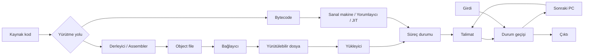

# Bilgisayarlar Programları Nasıl Çalıştırır?

## Learning Objectives

Bu bölüm kanonik olarak iki öğrenme çıktısını karşılar:

- `V01-LO003`: Kaynak kod, çalışma zamanı, bellek, girdi ve çıktı ilişkisini doğru yürütme modeliyle açıklayabilmek.
- `V01-LO004`: Küçük bir talimat dizisinde her adımdan sonra oluşan durumu hatasız izleyebilmek.

Bölüm sonunda kaynak kod ile makine kodunu, program ile süreci, sanal adres ile fiziksel adresi ve yerel yürütme ile sanal makine yürütmesini birbirine karıştırmadan açıklayabilmelisin. Ayrıca küçük bir soyut makine üzerinde `önceki PC → talimat → durum değişikliği → sonraki PC` zincirini izleyebilmelisin.

## Prerequisites

Bu bölüm programlama dili bilmeyi gerektirmez. Şunları bilmen yeterlidir:

- Bir problemi açık talimatlara ayırma fikri.
- Girdi (Input) ve çıktı (Output) arasındaki temel fark.
- Bir değerin zaman içinde değişebileceği fikri.
- Dosya ile çalışan uygulamanın aynı şey olmayabileceğine dair sezgi.

Bilgisayarın elektriksel devre düzeyini veya işletim sistemi iç yapılarını bilmen beklenmez. Burada yazılımcının görebildiği mimari modeli kuracağız. Önceki chapter olan `V01-C01` içindeki “kesin ve sıralı talimat” modelini kendi cümlelerinle açıklayamıyorsan önce o bölümü tekrar etmelisin.

## Estimated Study Time

Kanonik çalışma süresi **2,5 saattir**. Önerilen dağılım şöyledir:

| Çalışma | Süre |
| --- | ---: |
| Ana anlatım ve kontrol noktaları | 80 dakika |
| Durum izleme ve rehberli alıştırmalar | 35 dakika |
| Bağımsız uygulama ve öz değerlendirme | 25 dakika |
| Quiz ve yansıtma | 10 dakika |
| **Toplam** | **150 dakika** |

Laboratuvar ve mini proje bu sürenin dışındaki genişletilmiş uygulamalardır.

### Bu dersi nasıl çalışmalısın?

Bu bölüm yalnızca okunup geçilecek bir metin değildir. Amacımız, program yürütme sürecini kendi cümlelerinle yeniden kurabilmendir. Bir kavramı ilk okumada tamamen anlamaman normaldir; çünkü bu bölümde yazılımın farklı katmanlarını ilk kez aynı resmin içinde göreceksin.

Çalışırken şu yöntemi kullan:

1. Bir başlığı okumadan önce başlığı soruya dönüştür. Örneğin “Bağlayıcı nedir?” yerine “Derleyici varken bağlayıcıya neden ihtiyaç var?” diye sor.
2. Sezgisel açıklamayı okuduktan sonra teknik tanımı kendi cümlenle yaz.
3. Her yeni kavram için “Bunu kim üretir, kim kullanır, hangi durumu değiştirir?” sorularını cevapla.
4. Bir kavramı yalnız benzetmeyle açıklayabiliyorsan teknik tanıma geri dön. Benzetme anlamayı başlatır; tanımın yerine geçmez.
5. Kontrol noktalarında metne bakmadan cevap vermeye çalış. Cevaplayamıyorsan başarısız olmadın; hangi bölüme dönmen gerektiğini buldun.

> **Not defteri şablonu**
>
> Her önemli kavram için şu alanları kullan:
>
> - Kavramın adı:
> - Neden gereklidir?
> - Hangi girdiyi alır?
> - Hangi çıktıyı üretir?
> - Hangi katmanda çalışır?
> - Hangi kavramlarla karıştırılır?
> - Kendi örneğim:
> - Tek cümlelik açıklamam:

Bu şablonun amacı tanımları kopyalamak değildir. Bilgiyi yeniden düzenleyerek zihninde kullanılabilir bir modele dönüştürmektir.

## Introduction

Bu chapter, kaynak koddan çalışan programa uzanan yolu, işlemci tarafından görülebilen durum modelini ve adım adım yürütme izini başlangıç seviyesinde fakat teknik doğruluktan ödün vermeden öğretir. Modern mikro mimari, işletim sistemi zamanlayıcısının ayrıntıları, çöp toplayıcı algoritmaları ve JavaScript yürütme motorunun iç yapısı kapsam dışıdır.

İçerik, [V01-C02 araştırma sentezi](../programming-fundamentals/research/v01-c02/research-synthesis.md) ve onun doğrulanmış 92 kanıt (Evidence) kaydından türetilmiştir. Yeni öğrenme çıktısı veya araştırma sınırı dışında teknik iddia eklemez.

Bir programı başlatmak gündelik hayatta tek bir hareket gibi görünür: simgeye tıklarız ya da terminalde bir komut yazarız. Birkaç milisaniye sonra pencere açılır, metin görünür veya bir hesaplama sonucu gelir. Fakat bu kısa anın altında birbiriyle anlaşmak zorunda olan birçok temsil ve sistem katmanı vardır.

İnsan, niyetini kaynak kodla ifade eder. İşlemci ise belirli bir Talimat Kümesi Mimarisi (Instruction Set Architecture) tarafından tanımlanan makine talimatları ve durum değişimleriyle çalışır. Bu iki uç arasındaki boşluğu derleyiciler, bağlayıcılar, yükleyiciler, çalışma zamanı ortamları (Runtime Environments) ve bazen sanal makineler doldurur. Çalışan şey yalnız bir talimat listesi de değildir: program sayacı (Program Counter), yazmaçlar (Registers), bellek, girdi/çıktı bilgisi ve kontrol akışı birlikte bir **yürütme durumu (Execution State)** oluşturur. <!-- Evidence: `EV-001`–`EV-008`, `EV-037`, `EV-065`, `EV-066` -->

Bu bölümün ana sorusu şudur: “Bir kaynak dosyası, gözlenebilir sonuç üreten çalışan bir sisteme nasıl dönüşür?” Cevabı ezberlenecek tek bir ok zinciri değildir. Yerel (Native) yürütülebilir dosyalar, ara kod (Bytecode) kullanan sanal makineler, yorumlayıcılar ve anında derleme (Just-in-Time Compilation, JIT) kullanan hibrit sistemler farklı geçerli yollar sunar. Ortak fikir, bir program temsilinin uygun çalışma ortamı içinde adım adım durum değişimleri üretmesidir.

> **Dur ve düşün:** Ekranda gördüğün çıktı, kaynak kodun kendisi midir; yoksa kaynak koddan başlayan bir yürütme zincirinin gözlenebilir sonucu mudur?

### Büyük Resim

En yararlı başlangıç modeli iki geçerli yolu ortak bir noktada birleştirir:

1. **Yerel yürütme yolu (Native Path):** Kaynak kod → derleme/çevirici dil → nesne dosyası → bağlama → yürütülebilir dosya → yükleme → süreç (Process).
2. **Sanal makine veya yorumlayıcı yolu:** Kaynak kod → ara temsil/ara kod → sanal makine, yorumlayıcı veya isteğe bağlı JIT → çalışan durum.

İki yolun ayrıntıları farklıdır. Ancak ikisi de bir çalışma ortamı içinde talimatların durum üzerinde etkiler üretmesine ulaşır. Girdi mevcut durumu etkileyebilir; çıktı ise yürütmenin dışarıdan gözlenebilir sonucudur. <!-- Evidence: `EV-009`–`EV-024`, `EV-073`–`EV-080` -->

Bu modeli tiyatroya benzetebiliriz. Metin kaynak koddur. Çeviri ve hazırlık ekipleri metni sahnede uygulanabilir bir biçime dönüştürür. Sahne kurulmadan, oyuncular yerlerini almadan ve başlangıç işaretleri belirlenmeden oyun başlamaz. Ancak benzetmenin sınırı vardır: bilgisayar, belirlenmiş talimat anlamlarına göre durum değiştirir; tiyatrodaki insan yorumuna sahip değildir.

#### Bölüm boyunca izleyeceğimiz program

Soyut kavramları birbirinden kopuk öğrenmemek için bölüm boyunca aynı küçük programı takip edeceğiz. Henüz belirli bir programlama diline bağlı değiliz:

```text
PROGRAM double-number

READ number
result = number + number
WRITE result
```

Bu program dışarıdan bir sayı alır, sayıyı kendisiyle toplar ve sonucu dışarı verir. Örneğin girdi `6` ise çıktı `12` olur. Çok basit görünür; fakat çalışabilmesi için şu soruların tamamının cevabı gerekir:

- `READ`, toplama ve `WRITE` ifadelerini kim anlayacak?
- `number` ve `result` değerleri yürütme sırasında nerede tutulacak?
- Hangi talimatın sırada olduğunu sistem nasıl bilecek?
- Program dosyası ne zaman çalışan bir sürece dönüşecek?
- Girdi programa nasıl ulaşacak?
- Sonucun dışarı verilmesi hangi durum değişikliğini gösterecek?

Kaynak programımız insan için anlamlıdır. Fakat işlemci doğrudan `READ number` cümlesinin niyetini bilmez. Önce programın belirli bir yürütme modelinin anlayacağı temsile dönüşmesi gerekir. Yerel bir yol seçilirse daha düşük seviyeli talimatlar, nesne dosyaları ve yürütülebilir biçim oluşabilir. Sanal makine yolu seçilirse ara temsil veya bayt kodu üretilebilir.

Yürütme başladığında programın anlamını artık yalnız dosya üzerinden düşünmeyiz. Çalışan durum şunları içerebilir:

```text
Sıradaki talimat: READ number
Program sayacı: 0
number: henüz değer yok
result: henüz değer yok
Girdi: 6
Çıktı: boş
```

İlk adım tamamlandığında durum değişir:

```text
Sıradaki talimat: result = number + number
Program sayacı: 1
number: 6
result: henüz değer yok
Girdi: tüketildi
Çıktı: boş
```

Bu bölümün sonunda bu değişimi yalnız sezgisel olarak değil; kaynak kod, çalışma zamanı, bellek, girdi, çıktı ve kontrol akışı ilişkileriyle açıklayabileceksin.

> **Not defterine yaz**
>
> Programın çalışması, kaynak dosyanın “canlanması” değildir. Program uygun bir yürütme ortamında talimatların mevcut durumu adım adım değiştirmesiyle çalışır.

#### İlk kontrol noktası

Metne dönmeden cevaplamaya çalış:

1. Kaynak kod neden tek başına çalışan süreç değildir?
2. Yerel yol ile sanal makine yolu hangi noktada ortaklaşır?
3. Küçük örneğimizde “durum” dediğimiz şey hangi değerlerden oluşuyor?

Yanıtının özü şu olmalıdır: temsiller ve dönüşüm yolları farklı olabilir; fakat yürütme, bir ortam içinde talimatların durum geçişleri üretmesine dayanır.

## Core Concepts

### 5. Program Nedir?

Sezgisel olarak program, bilgisayara ne yapacağını söyleyen düzenli talimatlar bütünüdür. Teknik olarak ise program; talimatları ve gerekirse statik veriyi içeren **pasif bir temsil** olabilir. Diskte duran yürütülebilir dosya henüz yürütülmüyorsa süreç değildir. <!-- Evidence: `EV-004`, `EV-005`, `EV-067` -->

Programın tek bir görünümü yoktur. Aynı amaç; kaynak kod, çevirici dil (Assembly), makine kodu veya sanal makine ara kodu biçimlerinde temsil edilebilir. Bu temsiller eş anlamlı değildir; farklı okuyuculara ve yürütme katmanlarına yöneliktir.

**Yanlış:** “Program, CPU'nun o anda yaptığı iştir.”  
**Neden yanlış?** Bu ifade pasif program ile çalışan süreci birleştirir.  
**Doğrusu:** Program yürütülebilecek temsildir; süreç bu programın çalışan örneğidir.

### 6. Kaynak Kod

Kaynak kod (Source Code), insanın bir programlama diliyle yazdığı program temsilidir. Değişken adları, fonksiyonlar ve dil kuralları yazılımcının niyetini düzenler. Yüksek seviyeli diller işlemci mimarisinin birçok ayrıntısını soyutlayabilir. <!-- Evidence: `EV-002`, `EV-003` -->

Kaynak kodun okunabilir olması, CPU tarafından doğrudan anlaşılacağı anlamına gelmez. CPU'nun sözleşmesi kaynak dil değil ISA'dır. Kaynak kod ile ISA arasındaki dönüşüm yolu; dile ve gerçekleştirmeye göre yerel derleme, yorumlayıcı, ara kod kullanan sanal makine veya hibrit JIT içerebilir.

**Benzetme:** Kaynak kod, mimarın planına benzer. Plan binanın nasıl olması gerektiğini ifade eder; fakat kendi başına yaşanabilir bina değildir.

### 7. Programlama Dili

Programlama dili (Programming Language), programı ifade etmek için sözdizimi ve anlam kuralları sunar. Neden gereklidir? Çünkü ham makine kodu ile büyük sistem kurmak insanlar için zor, hataya açık ve mimariye bağımlıdır. Dil, problem alanındaki düşünceleri daha uygun soyutlamalarla anlatır.

Bir dilin varlığı yürütme yolunu tek başına belirlemez. Aynı dil farklı gerçekleştirimlerde farklı dönüşüm stratejileri kullanabilir. Bu nedenle “derlenen dil” ve “yorumlanan dil” etiketleri çoğu zaman bütün resmi açıklamaz; önemli olan belirli gerçekleştirimin hangi temsilleri hangi aşamalarda kullandığıdır. <!-- Evidence: `EV-024`, `EV-074`, `EV-077`, `EV-079` -->

#### Kaynak programımız bu katmanda ne ifade ediyor?

`READ number`, `result = number + number` ve `WRITE result` ifadeleri insan niyetine yakındır. Programlama dili bu ifadelerin hangi kurallarla yazıldığını ve ne anlama geldiğini belirler. Örneğin toplama ifadesinin iki değeri okuması, bir sonuç üretmesi ve sonucun `result` adıyla ilişkilendirilmesi gerekir.

Bu aşamada henüz fiziksel yazmaç numarasının, makine talimatındaki bitlerin veya süreç adresinin bilinmesi gerekmez. Dil bu ayrıntıların bir bölümünü soyutlar. Fakat soyutlama, alttaki katmanların yok olduğu anlamına gelmez. Program çalışırken değerler gerçek bir yürütme durumunda temsil edilir ve talimatlar belirli bir yürütme modeli tarafından uygulanır.

> **Not defterine yaz**
>
> Programlama dili, problemi insanın yönetebileceği kavramlarla ifade eder. İşlemci mimarisi ayrıntılarını azaltır; fakat yürütme sırasında bu programın daha düşük seviyeli bir modele bağlanması gerekir.

#### Temsil kontrol noktası

- Program ile kaynak kod aynı kavram mıdır? Kaynak kod, programın olası temsillerinden biridir.
- Kaynak kod ile makine kodu neden aynı değildir? Farklı okuyuculara ve sözleşmelere yöneliktir.
- Bir dil neden tek başına “derlenen” veya “yorumlanan” diye kesin sınıflandırılamaz? Çünkü yürütme stratejisi gerçekleştirmeye bağlıdır.

### 8. Derleyici

Derleyici (Compiler), program temsilini başka bir temsile dönüştüren araç zinciri bileşenidir. Sezgisel olarak profesyonel çevirmene benzer: anlamı hedef tarafın kurallarına uygun biçimde yeniden ifade eder. Ancak derleyici serbest yorum yapmaz; dil ve hedef sözleşmelerine göre dönüşüm uygular.

GCC örneğinde süreç ön işleme, asıl derleme, Assembly üretimi ve bağlama aşamalarını içerebilir. `-E`, `-S` ve `-c` gibi seçeneklerin farklı noktalarda durabilmesi, derlemenin tek ve bölünemez bir işlem olmadığını gösterir. <!-- Evidence: `EV-009`–`EV-013` -->

**Yanlış:** “Derleyici her zaman doğrudan yürütülebilir dosya üretir.”  
**Doğrusu:** Araç zinciri, çevirici dil veya nesne dosyası aşamasında durabilir; yürütülebilir dosyanın oluşması bağlama işlemi gerektirebilir.

#### Derleyici neden ve nasıl kullanılır?

Derleyici gerekir çünkü kaynak dilin kavramları ile hedef yürütme modelinin talimat ve temsil kuralları aynı değildir. Kaynak yapıları inceler, hedefe uygun daha düşük seviyeli temsil üretir; bu çıktı henüz tek başına çalıştırılabilir olmak zorunda değildir. Büyük bir uygulamada farklı kaynak dosyalar ayrı nesne dosyalarına dönüştürülebilir ve sonra bağlanabilir. Bu ayrım, değişmeyen parçaları yeniden derlemeden kullanmayı ve hatanın hangi aşamada oluştuğunu görmeyi kolaylaştırır.

Gerçek bir GCC akışında ön işlenmiş kaynak, Assembly çıktısı ve nesne dosyası ayrı ayrı gözlenebilir. Mühendislik alışkanlığı, “derleyici hata verdi” demeden önce ön işleme, derleme, Assembly üretimi veya bağlama aşamalarından hangisinin başarısız olduğunu sormaktır. **Küçük özet:** Derleyici sihirli bir “programı çalıştır” kutusu değil, temsiller arasında kurallı dönüşüm yapan araç zinciri bileşenidir.

### 9. Yorumlayıcı

Yorumlayıcı (Interpreter), belirli bir gerçekleştirimde ara talimatları veya program temsilini yürütme sürecine katan bileşendir. Sezgisel olarak metni önceden bütünüyle hedef kitaba dönüştürmek yerine uygulama sırasında okuyup eyleme dönüştüren görevliye benzetilebilir.

Bu benzetme “yorumlayıcı asla derleme yapmaz” sonucunu doğurmamalıdır. V8'in belgelenmiş tarihsel Ignition/TurboFan mimarisi, yorumlayıcı ile iyileştiren derleyiciyi birlikte kullanır. WebAssembly, JIT veya önceden derleme (Ahead-of-Time Compilation) ile çalışabilir. Yani yürütme yolları keskin bir derleyici-yorumlayıcı ikiliğine indirgenemez. <!-- Evidence: `EV-074`, `EV-077`, `EV-079` -->

#### Yorumlayıcı neden ve nasıl kullanılır?

Yorumlayıcı yaklaşımı, ara temsili önceden bütünüyle yerel yürütülebilir dosyaya dönüştürmeden çalıştırma esnekliği sağlayabilir. Gerçekleştirim, mevcut talimatı inceler, anlamını kendi yürütme durumu üzerinde uygular ve sonraki talimata geçer. Bu açıklama belirli bir yorumlayıcının iç algoritmasını evrenselleştirmez.

Python ara kodunun CPython'a ait olması ve sürümler arasında değişebilmesi, dil ile gerçekleştirimde kullanılan talimat kümesi arasındaki sınırı gösterir. Bir yürütme motoru, sık kullanılan yolları JIT ile ana makinenin koduna dönüştürebilir. **Yorumlayıcı ve derleyici kesin karşıtlar olsaydı ne olurdu?** Hibrit yürütme motorlarını açıklayamazdık. **Küçük özet:** Sınıflandırmayı dile göre değil, kullanılan temsile ve belirli gerçekleştirimin yürütme yoluna göre yap.

### 10. Makine Kodu

Makine kodu (Machine Code), hedef donanım platformunun ISA'sına göre bitlerle kodlanmış talimat temsilidir. CPU bu komutların mimari etkisini gerçekleştirir. Farklı CPU aileleri farklı ISA'lar kullanabileceğinden aynı bit dizisi her işlemcide aynı talimat anlamına gelmez. <!-- Evidence: `EV-025`, `EV-028`, `EV-029` -->

Makine kodunun “0 ve 1”lerden oluşması tek başına yeterli açıklama değildir. Önemli olan, bit alanlarının hedef ISA tarafından işlem kodu (Opcode), yazmaç veya sabit işlenen (Immediate) gibi anlamlara bağlanmasıdır.

### 11. Assembly Dili

Assembly dili (Assembly Language), machine talimatların sembolik düşük seviyeli temsilidir. İnsan için `ADD` gibi bir mnemonic, çıplak bit dizisinden daha okunabilirdir. Assembler, bu sembolik talimatları binary machine talimatlara dönüştürür. <!-- Evidence: `EV-023`, `EV-026` -->

Assembly ve makine kodu yakın ilişkilidir fakat aynı temsil değildir. Biri sembolik metin, diğeri hedef platformun tükettiği ikili kodlamadır.

Kaynak programımızdaki toplama işlemi, hedef mimariye göre Assembly düzeyinde yazmaç işlenenleri kullanan bir toplama talimatıyla temsil edilebilir. Fakat `READ` ve `WRITE` gibi işlemler yalnız aritmetik talimat değildir; çalışma ortamı veya işletim sistemi kaynaklarıyla ilişki kurmayı gerektirebilir. Bu nedenle birkaç kaynak satırının bire bir birkaç makine talimatına dönüşeceğini varsaymak doğru değildir.

Assembly dili okurken iki şeyi ayırmalısın: **talimatın sembolik yazımı** ve **talimatın mimari etkisi**. `ADD` adını görmek, hangi yazmaçların okunup hangisinin yazıldığını bilmeden yeterli değildir. Teknik düşünme, anımsatıcı adı (Mnemonic) ezberlemekten çok talimatın durum üzerindeki etkisini açıklamaktır.

> **Not defterine yaz**
>
> Assembly, makine talimatlarını insanlar için sembolik gösterir. Assembler bu sembolik gösterimi makine koduna dönüştürür. Assembly ile makine kodu ilişkili fakat farklı temsillerdir.

#### Dönüşüm zinciri kontrol noktası

Kaynak programımızın yerel yolunu şu sorularla yeniden kur:

1. Kaynak kodu kim daha düşük seviyeli temsile dönüştürür?
2. Assembly dilini kim ikili makine talimatlarına dönüştürür?
3. Ayrı nesne dosyaları arasındaki sembolleri kim çözer?
4. Yürütülebilir dosya için çalışan süreç durumunu kim hazırlar?

Sıralı cevap: derleyici araç zinciri, çevirici (Assembler), bağlayıcı (Linker) ve yükleyici (Loader). Bu roller bazı araçlarda birlikte çalışabilir; sorumlulukları yine de kavramsal olarak ayrıdır.

### 12. Talimat Kümesi Mimarisi

Talimat Kümesi Mimarisi (Instruction Set Architecture, ISA), yazılım ile işlemci arasındaki görünür sözleşmedir. Hangi talimatların bulunduğunu, yazmaç ve program sayacı gibi görünür durumu ve talimatların bu durum üzerindeki etkisini tanımlar. <!-- Evidence: `EV-027`, `EV-030`–`EV-034` -->

ISA neden gereklidir? Yazılım, işlemcinin transistör yerleşimini bilmeden belirli davranışlara güvenebilmelidir. Aynı ISA'yı uygulayan işlemciler iç tasarım bakımından farklı olabilir; yine de yazılıma aynı mimari sonucu sunarlar.

**Yanlış:** “ISA işlemcinin bütün iç tasarımıdır.”  
**Doğrusu:** ISA görünür bir sözleşmedir; işlem hattı, önbellek ve zamanlama gibi mikro mimari ayrıntılarının tamamı değildir.

#### ISA neden bir sözleşmedir?

ISA sözleşmesi olmasaydı derleyicinin hangi talimatı üreteceği, yazmaçların nasıl adlandırıldığı veya yükleme ve saklama işlemlerinin ne anlama geldiği ortak biçimde belirlenemezdi. RV32I; genel amaçlı yazmaçlar ve program sayacı içeren, yazılımcı tarafından görülebilen bir model sunar. Aritmetik talimatların yazmaç işlenenlerini kullanmasını, yükleme ve saklama talimatlarının ise bellek ile yazmaç arasında aktarım yapmasını tanımlar.

İki işlemci gerçekleştirimi, aynı ISA talimatı için farklı iç devreler veya zamanlamalar kullanabilir; fakat aynı görünür durum etkisini üretmelidir. **Dur ve düşün:** Bir talimatın kaç transistör kullandığını bilmeden doğru sonucu bekleyebilmemiz hangi soyutlama sayesinde mümkündür? **Küçük özet:** ISA, “içeride nasıl yapıldığı” değil, “yazılıma neyin garanti edildiği” katmanıdır.

### 13. Merkezi İşlem Birimi

Merkezi işlem birimi (Central Processing Unit, CPU), yerel machine talimatların ISA tarafından tanımlanan etkilerini gerçekleştirir. Onu “talimatları uygulayan çalışan” diye düşünebilirsin. Çalışanın kural kitabı ISA, çalışma durumu ise yazmaçlar, PC ve adreslenebilir bellek ile temsil edilir.

CPU yalnız aritmetik işlem yapmaz. Yükleme ve saklama talimatlarıyla yazmaç ve bellek arasında veri taşır; kontrol aktarımı talimatıyla sonraki talimatı değiştirir; geçersiz bellek erişimi gibi olaylarda denetim işletim sistemine geçebilir. <!-- Evidence: `EV-033`, `EV-034`, `EV-043`, `EV-048`, `EV-051` -->

#### CPU durumu nasıl değiştirir?

CPU'nun görevi talimatın mimari anlamını durum geçişi olarak gerçekleştirmektir. Bir `ADD` kaynak yazmaçları okuyup hedef yazmaca sonuç yazabilir; yükleme talimatı bellekten yazmaca değer getirir; dallanma program sayacını değiştirir. Program davranışı çok sayıda küçük durum değişiminin bileşimi olarak ortaya çıkar.

Yerel yürütme sırasında CPU başıboş değildir. İşletim sistemi (Operating System), süreci başlatır, kaynakları hazırlar ve koruma ihlali durumunda denetimi geri alabilir. “CPU programı çalıştırır” doğru ama eksiktir: CPU talimat etkilerini gerçekleştirirken işletim sistemi çalışma ortamını ve koruma sınırlarını sağlar. **Küçük özet:** CPU, durumu ISA kurallarına göre değiştiren yürütme motorudur; programın bütün yaşam döngüsü değildir.

### 14. Talimat Döngüsü

Getir-çözümle-yürüt döngüsü (Fetch-Decode-Execute Cycle), başlangıç için güçlü bir zihinsel modeldir:

1. **Getir (Fetch):** PC'nin gösterdiği adresten talimat getirilir.
2. **Çözümleme (Decode):** Talimat alanları yapılacak işlem ve işlenen seçimlerine dönüştürülür.
3. **Yürütme (Execute):** İşlem uygulanır; görünür durum ve program sayacı güncellenir.

<!-- Evidence: `EV-089`–`EV-092` -->

Bu sıralama kavramsal açıklamadır. Modern CPU'nun bütün iç adımlarının fiziksel zaman çizelgesi olduğu iddia edilmez. Bizim için önemli olan talimat öncesi ve sonrası mimari durumdur.

#### Döngüyü doğru okumak

Getirme aşamasında adres PC'den gelir. Çözme aşamasında talimat bitlerinin hangi işlemi ve işlenenleri belirttiği anlaşılır. Yürütme aşamasında aritmetik, veri aktarımı veya kontrol aktarımı etkisi uygulanır. Son olarak PC, sıradaki adrese ya da dallanma veya sıçrama hedefine geçer. Bu ayrım “hangi talimat?”, “hangi veri?” ve “hangi değişiklik?” sorularını sıraya koyar.

Modern işlemciler farklı talimatları bir işlem hattında üst üste işleyebilir. Yine de yazılımcı tarafından görülebilen sonuç, ISA'nın durum geçişi sözleşmesiyle uyumlu olmalıdır. **Benzetmenin sınırı:** Fabrika bandı işlem hacmini sezdirir; ancak mimari sıralamanın ve görünmeyen zamanlamanın tümünü açıklamaz. **Küçük özet:** Döngüyü fiziksel saat planı olarak değil, talimat etkisi hakkında akıl yürütmek için kullan.

### 15. Yazmaçlar

Yazmaç, mimari açıdan görünür makine durumunun talimat işlenenlerini ve sonuçlarını taşıyabilen bileşenidir. RV32I örneğinde aritmetik talimatlar yazmaç işlenenleri üzerinde çalışır; yükleme ve saklama talimatları yazmaç ile bellek arasında değer taşır. <!-- Evidence: `EV-030`, `EV-033`, `EV-034`, `EV-046` -->

Yazmaç genel amaçlı RAM hücresi değildir. ISA tarafından adlandırılan sınırlı bir durum bileşenidir. Bir talimat iki kaynak yazmaç okuyup bir hedef yazmaç yazabilir.

#### Yazmaç nasıl okunur ve yazılır?

Talimat biçimi, işlenenleri yazmaç kimlikleriyle gösterebilir. CPU kaynak değerleri okur ve sonuç varsa hedef yazmacı günceller. İzleme yaparken değişen hedef ile değişmeden kalan kaynaklar ayrılmalıdır.

Örneğin `ADD hedef, kaynak1, kaynak2`, kaynak değerleri toplar fakat kaynak yazmaçları otomatik olarak değiştirmez. Yaygın hata, “işlemde kullanılan her değer değişti” sanmaktır. **Küçük özet:** Yazmaç, talimatın okuyup yazabildiği isimlendirilmiş mimari durumdur; bir değerin okunması ile değiştirilmesi aynı şey değildir.

### 16. Program Sayacı

Program sayacı (Program Counter, PC), talimat sequencing için kullanılan adres durumudir. Kitaptaki ayraç benzetmesi yararlıdır: nereden devam edileceğini gösterir. Fakat ayraç pasifken PC talimat semantics ile güncellenir.

Sıralı bir talimat PC'yi sonraki adrese ilerletebilir; dallanma veya sıçrama farklı bir adres seçebilir. “PC mevcut talimatı mı, sonraki talimatı mı gösterir?” sorusu, gözlem anı ve ISA anlamı belirtilmeden eksiktir. Bu derste her izleme için `önceki PC` ve `sonraki PC` ayrı tutulur. <!-- Evidence: `EV-031`, `EV-041`, `EV-043`, `EV-044`, `EV-047`, `EV-048` -->

#### Program sayacı neden gereklidir?

Programın yalnız veri değerleri değil, yürütme konumu da durumun parçası olmalıdır. Aksi halde CPU bir talimat tamamlandıktan sonra nereden devam edeceğini bilemez. Sıralı ilerleme olağan yolu, kontrol aktarımı talimatı ise alternatif sonraki adresi tanımlar.

İzleme sırasında `PC=4` tek başına belirsizdir: talimattan önce mi, sonra mı? Önce `önceki PC` ile mevcut talimat seçilir; işlem uygulanır; sonra `sonraki PC` yazılır. **Dallanma PC'yi değiştiremeseydi ne olurdu?** Program yalnız doğrusal ilerlerdi. **Küçük özet:** PC, kontrol akışının durum içindeki adreslenebilir temsilidir.

### 17. Bellek

Bellek (Memory), kodun ve veri durumunun adreslenebilir saklama modelidir. Çalışma masası benzetmesi, etkin çalışma sırasında gereken şeylerin erişilebilir tutulduğunu anlatır. Ancak tek bir fiziksel masa resmi; önbelleği, sanal belleği ve çalışma zamanı yapılarını açıklamaz.

Çalışan program yalnız talimatlardan oluşmaz. Memory durum, yazmaç durum ve I/O bilgisi sürecin gözlenebilir durumuna katılır. <!-- Evidence: `EV-057`, `EV-065`, `EV-066` -->

#### Bellek yürütüme nasıl katılır?

Yazmaç sayısı sınırlıdır; program kodu, statik veri, yığın çerçeveleri ve dinamik ayrılmış veri daha geniş adreslenebilir durum gerektirir. Yükleme/saklama modelinde CPU bellekten yazmaca değer taşır, işlemi yapar ve gerekiyorsa sonucu geri yazar.

Bellek her zaman fiziksel RAM değildir. Süreç sanal adres alanını görür; çalışma zamanı yığın ve öbek gibi mantıksal yapılar kurar. Yerel bir değer yığın çerçevesinde, bir nesne öbek alanında temsil edilebilir; kesin yerleşim çalışma ortamına bağlıdır. **Küçük özet:** Bellek, yürütme durumunun adreslenebilir katmanıdır; tek fiziksel kutu açıklaması değildir.

### 18. Sanal Adres Alanı

Sanal adres alanı (Virtual Address Space), bir sürecin kullanabildiği sanal adresler kümesidir. İşletim sistemi her sürece özel bir görünüm sunabilir; açıkça paylaşılmadıkça süreçler aynı adres görünümünü paylaşmak zorunda değildir. <!-- Evidence: `EV-053`, `EV-054` -->

Sanal adres doğrudan fiziksel RAM konumu değildir. Adres çevirisi, sanal adresi fiziksel adrese eşler. Ayrıca yürütülebilir dosya içindeki dosya konumu, yükleme sonrasındaki sanal adresle aynı koordinat değildir. <!-- Evidence: `EV-055`, `EV-056`, `EV-064` -->

#### Sanal adres alanı neden gereklidir?

Sanal adres alanı (Virtual Address Space), sürece düzenli ve yalıtılmış bir bellek görünümü sağlar. Aynı sayısal sanal adres, iki süreçte farklı fiziksel depolama konumlarına karşılık gelebilir; açıkça paylaşılan bellek ise ayrı bir düzenlemedir. Çeviri ayrıntıları kapsam dışı olsa da adres alanlarının farklı olduğunu bilmek hata ayıklama için temeldir.

Yürütülebilir dosyadaki bir bölümün dosya konumu “dosyanın neresinde?”, sanal adresi ise “yüklenen program görüntüsünde süreç bunu nerede görüyor?” sorusunu yanıtlar. **Yanlış:** “Hata ayıklayıcıdaki adres, RAM çipindeki kesin hücredir.” **Doğrusu:** Değer çoğunlukla sanal adres alanındadır. **Küçük özet:** Her adresi yorumlamadan önce hangi koordinat sistemine ait olduğunu sor.

### 19. Yığın

Yığın (Stack), çalışma ortamına göre çağrı, yerel değişken, parametre, dönüş değeri veya çerçeve durumu taşıyabilen mantıksal yapıdır. OSTEP'in C odaklı modelinde bu roller görünür; JVM'de her iş parçacığı kendine özel JVM yığınına ve çerçevelere sahiptir. <!-- Evidence: `EV-059`, `EV-062` -->

**Yanlış:** “Yığın bütün sistemlerde RAM'in aynı tarafındadır.”  
**Doğrusu:** Diyagramdaki yerleşim bir gösterim tercihidir; kullanım ve yönetim çalışma ortamına bağlıdır.

### 20. Öbek

Öbek (Heap), çalışma ortamına bağlı olarak dinamik ayrılan veriler veya nesneler için depolama sağlayan mantıksal alandır. OSTEP'in C odaklı açıklaması dinamik ayırmayı; JVM belirtimi ise sınıf örnekleri ve diziler için iş parçacıkları arasında paylaşılan öbeği gösterir. <!-- Evidence: `EV-060`, `EV-063` -->

Yığın ve öbek, “biri hızlı, biri yavaş” gibi tek cümleyle doğru açıklanamaz. Buradaki temel ayrım, yaşam döngüsü ve yönetim sorumluluğunun çalışma ortamı tarafından farklı düzenlenmesidir.

Kaynak programımızdaki `number` ve `result` değerlerinin kesin olarak yığında veya öbekte olduğunu yalnız kaynak metne bakarak söyleyemeyiz. Derleyici, çalışma zamanı ve kullanılan dilin modeli bu temsil kararını etkileyebilir. Başlangıç seviyesinde önemli olan, kaynak düzeyindeki bir ad ile fiziksel bellek hücresi arasında evrensel ve değişmez bire bir ilişki varsaymamaktır.

#### Belleği katmanlar hâlinde düşün

Bellek konusunda dört farklı soruyu birbirinden ayır:

1. **Kaynak düzeyi:** Programcı hangi adları ve veri yapılarını görüyor?
2. **Çalışma zamanı düzeyi:** Yığın çerçevesi, öbek nesnesi veya sanal makine çerçevesi gibi hangi mantıksal yapı kullanılıyor?
3. **Süreç düzeyi:** Hangi sanal adresler sürecin adres alanında bulunuyor?
4. **Fiziksel düzey:** Sanal adresler hangi fiziksel depolama konumlarına eşleniyor?

Bu katmanları tek resimde birleştirmek, “değişken RAM'de bir kutudur” gibi başlangıçta yararlı görünen fakat ileride yanlış sonuç veren anlatımları önler.

> **Not defterine yaz**
>
> Kaynak koddaki değişken, doğrudan ve değişmez bir fiziksel RAM hücresi değildir. Değerin temsili; derleyici, çalışma zamanı ortamı, süreç adres alanı ve bellek eşleme katmanlarından etkilenebilir.

#### Bellek kontrol noktası

- Sanal adres ile fiziksel adres neden farklıdır?
- File offset hangi soruyu, sanal adres hangi soruyu cevaplar?
- Yığın ve öbek neden fiziksel yer adları gibi öğretilmemelidir?
- Aynı programın iki süreci aynı sanal adres değerini kullanırsa kesinlikle aynı veriyi mi görür? Hayır; süreç address spaces ayrı olabilir.

### 21. Derleme

Derleme (Compilation), kaynak temsili hedefte kullanılabilecek başka bir biçime dönüştüren aşamalar bütünüdür. Yerel zincirde ön işleme → asıl derleme → Assembly üretimi görülebilir. Başka sistemlerde hedef bir ara temsil veya bayt kodu olabilir.

Neden aşamalar ayrılır? Çünkü her aşama farklı sözleşmeler ve ürünler üzerinde çalışır; bu ayrım hata teşhisini, taşınabilirliği ve araçların yeniden kullanımını mümkün kılar. <!-- Evidence: `EV-009`–`EV-013`, `EV-023`, `EV-024` -->

### 22. Bağlama

Bağlama (Linking), ayrı nesne ve arşiv girdilerini bir araya getirir, sembol başvurularını çözer ve gerekli yeniden konumlandırma işlemlerini yapar. <!-- Evidence: `EV-014`–`EV-016` -->

Benzetme olarak ayrı kitap bölümlerindeki çapraz referansları tek baskıda doğru sayfalara bağlayan editörü düşünebilirsin. Ancak bağlayıcı yalnız metin birleştirmez; adres ve sembol ilişkilerini yürütülebilir dosya biçimine göre düzenler.

### 23. Yükleme

Yükleme (Loading), programın çalışabilmesi için yürütülebilir dosyadaki kodu ve statik veriyi süreç adres alanına yerleştirme ve başlangıç durumunu hazırlama sürecidir. Çalışma zamanı yığını ile standart girdi, çıktı ve hata akışları da süreç başlatılırken hazırlanabilir. <!-- Evidence: `EV-019`–`EV-022` -->

Loader, tiyatro başlamadan sahneyi hazırlayan ekip gibidir. Metni yazmaz ve oyunu oynamaz; fakat başlangıç düzeni kurulmadan yürütme başlayamaz.

### 24. Çalışma Zamanı

Çalışma zamanı ortamı (Runtime Environment), programın yürütme sırasında ihtiyaç duyduğu durumu, hizmetleri veya soyut makine bağlamını sağlayan ortamdır. Terim bağlama duyarlıdır: çalışma zamanı aşaması, çalışma zamanı sistemi ve bir dilin çalışma ortamı aynı şey değildir.

Yerel bir süreç işletim sistemi hizmetleri altında çalışabilir; JVM veya WebAssembly ise soyut bir makine durumu tanımlar. Bu nedenle “çalışma zamanı her programda aynı bileşendir” denemez. <!-- Evidence: `EV-019`–`EV-024`, `EV-071`–`EV-080` -->

### 25. Süreç

Süreç (Process), çalışan programın işletim sistemi soyutlamasıdır. Adres alanındaki bellek, yazmaç içerikleri ve girdi/çıktı bilgisi süreç durumunun parçalarıdır. <!-- Evidence: `EV-005`, `EV-050`, `EV-065`, `EV-066` -->

Bir yürütülebilir dosya pasiftir; başlatıldığında süreç görüntüsü ve makine durumu oluşur. Aynı programdan birden fazla çalışan örnek düşünülebilir; dosya aynı kalsa bile her sürecin durumu farklı olabilir.

#### Süreç neden ayrı bir soyutlamadır?

Süreç soyutlaması, işletim sisteminin çalışan program için bellek ve CPU durumunu birlikte yönetebilmesini sağlar. Bir süreç durdurulup daha sonra devam ettirilecekse yazmaç içerikleri ve yürütme konumu anlamını korumalıdır; girdi/çıktı kaynakları da programın dış dünya ile ilişkisini taşır.

Bir metin düzenleyiciyi iki kez başlatmayı düşün. Program temsili aynı olabilir, fakat iki süreç farklı belge verisi, program sayacı/yazmaç durumu ve girdi/çıktı etkileşimleri taşır. **Yanlış:** “Program dosyası ile süreç aynıdır.” **Doğrusu:** Dosya ile çalışan örnek farklı yaşam döngülerine sahiptir. **Küçük özet:** Süreç, programın zaman içindeki canlı durum bağlamıdır.

### 26. İş Parçacığı

İş parçacığı (Thread), süreç içindeki yürütme noktasıdır. Çok iş parçacıklı bir süreç birden fazla yürütme noktası taşır. İş parçacıkları aynı adres alanını paylaşabilirken her birinin kendi program sayacı ve özel yazmaç kümesi bulunabilir. <!-- Evidence: `EV-068`–`EV-070` -->

Bu ayrım neden önemlidir? “Aynı belleği paylaşmak” ile “aynı anda aynı talimat konumunda olmak” farklı şeylerdir. Süreç kaynak ve durum ortamı, iş parçacığı ise yürütme akışı açısından düşünülmelidir.

#### İş parçacığı durumu nasıl ayrılır?

Bir süreç birden fazla yürütme akışı gerektirdiğinde iş parçacığı modeli, paylaşılan adres alanı üzerinde farklı mevcut talimatları ilerletebilir. Her iş parçacığının program sayacı ve özel yazmaç durumu ayrı olduğu için biri hesaplama yaparken diğeri başka yürütme noktasında olabilir.

Paylaşılan bellek, bütün durumun aynı olduğu anlamına gelmez. Tam tersine özel yürütme durumu ile paylaşılan süreç durumunun birlikte bulunması akıl yürütmeyi zorlaştırır. Bu bölüm eşzamanlama öğretmez; yalnız sahiplik sınırını kurar. **Küçük özet:** Süreç ortak çalışma ortamını, iş parçacığı o ortam içindeki ayrı yürütme akışını temsil eder.

### 27. Sanal Makine

Sanal makine (Virtual Machine), somut donanım yerine soyut makine sözleşmesi sunar. JVM belirtiminin somut bir gerçekleştirim değil soyut makine tanımlaması ve WebAssembly'nin yığın/saklama alanı içeren yürütme kuralları bu modeli gösterir. <!-- Evidence: `EV-035`, `EV-075` -->

Sanal makinenin talimatları sonunda fiziksel CPU üzerinde bir gerçekleştirim aracılığıyla uygulanır; fakat programın doğrudan bağlı olduğu sözleşme sanal makine olabilir. Bu katman taşınabilirlik ve gerçekleştirim özgürlüğü sağlar.

#### Sanal makine neden kullanılır?

Sanal makine sözleşmesi, program temsilini tek bir fiziksel ISA'ya doğrudan bağlamadan tanımlayabilir. JVM sınıf dosyasının donanım ve işletim sisteminden bağımsız olması bu ayrımın sonucudur. Gerçekleştirim soyut talimatları yorumlayabilir veya yerel makine koduna dönüştürebilir; yöntem değişse de soyut makine davranışı korunur.

WebAssembly yığın/saklama modeli, sanal makine durumunun da izlenebilir olduğunu gösterir. **Yanlış:** “Sanal makine yalnız başka bir bilgisayarı eksiksiz taklit eder.” **Doğrusu:** Buradaki sanal makine, dil ve çalışma zamanı yürütmesi için soyut talimat ve durum sözleşmesi sunabilir. **Küçük özet:** Sanal makine, taşınabilirlik ile gerçekleştirim özgürlüğü arasında bir sözleşme katmanıdır.

### 28. Bayt Kodu

Bayt kodu (Bytecode), belirli bir sanal makine veya gerçekleştirim tarafından tüketilen ikili ara talimat temsilidir. JVM sınıf dosyası donanım ve işletim sisteminden bağımsız ikili biçim sunar. CPython bayt kodu ise sürümler arasında değişebilen bir gerçekleştirim ayrıntısıdır. <!-- Evidence: `EV-036`, `EV-076`, `EV-078` -->

**Yanlış:** “Bayt kodu, CPU makine kodunun taşınabilir adıdır.”  
**Doğrusu:** Hedef makine farklıdır: bayt kodu sanal makine sözleşmesini, yerel makine kodu fiziksel ISA'yı hedefler.

### 29. Anında Derleme

Anında derleme (Just-in-Time Compilation, JIT), yürütme sırasında ara talimatları ana makinenin koduna çevirebilen isteğe bağlı stratejidir. WebAssembly JIT veya önceden derleme kullanabilir; JVM gerçekleştirimleri sanal makine talimatlarını makine koduna çevirebilir. <!-- Evidence: `EV-074`, `EV-077` -->

JIT bir sanal makinenin tanımı değildir ve her sanal makine için zorunlu değildir. V8'in tarihsel Ignition/TurboFan örneği yorumlayıcı ile iyileştiren derleyicinin birlikte kullanılabileceğini gösterir; bu kanıt güncel bütün motorlar için normatif sayılmaz. <!-- Evidence: `EV-079` -->

#### Aynı program neden farklı yollardan çalışabilir?

Kaynak programımız bir sistemde önceden yerel yürütülebilir dosyaya dönüştürülebilir. Başka bir sistemde bayt kodu üretilip sanal makine tarafından yorumlanabilir. Üçüncü bir sistem, başlangıçta yorumlama kullanıp belirli bölümleri yürütme sırasında yerel makine koduna dönüştürebilir. Kullanıcı aynı gözlenebilir sonucu görse de ara temsiller ve sorumluluklar farklıdır.

Bu çeşitlilik bir çelişki değildir. Her model taşınabilirlik, başlangıç davranışı, çalışma zamanı bilgisi ve gerçekleştirim özgürlüğü gibi hedefler arasında denge kurabilir. Bu bölüm performans karşılaştırması yapmaz; yalnız yürütme yollarının tek bir evrensel işlem hattına indirgenemeyeceğini öğretir.

> **Not defterine yaz**
>
> Derleyici, yorumlayıcı, sanal makine ve JIT birbirini her durumda dışlayan etiketler değildir. Bir gerçekleştirim bunlardan birden fazlasını aynı yürütme yolu içinde kullanabilir.

#### Çalışma ortamı kontrol noktası

1. Program ile süreç arasındaki farkı kendi cümlenle açıkla.
2. Aynı süreç içindeki iş parçacıkları hangi durumu paylaşabilir, hangi durumu ayrı tutabilir?
3. Bytecode neden yerel makine kodu sayılmaz?
4. JIT neden sanal makinenin zorunlu parçası değildir?
5. Runtime sözcüğünü kullanırken neden bağlam belirtmelisin?

Bu soruları cevaplayamıyorsan 24–29. bölümler arasındaki “kim hangi temsili
tüketiyor?” ilişkisini yeniden çiz.

### 30. Yürütme Durumu

Yürütme durumu (Execution State), bir adımın ne yapacağını ve sonrasında ne değiştiğini açıklamak için gereken değerlerin bütünüdür. Başlangıç modelimiz mevcut talimat, program sayacı, yazmaç/çalışma alanı, bellek/saklama alanı, girdi, çıktı ve kontrol akışı kararı bileşenlerini izler.

Talimatı matematiksel olarak `önceki durum → sonraki durum` dönüşümü gibi düşünebiliriz. WebAssembly indirgeme kuralı bir yapılandırmadan diğerine tek yürütme adımı tanımlar; Beta `ADD` tanımı ise hedef yazmaç ile program sayacının birlikte nasıl güncellendiğini gösterir. <!-- Evidence: `EV-081`–`EV-087` -->

#### Durum neden dersin merkezindedir?

Yalnız talimat isimlerini bilmek programın ne yaptığını açıklamaz; aynı `ADD` farklı girdi değerleriyle farklı sonuç üretir. Davranış, talimat ile o anda okunan durumun birleşimidir. Bu nedenle iz satırı yalnız işlemi değil, önceki ve sonraki değerleri kaydeder.

Durum modeline gereksiz iç zamanlama ayrıntıları eklemek de hatadır. Başlangıçta yalnız gözlenebilir veya soyut makine tarafından tanımlanmış bileşenler izlenir. **Birlikte düşünelim:** İki iz aynı talimat dizisine sahipken başlangıç yazmaç değerleri farklıysa sonuç aynı olmak zorunda mıdır? Hayır. **Küçük özet:** Program yürütme, yalnız talimat listesi değil, durum üzerinde sıralı geçişler bütünüdür.

### 31. Kontrol Akışı

Kontrol akışı (Control Flow), hangi talimatın sırada yürütüleceğini belirler. Olağan durumda talimat dizisi sırayla ilerleyebilir; dallanma, sıçrama, tuzak veya istisna bu sırayı değiştirebilir. <!-- Evidence: `EV-043`, `EV-048`, `EV-084`, `EV-085` -->

Kontrol akışını anlamadan program tracing yapılamaz. Yalnız satırları yukarıdan aşağı okumak, alınan dallanma sonrasındaki gerçek talimatı kaçırabilir.

#### Kontrol akışı yürütümü nasıl yönlendirir?

Sıralı yürütme tek başına koşul, tekrar veya alternatif yol oluşturamaz. Kontrol aktarımı talimatı mevcut durumu inceler veya doğrudan bir hedef belirler ve PC'nin sonraki değerini değiştirir. Tuzak (Trap) veya istisna (Exception) da olağan sırayı kesebilir.

İzleme yaparken önce dal koşulu belirlenir, sonra yalnız seçilen yol izlenir. Hem alınan hem alınmayan yolu aynı yürütmeye yazmak iki farklı olası durumu karıştırır. **Küçük özet:** Kontrol akışı, durum geçişi zincirinin hangi talimatla devam edeceğini belirleyen mekanizmadır.

### 32. Girdi ve Çıktı

Girdi (Input), yürütme durumuna dışarıdan değer veya olay sağlar. Çıktı (Output), yürütmenin dışarıdan gözlenebilir sonucudur. Süreç başlangıcında standart girdi, çıktı ve hata akışları hazırlanabilir; bir girdi/çıktı olayı süreç durum geçişine neden olabilir. <!-- Evidence: `EV-022`, `EV-066`, `EV-088` -->

Çıktı yalnız ekrana yazı değildir; burada ayrıntıya girmeden dış dünyaya aktarılan gözlenebilir etki olarak düşünülür. Girdi de yalnız klavye değildir; çalışma ortamının programa sunduğu veri veya olaydır.

### 33. Durum İzleme

Durum izleme (State Tracing), her talimat öncesi durumu kaydedip tanımlı işlemi uyguladıktan sonra yeni durumu yazma yöntemidir. Küçük soyut makinemizde şu talimatları kullanalım:

- `LOAD R1, 4`: `R1` değerini 4 yapar.
- `ADD R2, R1, R1`: `R2 = R1 + R1` yapar.
- `OUT R2`: `R2` değerini çıktı akışına aktarır.

Başlangıç: `PC=0`, `R1=0`, `R2=0`, `output=[]`. Buradaki `output`, çıktı listesinin kod içindeki adıdır. Her talimatın bir adres ilerlediğini varsayan bu **ders içi soyut model**, gerçek bir ISA iddiası değildir.

| Adım | Önceki PC | Talimat | Durum değişikliği | Sonraki PC | Çıktı |
| ---: | ---: | --- | --- | ---: | --- |
| 1 | 0 | `LOAD R1, 4` | `R1: 0 → 4` | 1 | `[]` |
| 2 | 1 | `ADD R2, R1, R1` | `R2: 0 → 8` | 2 | `[]` |
| 3 | 2 | `OUT R2` | Çıktı listesine `8` eklenir | 3 | `[8]` |

İzlemenin ana disiplini zihinden atlamamaktır: mevcut talimatı seç, gerekli durumu oku, yalnız tanımlı etkileri uygula, program sayacını ve kontrol akışını güncelle, ardından sonraki durumu kaydet. <!-- Evidence model: `EV-081`–`EV-088` -->

> **Kendini test et:** İkinci adımda `R1` değişti mi? Hayır; talimat `R1` değerini iki kez kaynak olarak okudu ve `R2` yazmacını hedef olarak yazdı. İzleme, değişmeyen durumu da korumalıdır.

#### Kaynak programımızın tam durum izi

Şimdi bölüm başındaki programı soyut talimatlara dönüştürelim. Bu, gerçek bir ISA'nın talimat kümesi değildir; yalnız yürütme düşüncesini öğrenmek için tanımlanmış bir eğitim makinesidir:

```text
0: IN   R1
1: ADD  R2, R1, R1
2: OUT  R2
3: HALT
```

Makine sözleşmemiz:

- `IN R1`, sıradaki girdi değerini `R1` içine yazar.
- `ADD R2, R1, R1`, iki kaynak değeri okur ve toplamı `R2` içine yazar.
- `OUT R2`, `R2` değerini çıktı listesine ekler.
- `HALT`, bu eğitim modelinde yürütmeyi tamamlar.
- Normal durumda her talimat sonrasında PC bir artar.

Başlangıç durumu:

```text
PC = 0
R1 = 0
R2 = 0
input = [6]
output = []
running = true
```

| Adım | Önceki durum | Mevcut talimat | Akıl yürütme | Sonraki durum |
| ---: | --- | --- | --- | --- |
| 1 | `PC=0, R1=0, R2=0, input=[6], output=[]` | `IN R1` | İlk girdi tüketilir ve `R1` yazılır. | `PC=1, R1=6, R2=0, input=[], output=[]` |
| 2 | `PC=1, R1=6, R2=0` | `ADD R2, R1, R1` | İki kaynak okuması `6 + 6` üretir; yalnız `R2` yazılır. | `PC=2, R1=6, R2=12, output=[]` |
| 3 | `PC=2, R1=6, R2=12` | `OUT R2` | `R2` okunur ve çıktı listesine eklenir. | `PC=3, R1=6, R2=12, output=[12]` |
| 4 | `PC=3, running=true` | `HALT` | Eğitim makinesi yürütmeyi tamamlar. | `PC=3, running=false, output=[12]` |

Bu tabloda dört mühendislik alışkanlığı vardır:

1. Mevcut talimat, `önceki PC` kullanılarak seçilir.
2. Talimat yalnız sözleşmede tanımlanan durum parçalarını değiştirir.
3. Okunan yazmaç ile yazılan yazmaç birbirinden ayrılır.
4. Çıktının oluşması da durum geçişinin parçası olarak kaydedilir.

#### İzleme yaparken hata bulma yöntemi

Sonucun yanlış olduğunu fark ettiğinde bütün tabloyu yeniden tahmin etme. İlk hatalı satırı bul:

1. Önceki satırın `sonraki durum` değeri, mevcut satırın `önceki durum` değeriyle aynı mı?
2. PC gerçekten doğru talimatı mı seçiyor?
3. Talimat doğru kaynak değerleri mi okuyor?
4. Yalnız tanımlı hedefler mi değişiyor?
5. Dallanma veya sıçrama varsa sonraki PC doğru mu?
6. Girdinin tüketilmesi ve çıktının üretilmesi doğru adımda mı gerçekleşiyor?

Bu yöntem, ileride gerçek kodda hata ayıklarken de kullanacağın temel düşünme biçimidir: hatanın göründüğü sonuca değil, doğru durumdan ilk kez sapılan geçişe odaklan.

> **Not defterine yaz**
>
> Durum izleme, sonucu zihinden tahmin etmek değildir. Her talimat için önceki durumu, okunan değerleri, yapılan işlemi, değişen alanları ve sonraki program sayacını sistematik olarak kaydetmektir.

## Engineering Perspective

Bir mühendis “Program neden çalışmıyor?” sorusunu tek bir hata sınıfı gibi ele almaz. Önce hangi temsilin başarıyla üretildiğini, onu hangi bileşenin tükettiğini ve beklenen durumdan ilk sapmanın nerede oluştuğunu belirler. Bu ayrım; sözdizimi, derleme, bağlama, yükleme, çalışma zamanı ve mantık hatalarını rastgele denemeler yerine kanıtla daraltmayı sağlar.

Katman sayısı arttıkça taşınabilirlik ile görünürlük arasında bir ödünleşim oluşur. Sanal makine veya çalışma zamanı ortamı farklı donanımlar üzerinde ortak bir sözleşme sağlayabilir; buna karşılık performans ve hata teşhisi için yeni bir katman ekler. Yerel yürütme donanıma daha doğrudan yaklaşabilir; buna karşılık hedef ISA, işletim sistemi ve araç zinciri ayrıntılarını daha görünür kılabilir. Bu bölümdeki amaç bir yolu üstün ilan etmek değil, seçilen yolun temsil ve durum sınırlarını açıklayabilmektir.

Bellek hakkında konuşurken de aynı disiplin gerekir. Kaynak koddaki bir adın doğrudan sabit bir fiziksel RAM hücresine karşılık geldiğini varsaymak; derleyici optimizasyonlarını, yazmaçları, sanal adresleri ve çalışma zamanı düzenini yok sayar. Mühendis, gözlediği soyutlama düzeyini açıkça adlandırır ve o düzeyin garanti etmediği ayrıntıları iddia etmez.

Son olarak, getir-çözümle-yürüt modeli öğretim için yararlı bir mimari durum modelidir; modern işlemcilerin çevrim çevrim iç yapısının eksiksiz açıklaması değildir. Boru hattı, önbellek ve spekülatif yürütme bu chapter'ın kapsamı dışındadır. Modeli sınırıyla kullanmak teknik doğruluğun parçasıdır.

## Real World Examples

### 34. Gerçek Hayat Senaryoları

**Yerel komut satırı programı:** Kaynak kod, derleyici ve çevirici aşamalarından geçer; nesne dosyaları bağlayıcı tarafından yürütülebilir dosyaya dönüştürülür; işletim sistemi program görüntüsünü yükler; süreç durumu ve standart veri akışları hazırlanır; CPU yerel talimatları yürütür.

**JVM uygulaması:** Kaynak kod, ikili sınıf dosyası temsiline dönüşür. JVM soyut makine sözleşmesini uygular; gerçekleştirim, sanal makine talimatlarını yorumlayabilir veya makine koduna çevirebilir. JVM yığınları iş parçacığına özel, öbek ise paylaşılan olabilir.

**WebAssembly modülü:** Taşınabilir düşük seviyeli biçim, soyut makine içinde yığın ve depolama durumuyla adım adım tanımlanır; gerçekleştirim JIT veya önceden derleme kullanabilir.

Bu senaryoların hiçbiri “tek gerçek işlem hattı” değildir. Doğru model, hedef temsili ve yürütmeden sorumlu bileşeni açıkça adlandırır.

#### Senaryo A: Kaynak programın yerel yürütme yolculuğu

Bölüm başındaki `double-number` programının C benzeri bir kaynak dile yazıldığını düşün. Programcı şu niyeti ifade eder: bir sayı oku, iki kez topla ve sonucu yaz. Kaynak dosya henüz işlemcinin tüketebileceği talimatlardan oluşmaz. İlk sorumuz “Bu dosya çalışıyor mu?” değil, “Bu dosya şu anda hangi temsilde?” olmalıdır.

Derleyici araç zinciri kaynak programı işler. Ön işleme gerekiyorsa kaynak metnin belirli kısımlarını hazırlar. Derleme aşaması dildeki ifadeleri daha düşük seviyeli bir temsile dönüştürür. Assembly aşaması sembolik makine talimatlarını nesne dosyasındaki ikili talimatlara çevirir. Bu noktada programın bir parçası makine kodu içerebilir; fakat dış işlevlere veya başka dosyalara yaptığı başvurular henüz çözümlenmemiş olabilir.

Bağlayıcı, programın parçalarını ve gereken arşivleri bir araya getirir. Sembol başvurularını çözer, adreslerle ilgili yeniden konumlandırma (Relocation) düzenlemelerini yapar ve bir giriş noktası bulunan yürütülebilir biçim üretir. Burada çok önemli bir ayrım vardır:

```text
Kaynak dosya ≠ nesne dosyası ≠ yürütülebilir dosya ≠ çalışan süreç
```

Kullanıcı programı başlattığında işletim sistemi ve yükleme mekanizması yürütülebilir biçimden çalışan durum hazırlar. Kod ve statik veri sürecin sanal adres alanına yerleştirilir. Yığın hazırlanabilir. Standart girdi, çıktı ve hata kaynakları bağlanabilir. Program sayacı giriş noktasına yönlendirilecek biçimde başlangıç makine durumu kurulur.

Artık işlemci yerel talimatları yürütmeye başlayabilir. Girdi okuma işlemi çalışma ortamı ve işletim sistemi kaynaklarıyla ilişki kurar. Okunan `6` değeri programın kullanabileceği duruma girer. Toplama için gerekli değerler yazmaçlara alınabilir; toplama talimatı sonucu üretir; çıktı işlemi sonucu dış dünyaya aktarır.

Öğrenci olarak burada belirli bir C derleyicisinin tam olarak kaç talimat ürettiğini bilmen gerekmiyor. Bilmen gereken ilişki şudur:

```text
İnsan niyeti
→ kaynak dil temsili
→ araç zinciri temsilleri
→ yürütülebilir biçim
→ süreç başlangıç durumu
→ mimari talimatların durum geçişleri
→ gözlenebilir çıktı
```

> **Not defterine yaz**
>
> Yerel yürütme yolunda “derlemek” ile “çalıştırmak” aynı işlem değildir. Derleme ve bağlama yürütülebilir temsil üretir; yükleme ve süreç hazırlığı yürütmenin başlayabileceği durumu kurar; işlemci talimatların etkisini gerçekleştirir.

#### Senaryo B: Aynı niyetin sanal makine yolculuğu

Şimdi aynı programın bir sanal makineyi hedeflediğini düşün. Kaynak program doğrudan fiziksel CPU ISA'sına göre makine kodu üretmek zorunda değildir. Bunun yerine sanal makinenin anlayacağı ikili ara temsil oluşturulabilir.

Bu temsil, “artık hiçbir işlemciye gerek yok” anlamına gelmez. Sanal makinenin kendisi fiziksel bilgisayar üzerinde çalışan bir gerçekleştirimdir. Fark, programın doğrudan bağlı olduğu sözleşmededir. Yerel program fiziksel ISA'yı hedeflerken sanal makine programı soyut talimat ve durum modelini hedefleyebilir.

Sanal makine programı yüklediğinde kendi çalışma zamanı yapılarını hazırlar. JVM örneğinde iş parçacıklarına özel yığınlar ve çerçeveler ile iş parçacıkları arasında paylaşılabilen öbek gibi yapılar bulunur. WebAssembly modelinde yığın, depolama alanı, çerçeve ve kalan talimat dizisi yürütme durumunu açıklayabilir.

Talimatların uygulanması birkaç farklı yoldan ilerleyebilir:

- Yorumlayıcı sıradaki sanal makine talimatını okuyup etkisini uygular.
- JIT belirli talimatları yürütme sırasında ana makinenin koduna dönüştürebilir.
- Önceden derleme yaklaşımı, ara temsili program başlamadan önce ana makinenin koduna çevirebilir.

Bu yolların hepsi aynı anda zorunlu değildir. Önemli olan, gerçekleştirim değişse de programın bağlı olduğu soyut-makine davranışının korunmasıdır.

Kaynak programımız `6` girdisini aldığında sanal makine durumu içinde bir değer oluşur. Toplama talimatı bu değeri iki kez okuyup sonuç üretir. Çıktı işlemi, sonucu ana çalışma ortamıyla ilişkilendirir. Öğrenci açısından ortak model yine aynıdır:

```text
Önceki durum
→ mevcut sanal makine talimatı
→ tanımlı etki
→ sonraki durum
```

> **Dur ve düşün**
>
> Yerel yol ile sanal makine yolu tamamen farklıysa neden ikisini aynı bölümde öğreniyoruz? Çünkü kullandıkları temsiller farklı olsa da ikisi de talimat, durum, kontrol akışı, girdi ve çıktı ilişkileriyle açıklanabilir.

#### Senaryo C: Program neden başlamıyor?

Gerçek yazılım geliştirmede “program çalışmıyor” tek bir hata sınıfı değildir. Katman modelini kullanırsan sorunu daha doğru yerde ararsın.

**Kaynak düzeyi sorunu:** Program, dil kurallarına uymayan bir ifade içeriyor olabilir. Dönüşüm daha başlamadan durur.

**Derleme düzeyi sorunu:** Derleyici kaynak ifadenin anlamını hedef temsile dönüştüremeyebilir. Henüz yürütülebilir dosya oluşmamıştır.

**Bağlama düzeyi sorunu:** Bir nesne dosyası içinde kullanılan sembol için uygun tanım bulunamayabilir. Parçalar ayrı ayrı üretilmiş olsa bile tamamlanmış program oluşmaz.

**Yükleme düzeyi sorunu:** Yürütülebilir biçim mevcut olsa da gerekli program görüntüsü veya başlangıç kaynakları hazırlanamayabilir.

**Yürütme düzeyi sorunu:** Program başlamış fakat geçersiz bellek erişimi gibi bir olay meydana gelmiş olabilir. Bu durumda süreç vardır; hata bir talimatın yürütülmesi sırasında ortaya çıkmıştır.

**Mantık düzeyi sorunu:** Program teknik olarak tamamlanır fakat yanlış çıktı üretir. Dönüşüm zinciri başarılıdır; sorun programın oluşturduğu durum geçişlerindedir.

Bu sınıflandırma, hata mesajı ezberlemekten daha değerlidir. Soruyu şöyle kurarsın:

```text
En son hangi temsil başarıyla üretildi?
Hangi katman onu tüketmeye çalıştı?
Beklenen durum geçişi neydi?
Gerçek durum ilk kez hangi adımda farklılaştı?
```

Bu düşünme biçimi ileride derleyici hataları, bağlayıcı hataları, çalışma zamanı hataları ve mantık hataları arasındaki farkı anlamanı kolaylaştırır.

#### Senaryo D: Aynı programı iki kez açmak

Aynı yürütülebilir dosyayı iki kez başlattığını düşün. Diskte tek program dosyası bulunabilir; fakat işletim sistemi iki ayrı çalışan süreç oluşturabilir. Her süreç kendi sanal adres alanı görünümüne, yazmaç durumuna, program sayacına ve girdi/çıktı ilişkilerine sahip olabilir.

İlk sürece `6`, ikinci sürece `10` girdisi verildiğinde aynı program farklı durum yolları izler:

```text
Program temsili: aynı

Süreç A:
input = 6
output = 12

Süreç B:
input = 10
output = 20
```

Bu örnek, program davranışının yalnız talimat listesiyle belirlenmediğini gösterir. Başlangıç durumu ve girdi de sonuç üzerinde etkilidir. Aynı programın farklı süreçleri aynı sayısal sanal adresi kullanıyor görünse bile bu adreslerin aynı fiziksel depolama konumunu göstermesi zorunlu değildir.

> **Not defterine yaz**
>
> Program davranışı = talimatlar + başlangıç durumu + girdi + kontrol akışı boyunca oluşan durum geçişleri.

#### Senaryo E: Bir iş parçacığı daha eklendiğinde ne değişir?

Tek iş parçacıklı süreçte bir yürütme noktası vardır. İkinci iş parçacığı eklendiğinde aynı süreç adres alanını paylaşabilen ikinci bir yürütme noktası oluşur. Her iş parçacığı kendi program sayacı ve özel yazmaç durumuyla farklı talimat konumunda bulunabilir.

Bu bölüm eşzamanlılık veya eşgüdümleme (Synchronization) öğretmez. Ancak ileride neden zor bir konu olduğunu şimdiden görebilirsin: iki yürütme akışı bazı durumları paylaşırken bazılarını ayrı tutar. “Program şu satırda” cümlesi artık bütün süreç için tek bir konum ifade etmeyebilir.

> **Kendi cümlenle açıkla**
>
> Program, süreç ve iş parçacığı kavramlarını “dosya”, “çalışan örnek” ve “yürütme akışı” ilişkisiyle fakat bu kelimeleri ezberlemeden yeniden anlat.

#### Senaryoların ortak sonucu

Beş senaryo farklı görünse de aynı mühendislik soruları onları birleştirir:

- Şu anda hangi temsil var?
- Bu temsili hangi bileşen tüketiyor?
- Yürütmenin mevcut durumu hangi parçalardan oluşuyor?
- Sıradaki talimatı ne belirliyor?
- Bu adım hangi durumu değiştirecek?
- Hangi çıktı dışarıdan gözlenebilir?

Bu altı soruyu kullanabiliyorsan program yürütmeyi ezberlenmiş bir şema olarak değil, analiz edilebilir bir sistem olarak anlamaya başlıyorsun.

## Common Mistakes

| Yanlış | Neden yanlış? | Doğrusu |
| --- | --- | --- |
| Kaynak kod CPU'da doğrudan çalışır. | CPU, hedef ISA'nın talimatlarını yürütür. | Kaynak kod uygun yürütme temsiline dönüşür. |
| Derleme, bağlama ve yükleme aynıdır. | Farklı ürünleri ve sorumlulukları vardır. | Dönüşüm, bağlama ve süreç hazırlığı ayrıdır. |
| ISA CPU iç tasarımının tamamıdır. | Sözleşme ile gerçekleştirim karışır. | ISA, yazılım tarafından görülebilen davranışı tanımlar. |
| Sanal adres fiziksel RAM adresidir. | Adres çevirisi katmanı yok sayılır. | Sanal ve fiziksel adresler ayrı adres alanlarına aittir. |
| Program süreçtir. | Pasif temsil ile çalışan durum karışır. | Süreç, programın çalışan örneğidir. |
| Yorumlayıcı derleme kullanmaz. | Hibrit yürütme yolları yok sayılır. | Yorumlayıcı ve derleyici birlikte kullanılabilir. |
| PC her zaman sıradaki satırdır. | Dallanma ve gözlem anının anlamı yok sayılır. | `önceki PC/sonraki PC` ayrımı ve ISA kuralı izlenir. |
| Getir-çöz-yürüt fiziksel zamanlamanın tamamıdır. | Öğretim modeli gereğinden fazla genellenir. | Bu, mimari durum etkisini anlatan sınırları belirli bir modeldir. |

## Best Practices

- Bir yürütme zincirini açıklarken her adım için **girdi temsili → sorumlu bileşen → çıktı temsili** üçlüsünü yaz.
- “Derlendi”, “yüklendi” veya “çalıştı” demeden önce hangi aşamayı kastettiğini açıkça belirt.
- Program ile süreci; sanal adres ile fiziksel adresi; ISA ile mikro mimariyi aynı cümlede ayrı tut.
- Durum izlerken sonucu zihinden atlama. Önceki durum, okunan değerler, değişen alanlar ve sonraki PC için ayrı sütun kullan.
- Bir hata görüldüğünde son çıktıya değil, doğru durumdan ilk sapılan geçişe odaklan.
- Benzetmeyi yalnız ilk sezgi için kullan; teknik tanımı ve benzetmenin sınırını mutlaka kaydet.
- Gerçek bir runtime'ın davranışını bütün diller ve makineler için evrensel kural gibi sunma.

### 36. Kavram Haritası



Haritanın merkezi “dosyadan CPU'ya tek ok” değil, **temsil → çalışma ortamı → durum geçişi** ilişkisidir.

## Hands-on Exercise

### Objective

`V01-LO004` öğrenme çıktısını, küçük bir soyut makine programının her adımındaki yürütme durumunu eksiksiz izleyerek kanıtlamak.

### Requirements

- [Alıştırmalar](../programming-fundamentals/content/v01-c02/exercises.md) içindeki `V01-C02-EX01` çalışma sayfası
- Bir metin düzenleyici veya kâğıt
- Başlangıç durumu, talimat ve sonraki durum için ayrı sütunlar
- Çözümü görmeden önce bağımsız deneme

### Tasks

1. Başlangıçta `PC`, yazmaçlar, bellek, girdi, çıktı ve çalışma durumunu yaz.
2. Her adımda mevcut `PC` değerinin seçtiği talimatı belirle.
3. Talimatın okuduğu değerleri ve değiştirdiği durum alanlarını kaydet.
4. Dallanma varsa koşulu değerlendirip sonraki `PC` değerini gerekçelendir.
5. İlk ve son durum arasındaki farkı bir paragrafla açıkla.
6. Sonucunu chapter'daki izleme tablosuyla değil, [değerlendirme rubriği](../programming-fundamentals/content/v01-c02/assessment-rubric.md) ile kontrol et.

### Deliverables

- Eksiksiz yürütme izi
- Bir program/süreç ayrımı açıklaması
- Bir yanlış izleme adımının kök neden analizi
- `V01-C02-EX01` öz değerlendirme kaydı

### Evaluation Criteria

- Her satırın önceki durumu bir önceki satırın sonraki durumuyla aynıdır.
- Talimat seçimi ve sonraki `PC` doğrudur.
- Yalnız talimat sözleşmesinin izin verdiği alanlar değişmiştir.
- Girdi tüketimi ve çıktı üretimi doğru adımda gösterilmiştir.
- Açıklama, soyut makineyi evrensel fiziksel CPU davranışı gibi sunmaz.

Genişletilmiş uygulama için [laboratuvara](../programming-fundamentals/content/v01-c02/lab.md), bağımsız transfer için [mini projeye](../programming-fundamentals/content/v01-c02/mini-project.md) geç.

## Reflection Questions

1. Kaynak kodun CPU tarafından doğrudan yürütüldüğünü düşünmek hangi iki temsil katmanını görünmez kılar?
2. Aynı program iki süreç olarak açıldığında hangi şey aynı, hangi durumlar farklı kalır?
3. Bir sanal makine taşınabilirliği artırırken hata ayıklama sürecine hangi yeni sınırı ekleyebilir?
4. “Değişken RAM'deki bir kutudur” benzetmesi hangi durumda yararlı, hangi durumda yanıltıcıdır?
5. İzleme tablosunda yalnız son çıktıyı doğru bulmak neden `V01-LO004` için yeterli değildir?
6. Bir programın başlamaması ile başladıktan sonra yanlış sonuç vermesi hangi teşhis yollarını gerektirir?
7. Bu chapter'daki modeli daha önce kullandığın bir uygulamanın açılış sürecine nasıl aktarırsın?

## Chapter Summary

### 37. Bölüm Özeti

- Program pasif bir temsildir; süreç ise programın çalışan örneğini ve durumunu içerir.
- Kaynak kod, CPU tarafından doğrudan ve evrensel biçimde yürütülmez.
- Yerel araç zinciri; derleme, çevirici dil, bağlama ve yükleme aşamalarını ayırabilir.
- Yorumlayıcı, sanal makine, ara kod ve JIT alternatif veya hibrit yürütme yolları oluşturabilir.
- ISA, yazılım tarafından görülebilen talimat ve durum sözleşmesidir; mikro mimarinin tamamı değildir.
- CPU talimat etkilerini yazmaç, PC ve bellek durum üzerinde gerçekleştirir.
- Sanal adres alanı fiziksel RAM ile aynı değildir.
- Yığın ve öbek, çalışma zamanı ve ABI bağlamına göre tanımlanan mantıksal yapılardır.
- Kontrol akışı sonraki talimatı belirler; girdi ve çıktı gözlenebilir duruma bağlanır.
- Doğru izleme, her adımda `önceki durum`, işlem, `sonraki durum` ve sonraki PC'yi kaydeder.

#### Not defterindeki ana sayfa

Bu bölümden çıkaracağın notların merkezine aşağıdaki modeli yerleştir. Metni olduğu gibi kopyalamak yerine her okun neden gerekli olduğunu yanına kendi cümlenle yaz:

```text
PROGRAMIN PASİF TEMSİLİ

İnsan niyeti
→ kaynak kod
→ programlama dili kuralları

DÖNÜŞÜM YOLU

Yerel yol:
kaynak kod
→ derleme
→ Assembly / nesne dosyası
→ bağlama
→ yürütülebilir dosya

Sanal makine yolu:
kaynak kod
→ ara temsil / bayt kodu
→ sanal makine / yorumlayıcı / isteğe bağlı JIT

ÇALIŞAN DURUM

yükleme ve çalışma ortamı
→ süreç
→ sanal adres alanı
→ program sayacı
→ yazmaçlar
→ bellek durumu
→ girdi / çıktı durumu

YÜRÜTME

mevcut talimat
→ gerekli durumu oku
→ tanımlı işlemi uygula
→ değişen durumu yaz
→ program sayacını güncelle
→ sonraki talimata geç
```

Şimdi bu ana sayfanın çevresine şu ayrımları ekle:

| Birinci kavram | İkinci kavram | Temel ayrım |
| --- | --- | --- |
| Program | Süreç | Pasif temsil / çalışan örnek ve durum |
| Kaynak kod | Makine kodu | İnsan odaklı dil temsili / hedef ISA talimat kodlaması |
| Assembly | Makine kodu | Sembolik gösterim / ikili gösterim |
| Derleme | Bağlama | Kaynak temsilini dönüştürme / ayrı girdileri ve sembolleri birleştirme |
| Bağlama | Yükleme | Yürütülebilir biçim oluşturma / çalışan başlangıç durumu hazırlama |
| ISA | Mikro mimari | Yazılımca görünür sözleşme / işlemcinin iç gerçekleştirim yöntemi |
| Program sayacı | Kaynak satır numarası | Mimari talimat adresi / insanın kaynak metindeki konumu |
| Sanal adres | Fiziksel adres | Sürecin gördüğü adres / fiziksel saklama konumu |
| Süreç | İş parçacığı | Kaynak ve durum ortamı / ortam içindeki yürütme akışı |
| Makine kodu | Bayt kodu | Fiziksel ISA hedefi / sanal makine veya gerçekleştirim hedefi |
| Yorumlayıcı | JIT | Talimatı yürütme bileşeni / yürütme sırasında yerel makine kodu üretebilen strateji |
| Talimat | Durum | Uygulanacak işlem / işlemin okuyup değiştirdiği değerler bütünü |

#### Bu bölümü gerçekten öğrendin mi?

Aşağıdaki açıklamaları metne bakmadan yapabiliyorsan bölümün ana modelini kurmuşsun demektir:

1. Bir kaynak dosyasına çift tıkladığında neden kaynak metnin kendisi doğrudan CPU tarafından yürütülmüş olmaz?
2. Derleyici, çevirici, bağlayıcı ve yükleyici rollerini aynı cümlede birbirine karıştırmadan açıkla.
3. ISA'nın neden hem yazılımı hem işlemciyi ilgilendirdiğini, fakat işlemcinin bütün iç yapısı olmadığını anlat.
4. Program sayacının bir durum değeri olmasının kontrol akışı için neden gerekli olduğunu açıkla.
5. Kaynak koddaki bir değişkenin neden doğrudan sabit bir fiziksel RAM hücresi olarak düşünülmemesi gerektiğini anlat.
6. Aynı programın iki ayrı süreç olarak çalışabilmesini başlangıç durumu ve girdiyle ilişkilendir.
7. Sanal makine, bayt kodu ve JIT arasındaki ilişkiyi “biri diğerinin eş anlamlısıdır” demeden açıkla.
8. Küçük bir talimat dizisinde önceki ve sonraki durumu hangi sütunlarla izleyeceğini yaz.
9. Bir dallanma alındığında program sayacının ve sonraki talimatın nasıl etkilendiğini açıkla.
10. Girdi ve çıktının yürütme durumuyla ilişkisini `double-number` örneği üzerinden anlat.

Bir soruyu yanıtlayamıyorsan bütün bölümü yeniden okumak zorunda değilsin. Sorunun bağlı olduğu kavrama dön, not defteri şablonunu doldur ve cevabı yeniden kendi cümlenle kur.

#### Öğrencinin kendi açıklaması

Son olarak boş bir sayfaya şu başlığı yaz:

> Bir program kaynak koddan çıktıya nasıl ulaşır?

Şu kelimelerin tamamını anlamlı bir ilişki içinde kullanarak bir sayfalık açıklama oluştur:

```text
kaynak kod
derleyici veya yorumlayıcı
temsil
ISA veya sanal makine
yükleyici
süreç
bellek
program sayacı
talimat
durum geçişi
girdi
çıktı
```

Bu çalışma bir ezber testi değildir. Kavramları kendi zihinsel modelin içinde bağlayıp bağlayamadığını gösterir. Açıklamanı tamamladıktan sonra bölümün “Büyük Resim” kısmıyla karşılaştır; eksik okları notlarına ekle.

### 38. Sonraki Derse Hazırlık

Bu bölümde programın nasıl yürüdüğünü dışarıdan ve mimari durum düzeyinden gördün. Sıradaki öğrenme adımında bu modeli problem çözme ve algoritmik düşünmeyle ilişkilendireceksin. Hazırlanırken şu ayrımları kendi cümlelerinle açıklayabildiğinden emin ol:

- program / süreç,
- kaynak kod / makine kodu,
- derleme / bağlama / yükleme,
- ISA / mikro mimari,
- sanal adres / fiziksel adres,
- talimat / durum geçişi.

Ezber yerine tek soruya dön: “Bu katman hangi temsili tüketiyor ve hangi durumu değiştiriyor?”

## Key Takeaways

- Kaynak kod, makine kodu, yürütülebilir dosya ve süreç aynı şey değildir.
- Çalışan program; talimatlar kadar başlangıç durumu, bellek, girdi, çıktı ve kontrol akışıyla açıklanır.
- Derleme, bağlama, yükleme ve yürütme farklı sorumluluklara ve ürünlere sahiptir.
- ISA yazılım ile işlemci arasındaki görünür sözleşmedir; mikro mimarinin tamamı değildir.
- Sanal makine, yorumlayıcı ve JIT birbirinin eş anlamlısı değil, farklı roller veya stratejilerdir.
- Güvenilir izleme her adımda önceki durum ile sonraki durumu açıkça bağlar.
- Hata ayıklama, doğru durumdan ilk sapılan geçişi bulma disiplinidir.

## Further Reading

- [RISC-V Unprivileged ISA — RV32I](https://docs.riscv.org/reference/isa/unpriv/rv32.html): ISA'nın yazmaç, talimat ve kontrol aktarımı sözleşmesini gerçek bir specification üzerinde görmek için.
- [GCC — Options Controlling the Kind of Output](https://gcc.gnu.org/onlinedocs/gcc/Overall-Options.html): Ön işleme, derleme, assembly ve bağlama aşamalarının araç zincirinde nasıl ayrıldığını incelemek için.
- [GNU `ld` — Overview](https://sourceware.org/binutils/docs/ld/Overview.html): Nesne dosyalarının sembol ve relocation ilişkileriyle nasıl birleştirildiğini anlamak için.
- [OSTEP — The Abstraction: The Process](https://pages.cs.wisc.edu/~remzi/OSTEP/cpu-intro.pdf): Program ile süreç ve sanallaştırılmış CPU modeli arasındaki farkı derinleştirmek için.
- [Java Virtual Machine Specification](https://docs.oracle.com/javase/specs/jvms/se26/html/jvms-2.html): Fiziksel ISA'dan farklı bir soyut makine sözleşmesini incelemek için.
- [WebAssembly Core Specification](https://webassembly.github.io/spec/core/): Taşınabilir ara temsil ve soyut yürütme durumunun normatif örneğini görmek için.

## References

### Teknik kaynak ve izlenebilirlik haritası

Ana anlatımın akışını bozmamak için kanıt kimlikleri öğrenciye görünmeyen Markdown yorumlarında korunmuştur. Aşağıdaki tablo, teknik inceleme sırasında her ders alanının araştırma kayıtlarına geri izlenmesini sağlar.

| Ders alanı | Knowledge Unit | Evidence aralığı |
| --- | --- | --- |
| Program, kaynak kod ve programlama dili | `KU-001` | `EV-001`–`EV-008` |
| Derleme araç zinciri | `KU-002` | `EV-009`–`EV-013`, `EV-023` |
| Bağlama ve yürütülebilir biçim | `KU-003` | `EV-014`–`EV-018` |
| Yükleme ve süreç başlangıcı | `KU-004` | `EV-019`–`EV-022` |
| Assembly, makine kodu ve ISA | `KU-005`, `KU-006` | `EV-025`–`EV-036` |
| CPU, yazmaç, program sayacı ve talimat etkisi | `KU-007`, `KU-008` | `EV-037`–`EV-052` |
| Sanal adres alanı, yığın ve öbek | `KU-009`, `KU-010` | `EV-053`–`EV-064` |
| Program, süreç, iş parçacığı ve çalışma zamanı | `KU-011`, `KU-012` | `EV-065`–`EV-072` |
| Sanal makine, bayt kodu ve JIT | `KU-013`, `KU-014` | `EV-073`–`EV-080` |
| Durum izleme | `KU-016` | `EV-081`–`EV-088` |
| Getir-çözümle-yürüt modeli | `KU-015` | `EV-089`–`EV-092` |

Bu tablo öğrencinin ezberlemesi gereken bir bölüm değildir. Teknik doğrulama, içerik bakımı ve gelecekteki AI Mentor traceability işlemleri içindir.

- [Research Synthesis](../programming-fundamentals/research/v01-c02/research-synthesis.md)
- [Atomic Evidence Register](../programming-fundamentals/research/v01-c02/atomic-evidence-register.md)
- [Mental Model](../programming-fundamentals/research/v01-c02/mental-model.md)
- [Concept Summary](../programming-fundamentals/content/v01-c02/concept-summary.md)
- [Visualization Notes](../programming-fundamentals/content/v01-c02/visualization-notes.md)
- [Reading Guide](../programming-fundamentals/content/v01-c02/reading-guide.md)
