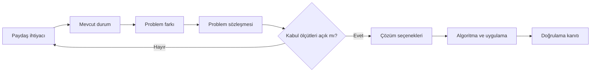
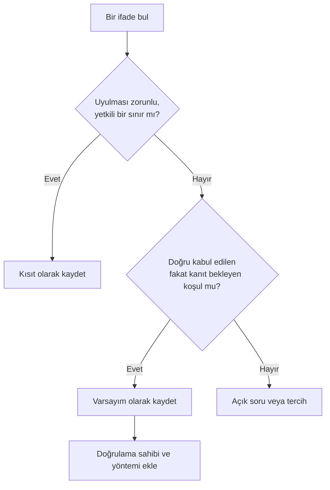
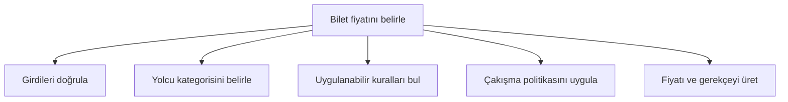
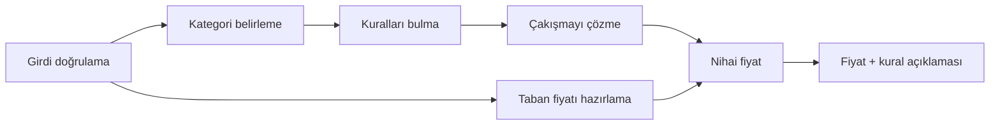

# Problem Tanımı ve Ayrıştırma

## Learning Objectives

Bu chapter'ın kanonik öğrenme çıktısı şudur:

- `V01-LO005`: Verilen problemi input, output, constraint, assumption ve edge
  case'lere ayırabilmek.

Bu çıktıyı karşıladığını yalnız terimleri ezberleyerek değil, aşağıdaki
kanıtları üreterek göstereceksin:

- belirsiz bir istekte belirtiyi, problemi ve çözüm fikrini ayırmak;
- paydaşı ve istenen gözlenebilir sonucu açıklamak;
- girdileri, çıktıları ve bunların geçerlilik sınırlarını yazmak;
- kısıtları varsayımlardan gerekçesiyle ayırmak;
- kapsamı ve kapsam dışı hedefleri belirlemek;
- normal, sınır, uç ve geçersiz senaryolar oluşturmak;
- ölçülebilir kabul ölçütleri yazmak;
- problemi tek sorumluluklu alt problemlere ayırmak;
- alt problemler arasındaki bağımlılıkları göstermek;
- bir AI önerisindeki uydurulmuş gereksinimi, eksik varsayımı veya kapsam
  kaymasını tespit etmek;
- nihai kararlarını kanıtla savunmak.

Bu chapter'ın sonunda çalışan program yazman beklenmez. Üreteceğin temel
artefact, sonraki chapter'da algoritmaya dönüştürülebilecek kadar açık bir
**problem sözleşmesidir**.

## Prerequisites

Bu chapter iki önceki chapter'ın bilgisini kullanır:

- `V01-C01`: Bir süreci kesin ve sonlanabilir talimatlara ayırmanın neden önemli
  olduğunu açıklayabilmelisin.
- `V01-C02`: Girdi, çıktı ve program durumu arasındaki ilişkiyi temel düzeyde
  açıklayabilmelisin.

Kodlama dili, framework veya matematiksel ispat bilgisi gerekmez.

### Hazır oluş kontrolü

Notlarına bakmadan şu üç soruyu yanıtla:

1. “Kullanıcıdan sayı al ve iki katını yazdır” ifadesindeki girdi ve çıktı nedir?
2. Bir talimat neden belirsiz olduğunda iki kişi farklı sonuç üretebilir?
3. Bir programın ekranda çıktı vermesi ile kaynak dosyanın kendisi neden aynı
   şey değildir?

İlk iki soruyu açıklayamıyorsan `V01-C01` bölümüne; üçüncü soruda zorlanıyorsan
`V01-C02` bölümüne dön. Bu geri dönüş başarısızlık değil, dependency zincirini
doğru kullanmaktır.

## Estimated Study Time

Kanonik çalışma süresi **4–5 saattir**.

| Çalışma | Tahmini süre |
| --- | ---: |
| Ana anlatım, not alma ve kontrol noktaları | 120 dakika |
| Rehberli ticket-pricing örneği | 40 dakika |
| Karşılaştırma ve sınıflandırma çalışmaları | 30 dakika |
| Bağımsız hands-on exercise | 60 dakika |
| AI audit ve teknik savunma | 25 dakika |
| Yansıtma ve tekrar | 15 dakika |
| **Toplam** | **290 dakika** |

Laboratuvar, quiz ve mini proje katkısı bu sürenin dışında ayrıca planlanır.

### Bu chapter nasıl çalışılmalı?

Bu metni yalnız okuyup altını çizmek yeterli değildir. Her ana kavramda şu
döngüyü uygula:

1. Başlığı okumadan önce kendi tanımını yaz.
2. Teknik açıklamadan sonra tanımını düzelt.
3. Verilen örneği kapat ve aynı alanları kendin yeniden üret.
4. “Bunu problem mi, çözüm mü, kısıt mı, varsayım mı yapıyor?” diye sor.
5. Kontrol noktasını notlara bakmadan yanıtla.
6. Yanlış yanıt verdiğin yerde yalnız doğru cevabı değil, yanlış düşünce modelini
   kaydet.

> **Not defteri şablonu**
>
> - Problem:
> - Paydaş:
> - İstenen sonuç:
> - Girdiler ve geçerlilik alanları:
> - Çıktılar:
> - Kısıtlar:
> - Varsayımlar ve doğrulama yolları:
> - Kapsam içi:
> - Kapsam dışı:
> - Kabul ölçütleri:
> - Normal/sınır/uç/geçersiz senaryolar:
> - Alt sorumluluklar:
> - Bağımlılıklar:
> - Açık sorular:

## Introduction

Bir ekip toplantısında sana şu görev verildiğini düşün:

> “Bir bilet fiyatı programı yap.”

İlk tepkin ne olurdu? Hangi programlama dilini kullanacağını mı düşünürdün?
`if` ifadelerini ve değişkenleri mi planlardın? Belki hemen yaşa göre indirim
uygulayan birkaç satır kod yazmaya başlardın.

Fakat henüz şu soruların hiçbirinin cevabını bilmiyorsun:

- Hangi biletin fiyatı hesaplanacak?
- Girdi olarak taban fiyat mı, rota mı, yolcu yaşı mı alınacak?
- Çocuk, öğrenci veya yaşlı indirimlerinin sınırları nedir?
- Bir kişi birden fazla indirime uygunsa ne olacak?
- Para hangi birimde ve hangi yuvarlama kuralıyla hesaplanacak?
- Negatif fiyat veya bilinmeyen yolcu kategorisi reddedilecek mi?
- Başarı yalnız bir sayı üretmek mi, yoksa uygulanan kuralı açıklamak mı?
- Ödeme alma, koltuk seçme ve kullanıcı hesabı bu işin parçası mı?

Bu sorular cevaplanmadan yazdığın kod sözdizimsel olarak kusursuz ve testleri
geçiyor olabilir. Yine de yanlış problemi çözebilir.

Profesyonel yazılım mühendisliğinde “çalışıyor” sözcüğü tek başına yeterli
değildir. **Neye göre çalışıyor? Hangi girdi alanında? Hangi paydaş için? Hangi
kısıtlarla? Hangi kanıt, ihtiyacın karşılandığını gösteriyor?** Bu chapter bu
soruları kod yazmadan önce cevaplayabilmenin temelini kurar. Problem tanımı;
gerekli sonucu, paydaşları, girdileri, çıktıları, kısıtları ve kabul sınırlarını
çözüm tasarımından önce görünür yapar. <!-- Claim: `ASEA-CLM-000012` -->

### Problem alanı ile çözüm alanı

Problem alanı (Problem Space), kimin hangi durumda neye ihtiyaç duyduğunu ve
mevcut durumla istenen sonuç arasındaki farkı anlamaya çalıştığımız alandır.
Çözüm alanı (Solution Space), bu farkı kapatabilecek seçenekleri tasarladığımız
alandır.



Metinsel karşılığı: Paydaş ihtiyacı ve mevcut durum karşılaştırılarak problem
farkı bulunur. Bu fark problem sözleşmesine dönüştürülür. Kabul ölçütleri açık
değilse ihtiyaç araştırmasına dönülür. Açık olduğunda çözüm seçenekleri,
algoritma ve uygulama tasarlanır; sonuç kanıtla doğrulanır.

Bu akış her projede katı biçimde doğrusal değildir. Yeni bir bulgu bizi problem
tanımına geri götürebilir. Önemli olan çözüm fikrini problem kanıtı gibi
sunmamaktır.

### İlk kontrol noktası

Aşağıdaki üç cümleyi sınıflandır:

1. “Kullanıcılar yoğun saatlerde bilet ücretini yolculuktan önce göremiyor.”
2. “Bir mobil uygulama yapmalıyız.”
3. “Kullanıcı, rota ve yolcu kategorisi seçildikten sonra nihai ücreti görmeli.”

Birinci cümle gözlenen problem/belirti hakkında kanıt adayıdır. İkinci cümle bir
çözüm fikridir. Üçüncü cümle istenen davranışa yaklaşır; fakat hâlâ fiyat
kuralları ve kabul ölçütleriyle netleştirilmelidir.

## Core Concepts

### İhtiyaç, belirti, problem ve çözüm fikri

İhtiyaç (Need), paydaşın elde etmek istediği sonuç veya ortadan kaldırmak
istediği güçlüktür. Belirti (Symptom), problemin gözlenen sonucudur. Problem,
mevcut durum ile istenen durum arasındaki açıklanabilir farktır. Çözüm fikri
(Solution Idea) ise bu farkı kapatabileceğini düşündüğümüz seçenektir.

Bu dört kavramı ayırmak önemlidir:

| İfade | Tür | Neden? |
| --- | --- | --- |
| Yolcular fiyatı önceden göremiyor | Belirti/problem kanıtı | Mevcut güçlüğü anlatır |
| Yolcu satın almadan önce doğru fiyatı bilmeli | İhtiyaç/istenen sonuç | Elde edilmesi gereken sonucu anlatır |
| React ile bir ekran yapalım | Çözüm fikri | Belirli bir teknoloji ve yöntem seçer |
| Fiyat iki saniye içinde gösterilmeli | Kısıt veya ölçüt adayı | Ölçülebilir sınır getirir |

Bir çözüm fikri kötü olmak zorunda değildir. Sorun, onu yeterli kanıt olmadan
problem tanımının içine kilitlemektir. “Mobil uygulama yap” dendiğinde belki asıl
sorun mevcut web ekranındaki yanlış fiyat kuralıdır. Yeni uygulama yanlış kuralı
daha hızlı gösterebilir.

### Paydaş ve gözlenebilir sonuç

Paydaş (Stakeholder), sonuçtan etkilenen veya gereksinimler üzerinde meşru
etkisi bulunan kişi ya da gruptur. Kullanıcı önemli bir paydaştır; fakat tek
paydaş olmayabilir. Bilet örneğinde yolcu, satış görevlisi, fiyat politikasını
yöneten ekip, müşteri desteği ve finans sorumlusu farklı beklentilere sahip
olabilir.

Paydaş listesi çıkarmanın amacı herkesi memnun edecek sınırsız kapsam üretmek
değildir. Amaç, hangi ihtiyacın kimden geldiğini ve çatışmanın nerede olduğunu
görmektir.

Bir paydaş kaydı şu dört soruyu yanıtlamalıdır:

1. Kim etkileniyor?
2. Hangi işi veya kararı vermeye çalışıyor?
3. Bugün hangi güçlükle karşılaşıyor?
4. İyileşmeyi hangi gözlenebilir sonuç gösterecek?

**Zayıf:** “Sistem kullanıcı dostu olmalı.”

**Daha güçlü:** “Yolcu, rota ve kategori bilgilerini girdikten sonra nihai
ücreti ve uygulanan indirim kuralını ek yardım almadan görebilmeli.”

İkinci ifade hâlâ ayrıntılandırılabilir; fakat gözlenebilir bir davranış sunar.

### Problem tanımı ve gereksinim

Problem tanımı (Problem Definition), çözülmesi gereken farkın bounded
tarifidir. Gereksinim (Requirement), çözümün veya sistemin sağlaması gereken
doğrulanabilir koşul ya da yetenektir.

Problem tanımı şu unsurları bir araya getirir:

- paydaş ve bağlam;
- mevcut güçlük;
- istenen sonuç;
- girdi ve çıktı sınırları;
- kısıtlar ve varsayımlar;
- kapsam ve kapsam dışı hedefler;
- kabul ölçütleri;
- belirsizlikler ve açık sorular.

Bu chapter'da tam kurumsal Software Requirements Specification yazmayacağız.
Ama küçük bir problem için bile bu unsurların görünür olmasını sağlayacağız.

#### Problem ifadesi şablonu

```text
[Paydaş], [bağlam] içinde [mevcut güçlük] yaşadığı için
[gözlenebilir sonucu] elde edemiyor.

Başarı, [ölçülebilir kabul koşulları] gerçekleştiğinde gözlenecek.
Bu çalışma [kapsam içi davranışları] kapsar;
[kapsam dışı hedefleri] kapsamaz.
```

Bilet örneğine uyarlama:

> Yolcu, satın alma öncesinde rota ve kategoriye uygulanacak kurallar dağınık
> olduğu için nihai fiyatı ve indirimin nedenini güvenilir biçimde göremiyor.
> Başarı; geçerli girdilerde doğru fiyat ve kural açıklaması üretildiğinde,
> geçersiz girdiler açıkça reddedildiğinde gözlenecek. Ödeme alma, koltuk seçme
> ve kullanıcı hesabı bu çalışmanın kapsamında değildir.

Bu ifade teknoloji seçmez. Ne üretileceğini ve neyin başarı sayılacağını sınırlar.

### Girdi, çıktı ve geçerlilik alanı

Girdi (Input), çözümün davranış üretmek için aldığı bilgidir. Çıktı (Output),
dışarıdan gözlenebilen sonuç veya durum değişikliğidir.

“Girdi: yaş” yazmak çoğu zaman yetersizdir. Şunları da sormalısın:

- Girdinin biçimi nedir?
- Birimi nedir?
- Zorunlu mudur?
- Geçerli minimum ve maksimum nedir?
- Kaynağı güvenilir midir?
- Eksik, bozuk veya tekrarlı olabilir mi?
- Hassas veya kişisel bilgi midir?

| Girdi | Geçerlilik sözleşmesi | Açık soru |
| --- | --- | --- |
| Taban fiyat | Negatif olmayan parasal değer | Para birimi ve hassasiyet nedir? |
| Yolcu kategorisi | Tanımlı kategori kümesinden biri | Kategorileri kim yönetir? |
| Rota | Aktif rota kimliği | Pasif rota nasıl ele alınır? |
| Yolculuk zamanı | Geçerli tarih/saat | Saat dilimi nedir? |

Çıktıyı da aynı dikkatle tanımla:

| Çıktı | Beklenen davranış |
| --- | --- |
| Nihai fiyat | Negatif olamaz; belirlenen para/yuvarlama kuralına uyar |
| Kural açıklaması | Uygulanan indirimi veya indirimsiz durumu belirtir |
| Red sonucu | Hangi girdinin neden kabul edilmediğini açıklar |

Ekrana bir sayı yazdırmak her zaman tek çıktı değildir. Bir kaydın değişmesi,
dosyanın oluşması veya işlemin güvenli biçimde reddedilmesi de gözlenebilir
çıktıdır.

### Kısıt ve varsayım

Kısıt (Constraint), kabul edilebilir çözüm alanını zorunlu olarak sınırlar.
Varsayım (Assumption), kanıt doğrulayıncaya veya yanlışlayıncaya kadar geçici
olarak doğru kabul ettiğimiz koşuldur. <!-- Claim: `ASEA-CLM-000013` -->



Metinsel karşılığı: İfade zorunlu ve yetkili bir sınırsa kısıttır. Değilse,
kanıt bekleyen geçici bir kabul olup olmadığı sorulur. Öyleyse varsayım olarak
kaydedilir ve doğrulama yöntemi eklenir. İki sınıfa da girmiyorsa açık soru veya
tasarım tercihi olabilir.

| İfade | Sınıf | Gerekçe |
| --- | --- | --- |
| Nihai fiyat negatif olamaz | Kısıt/domain kuralı | Kabul edilen sonucu zorunlu sınırlar |
| Bütün yolcular kategori bilgisini doğru girer | Varsayım | Henüz kanıtlanmamış kullanıcı davranışı |
| Yanıt iki saniye içinde üretilecek | Kısıt adayı | Yetkili performans gereksinimiyse zorunludur |
| Ağ bağlantısı her zaman açıktır | Varsayım | Çevre koşulu garanti edilmemiştir |
| TypeScript kullanılacak | Açık soru/constraint adayı | Kurumsal zorunluluk yoksa yalnız tercihtir |

#### Varsayım defteri

Varsayımı yalnız listelemek yetmez:

| Varsayım | Neden gerekli? | Nasıl doğrulanır? | Sahip | Yanlışsa etkisi |
| --- | --- | --- | --- | --- |
| Kategoriler çakışmaz | Tek kural seçebilmek | Politika sahibiyle review | Ürün sahibi | Öncelik kuralı gerekir |
| Taban fiyat doğru gelir | Hesaplamayı başlatmak | Veri kaynağı contract'ı | Entegrasyon sahibi | Ayrı validation gerekir |

Varsayım yanlış çıktığında bunu saklama. Problem sözleşmesini güncelle. Bir
varsayım yeni kısıta, edge case'e veya kapsam değişikliğine dönüşebilir.

### Kapsam ve kapsam dışı hedefler

Kapsam (Scope), bu teslimatta çözmeyi taahhüt ettiğimiz sorumlulukları belirtir.
Kapsam dışı hedef (Non-goal), önemli olsa bile bu sözleşmede bilerek
çözmeyeceğimiz alanı belirtir.

Bilet fiyatı probleminde:

#### Kapsam içi

- geçerli rota ve yolcu kategorisi için fiyat hesaplamak;
- uygulanan kuralı açıklamak;
- geçersiz girdiyi controlled biçimde reddetmek.

#### Kapsam dışı

- ödeme almak;
- koltuk ayırmak;
- kullanıcı hesabı oluşturmak;
- fiyat politikası yönetim ekranı yapmak.

Non-goal yazmak “bunu hiçbir zaman yapmayacağız” demek değildir. Yalnız bu
teslimatın sözünü netleştirir. Kapsam görünür değilse ekip iyi niyetle sürekli
yeni özellik ekleyebilir; acceptance criteria ise durmadan hareket eder.

### Kabul ölçütü

Kabul ölçütü (Acceptance Criterion), çözümün istenen davranışı sağladığını
gösterecek gözlenebilir koşuldur.

#### Zayıf ölçütler

- hızlı olmalı;
- doğru çalışmalı;
- kolay kullanılmalı;
- bütün edge case'leri desteklemeli.

Bu ifadeler niyet taşır, fakat gözlenebilir sınır taşımaz.

#### Daha güçlü ölçütler

- Geçerli taban fiyat ve tanımlı kategori verildiğinde sistem negatif olmayan
  nihai fiyat üretir.
- Kategori tanımsızsa sistem fiyat üretmez ve hangi alanın geçersiz olduğunu
  açıklar.
- İndirim uygulanırsa çıktı kullanılan kuralı belirtir.
- İki indirim aynı anda uygulanabiliyorsa öncelik veya birleştirme politikası
  açıkça uygulanır.

İyi ölçüt bir davranışı sınar, koşulu ve beklenen sonucu görünür yapar, fakat
gereksiz iç uygulama ayrıntısını dayatmaz.

### Normal, sınır, uç ve geçersiz senaryolar

Sınır durumu (Boundary Case), tanımlı bir alt/üst sınırın tam üzerindeki veya
hemen çevresindeki senaryodur. Uç durum (Edge Case), olağan varsayımların
zorlandığı davranış sınırındaki anlamlı senaryodur. Geçersiz girdi (Invalid
Input), problem sözleşmesinin kabul etmediği değerdir. <!-- Claim:
`ASEA-CLM-000014` -->

Bu kavramlar aynı değildir:

| Senaryo | Sınıflandırma | Açıklama |
| --- | --- | --- |
| Yetişkin kategori, 100 TL | Normal | Yaygın geçerli kullanım |
| İndirim yaş sınırının tam altı/üstü | Boundary | Kural geçiş noktasını sınar |
| Taban fiyat 0 | Edge ve geçerli olabilir | Sıra dışı fakat sözleşme izin verebilir |
| Taban fiyat -10 | Invalid | Negatif fiyat contract dışında |
| İki indirim hakkı aynı anda | Edge | Kural çakışmasını görünür yapar |
| Kategori alanının eksik olması | Invalid veya ayrı error case | Contract kararına bağlıdır |

Edge case bulmak rastgele “garip şeyler” düşünmek değildir. Şu mercekleri
kullan:

- minimum, maksimum ve sınırın iki yanı;
- boş, tek öğe ve çok öğe;
- tekrar, eşitlik ve sıra;
- eksik veya gecikmiş bilgi;
- aynı anda gerçekleşen kurallar;
- izin, sahiplik ve gizlilik;
- dış bağımlılığın başarısızlığı;
- birim, saat dilimi, locale ve encoding farkı;
- varsayımın yanlış çıkması.

### Problem ayrıştırma

Problem ayrıştırma (Problem Decomposition), bounded bir problemi girdileri,
çıktıları ve etkileşimleri anlaşılabilen daha küçük sorumluluklara ayırmaktır.
Amaç yalnız parçaları küçültmek değildir; ilişkileri düşünmeyi mümkün kılmaktır.
<!-- Claim: `ASEA-CLM-000015` -->

Bilet probleminde ilk ayrıştırma:



Metinsel karşılığı: Ana problem; girdileri doğrulama, kategoriyi belirleme,
uygulanabilir kuralları bulma, kural çakışmasını çözme ve fiyatla gerekçeyi
üretme sorumluluklarına ayrılır.

Bu ağaç bize hiyerarşiyi gösterir. Fakat çalışma sırası ve veri bağımlılığı
konusunda eksiktir. Bunun için dependency graph gerekir:



Metinsel karşılığı: Kategori belirleme doğrulanmış girdiye; kural bulma
kategoriye; çakışmayı çözme bulunan kurallara bağlıdır. Nihai fiyat hem
hazırlanmış taban fiyata hem çözülmüş kurala ihtiyaç duyar. Son çıktı fiyatı ve
kural açıklamasını birleştirir.

#### Kaliteli ayrıştırma kontrolü

Her alt parça için sor:

- Tek ve adlandırılabilir sorumluluğu var mı?
- Hangi girdiyi tüketiyor?
- Hangi çıktıyı üretiyor?
- Başka hangi parçaya bağlı?
- Bağımsız olarak incelenebilir mi?
- Ana problemde boşluk bırakıyor mu?
- Başka parçayla gereksiz overlap oluşturuyor mu?

“Frontend, backend, database” listesi her zaman problem decomposition değildir.
Bu liste teknik katmanları söyler; iş sorumluluklarını, acceptance criteria'yı
ve bağımlılıkları açıklamayabilir.

### Soyutlama

Soyutlama (Abstraction), belirli bir soruyu cevaplamak için gerekli bilgiyi
koruyup ilgisiz ayrıntıyı geçici olarak gizleyen modeldir.

Bilet fiyatında yolcunun adı hesaplamayı değiştirmiyorsa modelden çıkarılabilir.
Yaşı veya kategori hakkı fiyatı değiştiriyorsa korunmalıdır. Soyutlama bütün
ayrıntıyı silmek değil, amaca göre doğru ayrıntıyı seçmektir.

Şu soruyu kullan:

> Bu bilgiyi kaldırırsam acceptance criterion'ın sonucunu yanlış hesaplama veya
> açıklama ihtimalim var mı?

Evetse bilgi muhtemelen model için önemlidir. Hayırsa şimdilik gizlenebilir.

### Doğrulama, geçerleme ve izlenebilirlik

Doğrulama (Verification), ürettiğimiz artefact'ın tanımlı kurala uygun olup
olmadığını sorar: “Problem contract şablonunun gerekli alanlarını doğru
doldurduk mu?”

Geçerleme (Validation), doğru ihtiyacı temsil edip etmediğimizi sorar: “Bu
contract yolcunun gerçekten yaşadığı problemi karşılıyor mu?”

İzlenebilirlik (Traceability), ihtiyetten kabul ölçütüne ve alt sorumluluktan
kanıta kadar ilişkinin kaybolmamasıdır.

```text
Paydaş ihtiyacı
  -> problem ifadesi
  -> gereksinim/kısıt
  -> kabul ölçütü
  -> alt sorumluluk
  -> doğrulama kanıtı
```

Bir ihtiyaç değiştiğinde bu zincir etkilenen kriterleri ve sorumlulukları
bulmana yardım eder.

### Tam problem sözleşmesi

Artık parçaları tek bir artefact'ta birleştirebiliriz:

| Alan | Ticket-pricing örneği |
| --- | --- |
| Paydaş | Satın alma öncesinde fiyatını bilmek isteyen yolcu |
| Problem | Dağınık kurallar nedeniyle nihai fiyat ve nedeni güvenilir görünmüyor |
| İstenen sonuç | Geçerli girdide fiyat ve uygulanan kural açıklaması |
| Girdiler | Taban fiyat, rota, yolcu kategorisi, zaman |
| Çıktılar | Nihai fiyat, kural açıklaması veya açık red sonucu |
| Kısıtlar | Negatif fiyat yok; belirli para/yuvarlama kuralı |
| Varsayımlar | Kategori verisi güncel; rota fiyatı güvenilir kaynaktan geliyor |
| Kapsam | Fiyat hesaplama, açıklama ve input rejection |
| Non-goals | Ödeme, koltuk, hesap, politika yönetimi |
| Acceptance criteria | Normal, boundary, conflict ve invalid davranışları ölçen kurallar |
| Edge cases | Sıfır fiyat, sınır yaş, çakışan indirim, pasif rota |
| Ayrıştırma | Validation, categorization, rule selection, conflict, output |
| Açık sorular | İndirim birleşimi, zaman dilimi, rounding, politika sahibi |

### Aktif hatırlama kontrolü

Metni kapat ve şu sorulara cevap ver:

1. Problem ifadesi neden teknoloji adı içermek zorunda değildir?
2. Constraint ile assumption arasındaki karar sorusu nedir?
3. Edge case neden invalid input ile eş anlamlı değildir?
4. Decomposition tree ile dependency graph neyi farklı gösterir?
5. Verification ile validation arasındaki fark nedir?

Yanıtlarını problem sözleşmesindeki bir örnekle açıklayamıyorsan ilgili H3'e
geri dön.

## Engineering Perspective

### Yanlış problemi doğru biçimde çözmek

Bir çözüm bütün testlerini geçebilir ve yine de işe yaramayabilir. Testler
yazılmış contract'a göre doğruluk gösterir. Contract gerçek ihtiyacı yanlış
temsil ediyorsa testler yanlış problemi tutarlı biçimde doğrular.

Bu nedenle mühendis şu iki soruyu birlikte taşır:

- İnşa ettiğimiz şey tanımlandığı gibi çalışıyor mu?
- Tanımladığımız şey gerçekten inşa edilmesi gereken şey mi?

Birincisi verification, ikincisi validation düşüncesidir.

### Değişiklik maliyeti

Belirsizlik erken görünürse tablo veya diagram değiştirilir. Geç görünürse kod,
test, veri, dokümantasyon ve kullanıcı davranışı birlikte değişebilir. Bu ifade
“önceden her şeyi bilmeliyiz” anlamına gelmez. Ama bilinmeyeni varsayım ve açık
soru olarak kaydetmek, sessizce kesinlik taklidi yapmaktan daha güvenlidir.

### Takım iletişimi

Problem sözleşmesi farklı rolleri aynı dili kullanmaya zorlar. Ürün sahibi
istenen sonucu; developer input/output ve dependency'yi; tester acceptance
criteria ve edge case'leri; security reviewer trust boundary ve hassas veriyi
inceleyebilir.

Bu belge “duvarın üzerinden atılan gereksinim” olmamalıdır. Review sırasında
değişen yaşayan bir artefact'tır. Ancak değişiklikler izlenebilir olmalı;
önceki kararın neden değiştiği görünmelidir.

### AI-native mühendislik

Yapay zekâ belirsiz isteği akıcı ve ikna edici bir specification'a
dönüştürebilir. Akıcılık doğruluk değildir. AI:

- verilmeyen bir iş kuralını yaygın uygulama diye ekleyebilir;
- gerçek constraint'i tercih gibi ele alabilir;
- assumption'ı gerçek olarak yazabilir;
- edge case'i unutabilir;
- scope dışı özellikler ekleyebilir;
- erken teknoloji seçebilir.

Bu chapter'da AI'ın rolü cevabı üretmek değil, senin modelini sınamaktır.

#### Zorunlu AI çalışma sırası

1. AI kapalıyken ilk problem contract'ını yaz.
2. Emin olmadığın alanları “açık soru” diye işaretle.
3. AI'a contract'ı ver ve yalnız eksik/çelişkili alanları bulmasını iste.
4. Her AI önerisini `accept`, `correct` veya `reject` olarak sınıflandır.
5. Kararın yanında contract alanını ve kanıtını belirt.
6. AI'ın eklediği yeni requirement için yetkili kaynağı sor.
7. Nihai contract'ı AI olmadan sesli açıkla.

Örnek görev sözleşmesi:

```text
Amaç: Aşağıdaki problem contract'ındaki eksik veya çelişkili alanları bul.
Kapsam: Yalnız problem tanımı; çözüm kodu üretme.
Non-goal: Teknoloji, mimari veya UI seçme.
Çıktı: Her bulgu için alan, risk ve sorulması gereken soru.
Kural: Yeni bir gereksinim önerirsen bunun varsayım olduğunu açıkça etiketle.
```

Bu yaklaşım prompt ezberlemek değil, mühendislik authority'sini AI'a
devretmemektir.

## Real World Examples

### Dosya yükleme

Ham istek: “Dosya yüklemeyi iyileştir.”

Sorulması gerekenler:

- Sorun yavaşlık mı, başarısızlık mı, güvenlik mi, geri bildirim mi?
- Desteklenen tür ve boyut sınırı nedir?
- Aynı dosya yeniden yüklenirse ne olur?
- Ağ kesilirse partial upload nasıl ele alınır?
- Kullanıcı hangi sonucu görmelidir?
- Dosyanın içeriği hassas olabilir mi?

“Drag-and-drop ekran yap” çözüm fikridir. Asıl sorun başarısız upload'ın
kullanıcıya açıklanmamasıysa yalnız ekran biçimini değiştirmek yeterli değildir.

### Randevu planlama

Ham istek: “Uygun randevuyu bul.”

Problem contract şunları açıklamalıdır:

- hizmet veren ve randevu isteyen paydaşlar;
- çalışma saatleri ve timezone;
- randevu süresi;
- çakışma ve iptal kuralları;
- günün ilk/son slotu;
- aynı anda iki kişinin son slotu istemesi;
- geçmiş tarih ve bozuk tarih girdisi;
- başarı ölçütü ve red davranışı.

Burada ilk/son slot boundary case, eşzamanlı istek concurrency edge case,
biçimsiz tarih invalid input olabilir.

### Incident alarmı

Ham istek: “Kritik hatalarda ekibi uyar.”

Sorular:

- “Kritik” hangi ölçüte göre belirlenir?
- Alarmın sahibi kimdir?
- Aynı olay yüz kez gelirse yüz alarm mı üretilecek?
- İlk kişi yanıt vermezse escalation nasıl olur?
- Alarmın başarı ölçütü gönderilmesi mi, görülmesi mi, çözümün başlaması mı?
- Hassas kullanıcı verisi alarm metnine girebilir mi?

Bu örnek, output'un yalnız mesaj üretmek olmadığını gösterir. Acknowledgement ve
escalation da gözlenebilir state change olabilir.

### Kamu hizmeti başvurusu

Bir kurum “formu dijitalleştirmek” isteyebilir. Fakat kullanıcı ihtiyacı form
doldurmak değil, belirli bir hizmete başvurmak ve sonucunu takip etmektir. Formu
aynen ekrana taşımak mevcut kurumsal süreci dijital kopyaya dönüştürebilir;
kullanıcı problemini çözmeyebilir.

Bu nedenle paydaş ihtiyacı, policy constraint, gerekli evidence, accessibility,
status visibility ve red açıklaması problem contract'ta ayrılmalıdır.

### Örnekler arası transfer

| Soru | Bilet | Dosya | Randevu | Alarm |
| --- | --- | --- | --- | --- |
| Ana input | Fiyat/kategori | Dosya/metadata | Zaman/hizmet | Olay/severity |
| Boundary | Yaş/fiyat sınırı | Boyut sınırı | İlk/son slot | Severity eşiği |
| Assumption | Kategori güncel | Ağ kararlı | Takvim güncel | Bildirim kanalı açık |
| Non-goal | Ödeme | Dosya düzenleme | Görüntülü görüşme | Incident çözümü |
| Acceptance evidence | Doğru fiyat/açıklama | Başarı veya açık red | Çakışmasız slot | Doğru kişiye izlenebilir alarm |

Aynı zihinsel model farklı domain'lerde kullanılabilir. Değerli olan örneği
ezberlemek değil, soruları transfer etmektir.

## Common Mistakes

### Çözüm fikrini problem sanmak

**Belirti:** Problem ifadesi “uygulama yap,” “AI ekle” veya “mikroservise geç”
diye başlar.

**Kök neden:** Nasıl sorusu, kim ve neden sorularından önce cevaplanmıştır.

**Teşhis:** Teknoloji adını cümleden çıkar. Hangi paydaş güçlüğünün kaldığını
açıklayamıyorsan problem tanımı eksiktir.

**Düzeltme:** Mevcut durum, istenen sonuç ve başarı kanıtını yeniden yaz.

### Belirtiyi kök problem kabul etmek

**Belirti:** “Destek talepleri arttı” tek problem tanımıdır.

**Kök neden:** Gözlenen sonuç ile onu üreten mekanizma ayrılmamıştır.

**Teşhis:** “Bu neden oluyor ve hangi evidence bunu gösteriyor?” sorusunu sor.

**Düzeltme:** Kesin kök neden bilmiyorsan tahmin etme; hypothesis ve açık soru
olarak kaydet.

### Varsayımı gizlemek

**Belirti:** “Kullanıcı her zaman doğru kategori seçer” gibi cümleler fact gibi
yazılır.

**Etkisi:** Çözüm yanlış koşullarda güvenli görünür.

**Düzeltme:** Assumption ledger'a sahip, doğrulama yöntemi ve yanlış çıkma
etkisi ekle.

### Ölçüsüz kabul kriteri

**Belirti:** “Hızlı,” “kolay,” “güvenli” veya “doğru” sözcükleri tek başına
başarı sayılır.

**Teşhis:** İki reviewer aynı girdide aynı pass/fail kararını verebilir mi?

**Düzeltme:** Koşul, gözlenebilir davranış ve sınır ekle.

### Edge case ile invalid input'u birleştirmek

**Belirti:** Sıfır fiyat, eksik kategori ve negatif fiyat aynı sınıfta ele alınır.

**Etkisi:** Geçerli sınır davranışı yanlışlıkla reddedilebilir.

**Düzeltme:** Önce valid domain'i tanımla, sonra boundary/edge/invalid etiketle.

### Decomposition'ı rastgele görev listesi yapmak

**Belirti:** Alt parçaların input/output ve dependency'si yoktur.

**Etkisi:** İki iş aynı sorumluluğu yapar veya kritik iş sahipsiz kalır.

**Düzeltme:** Her parçaya tek sorumluluk, tüketilen/üretilen bilgi ve dependency
ekle.

### AI çıktısını authority sanmak

**Belirti:** Requirement'ın kaynağı “AI önerdi” olarak yazılır.

**Etkisi:** Uydurulmuş kural gerçek contract'a girer.

**Düzeltme:** AI önerisini candidate yap; stakeholder, standard veya testable
evidence ile doğrula.

## Best Practices

1. **Önce problemi çözüm teknolojisinden bağımsız yaz.** Teknoloji yalnız gerçek
   bir constraint ise problem contract'a girsin.
2. **Paydaş ile gözlenebilir sonucu birlikte yaz.** Özellik listesi başarı
   ölçütünün yerine geçmesin.
3. **Input için türden fazlasını tanımla.** Unit, range, optionality, source ve
   trust boundary ekle.
4. **Output'un failure davranışını da belirt.** Başarı kadar kontrollü red de
   contract'ın parçasıdır.
5. **Constraint ve assumption'ı ayrı tut.** Her assumption'a doğrulama yöntemi
   ve owner bağla.
6. **Scope ile non-goal'ü yan yana yaz.** Kapsam genişlemesini erken görünür yap.
7. **Acceptance criteria'yı observable behavior olarak yaz.** Gereksiz
   implementation dayatma.
8. **Boundary matrisi kullan.** Normal, boundary, edge ve invalid sınıflarını
   sistematik üret.
9. **Ağaç ve dependency graph'i birlikte incele.** Hiyerarşi ile sırayı
   karıştırma.
10. **Traceability zincirini koru.** Her responsibility'nin hangi criterion'ı
    desteklediğini bil.
11. **AI'dan önce bağımsız taslak üret.** Yoksa neyi öğrenci, neyi AI ürettiği
    ölçülemez.
12. **AI kararlarını accept/correct/reject olarak kaydet.** Her karara gerekçe
    ve evidence ekle.
13. **Belirsizliği saklama.** “Bilmiyoruz” alanı, uydurulmuş kesinlikten daha
    profesyoneldir.
14. **Contract'ı review ile yinele.** İlk taslak final değildir; değişiklik
    nedenini görünür tut.

Bu öneriler bağlama bağlıdır. Küçük ve düşük riskli bir egzersiz ile güvenlik
kritik sistem aynı belge derinliğini gerektirmez. Ancak düşünme alanları aynıdır.

## Hands-on Exercise

### Objective

`V01-C03-EX01` kapsamında belirsiz bir isteği bağımsız problem contract'a ve
dependency-aware decomposition'a dönüştürmek; ardından AI önerisini denetlemek.

### Requirements

Senaryo:

> “Bir kütüphane için kitap ödünç alma sistemi yap.”

Henüz kod veya pseudocode yazma. Teknoloji, database ve UI seçme. Çalışmanı
Markdown veya düz metinle yapabilirsin.

### Tasks

1. Ham istekteki çözüm kelimelerini işaretle.
2. En az üç paydaş ve her biri için istenen sonucu yaz.
3. Problem ifadesini çözüm teknolojisi kullanmadan oluştur.
4. En az altı input ve dört output tanımla.
5. Her input için valid domain veya açık soruyu belirt.
6. En az dört constraint yaz ve kaynağını belirt.
7. En az dört assumption yaz; doğrulama yöntemi ve yanlışsa etkisini ekle.
8. En az dört scope item ve dört non-goal yaz.
9. En az sekiz acceptance criterion üret.
10. En az üç normal, dört boundary/edge ve üç invalid scenario oluştur.
11. Problemi en az beş responsibility'ye ayır.
12. Decomposition tree ve dependency graph çiz.
13. Her responsibility'yi en az bir acceptance criterion'a bağla.
14. Çalışmanı kaydet; bundan sonra AI'a yalnız review görevi ver.
15. AI'ın önerdiği her değişikliği `accept`, `correct` veya `reject` olarak
    etiketle ve gerekçelendir.
16. Nihai contract'ı beş dakikada, notlardan yalnız diagramlara bakarak anlat.

### Deliverables

- `problem-contract.md`
- `scenario-matrix.md`
- `decomposition.md`
- `ai-review.md`
- kısa `reflection.md`

Dosya adları bu egzersiz için öneridir; kanonik repository yolu oluşturmaz.

### Evaluation Criteria

| Boyut | Başarı kanıtı |
| --- | --- |
| Problem framing | Problem ile çözüm fikri ayrılmış; stakeholder/outcome açık |
| Input/output | Alanlar, valid domain ve failure output görünür |
| Constraint/assumption | Doğru sınıflandırma, kaynak/verification bilgisi var |
| Boundaries | Normal, boundary, edge ve invalid ayrımı tutarlı |
| Scope | Scope ve non-goal çelişmiyor |
| Acceptance | Ölçütler gözlenebilir ve test edilebilir |
| Decomposition | Sorumluluklar complete, düşük overlap ve açık dependency taşıyor |
| Traceability | Responsibility → criterion ilişkisi kurulmuş |
| AI audit | Öğrenci AI'ı kanıtla kabul/düzeltme/reddetme kararı vermiş |
| Defense | Öğrenci kararlarını AI olmadan açıklayabiliyor |

Herhangi bir boyut eksikse bütün çalışmayı baştan yapma. Eksik alanı düzelt,
önce/sonra farkını ve nedenini kaydet. Bu diff, öğrenme kanıtıdır.

## Reflection Questions

1. İlk okuduğunda hangi çözüm fikrine gereğinden erken bağlandın?
2. Problem contract yazarken en çok hangi bilinmeyeni fact gibi kabul etmek
   istedin?
3. Hangi assumption yanlış çıkarsa çözümün en büyük bölümünü değiştirirdi?
4. Edge case üretirken rastgele örnek mi düşündün, yoksa sistematik mercek mi
   kullandın?
5. Decomposition tree ile dependency graph arasında hangi yeni ilişkiyi gördün?
6. Hangi responsibility'nin sınırı hâlâ belirsiz?
7. AI'ın önerdiği hangi requirement'ı reddettin ve authority neden yetersizdi?
8. AI'ın bulduğu hangi eksik gerçekten contract'ı iyileştirdi?
9. Verification yapıp validation yapmamanın sonucu ne olabilir?
10. Aynı yöntemi günlük yaşamında hangi belirsiz probleme uygulayabilirsin?
11. Bu chapter'dan C04'e taşınacak en önemli artefact hangisidir?
12. Bir hafta sonra bu yeterliği koruduğunu hangi kısa görevle kanıtlarsın?

## Chapter Summary

Bu chapter'da programlamanın koddan önce başlayan mühendislik katmanını kurduk.
Belirsiz isteği doğrudan çözüm olarak kabul etmek yerine ihtiyaç, belirti,
problem ve çözüm fikrini ayırdık. Paydaşın kim olduğunu ve hangi gözlenebilir
sonuca ihtiyaç duyduğunu belirledik.

Problem contract'ın input, output, constraint, assumption, scope, non-goal,
acceptance criterion ve edge-case alanlarını birleştirdiğini gördük. Constraint
kabul edilebilir çözümü zorunlu biçimde sınırlar; assumption kanıt bekleyen
geçici kabuldür. Boundary ve edge senaryoları davranış sınırlarını inceler;
invalid input contract dışında kalır.

Problem decomposition'ın rastgele görev listesi olmadığını öğrendik. Kaliteli
ayrıştırma, tek sorumluluklu parçaların input/output ve dependency ilişkilerini
korur. Decomposition tree hiyerarşiyi; dependency graph parçalar arası ihtiyacı
gösterir.

Verification artefact'ın yazılı contract'a uygunluğunu, validation ise doğru
ihtiyacın temsil edilmesini sorgular. Traceability, stakeholder ihtiyacından
acceptance evidence'a kadar ilişkiyi korur.

Son olarak AI'ın akıcı bir contract üretebilmesinin onu authority yapmadığını
uyguladık. Öğrenci önce bağımsız model üretir; AI çıktısını accept, correct veya
reject kararlarıyla ve evidence kullanarak denetler.

### Navigation

Bir sonraki chapter `V01-C04 — Algorithms, Pseudocode, and Tracing` olacaktır.
C04'e boş sayfayla değil, doğrulanabilir problem contract ve decomposition ile
gideceksin. C04 bu contract'ı sonlanan ve izlenebilir bir çözüm prosedürüne
dönüştürecektir.

## Key Takeaways

- Çalışan kod, doğru problemi çözdüğünü tek başına kanıtlamaz.
- İhtiyaç, belirti, problem ve çözüm fikri ayrı kavramlardır.
- Problem contract çözüm tasarımından önce başarı sınırını görünür yapar.
- Input yalnız isim değil; biçim, birim, range ve trust boundary taşır.
- Output başarı sonucu kadar controlled failure sonucunu da içerir.
- Constraint zorunlu sınır, assumption doğrulanması gereken geçici kabuldür.
- Scope taahhüdü, non-goal ise bilinçli dış sınırı gösterir.
- Acceptance criterion gözlenebilir davranışla yazılır.
- Boundary, edge ve invalid senaryolar eş anlamlı değildir.
- Decomposition responsibility, input/output ve dependency korumalıdır.
- Tree hiyerarşiyi, graph bağımlılığı gösterir.
- Verification “doğru yaptık mı?”, validation “doğru şeyi mi yaptık?” diye sorar.
- AI önerisi kanıt değildir; öğrenci authority ve teknik sorumluluğu korur.
- Öğrencinin nihai yeterliği, AI olmadan kararlarını savunabilmesidir.

## Further Reading

- [C03 Research Packet](../programming-fundamentals/research/v01-c03/research-packet.md):
  Bu dersin kaynak, evidence ve üretim sınırlarını görmek için.
- [NASA Systems Engineering Handbook](https://science.nasa.gov/wp-content/uploads/2023/04/nasa_systems_engineering_handbook_0.pdf):
  Stakeholder expectations, technical requirements ve logical decomposition
  süreçlerini daha ileri düzeyde incelemek için.
- [SEBoK Stakeholder Needs Definition](https://sebokwiki.org/wiki/Stakeholder_Needs_Definition):
  Need, stakeholder, risk, constraint ve scope ilişkisini sistem mühendisliği
  bağlamında okumak için.
- [GOV.UK Discovery Phase](https://www.gov.uk/service-manual/agile-delivery/how-the-discovery-phase-works):
  Önceden seçilmiş çözümü sorgulama ve problem alanını araştırma yaklaşımı için.
- [CS2023 Report](https://csed.acm.org/wp-content/uploads/2025/11/CS2023-Report.htm):
  Problem solving, abstraction ve decomposition'ın bilgisayar bilimi
  müfredatındaki yerini görmek için.

## References

1. ACM, IEEE Computer Society ve AAAI, *Computer Science Curricula 2023*, 2023,
   web edition 2025: <https://csed.acm.org/wp-content/uploads/2025/11/CS2023-Report.htm>
2. IEEE Computer Society, *Guide to the Software Engineering Body of Knowledge
   (SWEBOK) v4*: <https://www.computer.org/education/bodies-of-knowledge/software-engineering/topics>
3. ISO/IEC/IEEE, *29148:2018 Systems and Software Engineering — Life Cycle
   Processes — Requirements Engineering*: <https://www.iso.org/standard/72089.html>
4. NASA, *Systems Engineering Handbook*, Revision 2:
   <https://science.nasa.gov/wp-content/uploads/2023/04/nasa_systems_engineering_handbook_0.pdf>
5. NASA Software Engineering Handbook, *SWE-050 — Software Requirements*:
   <https://swehb.nasa.gov/spaces/7150/pages/16449651/SWE-050%2B-%2BSoftware%2BRequirements>
6. NASA Software Engineering Handbook, *SWE-055 — Requirements Validation*:
   <https://swehb.nasa.gov/spaces/SWEHBVB/pages/32604513/SWE-055%2B-%2BRequirements%2BValidation>
7. GOV.UK Service Manual, *Start by Learning User Needs*:
   <https://www.gov.uk/service-manual/user-research/start-by-learning-user-needs>
8. SEBoK Editorial Board, *Stakeholder Needs Definition*, SEBoK v2.14, May
   2026: <https://sebokwiki.org/wiki/Stakeholder_Needs_Definition>
9. Jeannette M. Wing, “Computational Thinking,” *Communications of the ACM*,
   49(3), 2006: <https://doi.org/10.1145/1118178.1118215>
10. [V01-C03 Research Collection](../programming-fundamentals/research/v01-c03/research-collection.md)
11. [V01-C03 Chapter Production Packet](../../../knowledge/production-packets/v01-c03-cpp-001.json)
