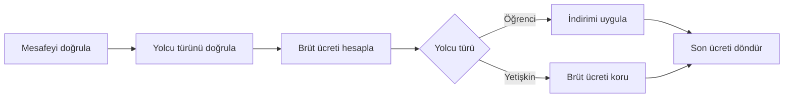
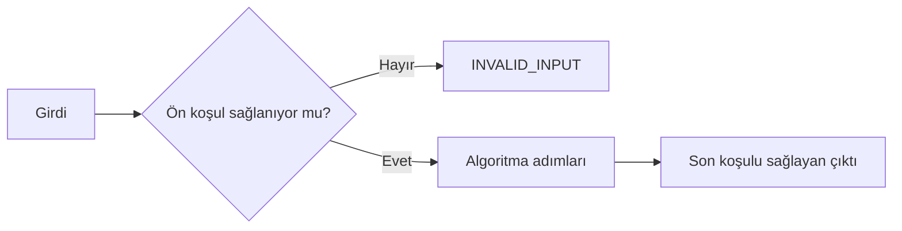
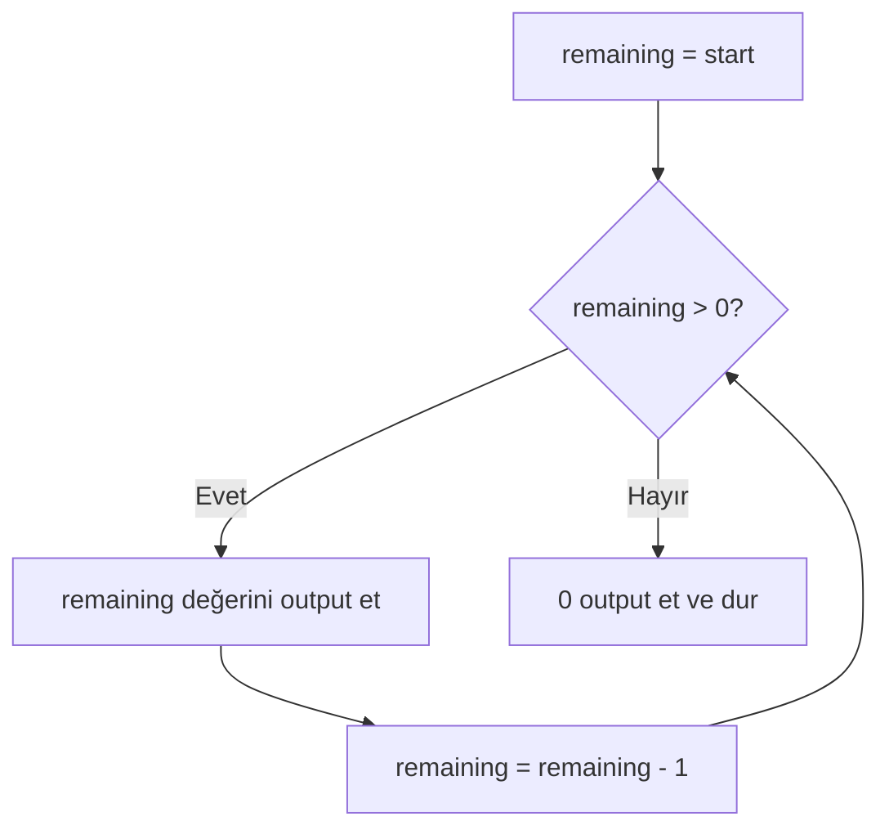
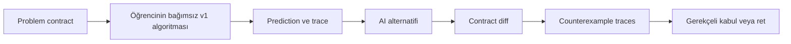

# Algoritmalar, Sözde Kod ve İzleme

## Learning Objectives

Bu chapter tamamlandığında `V01-LO006` kapsamında şunları yapabileceksin:

- problem sözleşmesini sıralı ve tek anlamlı çözüm adımlarına dönüştürmek,
- algoritma (Algorithm) ile program arasındaki farkı açıklamak,
- çözümü dil bağımsız sözde kod (Pseudocode) ile ifade etmek,
- ön koşul (Precondition) ve son koşul (Postcondition) yazmak,
- sözde kodu iki normal, bir sınır ve bir geçersiz girdide adım adım izlemek,
- bir tekrarın neden sonlanacağını ilerleme ölçüsü ve sınırla savunmak,
- trace sonucunun neyi desteklediğini ve neyi kanıtlamadığını ayırmak,
- AI tarafından önerilen algoritmayı sözleşme, trace ve karşı örnekle denetlemek.

Bu hedefin başarı kanıtı yalnız doğru bir sonuç değildir. Adımların neden doğru
sırada olduğunu, hangi girdileri kapsadığını ve nasıl durduğunu görünür kılman
gerekir.

## Prerequisites

Bu chapter’a başlamadan önce [C03 — Problem Tanımı ve
Ayrıştırma](./03-problem-tanimi-ve-ayristirma.md) bölümünü tamamlamış olmalısın.
Özellikle şu artefact’ları notlarına bakmadan yeniden kurabilmelisin:

- kullanıcı veya paydaş ihtiyacı,
- girdiler ve çıktılar,
- kısıtlar ve doğrulanmış varsayımlar,
- kapsam içi ve kapsam dışı davranışlar,
- normal, sınır ve geçersiz senaryolar,
- ölçülebilir kabul ölçütleri,
- sorumluluk ağacı ve bağımlılık sırası.

### Beş dakikalık başlangıç kontrolü

Şu isteği düşün:

> “Geçerli mesafeye ve yolcu türüne göre şehir içi ulaşım ücretini hesapla.”

Notlarına bakmadan dört girdi kuralı, bir çıktı ve üç açık soru yaz. Eğer
“hangi formülü kullanacağım?” sorusuna geçmeden önce problem sınırlarını
çıkaramıyorsan C03’ün problem sözleşmesi bölümüne dön. C04 belirsiz bir problemi
çözmez; sınırlandırılmış problemi izlenebilir bir prosedüre dönüştürür.

## Estimated Study Time

| Çalışma | Süre |
|---|---:|
| Ön koşul kontrolü ve ilk tahmin | 20 dakika |
| Ana anlatım ve not çıkarma | 120–150 dakika |
| Sözde kod ve trace örnekleri | 60 dakika |
| Hands-on exercise | 45–60 dakika |
| Quiz, tekrar ve reflection | 45–60 dakika |
| **Toplam** | **5–6 saat** |

Tek oturumda bitirmek zorunda değilsin. Önerilen düzen iki ana çalışma oturumu,
bir uygulama oturumu ve ertesi gün yapılan kısa aktif hatırlama turudur.

## Introduction

Bir problemi ayrıştırmak önemli bir eşiği geçmektir. Artık ne istediğimizi,
hangi verilerin geleceğini ve hangi sonuçların kabul edileceğini biliyoruz.
Fakat hâlâ bilgisayarın uygulayabileceği bir yol tarif etmiş değiliz.

Bir ekip arkadaşına “öğrenci indirimini hesapla” dediğini düşün. Arkadaşın şu
soruları sorabilir:

- Önce temel ücret mi, indirim mi hesaplanacak?
- Mesafe geçersizse ne olacak?
- Öğrenci indirimi hangi tutara uygulanacak?
- Yolcu türü tanınmıyorsa sonuç üretilecek mi?
- Sonuç hangi noktada tamamlanmış sayılacak?

Bu sorular cevapsızsa ortada hedef vardır fakat yeterince kesin bir prosedür
yoktur. Bilgisayar niyeti tamamlamaz, eksik kuralı tahmin etmez ve “mantıklı
olanı” kendi başına seçmez. Kendisine verilen operations hangi sırada ve hangi
koşullarla tanımlandıysa onları uygular.

Bu chapter’ın ana fikri şudur:

```text
Problem contract
→ algorithm contract
→ precise pseudocode
→ predicted trace
→ observed result
→ contract comparison
```

Burada henüz JavaScript öğrenmiyoruz. Değişken türleri, işleçler (Operators),
koşullar (Conditions) ve döngüler (Loops) ilerleyen chapter’larda ayrıntılı ele
alınacaktır. Yine de bu yapıların
dil bağımsız anlamlarını kullanacağız. Çünkü programlama dili, zaten düşünülmüş
bir çözümü ifade eder; çözümdeki belirsizliği sihirli biçimde ortadan kaldırmaz.

### Bu bölümü nasıl çalışmalısın?

Bu chapter yalnız okunarak tamamlanamaz. Bir algoritmayı okurken her satır sana
makul gelebilir; fakat aynı algoritmayı boş sayfaya yazmak veya bir girdide adım
adım yürütmek çok farklı bir beceridir. Bu nedenle her örnekte şu çalışma
döngüsünü kullan:

1. **Dur:** Örneğin sonucuna bakmadan kendi tahminini yaz.
2. **Oku:** Yalnız bir sözde kod satırını incele.
3. **Uygula:** O satırın mevcut değerleri nasıl değiştirdiğini hesapla.
4. **Kaydet:** Değişimi trace table’a yaz.
5. **Karşılaştır:** Tahmin ile oluşan sonucu karşılaştır.
6. **Açıkla:** Fark varsa ilk ayrışan adımı kendi cümlelerinle anlat.

Bir örneği hızlıca gözden geçirmek öğrenmiş olduğun anlamına gelmez. Kendine şu
ölçütü koy:

> Sözde kod kapanınca aynı düşünceyi yeni bir problem üzerinde yeniden
> kurabiliyor muyum?

Bu soruya henüz “evet” diyemiyorsan başarısız olmadın. Yalnızca hangi parçayı
tekrar üretmen gerektiğini öğrendin.

### Bölüm boyunca kullanacağımız ana hikâye

Bir şehir içi servis şirketi, yolculuk mesafesine ve yolcu türüne göre ücret
hesaplamak istiyor. C03’te şirketin isteğini doğrudan kodlamadık; girdileri,
çıktıları, sınırları ve açık soruları belirledik. Şimdi elimizde doğrulanmış bir
problem sözleşmesi olduğunu varsayacağız.

İlk bakışta çözüm kolay görünebilir: mesafeyi birim fiyatla çarp, başlangıç
ücretini ekle, gerekiyorsa indirim uygula. Fakat bilgisayar için “gerekiyorsa”
sözcüğü hâlâ anlamsızdır. Hangi yolcu türünde, hangi oranda, hangi sırayla ve
hangi geçersiz değer davranışıyla? Algoritma, insanın zihninde tamamladığı bu
boşlukları görünür hâle getirir.

Bu hikâyeyi chapter boyunca birkaç kez yeniden ziyaret edeceğiz. Her dönüşte
yeni bir katman ekleyeceğiz:

```text
İstek
→ doğrulanmış problem sözleşmesi
→ algoritma sözleşmesi
→ sözde kod
→ tahmin
→ trace table
→ sonlanma savunması
→ AI çıktısı denetimi
```

Bu sıra önemlidir. Sonraki bir aşamada hata bulduğunda önceki aşamaya geri
dönebilirsin. Trace yanlışsa hemen kod yazmak yerine sözde kodu; sözde kod yanlış
bir kural uyguluyorsa problem sözleşmesini incelersin.

## Core Concepts

### Algoritma: sonuçtan önce gelen kesin yol

Algoritma (Algorithm), belirli bir problem sınıfı için girdileri beklenen
çıktıya dönüştüren, uygulanabilir ve sonlanan adımlar bütünüdür. Bu chapter’daki
algoritmalar beş özelliğe sahip olacaktır:

1. **Sınırlandırılmıştır:** Hangi girdileri kapsadığı bellidir.
2. **Kesindir:** Her adım tek anlamlıdır.
3. **Sıralıdır:** Hangi adımın ne zaman çalışacağı bellidir.
4. **Gözlenebilirdir:** Ara state ve sonuç trace edilebilir.
5. **Sonlanır:** Contract kapsamındaki her girdi için durma noktasına ulaşır.

“En ucuz bileti bul” bir hedeftir; tek başına algoritma değildir. Hangi bilet
kümesinin inceleneceği, fiyatların nasıl karşılaştırılacağı, eşitlik durumunda ne
olacağı ve aramanın ne zaman biteceği açıklanmamıştır.

### Bir algoritmayı beş soruyla sınama

Bir metnin algoritma olup olmadığından emin değilsen şu beş soruyu sor:

1. **Ne alıyor?** Girdiler ve geçerli değer sınırları belli mi?
2. **Ne üretiyor?** Çıktı veya hata davranışı gözlenebilir mi?
3. **Hangi sırada ilerliyor?** Adımların önce-sonra ilişkisi açık mı?
4. **Kararı nasıl veriyor?** “Gerekirse”, “uygunsa” gibi sözcüklerin koşulları
   tanımlı mı?
5. **Ne zaman duruyor?** Her geçerli girdi için ulaşılabilir bir bitiş var mı?

Örneğin şu metni incele:

> “Sepetteki ürünlere bak. İndirimli olanları değerlendir. Toplamı uygun şekilde
> hesapla.”

Bu metin çözüm niyeti taşır fakat yeterli bir algoritma değildir. “Bakmak” hangi
değerin okunacağını, “değerlendirmek” hangi kuralın uygulanacağını, “uygun
şekilde” ise hangi sonucu üretmemiz gerektiğini söylemez.

Daha kesin bir başlangıç şöyle olabilir:

```text
1. Sepetin doğrulanmış ürün listesini al.
2. Toplamı sıfır olarak başlat.
3. Her ürün için sözleşmede tanımlı geçerli fiyatı al.
4. Ürün indirim koşulunu sağlıyorsa sözleşmedeki indirimi uygula.
5. Oluşan ürün tutarını toplama ekle.
6. İncelenmemiş ürün kalmadığında toplamı döndür.
```

Bu sürüm hâlâ ayrıntı ister; fakat artık girdi, ara durum, tekrar edilen iş ve
bitiş koşulu hakkında konuşabiliriz.

> **Not defterine yaz:** Bir algoritma “akıllı görünen talimatlar” listesi
> değildir. Girdi, çıktı, sıra, karar ve bitiş sınırları olan incelenebilir bir
> prosedürdür.

### Algoritmanın farklı gösterimleri

Aynı algoritma farklı biçimlerde gösterilebilir:

- numaralı doğal dil adımları,
- sözde kod,
- akış şeması,
- matematiksel ifade,
- belirli bir programlama dilindeki program.

Gösterim değişse de çözümün davranışı değişmemelidir. Bir akış şemasında öğrenci
indirimi varken sözde kodda yoksa iki gösterim aynı algoritmayı anlatmıyordur.
Bu yüzden “hangisi daha güzel?” sorusundan önce “hangisi sözleşmeyi eksiksiz ve
çelişkisiz temsil ediyor?” sorusu gelir.

### Mini kontrol — Algoritma mı değil mi?

Aşağıdaki ifadeleri önce kendin sınıflandır:

1. “Kullanıcıya uygun öneriyi göster.”
2. “Girdi boşsa `INVALID_INPUT` döndür.”
3. “Listedeki her değeri sırayla topla ve incelenmemiş değer kalmadığında toplamı
   döndür.”
4. “Sistemi hızlı ve güvenli yap.”

İkinci ifade tek bir kesin adım; üçüncü ifade basit bir algoritma taslağıdır.
Birinci ve dördüncü ifadeler ise hedef veya kalite beklentisi taşır, fakat
uygulanabilir çözüm adımlarını henüz tanımlamaz.

Algoritma ile program da aynı şey değildir. Algoritma çözümün dil bağımsız
mantığını; program ise bu mantığın belirli bir programlama dili ve çalışma
ortamındaki uygulanabilir ifadesini taşır.

| Özellik | Algoritma | Program |
|---|---|---|
| Ana amaç | Çözüm prosedürünü tanımlamak | Prosedürü bilgisayarda yürütmek |
| Gösterim | Sözde kod, metin, diyagram | Programlama dili source code’u |
| Dil bağımlılığı | Olmaması tercih edilir | Belirli dile ve runtime’a bağlıdır |
| Çalıştırılabilirlik | İnsan tarafından trace edilir | Bilgisayar tarafından çalıştırılır |
| Ayrıntı seviyesi | Davranış ve kararlar | Syntax, types, APIs ve error handling |

### Problem sözleşmesinden algoritma sözleşmesine

C03’teki problem contract “ne gerekli?” sorusunu cevaplar. Algoritma contract’ı
bu sınırdan “hangi valid input için hangi sonucu garanti edeceğiz?” sorusunu
çıkarır.

Örnek ulaşım ücreti sözleşmesi:

| Alan | Karar |
|---|---|
| `distanceKm` | 1–50 arasında tam sayı |
| `passengerType` | `ADULT` veya `STUDENT` |
| Temel ücret | 20 TL |
| Mesafe ücreti | Kilometre başına 4 TL |
| Öğrenci indirimi | Brüt ücretin %25’i |
| Çıktı | Geçerli ücret veya açık hata |
| Yuvarlama | Formül tam sayı ürettiği için gerekmiyor |

Formül özellikle seçildi: `20 + 4 × distanceKm` her zaman dörde bölünebilir;
%25 indirim kuruş ve rounding konusunu bu chapter’a taşımadan hesaplanabilir.

### Sözleşmeyi işlem sırasına dönüştürme

Bir problem sözleşmesindeki maddeleri rastgele sıraya dizmek algoritma üretmez.
Önce aralarındaki bağımlılığı görmeliyiz. Ücret örneğinde:

1. Mesafe geçerli değilse ücret hesaplayamayız.
2. Yolcu türü tanınmıyorsa hangi indirim kuralını uygulayacağımızı bilemeyiz.
3. İndirim miktarı brüt ücrete bağlıdır; bu nedenle önce brüt ücret gerekir.
4. Son ücret, brüt ücret ve yolcu türü kararı tamamlandıktan sonra üretilebilir.



Metin karşılığı: Mesafe ve yolcu türü doğrulanmadan hesaplama başlamaz. İki
doğrulama geçerse brüt ücret hesaplanır. Yolcu türüne göre indirim uygulanır
veya brüt ücret korunur. Her iki yol aynı çıktı adımında birleşir.

### Kural–adım eşleme tablosu

Profesyonel çalışmada her sözleşme kuralını bir algoritma adımına bağlamak,
unutulan veya uydurulan davranışları bulmayı kolaylaştırır:

| Kural ID | Sözleşme kuralı | Algoritmadaki karşılığı |
|---|---|---|
| `R1` | Mesafe 1–50 olmalı | İlk doğrulama kararı |
| `R2` | Tür ADULT/STUDENT olmalı | İkinci doğrulama kararı |
| `R3` | Başlangıç ücreti 20 TL | Brüt ücret hesabı |
| `R4` | Km başına 4 TL | Brüt ücret hesabı |
| `R5` | Öğrenci %25 indirimli | Öğrenci karar yolu |
| `R6` | Geçersiz girdi açık hata üretir | İki erken hata dönüşü |

Tabloda karşılığı olmayan kural varsa algoritma eksiktir. Algoritmada karşılığı
olup sözleşmede bulunmayan davranış varsa kaynaksız bir kural eklenmiş olabilir.

> **Not defterine yaz:** Sözleşme ile algoritma arasında çift yönlü bağ kur.
> Her kural bir adıma, her önemli adım doğrulanmış bir kurala dayanmalıdır.

### Ön koşul ve son koşul

Ön koşul (Precondition), algoritma başlamadan önce doğru olması gereken
durumdur. Son koşul (Postcondition), algoritma başarılı biçimde bittiğinde doğru
olacağı garanti edilen durumdur.

Ücret örneğinde:

```text
Preconditions:
- distanceKm is an integer from 1 through 50.
- passengerType is ADULT or STUDENT.

Postconditions:
- ADULT için sonuç 20 + 4 × distanceKm değeridir.
- STUDENT için sonuç brüt ücretin %75’idir.
- Girdi değerleri değiştirilmez.
```

Ön koşul “kullanıcı hata yapmaz” anlamına gelmez. Sistem sınırında geçersiz
girdinin nasıl ele alınacağı ayrıca tanımlanmalıdır. Öğrenme örneğimiz geçersiz
girdi için `INVALID_INPUT` üretecektir. Böylece valid-domain contract ile güvenli
boundary behavior birlikte görünür kalır.



Metin karşılığı: Girdi önce ön koşula göre incelenir. Geçersizse açık hata
üretilir. Geçerliyse algoritma çalışır ve son koşulu sağlayan sonuç döner.

### Günlük yaşamdan ön koşul ve son koşula

Bir bankamatikten para çekmeyi düşün. İşleme başlayabilmek için kartın okunması,
kimlik doğrulamanın tamamlanması ve istenen tutarın belirli sınırlar içinde
olması gerekir. Bunlar başlangıç koşullarıdır. İşlem başarıyla bittiğinde para
verilmiş, ilgili bakiye güncellenmiş ve işlem sonucu kaydedilmiş olmalıdır.
Bunlar bitişte beklenen sonuçlardır.

Benzetmenin sınırı vardır: Gerçek bankacılık sistemi güvenlik, eşzamanlılık,
donanım ve mevzuat gibi çok daha fazla kural taşır. Burada yalnız “başlangıçta
ne doğru olmalı?” ile “başarılı bitişte ne garanti edilmeli?” ayrımını görüyoruz.

Şimdi daha küçük bir örnek kullanalım:

> 0–100 arasındaki bir sınav puanını `PASS` veya `FAIL` olarak sınıflandır.
> Geçme sınırı 50’dir.

Ön koşul ve son koşul:

```text
Precondition:
- score bir tam sayıdır ve 0–100 arasındadır.

Postcondition:
- score 50 veya üzerindeyse sonuç PASS'tir.
- score 50'nin altındaysa sonuç FAIL'dir.
- score değeri değiştirilmez.
```

Peki `score = 120` gelirse? Bu değer ön koşulu sağlamaz. İki farklı contract
tasarımı mümkündür:

1. Algorithm yalnız valid input alacağını varsayar; validation başka katmanın
   sorumluluğudur.
2. Algorithm sistem sınırında kullanılır ve invalid input için açık hata üretir.

İkisi de belirli bağlamlarda savunulabilir. Hata, hangi yaklaşımın seçildiğini
gizlemek veya gerçek sistemde gelebilen bir değeri kolaylık olsun diye kapsam
dışı bırakmaktır.

### Ön koşul ile doğrulama aynı şey değildir

Ön koşul bir sözleşme ifadesidir; doğrulama ise bu koşulu çalışma sırasında
kontrol eden davranıştır. Örneğin “mesafe 1–50 arasındadır” ön koşuldur.
`distanceKm < 1 OR distanceKm > 50` kontrolü ise validation adımıdır.

Bu fark önemlidir:

- Contract bize neyin geçerli olduğunu söyler.
- Validation, gelen değerin bu sınıra uyup uymadığını gözler.
- Error behavior, uymadığında ne yapılacağını tanımlar.

Bu üçü birbirine bağlıdır fakat aynı değildir.

### Son koşul iyi yazılmış mı?

Şu iki ifadeyi karşılaştır:

- “Ücreti doğru hesapla.”
- “`STUDENT` için dönen ücret, `20 + 4 × distanceKm` brüt ücretinin %75’idir.”

İlk ifade niyeti anlatır ama doğrulanamaz. İkinci ifade belirli bir input sınıfı
için hesaplanabilir sonuç verir. İyi bir son koşul:

- dışarıdan gözlenebilir,
- mümkünse kesin,
- implementation ayrıntısına gereksiz yere bağlı olmayan,
- problem sözleşmesiyle uyumlu

olmalıdır.

### Mini kontrol — Hangi tür ifade?

Aşağıdakileri precondition, postcondition veya implementation detail olarak
sınıflandır:

1. `distanceKm` 1–50 arasındadır.
2. Öğrenci için çıktı brüt ücretin %75’idir.
3. Ara sonuç `tempFare` adlı değerde tutulur.
4. Geçerli yetişkin girdisinde çıktı brüt ücrete eşittir.
5. Algorithm önce `IF` kullanmalıdır.

Birinci ifade precondition; ikinci ve dördüncü postcondition’dır. Üçüncü ve
beşinci çözümün nasıl yazıldığına ilişkin implementation ayrıntılarıdır.

> **Not defterine yaz:** Ön koşul giriş kapısını, son koşul çıkış sözünü
> tanımlar. İkisi de “içeride nasıl yaptığımızı” anlatmak zorunda değildir.

### Sözde kod: syntax değil, kesinlik

Sözde kod (Pseudocode), algoritmik control ve data operations’ı belirli bir
programlama diline bağlanmadan incelemeye yetecek kesinlikte ifade eder. Tek bir
evrensel pseudocode standardı yoktur. Bu nedenle ekip içi convention açık
olmalıdır.

ASEA C04 convention’ı:

- Yapı keywords’leri İngilizce ve büyük harfle yazılır.
- Bloklar iki boşlukla girintilenir.
- Assignment için `←`, comparison equality için `=` kullanılır.
- Her satır tek bir belirgin operation taşır.
- Input ve output isimleri problem contract ile aynı kalır.
- Branch ve repetition açıkça kapanır.
- Stop condition ile progress update görünür yazılır.

```pseudocode
ALGORITHM calculateFare(distanceKm, passengerType)
  IF distanceKm < 1 OR distanceKm > 50 THEN
    RETURN INVALID_INPUT
  END IF

  IF passengerType ≠ ADULT AND passengerType ≠ STUDENT THEN
    RETURN INVALID_INPUT
  END IF

  grossFare ← 20 + (4 × distanceKm)

  IF passengerType = STUDENT THEN
    finalFare ← grossFare × 3 ÷ 4
  ELSE
    finalFare ← grossFare
  END IF

  RETURN finalFare
END ALGORITHM
```

Bu sözde kod JavaScript değildir. `ALGORITHM`, `THEN` ve `END IF` JavaScript
syntax’ı değildir; davranış sınırlarını insan incelemesi için açık kılar.

### Sözde kodu satır satır okumak

İlk kez sözde kod okurken bütün bloğa aynı anda bakmak bunaltıcı olabilir. Şimdi
ücret algoritmasını parçalara ayıralım.

```pseudocode
ALGORITHM calculateFare(distanceKm, passengerType)
```

Bu satır algoritmanın adını ve aldığı girdileri söyler. Henüz herhangi bir
hesaplama yapılmaz.

```pseudocode
IF distanceKm < 1 OR distanceKm > 50 THEN
  RETURN INVALID_INPUT
END IF
```

Bu blok bir karar noktasıdır. Mesafe alt sınırdan küçük **veya** üst sınırdan
büyükse normal akış durur ve açık hata döner. `distanceKm = 50` için ikinci
karşılaştırma false olur; çünkü 50, 50’den büyük değildir. Boundary hataları
çoğunlukla bu küçük karşılaştırma farklarında oluşur.

```pseudocode
grossFare ← 20 + (4 × distanceKm)
```

Sol ok, sağ tarafta hesaplanan değerin soldaki isimle hatırlanacağını anlatır.
Bu bir eşitlik iddiası değil, atama (Assignment) operation’ıdır. `distanceKm =
5` ise önce `4 × 5 = 20`, sonra `20 + 20 = 40` hesaplanır ve `grossFare` 40
olur.

```pseudocode
IF passengerType = STUDENT THEN
  finalFare ← grossFare × 3 ÷ 4
ELSE
  finalFare ← grossFare
END IF
```

Bu blok iki execution path üretir. Öğrenci yolunda brüt ücretin dörtte üçü;
diğer valid yol olan yetişkin yolunda brüt ücretin tamamı seçilir. Bu bloktan
sonra iki path tekrar birleşir.

```pseudocode
RETURN finalFare
END ALGORITHM
```

`RETURN`, algorithm’ın observable output’unu üretir ve bu yürütmeyi bitirir.
`END ALGORITHM` ise gösterimin sınırını kapatır.

### Sözde kod yazma merdiveni

Boş sayfadan tam sözde koda tek sıçramada geçmeye çalışma. Şu merdiveni kullan:

#### 1. Girdi ve çıktıyı yaz

```text
Input: distanceKm, passengerType
Output: finalFare veya INVALID_INPUT
```

#### 2. Ana sorumlulukları doğal dille sırala

```text
- girdiyi doğrula
- brüt ücreti hesapla
- yolcu türüne göre indirimi belirle
- sonucu döndür
```

#### 3. Belirsiz fiilleri aç

“Girdiyi doğrula” tek başına yeterli değildir. Hangi sınırların kontrol
edileceğini iki ayrı decision olarak yaz.

#### 4. State changes’i adlandır

Brüt ve son ücretin hangi ara değerlerle takip edileceğini göster.

#### 5. Branch’leri kapat

Her `IF` için hangi durumda hangi path’in seçildiğini ve yolların nerede
birleştiğini açıkla.

#### 6. Output ve stop’u görünür yap

Normal ve error path’lerin nerede bittiğini belirt.

### Kötü sözde kodu birlikte onarma

İlk sürüm:

```pseudocode
fareyi hesapla
öğrenciyse düzelt
sonucu ver
```

Sorunları:

- girdiler yok,
- geçerli aralık yok,
- “hesapla” operation’ının formülü yok,
- “öğrenciyse” kararının hangi girdiden geldiği belirsiz,
- “düzelt” sözcüğü observable değişimi söylemiyor,
- error path yok.

İkinci sürüm:

```pseudocode
INPUT distanceKm, passengerType
VALIDATE distanceKm
grossFare ← base fare + distance fare
IF passengerType is STUDENT THEN
  apply student discount
END IF
RETURN fare
```

Bu sürüm daha iyi, fakat `VALIDATE`, `base fare`, `distance fare` ve `apply`
hâlâ contract’a bağlanmamış. Tam sürümde bu alanların her biri kesin rule’a
dönüştürülür.

> **Kendin dene:** Tam algoritmaya bakmadan ikinci sürümü contract tablosundaki
> sayılarla tamamla. Sonra kendi satırlarını ana örnekle karşılaştır. Farklı ama
> aynı davranışı üreten bir çözüm mümkün olabilir; önemli olan contract fidelity
> ve trace edilebilirliktir.

### Sıra, seçim ve yineleme

Algoritmalar üç temel control fikrini birleştirir:

- **Sıra (Sequence):** Operations belirli düzende yürür.
- **Seçim (Selection):** Bir condition’a göre farklı yol seçilir.
- **Yineleme (Iteration):** Bir condition sağlanana kadar adımlar tekrarlanır.

Ücret algoritmasında validation, gross calculation ve discount sıralıdır.
Passenger type selection oluşturur. Bu örnekte iteration gerekmez. Bir problemi
çözmek için loop eklemek zorunda değiliz; gereksiz iteration hem okunabilirliği
hem termination reasoning’i zorlaştırır.

### Sıra: doğru adımların yanlış düzeni de hatadır

Sıra (Sequence), operations’ın belirlenmiş düzende çalışmasıdır. Bir algoritmada
bütün gerekli adımlar bulunabilir fakat yanlış sıradaysa sonuç yine hatalı olur.

Şu iki sırayı karşılaştır:

```text
A: validate → calculate gross → apply discount → return
B: apply discount → validate → calculate gross → return
```

B sırası, discount için gerekli gross value henüz oluşmadan işlem yapmaya
çalışır. Ayrıca invalid input üzerinde calculation başlatabilir. Sıra yalnız
okuma tercihi değil, veri ve karar bağımlılığıdır.

Bir adımın yerini belirlerken sor:

- Bu adım hangi bilgiye ihtiyaç duyuyor?
- O bilgi hangi önceki adımda oluşuyor?
- Bu adım başarısız olursa sonraki adımlar çalışmalı mı?
- Adımı öne taşımak observable behavior’ı değiştirir mi?

### Seçim: bilgisayar “niyet” değil koşul izler

Seçim (Selection), açık bir koşulun sonucuna göre path belirler. “Öğrenciyse
indirim yap” cümlesini kullanabilmek için en az üç şey gerekir:

1. Yolcu türünü taşıyan girdinin adı
2. Öğrenci durumunu temsil eden değer
3. True ve false paths’lerin davranışı

Bir seçim tablosu branch’leri yazmadan önce yararlı olabilir:

| `passengerType` | Seçilen davranış | Beklenen sonuç |
|---|---|---|
| `STUDENT` | %25 discount | Gross fare’in %75’i |
| `ADULT` | Discount yok | Gross fare |
| Başka değer | Calculation yok | `INVALID_INPUT` |

Tablo, false branch’in unutulmasını önler. Yalnız “öğrenciyse” yazıp yetişkin
ve invalid values’u sessiz bırakmak eksik algoritmadır.

### Yineleme: aynı satıra dönmek değil, ilerleyerek tekrar etmek

Yineleme (Iteration), belirli bir işin koşula bağlı olarak tekrarlanmasıdır.
Başlangıç öğrencileri loop’u “aynı şeyi tekrar yap” diye düşünebilir. Daha doğru
model şudur:

```text
başlangıç durumu
→ devam koşulunu sor
→ işi yap
→ ilerleme değerini değiştir
→ koşula geri dön
```

İlerleme yoksa repetition aynı durumda kalabilir ve hiç bitmeyebilir.

Geri sayım örneğini önce doğal dille yaz:

1. Kalan sayıyı başlangıç değerine ayarla.
2. Kalan sayı sıfırdan büyük mü diye sor.
3. Büyükse değeri göster ve bir azalt.
4. İkinci adıma dön.
5. Büyük değilse sıfırı göster ve dur.

Sonra sözde koda dönüştür. Bu iki gösterimi karşılaştırmak, syntax ezberlemek
yerine control flow’u anlamanı sağlar.

### Mini kontrol — Hangi yapı?

- “Önce mesafeyi doğrula, sonra brüt ücreti hesapla”: sıra
- “Tür STUDENT ise indirim uygula”: seçim
- “Kalan görev olduğu sürece bir görev işle”: yineleme

Gerçek algoritmalar bu yapıların birkaçını birlikte kullanabilir. Bu chapter’da
amaç yapıların programlama dili syntax’ını değil, davranışını okuyabilmektir.

Iteration için küçük bir bağımsız örnek:

```pseudocode
ALGORITHM countdown(start)
  IF start < 0 THEN
    RETURN INVALID_INPUT
  END IF

  remaining ← start
  WHILE remaining > 0
    OUTPUT remaining
    remaining ← remaining - 1
  END WHILE
  OUTPUT 0
END ALGORITHM
```

Bu algoritmada `remaining` her turda bir azalır. Alt sınır sıfırdır. Dolayısıyla
geçerli ve sonlu `start` girdisi için stop condition sonunda sağlanır.

### Durum ve izleme tablosu

State, algoritmanın belirli bir anda hatırladığı ilgili değerlerin bütünüdür.
Kuru çalıştırma (Dry Run), algoritmayı bilgisayarda çalıştırmadan adımları elle
uygulamaktır. İzleme tablosu (Trace Table) ise bu uygulamadaki state
transitions’ı düzenli biçimde kaydeder.

Bir trace’e başlamadan önce tahmin yaz:

> Input `distanceKm = 5`, `passengerType = STUDENT` için beklediğim sonuç 30
> TL’dir; çünkü gross 40 TL ve %25 discount 10 TL’dir.

Ardından gerçek trace:

| Step | Instruction | State before | State after | Output/note |
|---:|---|---|---|---|
| 1 | Distance validation | `distanceKm=5` | unchanged | Valid |
| 2 | Type validation | `STUDENT` | unchanged | Valid |
| 3 | Calculate gross | `grossFare` undefined | `grossFare=40` | `20 + 4×5` |
| 4 | Student branch | `grossFare=40` | `finalFare=30` | `40×3÷4` |
| 5 | Return | `finalFare=30` | unchanged | `30` |

Tahmin ile trace aynı sonucu verdi. Bu, input 5 ve STUDENT path’i için davranış
kanıtıdır. Fakat distance 50, ADULT veya invalid category için doğru çalıştığını
tek başına göstermez.

### Trace table’ı boş sayfadan kurmak

Hazır bir tabloyu okumak, boş bir trace table oluşturmakla aynı beceri değildir.
Şimdi `distanceKm = 3`, `passengerType = ADULT` girdisi için tabloyu sıfırdan
kuralım.

#### Adım 1 — Tahmini yaz

Brüt ücret `20 + 4 × 3 = 32` TL’dir. Yetişkin indirimi olmadığı için final
sonucun 32 TL olmasını bekliyoruz. Bu tahmin trace’den önce yazılır.

#### Adım 2 — İzlenecek değerleri seç

Her kelimeyi tabloya eklemek gerekmez. Sonucu etkileyen şu değerler yeterlidir:

- `distanceKm`
- `passengerType`
- `grossFare`
- `finalFare`
- output veya hata

#### Adım 3 — Başlangıç satırını oluştur

| Step | Instruction | `distanceKm` | `passengerType` | `grossFare` | `finalFare` | Output |
|---:|---|---:|---|---:|---:|---|
| 0 | Inputs received | 3 | ADULT | — | — | — |

Tire, değerin henüz oluşmadığını gösterir. Sıfırla aynı değildir. `grossFare =
0` deseydik algoritmanın gerçekten sıfır değeri ürettiğini iddia etmiş olurduk.

#### Adım 4 — Her kararın sonucunu kaydet

| Step | Instruction | `distanceKm` | `passengerType` | `grossFare` | `finalFare` | Output |
|---:|---|---:|---|---:|---:|---|
| 0 | Inputs received | 3 | ADULT | — | — | — |
| 1 | Distance invalid mı? | 3 | ADULT | — | — | Hayır |
| 2 | Type invalid mı? | 3 | ADULT | — | — | Hayır |

Değerler değişmedi ama karar sonucu önemlidir. “Değişmediği için satırı atlamak”
hangi path’in seçildiğini gizler.

#### Adım 5 — State değişimlerini kaydet

| Step | Instruction | `distanceKm` | `passengerType` | `grossFare` | `finalFare` | Output |
|---:|---|---:|---|---:|---:|---|
| 3 | Gross fare hesapla | 3 | ADULT | 32 | — | — |
| 4 | Student branch? | 3 | ADULT | 32 | 32 | Hayır; adult path |
| 5 | Final fare döndür | 3 | ADULT | 32 | 32 | 32 |

#### Adım 6 — Tahminle karşılaştır

Tahmin 32, trace output 32. Fakat kontrol burada bitmez. Son koşulu da sor:

```text
ADULT için finalFare = 20 + 4 × distanceKm mı?
32 = 20 + 4 × 3 → evet.
```

### Öğrenci örneği — İlk yanlış adımı bulma

Bir öğrenci `distanceKm = 5`, `STUDENT` için şu trace’i yazmış olsun:

| Step | Instruction | Gross | Final |
|---:|---|---:|---:|
| 1 | Distance valid | — | — |
| 2 | Type valid | — | — |
| 3 | Gross hesapla | 40 | — |
| 4 | Student discount | 40 | 10 |
| 5 | Return | 40 | 10 |

Beklenen final 30 iken tabloda 10 bulunuyor. İlk yanlış satır 4’tür. Öğrenci
“%25 indirim” ifadesini “fiyatın %25’ini öde” şeklinde yorumlamıştır. Oysa
ödenecek tutar brüt ücretin %75’idir.

Onarım yalnız 10’u 30 yapmak değildir. Düşünce hatasını görünür yazmalıyız:

```text
Symptom: finalFare 10, expected 30.
First divergence: Step 4.
Root cause: discount amount ile discounted final amount karıştırıldı.
Repair: finalFare ← grossFare × 3 ÷ 4.
Regression cases: STUDENT normal ve boundary traces yeniden çalıştırılacak.
```

Bu kayıt, ileride debugging yaparken kullanacağın güçlü bir alışkanlıktır.

### Not çıkarma şablonu

Kendi trace çalışmanda şu şablonu kullan:

```text
Input:
Case class:
Output prediction:
Relevant state:
Selected path:
Observed output:
Postcondition check:
First divergence, if any:
Repair and rerun:
```

> **Kendin dene:** `distanceKm = 1`, `passengerType = STUDENT` için boş tablo
> oluştur. Hazır boundary tablosuna bakmadan sonucu tahmin et. Sonra adımları
> doldur ve neden alt sınırın valid olduğunu tek cümleyle açıkla.

### Normal, sınır ve geçersiz izlemeler

İki normal trace bize temel branch’leri; boundary trace comparison eşiklerini;
invalid trace ise contract dışı davranışı gösterir.

| Case | Input | Beklenen output | Neden seçildi? |
|---|---|---:|---|
| Normal 1 | `5, ADULT` | 40 | Adult branch |
| Normal 2 | `5, STUDENT` | 30 | Student branch |
| Boundary | `50, STUDENT` | 165 | Maximum valid distance |
| Invalid | `51, ADULT` | `INVALID_INPUT` | Upper bound violation |

Boundary trace’in kritik satırları:

| Step | Instruction | Before | After | Note |
|---:|---|---|---|---|
| 1 | Check `distanceKm > 50` | `50` | unchanged | False; 50 valid |
| 2 | Validate type | `STUDENT` | unchanged | Valid |
| 3 | Gross | undefined | `220` | `20 + 4×50` |
| 4 | Discount | `220` | `165` | `220×3÷4` |
| 5 | Return | `165` | unchanged | Postcondition holds |

Invalid trace:

| Step | Instruction | Before | After | Output/note |
|---:|---|---|---|---|
| 1 | Check `distanceKm > 50` | `51` | unchanged | True |
| 2 | Return error | no fare state | unchanged | `INVALID_INPUT` |

Burada gross calculation’a hiç geçilmez. Bu ayrıntı önemlidir: yalnız hata
çıktısı değil, invalid data’nın sonraki operations’a ulaşmaması da görünürdür.

### Case seçimini rastgele yapma

“Üç input seçtim” demek iyi bir test stratejisi değildir. Her input belirli bir
soruyu cevaplamalıdır:

| Soru | Uygun case |
|---|---|
| Adult path doğru mu? | Normal adult |
| Student path doğru mu? | Normal student |
| Alt sınır eşitlikte kabul ediliyor mu? | `distanceKm = 1` |
| Üst sınır eşitlikte kabul ediliyor mu? | `distanceKm = 50` |
| Üst sınırın üzeri reddediliyor mu? | `distanceKm = 51` |
| Bilinmeyen tür calculation’a ulaşıyor mu? | `passengerType = CHILD` |

Bu tablo “çok örnek” yerine “amaçlı örnek” üretir. Daha sonraki testing
chapter’larında bu düşünce genişleyecektir.

### Trace table okuma egzersizi

Bir trace table gördüğünde şu sırayla incele:

1. Input ve case class doğru mu?
2. Prediction yazılmış mı?
3. Her branch sonucu görünür mü?
4. Bir value ilk kez oluşmadan kullanılmış mı?
5. State değişimi pseudocode satırıyla eşleşiyor mu?
6. Error path normal calculation’ı gerçekten durduruyor mu?
7. Final output postcondition’ı sağlıyor mu?

Bu yedi soru trace’i yalnız doldurulan tablo olmaktan çıkarır; review aracına
dönüştürür.

### İzleme neyi kanıtlar, neyi kanıtlamaz?

Trace şunları yapabilir:

- belirli input’taki output’u doğrulamak,
- branch sırasını görünür kılmak,
- state’in ilk yanlışlaştığı adımı bulmak,
- missing update veya wrong comparison keşfetmek,
- counterexample ile geniş bir doğruluk iddiasını çürütmek.

Trace şunları tek başına yapamaz:

- sonsuz input alanındaki bütün durumları denemek,
- seçilmemiş path’lerin doğru olduğunu göstermek,
- formal correctness proof yerine geçmek,
- problem contract’ın iş açısından doğru olduğunu garanti etmek.

Üç doğru trace “algoritma her durumda doğrudur” demez. Bir yanlış trace ise
algoritmanın veya contract interpretation’ın en az bir durumda hatalı olduğunu
gösterebilir. Bu asimetri mühendislikte çok değerlidir: counterexample aramak,
yalnız başarılı örnek biriktirmekten daha güçlü olabilir.

### Bu farkı sade bir örnekle görelim

Bir arkadaşın “Seçtiğim üç çift sayının karesi de çiftti; bütün tam sayıların
karesi çifttir” desin. Üç örnek gözlemledi, fakat örneklerini yalnız çift
sayılardan seçti. `3 × 3 = 9` karşı örneği geniş iddiayı hemen çürütür.

Algorithm trace’lerinde de aynı dikkat gerekir. Yalnız adult path’i farklı
mesafelerde üç kez trace etmek student branch’ini doğrulamaz. Case diversity,
sayının kendisinden daha değerlidir.

Başlangıç seviyesinde şu cümleyi kullanabilirsin:

> “Bu trace, seçtiğim input ve izlenen path için beklenen davranışı destekliyor;
> diğer input sınıfları için ayrıca kanıt gerekir.”

Bu ifade ne gereğinden büyük bir correctness iddiası kurar ne de trace’in
değerini küçümser.

### Sonlanma: bitiş satırı yetmez

Sonlanma (Termination), algoritmanın contract kapsamındaki her girdi için
tanımlı bir durma durumuna ulaşmasıdır. Bir `END ALGORITHM` satırının bulunması,
oraya mutlaka ulaşılacağını göstermez.

Hatalı örnek:

```pseudocode
remaining ← 3
WHILE remaining > 0
  OUTPUT remaining
END WHILE
```

`remaining` hiç değişmediği için condition her turda true kalır. Onarım:

```pseudocode
remaining ← 3
WHILE remaining > 0
  OUTPUT remaining
  remaining ← remaining - 1
END WHILE
```

Başlangıç seviyesi termination defense’i:

1. **Progress measure:** `remaining`
2. **Başlangıç:** sonlu ve sıfırdan büyük veya eşit
3. **İlerleme:** her iteration’da tam bir azalır
4. **Bound:** sıfırın altına inmeden condition false olur
5. **Stop:** `remaining > 0` false olduğunda loop biter

### Sonlanmayı günlük dille anlamak

Bir masada yedi kapalı zarf olduğunu düşün. Her turda bir zarf açıp kapalı zarf
sayısını bir azaltıyorsun. Yeni zarf eklenmiyorsa en fazla yedi tur sonra kapalı
zarf kalmaz. Burada:

- progress measure: kapalı zarf sayısı,
- başlangıç: 7,
- update: her turda `-1`,
- bound: 0,
- stop condition: kapalı zarf kalmaması.

Bu örnek sonlanmayı sezgisel kılar. Fakat software’te her branch’in gerçekten
bir zarf açtığından emin olmalıyız. Bir branch “bu zarfı sonra açarım” deyip aynı
zarfa geri dönüyorsa ilerleme durur.

### Sabit adımlı algoritma da sonlanma gerekçesi ister mi?

Fare algorithm’ında loop yoktur. Validation’dan sonra birkaç calculation ve
return adımı vardır. Bu nedenle termination savunması kısadır:

1. Algorithm’da repetition veya recursion yoktur.
2. Her branch sonlu sayıda operation’dan sonra `RETURN` satırına ulaşır.
3. Invalid paths erken `RETURN` ile biter.
4. Bu nedenle her input, sonlu bir path izler.

“Sonlanma” yalnız loop bulunan örneklere ait değildir. Sabit adımlı algorithm’da
kanıt çok kolaydır; yine de ulaşılmaz veya eksik output path’i olup olmadığı
kontrol edilir.

### Bir branch sonlanmayı nasıl bozar?

Şu pseudocode’u incele:

```pseudocode
remaining ← start
WHILE remaining > 0
  IF remaining is even THEN
    remaining ← remaining - 1
  ELSE
    OUTPUT "odd"
  END IF
END WHILE
```

`start = 4` için ilk turda değer 3 olur. Sonraki turda odd branch seçilir ve
`remaining` değişmez. Bundan sonra aynı branch sonsuza kadar tekrarlanabilir.

Kısa trace:

| Iteration | Before | Branch | After |
|---:|---:|---|---:|
| 1 | 4 | even | 3 |
| 2 | 3 | odd | 3 |
| 3 | 3 | odd | 3 |
| 4 | 3 | odd | 3 |

Stop condition yazılmıştır, fakat bütün devam eden paths’lerde progress yoktur.
İyi termination review şu soruyu sorar:

> Loop devam ediyorsa, seçilebilecek her branch progress measure’ı bound’a
> yaklaştırıyor mu veya güvenli bir çıkış üretiyor mu?

### Sonlanma savunması yazma şablonu

```text
Repeated region:
Progress measure:
Initial value/domain:
Update on every continuing branch:
Lower or upper bound:
Stop condition:
Why the stop condition must eventually be reached:
```

> **Not defterine yaz:** Stop condition “nerede durmalı?” sorusudur. Progress
> measure ise “oraya gerçekten yaklaşıyor muyuz?” sorusudur.



Metin karşılığı: Algoritma `remaining` değerini başlangıçtan alır. Değer
sıfırdan büyükken output eder ve bir azaltır. Değer sıfır olduğunda condition
false olur, sıfır output edilir ve algoritma durur.

### Doğruluk sezgisi ve değişmez

Bu chapter’da formal proof yazmayacağız. Fakat iki correctness sorusunu
ayıracağız:

1. Algoritma durursa son koşulu sağlayan sonucu üretiyor mu?
2. Contract kapsamındaki girdilerde gerçekten duruyor mu?

İkincisi termination’dır. İkisi birlikte daha güçlü bir correctness görüşü
verir.

Değişmez sezgisi (Invariant Intuition), her önemli adımdan sonra doğru kalması
gereken ifadeyi düşünmektir. Ücret örneğinde gross hesaplandıktan sonra:

> `grossFare = 20 + 4 × distanceKm`

ifadesi branch boyunca doğru kalmalıdır. Öğrenci branch’inde final fare değişse
de gross value bozulmamalıdır. Trace table bu ilişkiyi kontrol etmeyi sağlar.

### “Doğru” kelimesini parçalara ayır

Başlangıçta “algoritma doğru mu?” sorusu çok büyük gelebilir. Onu daha küçük
sorulara ayır:

1. Girdinin valid olup olmadığı doğru belirleniyor mu?
2. Her valid input class doğru branch’e gidiyor mu?
3. Her operation contract’taki rule’u doğru uyguluyor mu?
4. Final output postcondition’ı sağlıyor mu?
5. Her path sonlu sürede bitiyor mu?

Bu sorular formal proof değildir. Fakat “bence doğru” demekten çok daha güçlü ve
incelemeye açık bir savunma üretir.

### Değişmezi neden şimdi yalnız sezgisel öğreniyoruz?

Bir loop boyunca her turda doğru kalması gereken ifadeyi ispatlamak daha ileri
matematiksel reasoning gerektirebilir. Bu chapter’da hedefimiz değişmezi formal
olarak kanıtlamak değil, trace sırasında “hangi ilişki bozulmamalı?” sorusunu
sormaktır.

Countdown örneğinde basit değişmez sezgisi:

> `remaining`, başlangıç değerinden büyük olmaz ve negatif değere geçmeden önce
> loop durur.

Fare örneğinde:

> Gross fare hesaplandıktan sonra passenger branch’i bu değerin formülünü
> değiştirmez; yalnız final fare’i belirler.

Bu ifadeler trace table’da kontrol edilebilir. Daha ileri chapter’larda
functions, loops ve formal reasoning öğrenildiğinde aynı düşünce daha kesin
biçimde kullanılacaktır.

### Mini kontrol — Sonlanma savunması

`current` değeri 0’dan başlıyor, her turda 2 artıyor ve `current >= 10` olduğunda
loop duruyor.

- Progress measure: `current`
- Update: `+2`
- Bound: `10`
- Stop condition: `current >= 10`
- Expected values: `0, 2, 4, 6, 8, 10`

Şimdi update `+0` olsaydı veya stop condition `current = 9` olsaydı ne olurdu?
İlkinde progress olmazdı. İkincisinde değerler çift ilerlediği için 9’a hiç
ulaşılamazdı. Yalnız update bulunması yetmez; stop condition’ın ulaşılabilir
olması gerekir.

### Akış şeması ve sözde kodun rolleri

Akış şeması branch ve repetition yapısını görsel olarak hızlı gösterebilir.
Sözde kod ise operations ve state changes için daha yoğun ayrıntı taşır.

| İhtiyaç | Uygun temsil |
|---|---|
| Branch yapısını hızlı görmek | Flowchart |
| State update’i tam yazmak | Pseudocode |
| Bir input path’ini doğrulamak | Trace table |
| Caller obligation ve guarantee | Pre/postcondition contract |

Tek temsil her ihtiyacı aynı kalitede karşılamaz. Bu nedenle C04 tesliminde
pseudocode ve trace canonical kanıttır; flowchart destekleyicidir.

### AI ile algoritma üretmek: hız değil denetim

AI bir problem sözleşmesinden hızlı pseudocode önerebilir. Ancak model:

- contract’ta olmayan discount ekleyebilir,
- `50` boundary’sini yanlışlıkla invalid sayabilir,
- invalid input’u calculation’a gönderebilir,
- bir branch’te progress update’i unutabilir,
- açıklamada başka, pseudocode’da başka rule kullanabilir.

Bu nedenle çalışma sırası:



Metin karşılığı: Önce öğrenci contract’tan bağımsız algoritmasını yazar ve
trace eder. Sonra AI alternatifi alınır. İki çözüm contract’a göre
karşılaştırılır, riskli branch’ler counterexample ile trace edilir ve yalnız
kanıtlanabilen changes kabul edilir.

## Engineering Perspective

### Algoritma incelenebilir bir mühendislik belgesidir

Bir algoritmanın değeri yalnız doğru sonuç üretmesi değildir. Ekip arkadaşının
adımları okuyabilmesi, test uzmanının örnek durumlar türetebilmesi ve yeni bir
kural geldiğinde hangi bölümlerin etkilendiğinin görülebilmesi gerekir.

Üç belge üç ayrı soru sorar:

- **Problem sözleşmesi:** Doğru problemi ve doğru sınırları mı ele alıyoruz?
- **Sözde kod:** Çözüm adımları eksiksiz, kesin ve doğru sırada mı?
- **İzleme tablosu:** Seçilen örnekte adımlar gerçekten beklenen durumu mu
  oluşturuyor?

Bu ayrım hatanın yerini bulmayı kolaylaştırır. İş kuralı yanlışsa sözde kodu
daha güzel yazmak sorunu çözmez. Kural doğru fakat yanlış karar yoluna
çevrilmişse problem sözleşmesini baştan yazmak da gereksizdir.

Şu tanı sırasını kullanabilirsin:

```text
Yanlış sonuç
→ ilk yanlış izleme satırı
→ ilgili sözde kod adımı
→ adımın dayandığı sözleşme kuralı
→ kural mı, çeviri mi, uygulama sırası mı yanlış?
```

### Doğruluk, sadelik ve değişiklik maliyeti

Aynı sonucu üreten birden fazla algoritma olabilir. Bu chapter’da çalışma süresi
karmaşıklığını henüz ölçmüyoruz; fakat başlangıç seviyesinde bile şu tercihleri
değerlendirebiliriz:

- Daha az karar noktası mı, daha açık karar yolları mı?
- Ortak hesabı bir kez yapmak mı, her yolda tekrar yazmak mı?
- Kısa gösterim mi, başka bir öğrencinin kolayca izleyebileceği açıklık mı?

Ücret algoritmasında brüt ücreti yolcu türü kararından önce bir kez hesaplamak
tekrarı azaltır:

```pseudocode
grossFare ← 20 + (4 × distanceKm)
IF passengerType = STUDENT THEN
  finalFare ← grossFare × 3 ÷ 4
ELSE
  finalFare ← grossFare
END IF
```

Fakat her yolcu türü tamamen farklı bir ücret hesabına sahip olsaydı ortak
hesaplama gerçekte ortak olmayabilirdi. O durumda karar yollarını ayrı ve açık
tutmak daha kolay incelenebilir bir sonuç verebilir. İyi yöntem, bağlamdan
bağımsız ezberlenmiş kural değildir; gerekçelendirilebilen tercihtir.

### İzleme tablosundan hata ayıklamaya

Elle hazırladığın izleme tablosu, ileride göreceğin hata ayıklayıcıların
(Debugger), yapılandırılmış günlüklerin (Structured Logs) ve dağıtık izlerin
(Distributed Traces) arkasındaki temel düşüncenin küçük bir örneğidir. Yalnız
son hataya değil, hataya götüren durum değişikliklerine bakarsın.

Şimdilik bu ileri araçları öğrenmiyoruz. Koruman gereken alışkanlık şudur:

> Önce tahmin et. Adımları kaydet. Beklentiyle sonucun ilk ayrıldığı yeri bul.
> Ardından ilgili sözde kod adımına ve sözleşme kuralına geri dön.

Bu yaklaşım rastgele değişiklik yapmayı önler. “Şu satırı değiştirsem belki
düzelir” yerine, hangi satırın neden yanlış olduğuna dair kanıt üretirsin.

### Yapay zekâyla çalışan mühendisin sorumluluğu

Profesyonel yapay zekâ kullanımı cevabı modele yazdırıp teslim etmek değildir.
Mühendis:

1. doğrulanmış problem sözleşmesini korur,
2. önce kendi çözüm taslağını üretir,
3. yapay zekâ çıktısını bir öneri olarak ele alır,
4. sınır ve karşı örnek izlemeleriyle öneriyi zorlar,
5. kabul veya ret kararını gerekçesiyle kaydeder,
6. sonucun sorumluluğunu modele devretmez.

Örneğin yapay zekâ “50 kilometre ve üzerini geçersiz say” derse önce sözleşmeye
bakarız. Sözleşme 1–50 aralığını geçerli tanımlıyorsa öneri üst sınırı yanlış
yorumlamıştır. `49`, `50`, `51` izlemeleri bu farkı görünür kılar. Modelin
çıktısı akıcı olsa da sözleşmeye aykırıdır ve reddedilmelidir.

## Real World Examples

### Örnek 1 — Sınırlı yeniden deneme

Bir dış işlem geçici olarak başarısız olduğunda en fazla üç kez yeniden
deneneceğini düşün. Başlangıçta `remainingAttempts = 3` olsun. Her başarısız
denemede değer bir azalır. İşlem başarılı olursa erken biter; değer sıfır olursa
başarısız sonuçla durur.

```pseudocode
remainingAttempts ← 3
success ← false

WHILE remainingAttempts > 0 AND success = false
  success ← ATTEMPT OPERATION
  IF success = false THEN
    remainingAttempts ← remainingAttempts - 1
  END IF
END WHILE

RETURN success
```

Buradaki sonlanma savunması nettir: İşlem başarılıysa döngü koşulu bozulur.
Başarısızsa kalan deneme sayısı azalır ve en geç sıfıra ulaşır. Ancak hangi
hataların yeniden denenebileceği problem sözleşmesinden gelmelidir. Yapay
zekânın “bütün hatalarda tekrar dene” önerisi, kalıcı veya güvenlik kaynaklı
hatalarda zararlı olabilir.

### Örnek 2 — Sipariş onay sırası

Basitleştirilmiş bir sipariş için şu adımlar gerektiğini düşün:

1. Girdiyi doğrula.
2. Stok uygunluğunu kontrol et.
3. Ödeme yetkilendirmesi iste.
4. Siparişi onayla.

Doğru adımların yanlış sıraya konması sorun yaratabilir. Ödeme, stok kontrolünden
önce alınırsa stok bulunmadığında geri alma işlemi gerekebilir. Girdi doğrulaması
sona bırakılırsa geçersiz veri başka adımlara taşınabilir.

Bu örnekte inceleme yalnız “dört adım da yazılmış mı?” diye sormaz. Her adımın
hangi önceki bilgiye bağlı olduğunu da sorar. C03’teki bağımlılık grafiği burada
çalışma sırasına dönüşür.

> **Kendin dene:** Yukarıdaki dört adım için bir ön koşul, başarılı son koşul ve
> iki erken hata çıkışı yaz. Henüz ödeme sisteminin nasıl çalıştığını uydurma.

### Örnek 3 — Sınav sonucu sınıflandırma

Şimdi baştan sona küçük bir örnek oluşturalım.

Problem sözleşmesi:

- Girdi 0–100 arasında tam sayı puandır.
- 50 ve üzeri `PASS`, altı `FAIL` üretir.
- Geçersiz değer `INVALID_INPUT` üretir.

Sözde kod:

```pseudocode
ALGORITHM classifyScore(score)
  IF score < 0 OR score > 100 THEN
    RETURN INVALID_INPUT
  END IF

  IF score >= 50 THEN
    RETURN PASS
  ELSE
    RETURN FAIL
  END IF
END ALGORITHM
```

Amaçlı örnekler:

| Girdi | Sınıf | Tahmin | İncelenen kural |
|---:|---|---|---|
| 72 | Normal | PASS | Geçme yolu |
| 32 | Normal | FAIL | Kalma yolu |
| 50 | Sınır | PASS | Eşitlik geçerli mi? |
| 101 | Geçersiz | INVALID_INPUT | Üst sınır koruması |

Bu örnek sabit sayıda adım içerir. Tekrar yoktur ve her karar yolu `RETURN` ile
biter. Sonlanma savunması bu nedenle kolaydır. Buna rağmen 50 sınırını trace
etmezsek `>` ile `>=` hatasını kaçırabiliriz.

### Örnek 4 — Erişim kararı

Bir kullanıcı için rol ve kaynak sahipliği kuralları değerlendirilebilir. Karar
önceliği yanlışsa bazı normal örnekler doğru görünürken sınır durumunda yetkisiz
erişim oluşabilir. İzleme tablosu tek başına güvenlik kanıtı değildir; fakat
kuralların yanlış sırasını gösteren karşı örneği görünür kılabilir.

Bu senaryoda gerçek erişim politikası uydurulmaz. Önce yetkili politika kaynağı,
varsayılan reddetme davranışı ve kural önceliği öğrenilir.

### Örnek 5 — Instruction Simulator

Volume 01’in `V01-P01` projesi, kesin komutları okuyup sanal bir karakterin
konum ve yön durumunu adım adım değiştirecektir. C04 bu projenin temelini sağlar:

- komut sözleşmesi,
- başlangıç durumu,
- her komut için durum değişimi,
- final durumun son koşulu,
- komut sayısıyla sınırlı sonlanma,
- adım adım yürütme izi.

Örneğin karakter `(0, 0)` konumunda kuzeye bakarken `MOVE`, `RIGHT`, `MOVE`
komutlarını alabilir. Öğrenci önce final konumu tahmin eder, sonra her komuttan
sonraki konum ve yönü tabloya yazar. Böylece yalnız final sonucu değil, sonuca
giden bütün değişiklikleri açıklar.

Henüz projeyi kodlamıyoruz. Yalnız uygulanabilir algoritma sözleşmesini ve
ileride kodla karşılaştırabileceğimiz beklenen izi hazırlıyoruz.

## Common Mistakes

### Programlama dili syntax’ını pseudocode sanmak

**Belirti:** `console.log`, `let`, braces veya library calls çözümün anlamını
taşır.  
**Kök neden:** Öğrenci davranış yerine ezberlediği syntax’a tutunur.  
**Etkisi:** Algoritma başka dile taşınamaz ve conceptual error syntax içinde
gizlenir.  
**Teşhis:** Dil-specific sözcükleri silince adımlar anlaşılabiliyor mu?  
**Onarım:** Operation’ı davranış adıyla ve açık input/output ile yeniden yaz.

### Stop condition yazıp progress’i unutmak

**Belirti:** Loop condition teorik olarak bitebilir fakat ilgili value değişmez.  
**Kök neden:** Bitiş cümlesi termination proof sanılır.  
**Etkisi:** Infinite loop veya resource exhaustion.  
**Teşhis:** Progress measure’ı üç iteration trace et.  
**Onarım:** Her branch’in measure’ı bound’a taşıdığını göster.

### Trace satırlarını atlamak

**Belirti:** State bir anda başlangıçtan final değere sıçrar.  
**Kök neden:** Öğrenci mental calculation’ı kayıt yerine koyar.  
**Etkisi:** İlk yanlış operation bulunamaz.  
**Teşhis:** Her pseudocode satırının trace karşılığını işaretle.  
**Onarım:** Relevant state’i operation öncesi ve sonrası kaydet.

### Birkaç başarılı case’i proof saymak

**Belirti:** “Üç örnek doğru, algoritma doğrudur.”  
**Kök neden:** Example evidence ile universal claim karışır.  
**Etkisi:** Unseen branch ve boundaries gözden kaçar.  
**Teşhis:** Contract domain’inde trace edilmeyen bir class iste.  
**Onarım:** İddiayı sınırla; systematic classes ve counterexamples kullan.

### Preconditions ile hatayı saklamak

**Belirti:** Gerçek sistemin alabileceği her zor input “geçersiz” ilan edilir.  
**Kök neden:** Algorithm design difficulty caller’a aktarılır.  
**Etkisi:** Contract gerçek requirement’ı karşılamaz.  
**Teşhis:** Bu input gerçekten sistem sınırında engelleniyor mu?  
**Onarım:** Authoritative problem contract’a dön ve invalid behavior’ı açıkla.

### AI’nın eklediği rule’u kabul etmek

**Belirti:** Kaynak contract’ta olmayan discount veya priority pseudocode’a girer.  
**Kök neden:** Akıcı output otorite sanılır.  
**Etkisi:** Yanlış ama tutarlı çalışan program.  
**Teşhis:** Her rule’un source line veya decision owner’ını iste.  
**Onarım:** Kaynaksız rule’u assumption olarak ayır ve doğrula.

## Best Practices

### Contract-first çalış

Pseudocode’dan önce inputs, outputs, preconditions, postconditions ve invalid
behavior’ı yaz. Bu, çözümün yanlış problemi kesin biçimde uygulamasını önler.

### Bir satırda bir operation kullan

“Ücreti doğrula, hesapla ve indirimi uygula” yerine üç ayrı operation yaz. Trace
ve review granularity’si artar.

### Prediction-first trace yap

Tabloyu doldurmadan önce output tahmini yaz. Aksi hâlde mevcut adımları mekanik
olarak takip eder, kendi mental model’indeki farkı göremezsin.

### Case classes kullan

Rastgele üç input yerine en az iki normal branch, bir boundary ve bir invalid
case seç. Case selection’ın nedenini yaz.

### Termination’ı üç parçayla savun

Progress measure, bound ve stop condition. Bu üçlüden biri yoksa “biter” iddiası
henüz savunulmamıştır.

### Trace ile proof arasındaki sınırı koru

Trace’i concrete behavior evidence olarak kullan. Evrensel correctness için
daha güçlü reasoning veya kapsamlı verification gerekir; sonraki öğrenme
aşamalarında genişletilecektir.

### AI diff’ini karar kaydıyla kapat

AI önerisi için `öneri → contract evidence → counterexample → karar → gerekçe`
zinciri kur. “Daha güzel göründü” teknik gerekçe değildir.

## Hands-on Exercise

### Objective

`V01-C04-EX01` kapsamında C03’teki ticket-pricing contract’ından sonlanan bir
pseudocode üretmek ve davranışı iki normal, bir boundary ve bir invalid case’te
trace etmek.

### Requirements

- Problem contract kaynağı
- Input/output ve pre/postcondition tablosu
- ASEA convention’ına uygun pseudocode
- Dört trace table
- Termination defense
- AI kullanıldıysa independent `student-v1` sürümü

### Tasks

1. Contract’taki bütün rules’u benzersiz kimlikle listele.
2. Her rule’u bir pseudocode line veya branch’e bağla.
3. Pseudocode’u yaz; language-specific API kullanma.
4. İki normal case için output tahmini yap ve trace et.
5. Bir boundary ile bir invalid case trace et.
6. İlk divergence varsa root cause’u düzelt ve diff kaydet.
7. Progress measure, bound ve stop condition ile termination’ı savun.
8. İlk sürümden sonra AI alternatifi al; en az üç öneriyi kanıtla kabul veya
   reddet.

### Deliverables

- `algorithm-contract.md`
- `fare-algorithm.pseudo.md`
- `trace-normal-1.md`
- `trace-normal-2.md`
- `trace-boundary.md`
- `trace-invalid.md`
- `termination-defense.md`
- `ai-audit.md`

### Evaluation Criteria

| Ölçüt | Başarı kanıtı |
|---|---|
| Contract fidelity | Her rule traceable, invented rule yok |
| Pseudocode precision | Tek anlamlı, dil bağımsız, eksiksiz |
| Trace correctness | Dört case’te instruction/state eşlemesi doğru |
| Termination | Progress, bound ve stop açık |
| Evidence discipline | Prediction, diff ve AI kararları kayıtlı |

Ayrıntılı uygulama [C04 laboratuvarında](../programming-fundamentals/content/v01-c04/lab.md),
puanlama ise [assessment rubric’te](../programming-fundamentals/content/v01-c04/assessment-rubric.md)
yer alacaktır.

## Reflection Questions

1. Algorithm yazarken hangi problem rule’unu farkında olmadan değiştirdin?
2. Hangi trace prediction’ın actual trace’ten farklı çıktı ve neden?
3. Boundary case normal case’in göstermediği neyi görünür kıldı?
4. Stop condition ile progress measure arasındaki farkı kendi örneğinle nasıl
   açıklarsın?
5. Birkaç başarılı trace’in proof olmadığını bir ekip arkadaşına nasıl anlatırsın?
6. Pseudocode’un hangi satırı implementation detail’e fazla yaklaştı?
7. AI önerisindeki en ikna edici fakat kanıtsız iddia neydi?
8. Contract değişirse hangi trace’lerin yeniden çalıştırılması gerekir?
9. Flowchart yerine trace table seçtiğin bir durum söyle.
10. C05’e taşımak istediğin en güçlü çalışma artefact’ı hangisidir?

## Chapter Summary

C03 bize sınırlandırılmış bir problem contract verdi. C04 bu contract’ı
uygulanabilir bir algorithm contract’a, precise pseudocode’a ve inspectable
trace evidence’a dönüştürdü.

Algoritma bir hedef veya code snippet değildir. Girdileri, outputs’u, order’ı,
branches’i ve stop behavior’ı tanımlanmış bir prosedürdür. Preconditions caller
obligations’ı; postconditions successful completion guarantees’i görünür kılar.

Trace table seçilen input için adımları ve state changes’i kaydeder. İki normal,
bir boundary ve bir invalid case, farklı behavior classes’ı inceler. Bu traces
valuable evidence sağlar fakat universal correctness proof değildir.

Termination için bitiş satırına değil; her repetition’da bound’a yaklaşan
progress measure’a ve reachable stop condition’a bakılır. AI output ise final
otorite değil, contract ve counterexample traces ile denetlenen candidate
solution’dır.

### Navigation

- Önceki: [C03 — Problem Tanımı ve Ayrıştırma](./03-problem-tanimi-ve-ayristirma.md)
- Sonraki: `V01-C05 — Values and Data Types`

## Key Takeaways

- Problem contract “ne”; algorithm “hangi kesin adımlarla” sorusunu cevaplar.
- Pseudocode dil bağımsızdır fakat belirsiz olamaz.
- Preconditions valid başlangıcı, postconditions guaranteed bitişi tanımlar.
- Trace final output kadar intermediate state’i de görünür kılar.
- Prediction trace’ten önce yapılmalıdır.
- Normal, boundary ve invalid cases farklı riskleri ortaya çıkarır.
- Birkaç doğru trace universal proof değildir; tek counterexample önemli bir
  hatayı gösterebilir.
- Termination, progress measure + bound + stop condition ile savunulur.
- AI önerisi contract’a dayanmadıkça rule değildir.
- Mühendis final kararın ve doğrulamanın sorumluluğunu AI’ya devretmez.

## Further Reading

- [NIST DADS](https://xlinux.nist.gov/dads/): algoritma ve data structure
  terminology’sini authoritative bir başlangıç noktasından incelemek için.
- [ACM/IEEE-CS CS2023 Computing Foundations](https://csed.acm.org/computer-science-foundations/):
  algorithms ve problem solving’in computer science curriculum’ündeki yerini
  görmek için.
- [MIT 6.046J Syllabus](https://ocw.mit.edu/courses/6-046j-introduction-to-algorithms-sma-5503-fall-2005/pages/syllabus/):
  algorithm description ile correctness argument’ın birlikte ele alınışını
  görmek için.
- [CMU 15-122](https://www.cs.cmu.edu/~15122/syllabus.shtml): contracts,
  correctness ve termination’ın programlara nasıl taşındığını ileride incelemek
  için.
- [NCCE Tracing Algorithms](https://teachcomputing.org/curriculum/key-stage-4/algorithms-part-1/tracing-algorithms):
  trace table’ın comprehension ve logic error discovery rolünü görmek için.
- [ISO 5807](https://www.iso.org/standard/11955.html): flowchart symbols ve
  documentation conventions standardının kapsamını görmek için.

## References

1. Paul E. Black, “DADS: The On-Line Dictionary of Algorithms and Data
   Structures,” NISTIR 8318, 2020,
   <https://doi.org/10.6028/NIST.IR.8318>.
2. NIST, “Dictionary of Algorithms and Data Structures,”
   <https://xlinux.nist.gov/dads/>.
3. ISO, “ISO 5807:1985 — Information processing — Documentation symbols and
   conventions,” <https://www.iso.org/standard/11955.html>.
4. ACM/IEEE-CS/AAAI, “CS2023 Computer Science Foundations,”
   <https://csed.acm.org/computer-science-foundations/>.
5. ACM CCECC, “Computer Science I,”
   <https://ccecc.acm.org/guidance/software-engineering/courses/computer-science-i>.
6. MIT OpenCourseWare, “6.046J Introduction to Algorithms — Syllabus,”
   <https://ocw.mit.edu/courses/6-046j-introduction-to-algorithms-sma-5503-fall-2005/pages/syllabus/>.
7. MIT OpenCourseWare, “6.046J Design and Analysis of Algorithms,”
   <https://ocw.mit.edu/courses/6-046j-design-and-analysis-of-algorithms-spring-2012/>.
8. MIT OpenCourseWare, “6.006 Introduction to Algorithms,”
   <https://ocw.mit.edu/courses/6-006-introduction-to-algorithms-spring-2020/>.
9. Carnegie Mellon University, “15-122 Principles of Imperative Computation,”
   <https://www.cs.cmu.edu/~15122/syllabus.shtml>.
10. Jonathan Aldrich, “Hoare Logic,” Carnegie Mellon University,
    <https://www.cs.cmu.edu/~aldrich/courses/654-sp08/notes/3-hoare-notes.pdf>.
11. OpenStax, “Building C Programs,”
    <https://openstax.org/books/introduction-computer-science/pages/4-2-building-c-programs>.
12. OpenStax, “Computer Levels of Abstraction,”
    <https://openstax.org/books/introduction-computer-science/pages/5-2-computer-levels-of-abstraction>.
13. National Centre for Computing Education, “Tracing Algorithms,”
    <https://teachcomputing.org/curriculum/key-stage-4/algorithms-part-1/tracing-algorithms>.
14. National Centre for Computing Education, “Code Tracing — Pedagogy Quick
    Read,” <https://media.teachcomputing.org/QR_14_Code_tracing_8eb7c3b366.pdf>.
15. Computer Science Field Guide, “Algorithms,”
    <https://www.csfieldguide.org.nz/en/chapters/algorithms/whats-the-big-picture/>.
