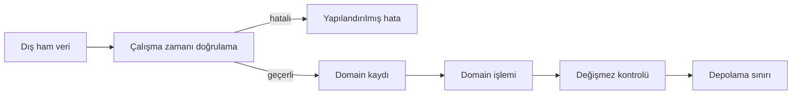

# Kayıtlar ve Veri Modelleme — Anlamlı ve Geçerli Yapılar Tasarlamak

## Learning Objectives

Bir programın güvenilirliği yalnız algoritmasının doğruluğuna bağlı değildir.
Algoritmanın işlediği veri, gerçek dünyadaki kavramı yanlış temsil ediyorsa kod
teknik olarak çalışırken yanlış kararlar üretebilir. Bu bölümde bir gereksinimi
adlandırılmış ve denetlenebilir bir veri yapısına dönüştürmeyi öğreneceğiz.

Bölüm sonunda şunları yapabileceksiniz:

- Kayıt (Record), alan (Field), özellik (Property), nesne (Object), veri modeli
  (Data Model), şema (Schema) ve değişmez (Invariant) kavramlarını ayırmak.
- Konumsal değer dizisi ile adlandırılmış kayıt arasındaki okunabilirlik ve değişim
  maliyetini karşılaştırmak.
- Bir gereksinimden alan adı, alan türü, zorunlu/opsiyonel kararı, varsayılan ve
  doğrulama kuralı çıkarmak.
- JavaScript object literal sözdizimini düz veri kaydının bir temsili olarak kullanmak.
- Nesne örneği ile şemayı birbirine karıştırmamak.
- Eksik özellik, `undefined`, `null`, boş metin, sıfır ve `false` durumlarını iş
  anlamına göre ayırmak.
- İç içe veri kullanımıyla düz yapı arasında sahiplik ve yaşam döngüsü üzerinden
  karar vermek.
- Kimlik (Identity), referans eşitliği (Reference Equality) ve değer eşitliği
  (Value Equality) arasındaki farkı açıklamak.
- Türetilmiş alan tekrarının nasıl tutarsızlık üretebildiğini göstermek.
- Tek alan kısıtı ile alanlar arası değişmezi ayırmak.
- Geçersiz durum (Invalid State) örnekleri üretip bunları construction boundary'de
  reddetmek.
- Statik tür denetimiyle çalışma zamanı doğrulamasının farklı sorumluluklarını
  açıklamak.
- AI tarafından önerilen veri modelini gereksinim izi, alan gerekçesi, değişmez,
  gizlilik ve test bakımından denetlemek.

`V01-LO027` için kanıtınız, bir envanter gereksinimini alan ve tür karar tablosuna,
ardından çalışan kayıt modeline dönüştürmektir. `V01-LO028` için kanıtınız, modelin
en az üç değişmezini açıklayan, geçersiz durumları reddeden ve her başarılı işlemden
sonra değişmezlerin korunduğunu test eden karar kaydıdır.

## Prerequisites

Bu bölüm `V01-C05` içindeki değer ve tür ayrımına, `V01-C14` içindeki fonksiyon
sözleşmelerine ve `V01-C17` içindeki koleksiyonlara dayanır. Şu örneği okuyabilmeniz
beklenir:

```js
function calculateLineTotal(unitPrice, quantity) {
  return unitPrice * quantity;
}

const quantities = [2, 1, 4];

for (const quantity of quantities) {
  console.log(calculateLineTotal(25, quantity));
}
```

Kodun sınırlaması hemen görülebilir: `25` sayısının ne olduğu çağrı bağlamı dışında
belli değildir. Ürün adı, kimliği ve fiyat birimi ayrı değişkenlerde tutulursa yanlış
ürünün adediyle başka ürünün fiyatını eşleştirmek kolaylaşır. Kayıt modeli, ilişkili
verileri aynı anlamlı bütün altında toplar.

Hazırlık için aşağıdaki sorulara notsuz yanıt verin:

1. Sayı ile sayıya benzeyen metin arasındaki fark nedir?
2. Fonksiyonun parametre ve dönüş sözleşmesi neyi açıklar?
3. Boş koleksiyon ile geçersiz koleksiyon aynı durum mudur?
4. Bir dizinin kaynak veriyi değiştirmeden yeni sonuç üretmesi ne demektir?
5. `null`, `undefined`, `0` ve boş metin her zaman aynı “boşluk” anlamına mı gelir?

Belirsiz yanıtlar için ilgili ön koşul bölümüne kısa dönüş yapın. Bu bölüm sınıf,
veritabanı veya framework bilgisi gerektirmez. JavaScript yalnız modeli çalışan
örneğe dönüştürmek için kullanılır.

## Estimated Study Time

Ana ders ve kod deneyleri yaklaşık dört buçuk saat, alan karar tabloları bir saat,
alıştırmalar iki saat, laboratuvar iki ila üç saat sürer. Quiz, mülakat ve tekrar
ile toplam sekiz ila on saat ayırın.

Önerilen oturumlar:

- Birinci oturum: kayıt, alan, object literal ve record boundary.
- İkinci oturum: tür, required/optional, missing/null ve şema.
- Üçüncü oturum: nested data, identity, equality ve derived data.
- Dördüncü oturum: invariant, invalid state, construction boundary ve test.
- Beşinci oturum: lab, challenge, AI denetimi ve öz değerlendirme.

Her oturumda bir “model defteri” tutun. Her alan için gereksinim, örnek değer, tür,
zorunluluk, doğrulama ve yanlış örnek yazın. Koddan çok bu karar tablosu, neden o
modeli seçtiğinizi hatırlamanızı sağlar.

## Introduction

Bir kırtasiye deposunda üç bilgi tutulduğunu düşünün: ürün kodu, ürün adı ve stok
adedi. Bunları ayrı dizilerde saklamak mümkün görünür:

```js
const productCodes = ["A-10", "B-20"];
const productNames = ["Defter", "Kalem"];
const stockCounts = [12, 40];
```

İlk ürün için üç dizinin de `0` indeksini okumamız gerekir. Bir diziye yeni ürün
eklenip diğerine eklenmezse hizalama bozulur. `B-20` kodu yanlışlıkla `12` stokla
eşleşebilir. Program sözdizimi hatası vermeden yanlış iş bilgisini taşır.

Adlandırılmış kayıtlar ilişkiyi doğrudan gösterir:

```js
const products = [
  { code: "A-10", name: "Defter", stock: 12 },
  { code: "B-20", name: "Kalem", stock: 40 },
];
```

Şimdi her koleksiyon öğesi tek ürünü anlatır. Fakat bu hâlâ başlangıçtır. `stock`
negatif olabilir mi? `code` boş olabilir mi? Ürün adı değişirse kimlik değişir mi?
`stock: "12"` kabul edilir mi? Alan hiç yoksa `0` mı varsayılır? Aynı ürün kodundan
iki tane olabilir mi? İyi veri modeli bu soruları görünür bir sözleşmeye dönüştürür.

Veri modelleme, gerçek dünyanın bütün ayrıntılarını bilgisayara kopyalamak değildir.
Belirli bir amaç için gerekli ayrımları seçmektir. Bir satış sistemi ürünün rengine
ihtiyaç duyabilir; depo sayımı yalnız kod ve miktarla çalışabilir. “Gerçek ürünün
bütün özelliklerini ekleyelim” yaklaşımı gereksiz veri, gizlilik ve bakım maliyeti
doğurur. “Şimdilik iki alan yeter” yaklaşımı da kritik iş kuralını kaçırabilir.
Karar gereksinimden türetilmelidir.

Bu bölümde bir envanter modelini adım adım kuracağız. Önce gereksinimi cümlelere,
sonra alan karar tablosuna, ardından object literal ve construction function'a
dönüştüreceğiz. Normal, sınır ve geçersiz kayıtları test edeceğiz. Amaç en çok alanı
taşıyan nesne değil, amaca uygun durumları temsil edip hatalı durumları erken reddeden
modeldir.

## Core Concepts

### Kayıt ve alan

Kayıt, tek bir varlık, olay veya değeri anlatan adlandırılmış alanlar bütünüdür.
Bir öğrenci kaydı `studentId`, `displayName` ve `enrollmentStatus` alanlarını; bir
sensör ölçümü `sensorId`, `capturedAt` ve `temperature` alanlarını taşıyabilir.
Alan, kaydın cevapladığı tek sorudur.

İyi kayıt sınırı için şu testleri kullanın:

- Bütün alanlar aynı özneyi mi anlatıyor?
- Alanlar aynı sahiplik ve yaşam döngüsüne mi bağlı?
- Birlikte oluşturulup birlikte mi doğrulanıyorlar?
- Bir alan değiştiğinde diğerlerinin anlamı etkileniyor mu?
- Kaydın adını tek ve açık bir domain kavramıyla verebiliyor muyuz?

`productName`, `stock` ve `browserTheme` alanlarını aynı `Product` kaydına koymak
bu testte başarısız olur. Tarayıcı teması ürüne değil kullanıcı tercihine aittir.
Alanların aynı ekranda görünmesi aynı kayda ait olduklarını kanıtlamaz.

### Konumsal veri ve adlandırılmış veri

Şu iki temsil aynı değerleri taşıyabilir:

```js
const positionalProduct = ["A-10", "Defter", 12];

const namedProduct = {
  code: "A-10",
  name: "Defter",
  stock: 12,
};
```

Konumsal sürümde `positionalProduct[2]` ifadesinin anlamı dış bilgiye bağlıdır.
Ortaya yeni alan eklendiğinde bütün indeks varsayımları etkilenebilir. Adlandırılmış
sürümde `namedProduct.stock` niyeti taşır. Koordinat, RGB değeri veya kısa sabit
tuple gibi sıra anlamının güçlü olduğu yerlerde konumsal yapı uygun olabilir.
İş kayıtlarında alan adları genellikle daha güvenli değişim sınırı sağlar.

### JavaScript nesnesi veri kaydı olarak

Nesne başlatıcısı (Object Initializer), süslü parantez içinde özellik adı ve değer
çiftleri oluşturur:

```js
const code = "A-10";
const stock = 12;

const product = {
  code,
  name: "Defter",
  stock,
};
```

Burada shorthand nedeniyle `code` ifadesi `code: code` anlamına gelir. Nokta
notasyonu sabit ve geçerli özellik adlarında açıktır:

```js
console.log(product.name);
```

Köşeli parantez dinamik anahtar gerektiğinde kullanılır:

```js
const requestedField = "stock";
console.log(product[requestedField]);
```

Dinamik erişim güçlüdür fakat yanlış anahtar sessizce `undefined` döndürebilir.
Kullanıcı girdisini doğrudan anahtar olarak kullanmak güvenlik ve veri bütünlüğü
açısından ayrıca değerlendirilmelidir.

Object literal bir temsil aracıdır, kendi başına şema değildir. JavaScript şu
nesneyi engellemez:

```js
const invalidProduct = {
  code: "",
  name: 42,
  stock: -10,
};
```

Sözdizimi geçerlidir; domain durumu geçersizdir. Veri modelleme, sözdiziminin izin
verdiği geniş durum kümesinden iş için kabul edilen dar kümeyi tanımlar.

### Gereksinimden alan çıkarmak

Gereksinim: “Depo görevlisi ürünü benzersiz kodla bulabilmeli, görünen adını
okuyabilmeli, eldeki tam adet ile yeniden sipariş eşiğini karşılaştırabilmelidir.”

Bu cümleyi doğrudan kodlamak yerine karar tablosuna dönüştürelim:

| Gereksinim sorusu | Alan | Tür | Zorunlu | Kural |
|---|---|---|---|---|
| Ürün nasıl bulunur? | `code` | string | Evet | Boş değil, benzersiz |
| Kullanıcı ne görür? | `name` | string | Evet | Trim sonrası boş değil |
| Elde kaç tane var? | `stock` | integer | Evet | `>= 0` |
| Ne zaman sipariş verilir? | `reorderLevel` | integer | Evet | `>= 0` |

Her alan bir gereksinim cümlesine izlenebilir. `color` alanı eklemek istersek hangi
kararı desteklediğini göstermeliyiz. Yalnız “ileride lazım olabilir” gerekçesi model
genişletmek için zayıftır. Buna YAGNI sloganı olarak değil, bakım ve gizlilik maliyeti
olarak bakın.

### Alan adı anlam taşır

`price` alanı hangi para birimini ve birimi taşır? `Date` oluşturulmuş bir zamanı mı,
takvim gününü mü temsil eder? `status` hangi izin verilen değerlerden biridir?
Adlandırma bütün sorunu çözmez ama belirsizliği azaltır:

```js
const product = {
  unitPriceInCents: 1299,
  currencyCode: "TRY",
  availableStock: 12,
};
```

Burada para kayan nokta yerine kuruş tamsayısıyla gösterilmiştir. Bu bütün finansal
kuralları çözmez; fakat birim görünürdür. `availableStock` fiziksel stok, ayrılmış
stok veya satışa hazır stok ayrımını düşündürür. Domain dilinde doğru ad, yanlış
varsayıma karşı ilk savunmadır.

### Tür seçimi yalnız JavaScript typeof değildir

`stock` için `number` demek eksiktir. JavaScript `number` kümesi kesir, `NaN`,
`Infinity` ve negatif değerleri de içerir. İş türü daha dardır: sıfır veya daha
büyük sonlu tamsayı.

```js
function isNonNegativeInteger(value) {
  return Number.isInteger(value) && value >= 0;
}
```

Bir alanın tür kararında şunları yazın:

1. Temel temsil türü nedir?
2. İzin verilen değer aralığı nedir?
3. Birim veya biçim nedir?
4. Eksiklik mümkün mü?
5. Hangi işlemler yapılacak?
6. Sınır dışında davranış nedir?

Telefon numarası üzerinde toplama yapılmaz; baştaki sıfır anlamlı olabilir. Bu
nedenle sayı gibi görünse de metin olarak modellenebilir. Posta kodu ve ürün kodu
da benzer örneklerdir. Türü görünüşe göre değil, anlam ve işlem kümesine göre seçin.

### Zorunlu ve opsiyonel alan

Zorunlu alan (Required Field), geçerli kaydın onsuz kurulamayacağı bilgidir.
Opsiyonel alan (Optional Field), yokluğun domain içinde tanımlı olduğu bilgidir.
“Kaynak sistem bazen göndermiyor” opsiyonellik için yeterli gerekçe değildir; bu
bir veri kalitesi hatası da olabilir.

Ürün açıklaması gerçekten opsiyonel olabilir. Ürün kodu ise kimlik için zorunluysa
yokluğu kaydı geçersiz yapar. Her alanı opsiyonel yapmanın sonucu, her tüketicinin
aynı kontrolleri tekrar yazmasıdır:

```js
function formatProduct(product) {
  if (product.code === undefined) {
    // Model bu noktaya geçersiz kayıt taşıdı.
  }
}
```

Daha iyi sınır, ürünün yalnız kod doğrulandıktan sonra kurulmasıdır. Opsiyonel
alan için de yokluk davranışı tanımlanır: açıklama gösterilmez mi, ayrı bir etiket
mi kullanılır, kullanıcıdan tamamlaması mı istenir?

### Eksik, undefined, null ve boş değer

Bu iki nesne aynı görünür sonuç verebilir ama aynı yapıda değildir:

```js
const missing = {};
const explicitUndefined = { description: undefined };

console.log(missing.description); // undefined
console.log(explicitUndefined.description); // undefined
console.log(Object.hasOwn(missing, "description")); // false
console.log(Object.hasOwn(explicitUndefined, "description")); // true
```

`null`, çoğu modelde bilinçli “değer yok” işareti olabilir. Boş metin ise mevcut
ama karakter içermeyen bir metindir. `0` ve `false` gerçek değerlerdir. Truthiness
kontrolü bunları aynı gruba atabilir:

```js
if (!product.stock) {
  // stock === 0 iken de çalışır; oysa sıfır geçerli stoktur.
}
```

Doğru kontrol, sorduğunuz soruyu açıkça ifade eder:

```js
if (!Object.hasOwn(product, "stock")) {
  // Alan eksik.
}

if (!Number.isInteger(product.stock) || product.stock < 0) {
  // Alan var ama değeri geçersiz.
}
```

### Şema ve örnek ayrımı

Şema, hangi alan ve değerlerin kabul edildiğini anlatan sözleşmedir. Örnek ise bu
sözleşmeye uyduğu iddia edilen gerçek veridir. Aşağıdaki nesne yalnız örnektir:

```js
const example = {
  code: "A-10",
  name: "Defter",
  stock: 12,
};
```

Bu örnek, `code` alanının zorunlu olduğunu veya stok alt sınırını açıklamaz. JSON
Schema ile yapının bir bölümü makine tarafından denetlenebilir:

```json
{
  "$schema": "https://json-schema.org/draft/2020-12/schema",
  "type": "object",
  "properties": {
    "code": { "type": "string", "minLength": 1 },
    "name": { "type": "string", "minLength": 1 },
    "stock": { "type": "integer", "minimum": 0 }
  },
  "required": ["code", "name", "stock"]
}
```

`properties` içinde alan tanımlamak tek başına onu required yapmaz; zorunluluk
ayrı listelenir. Şema aracı kullanmak model düşüncesinin yerini almaz. “Kod trim
edildiğinde boş kalmamalı” veya iki alan arasındaki karmaşık iş kuralı ek validation
gerektirebilir.

### Statik tür ve çalışma zamanı doğrulaması

TypeScript'te şu tür geliştiriciye yapı hakkında yardım eder:

```ts
type Product = {
  code: string;
  name: string;
  stock: number;
};
```

Fakat ağdan gelen JSON bu türe kendiliğinden uymaz. `as Product` yazmak veriyi
doğrulamaz; derleyiciye iddia bildirir. Runtime'da `stock: "çok"` gelebilir. Dış
veri önce `unknown` kabul edilip doğrulanmalıdır.

Katmanları ayırın:

- Statik tür, yazdığınız kodun olası kullanımlarını kontrol eder.
- Runtime validator, gerçek dış girdiyi inceler.
- Depolama constraint'i saklanan veriyi korur.
- Domain function, alanlar arası iş değişmezini korur.

Tek katmanı bütün güvence sanmak hatadır. TypeScript bulunması, API yanıtının doğru
olduğunu kanıtlamaz; JSON Schema bulunması da her domain işleminin değişmezi
koruduğunu garanti etmez.

### İç içe veri

Adres alanlarını ürüne düz biçimde eklemek yerine bir alt kayıt kullanılabilir:

```js
const warehouse = {
  id: "WH-01",
  name: "Merkez Depo",
  address: {
    city: "Ankara",
    district: "Çankaya",
    postalCode: "06420",
  },
};
```

`address` alanları birlikte anlamlı ve aynı sahiplikteyse nesting uygundur. Adres
bağımsız kimlik ve yaşam döngüsüne sahipse ayrı kayıt ve referans daha doğru olabilir.
Kararı yalnız görsel düzen değil sahiplik, birlikte değişim ve tekrar kullanım
belirler.

Derin nesting güvenli erişim ihtiyacı doğurur:

```js
const district = warehouse.address?.district ?? "Bilinmiyor";
```

Optional chaining hatalı modeli iyileştirmez; yalnız eksiklikte çöküşü önler.
`address` zorunluysa sessiz “Bilinmiyor” varsayımı veri hatasını saklayabilir.
Önce domain kararını, sonra erişim tekniğini seçin.

### Kimlik ve eşitlik

Kimlik, bir varlığın değişen özelliklerine rağmen aynı varlık olarak izlenmesidir.
Ürün adı değişebilir; `productId` kararlı kimlik olabilir. Ancak kimliğin nasıl
üretildiği, benzersizlik alanı ve gizlilik etkisi tasarlanmalıdır.

JavaScript nesnelerinde `===` aynı referansı denetler:

```js
const first = { code: "A-10" };
const second = { code: "A-10" };
const alias = first;

console.log(first === second); // false
console.log(first === alias); // true
```

Domain sorusu “aynı ürün mü?” ise `code` veya `id` karşılaştırılabilir. “Aynı değer
kaydı mı?” ise seçili bütün alanlar karşılaştırılabilir. Referans eşitliği, kimlik
eşitliği ve yapısal eşitlik farklı sorulara cevap verir.

### Türetilmiş veri ve tutarsızlık

```js
const line = {
  unitPriceInCents: 500,
  quantity: 3,
  totalInCents: 1500,
};
```

`quantity` ikiye düşürülüp `totalInCents` güncellenmezse kayıt kendi içinde çelişir.
Toplam her okumada hesaplanabilir:

```js
function calculateLineTotal(line) {
  return line.unitPriceInCents * line.quantity;
}
```

Bazen hesap pahalı olduğu için türetilmiş sonuç saklanır. O zaman tek güncelleme
sınırı, transaction veya yeniden hesaplama politikası gerekir. “Tekrar her zaman
kötüdür” yerine doğruluk kaynağı, hesap maliyeti ve drift riskini karşılaştırın.

### Değişmez ve geçersiz durum

Değişmez, model geçerli olduğu sürece doğru kalması gereken koşuldur. Envanter için:

- `code` trim sonrası boş değildir.
- `stock` sıfır veya daha büyük tamsayıdır.
- `reorderLevel` sıfır veya daha büyük tamsayıdır.
- `reservedStock`, `stock` değerini aşmaz.
- Durum `discontinued` ise yeni sipariş verilemez.

İlk üçü tek alan, dördüncü ve beşinci alanlar arası kurallardır. Şu nesne bütün
alan türleri doğru görünse de geçersizdir:

```js
const invalidInventory = {
  code: "A-10",
  stock: 5,
  reservedStock: 8,
  reorderLevel: 2,
};
```

Sorun `reservedStock` sayısının türü değil, iki alan arasındaki ilişkidir. Model
denetimi yalnız `typeof` kontrolleriyle tamamlanamaz.

### Construction boundary

Kayıtların her yerde serbest object literal ile oluşturulması doğrulamayı dağıtır.
Bir oluşturma sınırı (Construction Boundary) ham veriyi doğrular ve yalnız başarılı
olursa geçerli kayıt döndürür:

```js
function createInventoryItem(input) {
  const errors = [];

  if (typeof input.code !== "string" || input.code.trim().length === 0) {
    errors.push({ field: "code", code: "REQUIRED_NON_EMPTY_STRING" });
  }

  if (!Number.isInteger(input.stock) || input.stock < 0) {
    errors.push({ field: "stock", code: "NON_NEGATIVE_INTEGER" });
  }

  if (!Number.isInteger(input.reservedStock) || input.reservedStock < 0) {
    errors.push({ field: "reservedStock", code: "NON_NEGATIVE_INTEGER" });
  }

  if (
    Number.isInteger(input.stock)
    && Number.isInteger(input.reservedStock)
    && input.reservedStock > input.stock
  ) {
    errors.push({ field: "reservedStock", code: "EXCEEDS_STOCK" });
  }

  if (errors.length > 0) {
    return { ok: false, errors };
  }

  return {
    ok: true,
    value: {
      code: input.code.trim(),
      stock: input.stock,
      reservedStock: input.reservedStock,
    },
  };
}
```

Fonksiyon hatada yarım ürün döndürmez. Başarı sonucundaki kayıt değişmezleri
sağlar. Bundan sonraki `reserveStock` gibi işlemler de aynı değişmezleri korumalıdır.

### Geçersiz durumları zorlaştırmak

Şu ödeme modeli çelişkili kombinasyonlara izin verir:

```js
const payment = {
  success: false,
  receiptId: "R-10",
  errorMessage: null,
};
```

Başarısız ödemede receipt bulunması, hata mesajının olmaması anlamsız olabilir.
İki açık biçim kullanmak daha güçlüdür:

```js
const successfulPayment = {
  status: "success",
  receiptId: "R-10",
};

const failedPayment = {
  status: "failure",
  errorCode: "CARD_DECLINED",
};
```

`status` ayırt edici alan olur. Construction function, success biçiminde receipt,
failure biçiminde errorCode zorunluluğunu uygular. Bu yaklaşım bütün geçersiz
durumları sihirli biçimde yok etmez; temsil kümesini gereksinime yaklaştırır.

## Engineering Perspective

### Model bir iletişim ve değişim sınırıdır

Veri modeli yalnız programın bellekte kullandığı şekil değildir. Ürün ekibi
“stokta”, geliştirici `availableStock`, rapor `stock` ve dış servis `quantity`
diyorsa aynı kavramın dört farklı anlamı oluşabilir. Profesyonel model, gereksinim
cümlesi ile kod alanı arasındaki izi görünür tutar.

| Gereksinim | Alan | Karar | Kanıt |
|---|---|---|---|
| Ürün kalıcı bir kodla bulunur | `code` | Trim sonrası boş olmayan metin | Boş ve boşluk girdisi reddedilir |
| Fiziksel adet negatife düşmez | `stock` | Sıfır veya büyük tamsayı | `-1`, `1.5`, `"4"` reddedilir |
| Ayrılmış adet kullanılabilir adedi aşmaz | `reservedStock` | `0 <= reservedStock <= stock` | Alanlar arası test |
| Sipariş eşiği yokluğu anlamlı değildir | `reorderLevel` | Zorunlu, negatif olmayan tamsayı | Eksik alan reddedilir |

Bu tablo bir kod incelemesinde “neden bu alan var?” sorusunu yanıtlar. Alanın
gerekçesi yoksa, modelin taşıdığı yük de gerekçesizdir.

### Doğrulama katmanları aynı işi yapmaz



Statik tür denetimi geliştiricinin kodunu kontrol eder; tarayıcıdan, API'den veya
dosyadan gelen JSON'u kendiliğinden doğrulamaz. Runtime validator dış veriyi,
construction function domain kurallarını, depolama kısıtı ise kalıcı kayıt
bütünlüğünü korur. Aynı kontrolün birden çok katmanda bulunması bazen gereksiz
tekrar değil, farklı hata sınırlarına karşı savunmadır.

### Değişim ve geriye dönük uyumluluk

`supplierCode` alanını zorunlu eklemek yeni kayıtları iyileştirirken eski kayıtları
okunamaz hâle getirebilir. Bu değişiklik için en az şu kararlar gerekir:

1. Eski kayıt alanı nereden üretilecek?
2. Gerçek bir varsayılan yoksa migration nasıl yapılacak?
3. Eski okuyucular yeni kaydı gördüğünde ne olacak?
4. Şema ve veri sürümü nasıl izlenecek?
5. Başarısız migration geri alınabilecek mi?

`"UNKNOWN"` yazmak teknik olarak boşluğu kapatır fakat iş gerçeğini uydurabilir.
Sahte varsayılan yerine açık bilinmeyen durumu, kontrollü migration veya yeni bir
model varyantı daha doğru olabilir.

### Gizlilik ve veri minimizasyonu

Bir alanı saklayabilmek onu saklamamız gerektiği anlamına gelmez. Envanter modeli
ürün kodu ve stok adedine ihtiyaç duyarken son düzenleyen çalışanın kişisel telefon
numarasına ihtiyaç duymaz. Her hassas alan için amaç, erişim, saklama süresi ve
silme davranışı belirlenmelidir. AI önerisinde “ileride lazım olur” gerekçesiyle
eklenen alanlar veri minimizasyonu açısından reddedilmelidir.

## Real World Examples

### Sipariş satırı

Bir sipariş satırı ürün kimliği, birim fiyat ve adedi birlikte taşır. Güncel ürün
fiyatına yeniden bakmak geçmiş sipariş toplamını değiştirebileceği için satış
anındaki fiyat kayda alınabilir:

```js
const orderLine = {
  productId: "P-104",
  unitPriceInCents: 2490,
  quantity: 2,
};

function calculateOrderLineTotal(line) {
  return line.unitPriceInCents * line.quantity;
}
```

Buradaki tekrar bilinçlidir: `unitPriceInCents`, ürün kataloğunun anlık fiyatı
değil sipariş anının kanıtıdır.

### Sensör ölçümü

```js
const measurement = {
  sensorId: "S-8",
  capturedAt: "2026-07-29T08:30:00Z",
  temperatureCelsius: 24.6,
};
```

`temperature: 24.6` alanı birimi gizler. Alan adındaki `Celsius` ve ISO tarih
biçimi iki önemli varsayımı görünür kılar. Yine de tarih metninin gerçekten geçerli
olduğu runtime sınırında kontrol edilmelidir.

### İşlem sonucu varyantları

Başarı ve hata aynı anda gerçekleşmemelidir:

```js
function parseStock(value) {
  if (!Number.isInteger(value) || value < 0) {
    return {
      status: "failure",
      error: { code: "INVALID_STOCK", field: "stock" },
    };
  }

  return { status: "success", value };
}
```

Çağıran kod önce `status` alanını kontrol eder. Böylece başarısız sonuçtan yanlışlıkla
`value` okumak zorlaşır.

## Common Mistakes

| Belirti | Kök neden | Etki | Teşhis |
|---|---|---|---|
| `0` stok “eksik” sayılıyor | Truthiness ile iş anlamı karıştırıldı | Geçerli kayıt reddedilir | `0`, `false`, `""`, `null` ayrı test edilir |
| İki aynı görünen kayıt eşit çıkmıyor | `===` referansı karşılaştırır | Yanlış tekrar/arama sonucu | Kimlik veya alan karşılaştırma amacı yazılır |
| Toplam eski kalıyor | Türetilmiş alan kaynakla birlikte güncellenmedi | Yanlış fiyat/rapor | Kaynak alan değişiminden sonra invariant testi |
| Eski veriler okunmuyor | Yeni zorunlu alan migrationsız eklendi | Üretim hatası | Eski örneklerle uyumluluk testi |
| Hata yalnız `false` | Hata sözleşmesi tasarlanmadı | Kullanıcı ve geliştirici nedeni bulamaz | Alan yolu ve hata kodu kontrol edilir |
| Modelde ilgisiz kişisel veri var | “Belki gerekir” alanları eklendi | Gizlilik ve güvenlik riski | Her alan için amaç ve saklama süresi sorulur |

En tehlikeli hata, tek başarılı örneği modelin doğruluğuna kanıt saymaktır. Bir
model; normal, sınır, eksik, yanlış tür ve alanlar arası çelişki örnekleriyle
denenmeden güvenilir değildir.

## Best Practices

- Önce gereksinim–alan tablosunu, sonra object literal'i yazın.
- Alan adında anlamı ve gerekiyorsa birimi görünür kılın.
- Opsiyonelliği veri gelmediği için değil, yokluğun domain anlamı olduğu için seçin.
- Dış girdiyi `unknown` kabul edip construction boundary'de doğrulayın.
- Tek alan kontrolleriyle alanlar arası değişmezleri ayrı listeleyin.
- Hataları kararlı kodlar ve alan yollarıyla yapılandırın; hassas değeri mesaja
  taşımayın.
- Başarılı construction sonucunun bütün değişmezleri sağladığını test edin.
- Türetilmiş veriyi saklıyorsanız doğruluk kaynağı ve güncelleme politikasını yazın.
- Şema değişikliklerini eski kayıt ve eski okuyucularla sınayın.
- AI önerisindeki her alan için gereksinim kaynağı isteyin.

Bu öneriler bağlama bağlıdır. Tek kullanımlık küçük bir hesapta construction
function gereksiz olabilir; dış veri alan, kalıcı kayıt oluşturan veya ekipler arası
paylaşılan bir sistemde ise açık sınır güçlü bir korumadır.

## Hands-on Exercise

### Objective

`V01-LO027` ve `V01-LO028` için bir envanter gereksinimini alan karar tablosuna,
çalışan modele ve değişmez testlerine dönüştürmek.

### Requirements

Model şu bilgileri taşımalıdır: ürün kodu, görünen ad, toplam stok, ayrılmış stok,
yeniden sipariş eşiği ve durum. En az üç tek-alan kuralı ve iki alanlar-arası
değişmez tanımlayın.

### Tasks

1. Her alanın cevapladığı iş sorusunu yazın.
2. Tür, zorunluluk, varsayılan, normal ve geçersiz örnekleri tabloya ekleyin.
3. `createInventoryItem(input)` construction function'ını yazın.
4. Fonksiyonun bütün hataları `{ field, code }` biçiminde toplamasını sağlayın.
5. Başarı sonucunda normalize edilmiş kayıt döndürün.
6. Normal, sınır, eksik, yanlış tür ve iki çelişkili durum için test yazın.
7. Modelinize gereksiz bir alan ekleyip neden kaldırdığınızı karar kaydına yazın.

### Deliverables

- `inventory-model.js`
- `inventory-model.test.js`
- `field-decisions.md`
- `invariants.md`
- Test çalıştırma komutu ve beklenen sonuç

### Evaluation Criteria

Alan kararlarının gereksinime izlenmesi %25, değişmez ve construction boundary %25,
test kanıtı %25, hata sözleşmesi %15, açıklama ve veri minimizasyonu %10 ağırlığa
sahiptir. Ayrıntılı ölçütler içerik paketindeki `assessment-rubric.md` dosyasındadır.

## Reflection Questions

1. Modelinizde en kolay gözden kaçan geçersiz durum hangisiydi? Neden?
2. Hangi alanı opsiyonel yapmayı düşündünüz ve hangi iş kanıtıyla karar verdiniz?
3. `null`, eksik özellik ve `0` sizin modelinizde hangi farklı anlamları taşıyor?
4. Türetilmiş bir alanı saklamak hangi durumda savunulabilir?
5. AI önerisinden hangi alanı reddederdiniz ve gereksinim izi neden yetersiz olurdu?
6. Model yarın yeni bir zorunlu alan kazanırsa eski kayıtları nasıl korursunuz?

## Chapter Summary

Veri modelleme, değerleri bir nesne içine koymaktan önce gelen karar çalışmasıdır.
Gereksinim; kayıt sınırına, alanlara, türlere, zorunluluklara ve değişmezlere
dönüşür. Şema izin verilen yapıyı, instance gerçek değerleri anlatır. JavaScript
nesnesi yalnız temsildir; iyi domain modelini tek başına garanti etmez.

Construction boundary dış veriyi doğrular ve yalnız değişmezleri sağlayan kayıtları
içeri alır. Kimlik ile referans eşitliği, eksik ile `null`, kaynak ile türetilmiş veri
ayrımları modelin doğru davranması için açıkça seçilir. Değişim, gizlilik ve
geriye dönük uyumluluk da model kararının parçasıdır.

### Navigation

Önceki bölümde koleksiyonları işlediniz. Bu bölümde koleksiyon öğesinin güvenilir
şeklini kurdunuz. Sonraki bölümde kendine benzer yapı ve problemleri özyinelemeli
düşünmeyle işleyeceksiniz.

## Key Takeaways

- Önce gereksinim, sonra temsil gelir.
- Alan adı, türü ve zorunluluğu ayrı tasarım kararlarıdır.
- `undefined`, `null`, boş metin, `0` ve `false` aynı durum değildir.
- Şema ile tek bir nesne örneği farklıdır.
- `===`, iki ayrı nesnenin alan değerlerini karşılaştırmaz.
- Değişmezler tek alanı ve alanlar arası ilişkileri kapsar.
- Construction boundary geçersiz kaydın sisteme girişini sınırlar.
- Statik tür ve runtime validation birbirinin alternatifi değildir.
- Türetilmiş veri saklanıyorsa drift politikası gerekir.
- AI tarafından önerilen her alan gereksinim ve test kanıtıyla doğrulanır.

## Further Reading

- [JSON Schema — Objects](https://json-schema.org/understanding-json-schema/reference/object):
  `properties`, `required` ve ek alan davranışını somutlaştırır.
- [TypeScript — Object Types](https://www.typescriptlang.org/docs/handbook/2/objects.html):
  statik nesne türleri ve optional alanları bir sonraki dil katmanında gösterir.
- [MDN — Working with Objects](https://developer.mozilla.org/en-US/docs/Web/JavaScript/Guide/Working_with_objects):
  JavaScript nesne ve özellik davranışını ayrıntılandırır.
- [Parse, don't validate](https://lexi-lambda.github.io/blog/2019/11/05/parse-don-t-validate/):
  doğrulanmış veri ile ham veri sınırını daha ileri düzeyde tartışır.

## References

- ECMA International, *ECMAScript Language Specification — Object Type*:
  <https://tc39.es/ecma262/2025/multipage/ecmascript-data-types-and-values.html#sec-object-type>
- MDN, *Object initializer*:
  <https://developer.mozilla.org/en-US/docs/Web/JavaScript/Reference/Operators/Object_initializer>
- MDN, *Object.hasOwn()*:
  <https://developer.mozilla.org/en-US/docs/Web/JavaScript/Reference/Global_Objects/Object/hasOwn>
- MDN, *Equality comparisons and sameness*:
  <https://developer.mozilla.org/en-US/docs/Web/JavaScript/Guide/Equality_comparisons_and_sameness>
- JSON Schema, *Draft 2020-12 Validation*:
  <https://json-schema.org/draft/2020-12/json-schema-validation>
- TypeScript, *Object Types*:
  <https://www.typescriptlang.org/docs/handbook/2/objects.html>
