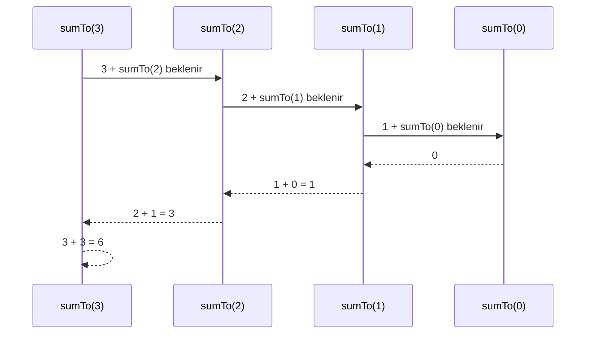

# Özyineleme ve Özyinelemeli Düşünme

## Learning Objectives

Bu bölümün sonunda:

- `V01-LO029`: Küçük bir özyinelemeli fonksiyonun çağrı yığınını; çağrı, bekleyen
  işlem ve dönüş değerleriyle adım adım izleyebileceksiniz.
- `V01-LO030`: Verilen çözümde base case'i, recursive case'i ve ilerleme ölçüsünü
  belirleyip bütün yolların durma koşuluna yaklaştığını doğrulayabileceksiniz.

Başarı kanıtı yalnız çalışan bir fonksiyon değildir. “Neden duruyor?”, “Her çağrıda
hangi problem küçülüyor?” ve “İç çağrı döndüğünde dış çağrı ne yapmaya devam ediyor?”
sorularını açık bir izle yanıtlamanız gerekir.

## Prerequisites

Bu chapter fonksiyon çağrısı, parametre, dönüş değeri, koşul ve yerel scope bilgisini
kullanır. Aşağıdaki fonksiyonu notsuz açıklayabiliyor olmalısınız:

```js
function absoluteDifference(a, b) {
  if (a >= b) {
    return a - b;
  }
  return b - a;
}
```

Başlamadan önce şu kısa tanıyı yapın:

1. `return` çalıştığında fonksiyonun geri kalanı çalışır mı?
2. Aynı fonksiyon iki kez çağrıldığında parametre değerleri ortak mıdır?
3. `if` dallarından yalnız biri çalıştığında diğer dalın sonucu gerekir mi?
4. Bir döngünün durması için hangi değer değişmelidir?
5. Bir fonksiyonun başka bir fonksiyonun sonucunu beklemesi ne demektir?

İlk üç soruda zorlanıyorsanız fonksiyon ve scope chapter'larına; dördüncü soruda
zorlanıyorsanız döngü chapter'ına kısa dönüş yapın.

Önceki chapter'daki kayıt modelini de öğretim bağlamı olarak kullanacağız.
Aşağıdaki alan kararlarını sözlü açıklamayı deneyin:

```js
const group = {
  title: "Fonksiyonlar",
  lessons: 4,
  children: [],
};
```

- `title` neden `string`?
- `lessons` neden `"4"` metni değil, `4` sayısı?
- `children` neden tek bir object değil, dizi?
- Boş `children` hangi gerçek durumun geçerli temsili?

Bu soruların amacı C18'i yeniden sınamak değildir. Özyinelemeyi soyut bir
matematik hilesi yerine daha önce kurduğunuz gerçek bir veri modelinin üzerinde
öğrenmenizi sağlamaktır.

## Estimated Study Time

| Çalışma | Süre |
|---|---:|
| Ana ders ve tahmin durakları | 150–180 dakika |
| Birlikte yapalım ve elle çağrı izleri | 75–90 dakika |
| Şimdi sen dene ve hata ayıklama | 75–90 dakika |
| Quiz, açıklamalı geri bildirim ve mülakat | 45–60 dakika |
| Lab | 75–90 dakika |
| Bağımsız uygulama, proje artışı ve yansıtma | 60–90 dakika |

Toplam süre yaklaşık 8–10 saattir. Bunu tek oturumda bitirmeye çalışmayın.
Önerilen düzen; ana zihinsel model, çağrı izleri, uygulama ve proje olmak üzere
dört ayrı çalışma oturumudur. Özyineleme yalnız okunarak değil, kalemle çağrı
izi çıkarılarak öğrenilir.

## Introduction

### C18'den taşıdığımız problem

Önceki chapter'da bir programın gerçek dünyadaki bilgileri nasıl kayıtlara
dönüştürdüğünü gördünüz. Bir öğrenme grubunu şöyle modelleyebildiğimizi
hatırlayın:

```js
const learningGroup = {
  title: "Programlama Temelleri",
  lessons: 2,
  children: [
    {
      title: "Fonksiyonlar",
      lessons: 4,
      children: [],
    },
  ],
};
```

Henüz yeni kod yazmayalım. Bu kaydı birlikte okuyalım.

`learningGroup` adı, değerin sıradan bir sayı veya metin olmadığını; bir öğrenme
grubunu temsil ettiğini söylüyor. `const` kullanıldı, çünkü
`learningGroup` bağlamasının daha sonra başka bir değerle değiştirilmesini
planlamıyoruz. Bu seçim nesnenin içindeki alanları otomatik olarak değişmez
yapmaz; yalnız değişken adının başka bir nesneye yeniden atanmasını engeller.

`title` alanının değeri `"Programlama Temelleri"` ve türü `string`'dir. Başlık
üzerinde toplama yapmak istemiyoruz; onu göstermek, karşılaştırmak ve ileride
C20'de temizlemek istiyoruz. Bu yüzden `number` uygun olmaz.

`lessons` alanının değeri `2` ve türü `number`'dır. JavaScript'te ayrı bir
`int` veri türü yoktur. Burada “negatif olmayan tamsayı olmalı” ifadesi veri
türünden daha dar bir **değer kısıtıdır**. `"2"` biçiminde bir `string`
kullansaydık toplama sırasında `"2" + 4` işlemi `6` yerine `"24"` üretebilirdi.
Bu nedenle ders sayısını hesaplamaya uygun sayısal bir değer olarak tutuyoruz.

`children` alanı bir dizidir. Bir grubun sıfır, bir veya birden fazla alt grubu
olabilir. Tek bir object kullansaydık yalnız bir alt grubu temsil edebilirdik.
Boş `[]` ise “bu kaydın alt grubu yok” bilgisini açıkça taşır.

Şimdi asıl ihtiyacımızı düşünelim: Bu yapının tamamında kaç ders var?

Yalnız iki seviyeyi bilen şu kod bugünkü örnekte çalışabilir:

```js
const totalLessons =
  learningGroup.lessons + learningGroup.children[0].lessons;
```

Sonuç `6` olur. Fakat bu kodun cevabını bildiği yapı sabittir. `Fonksiyonlar`
grubuna bir `Scope` alt grubu eklenirse üçüncü seviye hesaba katılmaz. İkinci
bir çocuk eklenirse yalnız `[0]` indeksindeki ilk çocuk sayılır. Hiç çocuk
yoksa `children[0]` değeri `undefined` olur ve `.lessons` erişimi hata verir.

Sorunumuz toplama işlemini bilmemek değil. Sorunumuz, yapının kaç seviye
derinleşeceğini önceden bilmeden aynı kuralı bütün seviyelerde
uygulayabilmektir.

Burada önemli bir örüntü var:

- Elimizde bir öğrenme grubu bulunuyor.
- Bu grubun kendi derslerini sayabiliyoruz.
- Her alt grup yine aynı alanlara sahip bir öğrenme grubudur.
- O hâlde her alt grup için de aynı sayma işini yapabiliriz.

Bu düşünce bizi özyinelemeye götürür. Tanımı şimdi vermemizin nedeni, artık
hangi sorunu çözdüğünü görmüş olmamızdır.

**Özyineleme (recursion)**, bir problemi aynı sözleşmeye sahip daha küçük bir
problem yardımıyla çözme yaklaşımıdır. Kodda çoğunlukla bir fonksiyonun
kendisini çağırması şeklinde görünür. Fakat “fonksiyon kendisini çağırır”
cümlesi tek başına yeterli değildir. Kontrolsüz biçimde kendisini çağıran bir
fonksiyon çözüm değil, bitmeyen bir çağrı zinciri üretir.

Güvenilir bir özyinelemeli çözüm şu dört soruya cevap verir:

1. En küçük problem nedir ve cevabı doğrudan nedir?
2. Daha büyük problemden aynı türde daha küçük probleme nasıl geçiyoruz?
3. Küçük problemin cevabını mevcut problemin cevabına nasıl dönüştürüyoruz?
4. Her yeni çağrının sonunda en küçük probleme ulaşacağını nasıl biliyoruz?

### İlk karşılaşma: yalnız aşağı doğru ilerleyelim

Çağrıların nasıl oluştuğunu görmek için ilk örneği özellikle sade tutacağız.
Henüz sonuçları birleştirmeyeceğiz:

```js
function countdown(n) {
  if (n === 0) {
    return;
  }

  console.log(n);
  countdown(n - 1);
}

countdown(3);
```

Bu kodu hemen çalıştırmadan önce tahmin edin:

- İlk yazdırılan değer nedir?
- `countdown(2)` çağrıldığında ilk çağrıdaki `n` değeri değişir mi?
- `n` değeri `0` olduğunda hangi satırlar artık çalışmaz?

Beklenen çıktı şöyledir:

```text
3
2
1
```

`n` burada fonksiyona verilen mevcut geri sayım değerini temsil eden bir
parametredir. Türü JavaScript açısından `number`'dır; fonksiyon sözleşmemiz onu
negatif olmayan bir tamsayıyla sınırlar. `n` adı kısa olmasına rağmen bu
matematiksel ve küçük örnekte yaygın bir üst sınır anlamı taşır. Gerçek bir
üründe `remainingSeconds` gibi alan dilini anlatan daha açık bir ad tercih
edebilirdik.

`n`, `let` veya `const` ile fonksiyon içinde bildirilmedi. Çünkü parametre
olarak her çağrı için ayrı bir bağlama oluşturulur:

```text
countdown(3) içindeki n -> 3
countdown(2) içindeki n -> 2
countdown(1) içindeki n -> 1
countdown(0) içindeki n -> 0
```

`countdown(n - 1)` dış çağrının `n` değerini değiştirmez. `n - 1` ifadesi yeni
bir sayı üretir ve bu sayı yeni çağrının parametresine bağlanır. Bu ayrım,
C15'te öğrendiğiniz scope ve yaşam süresi bilgisinin burada neden gerekli
olduğunu gösterir.

Şimdi kodun parçalarını adlandıralım:

- `n === 0`, yeni çağrı yapmadan biten **temel durumdur (Base Case)**.
- `countdown(n - 1)`, aynı problemi daha küçük `n` ile çözen
  **özyinelemeli durumdur (Recursive Case)**.
- `n`, her çağrıda bir azalır; bu **ilerleme ölçüsüdür (Progress Measure)**.
- `return`, `n === 0` olduğunda mevcut çağrıyı sonlandırır. Burada
  döndürülmesi gereken sayısal bir sonuç olmadığı için çıplak `return`
  kullanılmıştır.

Negatif sayılar sözleşmeye dahil olsaydı `n === 0` her başlangıç için yeterli
olmazdı. Örneğin `countdown(-1)` çağrıları `-1, -2, -3...` diye sıfırdan
uzaklaşırdı. Demek ki kodun doğru olup olmadığını yalnız birkaç satıra bakarak
değil, geçerli girdi sözleşmesiyle birlikte değerlendiririz.

### Küçük anlama kontrolü

Notlarınıza bakmadan cevaplayın:

1. `countdown(3)` sırasında kaç farklı `n` bağlaması oluşur?
2. `countdown(0)` neden `0` yazdırmaz?
3. `countdown(n)` biçiminde aynı değeri yeniden gönderseydik base case kodda
   bulunmasına rağmen neden ona ulaşamazdık?
4. `n - 1` mevcut `n` değerini mi değiştirir, yoksa yeni bir değer mi üretir?

Bu sorularda emin değilseniz sonraki örneğe geçmeden çağrı listesini kâğıda
yazın. Özyinelemede hızdan önce doğru zihinsel model gerekir.

### Bu chapter'da birlikte kuracağımız beceri

Geri sayım yalnız çağrıların base case'e doğru inişini gösterdi. Gerçek
problemlerde iç çağrıdan gelen sonucu dış çağrıda kullanmamız gerekir. Bir
sonraki adımda çağrıların neden beklediğini, base case'ten sonra neden ters
sırada çözüldüğünü ve her çağrının hangi değeri döndürdüğünü göreceğiz.

Bu chapter'da factorial veya Fibonacci formülünü ezberlemeyeceğiz. Önce bir çağrının
nasıl beklediğini ve geri döndüğünü görünür kılacağız; sonra base case ve ilerleme
kanıtı kuracağız; en son özyineleme ile döngü arasında gerekçeli seçim yapacağız.

## Core Concepts

### Özyineleme: daha küçük aynı problem

Bir problem şu iki soruya açık cevap verebiliyorsa özyinelemeye adaydır:

1. En küçük durumda cevap doğrudan nedir?
2. Büyük durumun cevabı, aynı problemin daha küçük cevabından nasıl kurulur?

`1` ile `n` arasındaki sayıların toplamını düşünün:

```text
sumTo(0) = 0
sumTo(n) = n + sumTo(n - 1)
```

İkinci satır, büyük problemi iki parçaya ayırır: şu anki `n` ve geri kalan küçük
problem. JavaScript karşılığı:

```js
function sumTo(n) {
  if (n === 0) {
    return 0;
  }

  return n + sumTo(n - 1);
}

console.log(sumTo(4)); // 10
```

İlk öğrenme örneğinde girdi doğrulamasını özellikle eklemedik. Şimdilik
sözleşmemiz şudur: `n`, negatif olmayan bir tamsayıdır. Girdi doğrulaması
önemlidir, fakat özyinelemenin çalışma süreciyle aynı anda verilirse görmek
istediğimiz üç satırı gereksiz yere saklar. Temel mekanizmayı anladıktan sonra
sözleşme sınırını koruyan sürümü ekleyeceğiz.

### Birlikte yapalım: `sumTo(3)` nasıl düşünüyor?

Fonksiyonun adından başlayalım. `sumTo`, “verilen sayıya kadar topla” davranışını
anlatır. `calculate` gibi genel bir ad, neyin hesaplandığını söylemezdi.
`recursiveSum` adı ise fonksiyonun nasıl çalıştığını söyler, ne iş yaptığını
değil. Kullanıcı ve ekip için davranışı anlatan `sumTo` daha yararlıdır.

`n`, o çağrının toplamaya ekleyeceği mevcut üst sınırı temsil eder. Örneğin
`sumTo(3)` çağrısında `n = 3`; daha küçük `sumTo(2)` çağrısında `n = 2` olur.
Her çağrının `n` parametresi ayrıdır.

| Karar | Açıklama |
|---|---|
| Değer | İlk çağrıda `n = 3` |
| JavaScript türü | `number` |
| Değer kısıtı | Negatif olmayan tamsayı |
| Neden sayı? | `n - 1` ve `n + sonuç` aritmetiği yapılacak |
| Neden string değil? | `"3" + 3`, sayısal `6` yerine `"33"` üretebilir |
| Değişiyor mu? | Bu frame içindeki `n` değişmez; `n - 1` yeni çağrı için yeni değer üretir |
| En küçük geçerli değer | `0` |
| Geçersiz örnekler | `-1`, `2.5`, `"3"`, `NaN` |

Şimdi çağrıyı satır satır yürütelim:

```js
sumTo(3);
```

1. JavaScript `sumTo` için yeni bir çağrı oluşturur ve bu çağrının `n`
   parametresine `3` değerini bağlar.
2. `n === 0` karşılaştırması `3 === 0` olur ve `false` üretir.
3. `return n + sumTo(n - 1)` satırına geçilir.
4. `n - 1`, `2` değerini üretir. Mevcut `n` hâlâ `3`'tür.
5. Dış çağrı henüz `3 + ?` işlemini tamamlayamaz. `sumTo(2)` sonucunu bekler.

Burada durup tahmin edin: `sumTo(2)` başladığında `sumTo(3)` silinir mi?

Silinmez. Dış çağrı kendi `n = 3` değeri ve `3 + ?` bekleyen işlemiyle çalışma
zamanı tarafından takip edilir. İç çağrı tamamlandığında program tam olarak
nereden devam edeceğini böyle bilir.

İkinci çağrıda aynı adımlar yeni değerlerle oluşur:

```text
sumTo(3): n = 3, 3 + ? bekliyor
sumTo(2): n = 2, 2 + ? bekliyor
sumTo(1): n = 1, 1 + ? bekliyor
sumTo(0): n = 0, doğrudan 0 döndürüyor
```

`sumTo(0)` yeni çağrı yapmaz. Bu zincirin zemini olur. Ardından bekleyen
işlemler ters sırada tamamlanır:

```text
sumTo(0) -> 0
sumTo(1) -> 1 + 0 -> 1
sumTo(2) -> 2 + 1 -> 3
sumTo(3) -> 3 + 3 -> 6
```

Bu örnekte iki farklı `3` görüyorsunuz. `sumTo(3)` frame'indeki ilk `3`
mevcut `n` değeridir. `sumTo(2)` sonucu olarak gelen ikinci `3`, daha küçük
problemin cevabıdır. Aynı sayısal değere sahip olmaları aynı rolü taşıdıkları
anlamına gelmez.

### Şimdi sen dene: bir satırı sen tamamla

`sumTo(4)` için aşağıdaki tabloyu kodu çalıştırmadan doldurun:

| Çağrı | `n === 0` | Bekleyen işlem | İç çağrıdan gelen sonuç | Dönen sonuç |
|---|---|---|---:|---:|
| `sumTo(4)` | false | `4 + ?` | ? | ? |
| `sumTo(3)` | false | `3 + ?` | ? | ? |
| `sumTo(2)` | false | `2 + ?` | ? | ? |
| `sumTo(1)` | false | `1 + ?` | ? | ? |
| `sumTo(0)` | true | yok | — | 0 |

Önce iniş satırlarını, sonra alttan yukarı dönüş sonuçlarını tamamlayın. Sonuç
`10` çıkarsa yalnız cevabı değil, `1`, `3`, `6`, `10` ara dönüşlerinin neden bu
sırada oluştuğunu da açıklayın.

### Base case: çağrı zincirinin zemini

Base case, başka özyinelemeli çağrı yapmadan sonuç üreten durumdur. “Fonksiyon ne
zaman durur?” sorusundan daha güçlü bir soru sorar: “En küçük geçerli problemin
doğru cevabı nedir?”

`sumTo` için base case `sumTo(0) = 0` olur. Neden `1` değil? Çünkü sıfıra kadar
toplanacak sayı yoktur ve toplamanın etkisiz elemanı `0`'dır. Yanlış base case,
fonksiyonu durdurabilir fakat yanlış sonuç üretir:

```js
function brokenSumTo(n) {
  if (n === 0) {
    return 1; // Durur, fakat matematiksel sözleşme yanlış.
  }
  return n + brokenSumTo(n - 1);
}
```

Demek ki “duruyor” ile “doğru” aynı kanıt değildir.

### Recursive case: sonucu küçük cevaptan kurmak

Recursive case iki sorumluluk taşır:

- Aynı sözleşmeye sahip daha küçük girdiyi üretmek.
- Küçük problemin sonucunu büyük problemin sonucuna dönüştürmek.

`return n + sumTo(n - 1)` satırında `sumTo(n - 1)` küçük cevabı üretir; `n +`
parçası sonucu birleştirir. Şu sürüm durur fakat sonucu kaybeder:

```js
function losesResult(n) {
  if (n === 0) return 0;
  sumTo(n - 1);
}
```

İç çağrı döndüğünde dış çağrı ne döndüreceğini söylemediği için sonuç `undefined`
olur.

### Progress measure: durmanın kanıtı

Base case'in kodda bulunması yetmez:

```js
function neverArrives(n) {
  if (n === 0) return 0;
  return n + neverArrives(n + 1);
}
```

Pozitif `n`, her çağrıda `0`'dan uzaklaşır. İlerleme ölçüsü şu özellikleri taşımalıdır:

1. Her geçerli recursive branch'te base case'e yaklaşır.
2. Sonsuza kadar küçülemeyeceği bir alt sınıra sahiptir.
3. Ölçü, fonksiyon sözleşmesindeki bütün geçerli girdilerde anlamlıdır.

`sumTo` için ölçü `n`'dir; negatif olmayan tamsayılarda her adımda bir azalır ve
`0` alt sınırına ulaşır.

### Çağrı yığını ve çağrı çerçevesi

Çağrı yığını (Call Stack), devam eden fonksiyon çağrılarını takip eden çalışma
zamanı yapısını anlamak için kullandığımız modeldir. Her çağrı kendi
**çağrı çerçevesine (Call Frame)** sahiptir:

- parametre değerleri;
- yerel değişkenler;
- çalışmaya devam edilecek nokta;
- döndürülecek sonuçla ilgili bekleyen işlem.

`sumTo(3)` için:



Elle iz tablosu iki fazı birlikte gösterir:

| Adım | Çağrı | Olay | Bekleyen işlem | Dönüş |
|---:|---|---|---|---:|
| 1 | `sumTo(3)` | recursive case | `3 + ?` | — |
| 2 | `sumTo(2)` | recursive case | `2 + ?` | — |
| 3 | `sumTo(1)` | recursive case | `1 + ?` | — |
| 4 | `sumTo(0)` | base case | yok | 0 |
| 5 | `sumTo(1)` | devam | `1 + 0` | 1 |
| 6 | `sumTo(2)` | devam | `2 + 1` | 3 |
| 7 | `sumTo(3)` | devam | `3 + 3` | 6 |

İlk dört adım **iniş (Descent)**, son üç adım **çözülme/dönüş
(Unwinding/Return)** fazıdır. Her çağrının `n` değeri ayrıdır; dış çağrının `n = 3`
değeri, iç çağrıda `n = 2` olduğunda değişmez.

### Kodun çağrıdan önce ve sonra çalışması

```js
function showFrames(n) {
  if (n === 0) {
    console.log("base");
    return;
  }

  console.log("gir", n);
  showFrames(n - 1);
  console.log("çık", n);
}

showFrames(3);
```

Çıktı:

```text
gir 3
gir 2
gir 1
base
çık 1
çık 2
çık 3
```

Çağrıdan önceki satırlar inişte, çağrıdan sonraki satırlar çözülmede çalışır.
Özyinelemeyi öğrenirken en sık kaçırılan noktalardan biri budur: dış çağrı yok
olmaz; iç çağrının bitmesini bekler.

### Yapısal özyineleme

Verinin tanımı kendine benziyorsa çözüm verinin yapısını izleyebilir. Bir dizinin
indeksten başlayan toplamı:

```js
function sumFrom(values, index = 0) {
  if (index === values.length) {
    return 0;
  }

  return values[index] + sumFrom(values, index + 1);
}

console.log(sumFrom([4, 7, 2])); // 13
```

Burada küçük problem `index + 1`'den sonraki parçanın toplamıdır. Progress measure
`values.length - index` olur; her çağrıda bir azalır. `slice(1)` ile yeni dizi
üretmek başlangıçta daha görsel olabilir, fakat her adımda kopya üretir. İndeksli
sürüm aynı zihinsel modeli kopyasız uygular.

### Birden fazla base case ve dal

Bazen birden çok doğrudan cevap vardır. Fakat her recursive branch ayrıca
ilerlemelidir. Bu chapter'da dallanan Fibonacci'yi ana örnek yapmıyoruz; aynı alt
problemleri tekrar hesaplaması performans ve memoization konularını erken getirir.
Önemli kural şudur: Bir fonksiyonda iki recursive call varsa, ikisi için de progress
kanıtı ayrı yapılır.

### Özyineleme ve matematiksel tümevarım sezgisi

Özyinelemeli doğruluk açıklaması şu sezgiyi kullanır:

- En küçük durumda sonuç doğru.
- Daha küçük problem doğru çözülüyorsa recursive case bu sonuçtan mevcut problemi
  doğru kuruyor.
- Progress measure bizi sonunda en küçük duruma ulaştırıyor.

Bu formal bir ispat dersi değildir; fakat “örnekte çalıştı” yerine genel doğruya
yaklaşan profesyonel gerekçe kurmayı öğretir.

## Engineering Perspective

### Özyineleme mi döngü mü?

`sumTo` döngüyle de açıkça yazılabilir:

```js
function sumToIterative(n) {
  if (!Number.isInteger(n) || n < 0) {
    throw new RangeError("n negatif olmayan bir tamsayı olmalıdır");
  }

  let total = 0;
  for (let current = 1; current <= n; current += 1) {
    total += current;
  }
  return total;
}
```

| Ölçüt | Özyineleme | Döngü |
|---|---|---|
| Problem tanımı kendine benzer | Yapıyı doğrudan ifade edebilir | Ek açık durum gerekebilir |
| Basit doğrusal tekrar | Gereksiz call frame oluşturabilir | Genellikle daha doğrudan |
| Derinlik çok büyük/belirsiz | Stack sınırı riski | Sabit call-stack kullanımı mümkün |
| İzleme | Call/return fazı gerekir | İndeks ve accumulator izlenir |
| Okunabilirlik | Ekip ve problem yapısına bağlı | Ekip ve problem yapısına bağlı |

JavaScript runtime'larında çok derin çağrı zinciri `RangeError: Maximum call stack
size exceeded` benzeri hataya yol açabilir. Güvenli maksimum derinliği sabit bir
sayı gibi varsaymayın; motor ve çalışma koşulları değişebilir. Kullanıcıdan gelen
belirsiz derinlikte veri için iteratif çözüm veya açık bir stack daha güvenli olabilir.

### Sözleşme, doğruluk ve gözlemlenebilirlik

Profesyonel çözüm şu kanıtları birlikte taşır:

- geçerli girdi sözleşmesi;
- base case sonucu;
- progress measure;
- her recursive branch'in ilerlemesi;
- küçük girdiler için call trace;
- sınır ve geçersiz girdi testleri;
- makul maksimum derinlik kararı.

Debug log eklerken derinliği girintiyle göstermek yararlıdır; üretimde sınırsız log
ise performans ve veri sızıntısı riski doğurabilir.

### Global state kullanmamak

Çağrılar arası sonucu global değişkende toplamak fonksiyonu tekrar kullanmayı,
test etmeyi ve eşzamanlı çağrıları zorlaştırır. Durumu parametre ve dönüş değeriyle
taşımak her çağrının sözleşmesini görünür kılar.

## Real World Examples

### Birlikte ikinci örnek: iç içe öğrenme planını saymak

Şimdi C18'den taşıdığımız veri modeline dönelim. Amacımız, bir grubun kendisine
doğrudan bağlı derslerle bütün alt gruplarındaki derslerin toplamını bulmak:

```js
const academyPlan = {
  title: "Programlama Temelleri",
  lessons: 2,
  children: [
    {
      title: "Fonksiyonlar",
      lessons: 4,
      children: [],
    },
    {
      title: "Yapılandırılmış Veri",
      lessons: 3,
      children: [
        {
          title: "Kayıtlar",
          lessons: 2,
          children: [],
        },
      ],
    },
  ],
};
```

Kodu yazmadan önce elle beklenen sonucu bulalım:

```text
Programlama Temelleri: 2
Fonksiyonlar:          4
Yapılandırılmış Veri:  3
Kayıtlar:              2
Toplam:               11
```

Bu hesap bize test için beklenen bir değer verir. Program `11` üretirse ilk
kontrolü geçer. Fakat tek bir doğru sonuç, bütün yapılarda doğru olduğunu henüz
kanıtlamaz.

Recursive fonksiyonumuz şöyledir:

```js
function countLessons(group) {
  let totalLessons = group.lessons;

  for (const child of group.children) {
    totalLessons += countLessons(child);
  }

  return totalLessons;
}

console.log(countLessons(academyPlan)); // 11
```

Bu örnekte base case ayrı bir `if` satırı olarak görünmüyor. Bu ilk bakışta
şaşırtıcı olabilir. Bir grubun `children` dizisi boşsa `for...of` döngüsünün
gövdesi hiç çalışmaz. Yeni recursive çağrı oluşmaz ve fonksiyon doğrudan o
grubun `lessons` değerini döndürür. Yaprak grup, yani alt grubu bulunmayan grup,
doğal temel durumdur.

Şimdi her önemli adı ve tür kararını inceleyelim.

#### `group` parametresi

`group`, şu anda işlenen tek öğrenme grubunu temsil eder. Değeri ilk çağrıda
`academyPlan`, sonraki çağrılarda `Fonksiyonlar`, `Yapılandırılmış Veri` veya
`Kayıtlar` kaydıdır.

JavaScript'te `typeof group` sonucu `"object"` olur. Fakat eğitim açısından
yalnız “object” demek yetersizdir. Fonksiyonun beklediği daha dar sözleşme:

```text
group:
  title    -> string
  lessons  -> negatif olmayan tamsayı number
  children -> aynı sözleşmedeki group kayıtlarının dizisi
```

Neden yalnız `lessons` sayısını parametre olarak göndermiyoruz? Çünkü
fonksiyonun alt gruplara ulaşabilmesi için `children` alanına da ihtiyacı var.
Bir sayının içinde alt grup bilgisi bulunmaz.

#### `totalLessons` yerel değişkeni

`totalLessons`, mevcut frame'in şu ana kadar bildiği toplamı temsil eder.
Başlangıç değeri `group.lessons` olur. Böylece mevcut grubun dersleri daha
çocuklara geçmeden hesaba katılır.

Bu değişken `let` ile bildirilir, çünkü her çocuk sonucu geldikçe
`totalLessons += ...` ile yeni bir sayıya yeniden atanır. `const` kullansaydık
yeniden atama yapamazdık. Türü `number`'dır; ara ve nihai sonuç üzerinde
sayısal toplama yaparız.

Neden başlangıç değeri `0` değil? `0` ile de başlayıp mevcut grubun derslerini
ayrı bir satırda ekleyebilirdik:

```js
let totalLessons = 0;
totalLessons += group.lessons;
```

İki yaklaşım da doğrudur. `group.lessons` ile başlamak, “önce mevcut grubun
katkısı” düşüncesini tek satırda görünür kılar.

Her çağrı kendi `totalLessons` değişkenine sahiptir. `Kayıtlar` çağrısındaki
`totalLessons = 2`, dışarıdaki `Yapılandırılmış Veri` çağrısının
`totalLessons = 3` değerini doğrudan değiştirmez. İç çağrı `2` sonucunu
döndürür; dış çağrı bu sonucu kendi toplamına ekler.

#### `child` döngü değişkeni

`child`, `group.children` dizisinin o turda işlenen tek elemanıdır. Türü yine
aynı grup kaydı sözleşmesidir. Bu yüzden `countLessons(child)` çağrısı
geçerlidir: fonksiyon daha küçük olsa da aynı biçimdeki problemi alır.

`child` bağlaması döngünün her turunda başka bir kaydı gösterir. Değişken adının
`item` olması teknik olarak çalışırdı; `child` adı kaydın mevcut gruba göre
rolünü daha açık anlatır.

#### Fonksiyon neden sonucu `return` ediyor?

İç çağrının hesapladığı sayının dış çağrıya ulaşması gerekir:

```js
totalLessons += countLessons(child);
```

`countLessons(child)` bir sayı döndürür. `+=` bu sayıyı dış frame'in
`totalLessons` değerine ekler. Fonksiyon sonunda `return totalLessons`
olmasaydı iç çağrı `undefined` döndürürdü. Sayı ile `undefined` toplandığında
sonuç `NaN` olur ve hata yukarı doğru taşınırdı.

### Proje çağrı izi

`Yapılandırılmış Veri` alt ağacı için iz şöyledir:

| Adım | Frame | Başlangıç toplamı | Yapılan iş | Dönen sonuç |
|---:|---|---:|---|---:|
| 1 | `countLessons(Yapılandırılmış Veri)` | 3 | `Kayıtlar` sonucunu bekler | — |
| 2 | `countLessons(Kayıtlar)` | 2 | `children` boş; çağrı yok | 2 |
| 3 | `countLessons(Yapılandırılmış Veri)` | 3 | `3 + 2` | 5 |

Tüm ağaç için dış frame önce `Fonksiyonlar` çağrısından `4`, sonra
`Yapılandırılmış Veri` çağrısından `5` alır:

```text
başlangıç 2
2 + 4 = 6
6 + 5 = 11
```

Buradaki ilerleme ölçüsü bir sayı parametresinin azalması değildir. Her çağrı,
mevcut ağacın tamamından onun daha küçük bir alt ağacına geçer. Verinin sonlu
ve döngüsüz bir ağaç olduğu sözleşmesi altında sonunda `children: []` taşıyan
yapraklara ulaşılır.

### Tahmin et: küçük bir değişiklik

`Kayıtlar` grubuna şu çocuk eklenirse:

```js
const invariantGroup = {
  title: "Invariant",
  lessons: 1,
  children: [],
};
```

Şunları kodu çalıştırmadan cevaplayın:

1. Kaç yeni call frame oluşur?
2. İlk hangi frame dönüş değeri üretir?
3. `Kayıtlar` frame'i artık hangi değeri döndürür?
4. `academyPlan` için nihai toplam kaç olur?

Doğru cevabı yalnızca `12` olarak söylemek yetmez. `Invariant` frame'inin `1`,
`Kayıtlar` frame'inin `3`, `Yapılandırılmış Veri` frame'inin `6` ve dış
frame'in `12` döndürdüğünü gösterebilmelisiniz.

### İç içe kategori saymak

Kategoriler kendi içinde başka kategoriler taşıyorsa yapı kendine benzerdir:

```js
const catalog = {
  name: "Kırtasiye",
  children: [
    { name: "Defter", children: [] },
    {
      name: "Kalem",
      children: [
        { name: "Kurşun Kalem", children: [] },
        { name: "Tükenmez Kalem", children: [] },
      ],
    },
  ],
};

function countCategories(category) {
  let total = 1;
  for (const child of category.children) {
    total += countCategories(child);
  }
  return total;
}
```

Base case kodda ayrı `if` olarak görünmez: `children` boşsa döngü çalışmaz ve sonuç
`1` olur. Bu da bir base case'tir. Progress measure her çağrıda daha küçük alt
ağaca geçmektir. Gerçek üretimde döngüsel referans veya çok derin yapı ayrıca
korunmalıdır; bu chapter ağaç algoritmalarını öğretmez.

### Dosya yolu parçalarını işlemek

Bir yolun ilk parçasını alıp kalan parçalar üzerinde aynı işlemi yapmak yapısal
özyinelemeye uygundur. Ancak işletim sistemi dosya ağacını gerçekten dolaşmak
izin, sembolik bağlantı ve hata yönetimi gibi yeni konular getirir; burada yalnız
veri modeli üzerinde çalışırız.

### Kullanıcı arayüzü bileşenleri

Yorum dizileri, menüler ve klasör görünümleri iç içe öğeler içerebilir. Özyinelemeli
UI bileşeni veri yapısını doğal biçimde izleyebilir. Yine de render derinliği,
anahtar kimliği ve döngüsel veri üretim sisteminde kontrol edilmelidir.

## Common Mistakes

### Hata avı: önce belirtiden kanıta git

Şu fonksiyon, bir gruptaki bütün dersleri saymayı amaçlıyor:

```js
function brokenCountLessons(group) {
  let totalLessons = group.lessons;

  for (const child of group.children) {
    totalLessons += brokenCountLessons(group);
  }

  return totalLessons;
}
```

Hemen düzeltmeye çalışmayın. Sistematik hata ayıklama sırasını uygulayın.

**1. Yeniden üretin.** En küçük hatalı veri, bir çocuk taşıyan gruptur:

```js
const smallestFailure = {
  title: "Kök",
  lessons: 1,
  children: [
    {
      title: "Çocuk",
      lessons: 2,
      children: [],
    },
  ],
};
```

**2. Beklentiyi yazın.** Doğru toplam `3` olmalıdır.

**3. İlk çağrıları izleyin.**

```text
brokenCountLessons(Kök)
brokenCountLessons(Kök)
brokenCountLessons(Kök)
...
```

**4. Hipotez kurun.** Döngü `child` değişkenini üretmesine rağmen recursive
çağrı yeniden `group` gönderiyor. Problem küçülmüyor.

**5. En küçük deneyi yapın.** Çağrı argümanını `group` yerine `child` yapın:

```js
totalLessons += brokenCountLessons(child);
```

**6. Yeniden doğrulayın.** Çağrı izi artık `Kök → Çocuk` olur. `Çocuk`
`children: []` taşıdığı için `2` döndürür; dış frame `1 + 2 = 3` üretir.

Bu örnekte base case ayrı bir `if` olarak görünmediği hâlde sorun “base case
eksik” değildir. Doğal base case'e gidecek daha küçük veri gönderilmemiştir.
Bu yüzden hata mesajını görür görmez rastgele bir `if` eklemek doğru teşhis
olmaz.

### Hata avı: yalnız ilk çocuğu saymak

Şu sürüm durur ve bazı testlerden geçer:

```js
function countOnlyFirstBranch(group) {
  if (group.children.length === 0) {
    return group.lessons;
  }

  return group.lessons + countOnlyFirstBranch(group.children[0]);
}
```

Tek zincir biçimindeki veride doğru sonuç verir. Fakat iki çocuk taşıyan bir
grupta yalnız `[0]` indeksindeki dalı gezer. Buradaki hata sonlanma değil,
kapsam hatasıdır: Fonksiyon sözleşmesi “bütün çocuklar” derken kod “ilk çocuk”
üzerinde çalışır.

En küçük karşı örnek, iki yaprak çocuğu olan bir köktür. Hata ayıklarken
yalnızca derinliği değil, genişliği de kapsayan test gerekir. Düzeltme bütün
`children` elemanlarını dolaşmak ve her sonucun toplamını birleştirmektir.

### Base case yok

**Belirti:** Call stack hatası.  
**Neden:** Her yol yeni çağrı yapıyor.  
**Tanı:** En küçük geçerli girdiyi çalıştırın; yeni çağrı yapılmadan sonuç var mı?  
**Düzeltme:** Sözleşmeden en küçük doğrudan sonucu çıkarın.

### Problem küçülmüyor

**Belirti:** Base case kodda olsa da hiç ulaşılmıyor.  
**Neden:** Parametre aynı kalıyor veya yanlış yönde değişiyor.  
**Tanı:** İlk beş çağrının progress measure değerini tabloya yazın.  
**Düzeltme:** Recursive argümanı ve alt sınırı yeniden kurun.

### Sonucu döndürmeyi unutmak

**Belirti:** İç çağrı doğru görünür, dış sonuç `undefined`.  
**Neden:** Recursive result dış çağrının sonucuna bağlanmadı.  
**Tanı:** Her frame'in ne döndürdüğünü dönüş fazında yazın.  
**Düzeltme:** `return` ve birleştirme adımını sözleşmeye göre ekleyin.

### Base case doğru yerde değil

**Belirti:** Sınır girdi yanlış sonuç veya erişim hatası üretir.  
**Neden:** Veri okunmadan önce sınır kontrol edilmedi.  
**Tanı:** Boş veriyle ilk çalışan satırı bulun.  
**Düzeltme:** Doğrudan durum kontrolünü recursive işlemden önce yapın.

### Tek örneğe güvenmek

**Belirti:** `n = 3` çalışır, `n = 0` veya geçersiz girdi bozulur.  
**Neden:** Sözleşme ve sınır test edilmedi.  
**Tanı:** En küçük, tek-adım, normal, geçersiz ve derin örnekleri ayırın.  
**Düzeltme:** Test matrisini outcome kanıtına ekleyin.

## Best Practices

- Önce fonksiyon sözleşmesini ve en küçük doğrudan cevabı yazın.
- Koddan önce `problem(n) = combine(current, problem(smaller))` ilişkisini düz
  cümleyle açıklayın.
- Progress measure'ı adlandırın ve her branch için küçüldüğünü gösterin.
- `0`, `1`, `2` gibi küçük girdilerle call/return izi çıkarın.
- Recursive sonucu açıkça döndürün ve nasıl birleştirildiğini işaretleyin.
- Global mutable state yerine parametre ve dönüş değerlerini tercih edin.
- Çok derin veya dışarıdan kontrol edilen girdide stack riskini değerlendirin.
- Döngü alternatifi daha açık ve güvenliyse onu seçmekten kaçınmayın.
- Performans iddiasını varsayımla değil ölçümle doğrulayın.
- AI kodunda base case'i görmekle yetinmeyin; progress ve bütün branch'leri izleyin.

## Hands-on Exercise

### Objective

Bu bölüm artık bağımsız uygulama alanınızdır. Bir dizideki metinlerin toplam
karakter sayısını indeks tabanlı özyinelemeyle hesaplayacak; call stack'i
izleyecek ve termination kanıtı yazacaksınız. Cevabı görmeden önce en az bir
çalışan deneme ve bir iz tablosu üretin.

### Requirements

- Girdi bir metin dizisi olmalıdır.
- Base case `index === values.length` durumunda doğrudan sonuç vermelidir.
- Recursive case mevcut metnin uzunluğunu kalan sonuçla birleştirmelidir.
- Kaynak dizi değişmemelidir.

### Tasks

1. Sözleşmeyi ve geçersiz girdi davranışını yazın.
2. `countCharacters(values, index = 0)` fonksiyonunu geliştirin.
3. `[]`, `["a"]` ve `["ASEA", "öğren"]` için çağrı/dönüş tablosu çıkarın.
4. Progress measure'ı matematiksel olmayan açık bir cümleyle açıklayın.
5. Problemi küçültmeyen hatalı sürüm üretip en küçük karşı örnekle teşhis edin.
6. Aynı davranışın döngülü sürümünü yazıp okunabilirlik ve stack riskini karşılaştırın.

### Kademeli İpuçları

Yalnız takıldığınız düzeyi açın:

1. **Yön sorusu:** Sıradaki işlenmemiş metni hangi bilgi gösteriyor?
2. **Base case ipucu:** `index`, dizinin uzunluğuna eşit olduğunda işlenecek
   kaç metin kalır?
3. **Küçük problem ipucu:** Mevcut metni ayırdıktan sonra aynı soru hangi
   `index` değeri için sorulmalı?
4. **Birleştirme ipucu:** Mevcut metnin `.length` değeri ile kalan dizinin
   sonucu hangi işlemle birleşir?
5. **Yapısal iskelet:**

   ```js
   function countCharacters(values, index = 0) {
     if (/* base case */) {
       return /* doğrudan cevap */;
     }

     return /* mevcut katkı */ + countCharacters(values, /* küçük girdi */);
   }
   ```

Bu ipuçlarından sonra da ilerleyemiyorsanız `values = ["a"]` için yalnız iki
frame'i elle yazın. Büyük örneği küçültmek, çözümü kopyalamaktan daha öğretici
bir sonraki adımdır.

### Deliverables

- Çalışan iki çözüm;
- en az sekiz test;
- üç iz tablosu;
- base case ve progress kanıtı;
- 200–300 kelimelik tasarım kararı.

### Evaluation Criteria

Call trace %30, base/progress doğruluğu %25, kod ve testler %25, alternatif tasarım
kararı %15, teknik iletişim %5. Ayrıntılı rubrik etkinlik paketindedir.

Denemenizi ve kademeli ipuçlarını kullandıktan sonra
[adım adım çözüm ve gerekçeyi](../programming-fundamentals/content/v01-c19/exercise-solutions.md)
inceleyebilirsiniz. Çözümü açtıysanız aynı kodu yeniden yazmak bağımsız kanıt
sayılmaz; çözüm dosyasındaki transfer görevini tamamlayın.

### Çözümünüzü Nasıl Doğrularsınız?

Nihai koda bakmadan önce şu beklenen davranışları test edin:

| Girdi | Beklenen sonuç | Neyi kanıtlar? |
|---|---:|---|
| `[]` | 0 | Base case veri okumadan çalışıyor |
| `["a"]` | 1 | Tek recursive adım ve dönüş doğru |
| `["ASEA", "öğren"]` | 9 | Birden fazla sonuç doğru birleşiyor |
| `["", "a"]` | 1 | Boş metin geçerli eleman olarak işleniyor |

`"öğren".length` sonucu JavaScript'in UTF-16 code unit davranışına bağlıdır.
Bu örnekteki harfler için beklenen değer uygundur; kullanıcı tarafından
algılanan karakter ile code unit farkı C20'nin Unicode farkındalığı kapsamında
ele alınacaktır. Böylece C19, C20'nin neden gerekli olacağını da görünür kılar.

## Reflection Questions

1. İç çağrı başladığında dış çağrının hangi bilgisi beklemeye alınır?
2. Base case'in bulunması neden tek başına termination kanıtı değildir?
3. Çağrıdan sonraki kodun ters sırada çalışması hangi örnekte sizi şaşırttı?
4. Döngü çözümünü özyinelemeye hangi kanıtla tercih edersiniz?
5. Birden fazla recursive branch varsa ilerleme kontrolünü nasıl değiştirirsiniz?
6. AI tarafından yazılan özyinelemeli kodu çalıştırmadan önce hangi üç tablo satırını
   elle üretirsiniz?
7. Öğrendiklerinizi bir hafta sonra hatırlamak için hangi küçük trace'i yeniden
   çözeceksiniz?

## Chapter Summary

Özyineleme, büyük problemi aynı sözleşmedeki daha küçük problem yardımıyla çözme
biçimidir. Güvenilir çözüm; doğru base case, küçük probleme giden recursive case,
sonucu birleştiren adım ve her çağrıda sınıra yaklaşan progress measure gerektirir.

Her çağrı ayrı bir call frame taşır. İniş sırasında dış çağrılar bekler; base case
döndükten sonra frame'ler ters sırada çözülür. Call stack izi bu iki fazı görünür
kılar. Özyineleme ve döngü rakip dogmalar değildir; problem yapısı, okunabilirlik,
stack riski ve ölçülmüş maliyetle seçilen alternatiflerdir.

### Navigation

Önceki chapter'da güvenilir kayıt yapılarını modellediniz. Bu chapter'da kendine
benzer problem ve yapıların nasıl işlendiğini öğrendiniz. Sonraki chapter metinleri
ve metin işleme sözleşmelerini ele alır.

## Key Takeaways

- Base case yeni recursive call yapmadan doğru sonuç üretir.
- Recursive case aynı problemin gerçekten daha küçük örneğine gitmelidir.
- Progress measure bütün recursive branch'lerde sınıra yaklaşmalıdır.
- Durmak ile doğru sonuç üretmek farklı kanıtlardır.
- Her çağrının parametre ve yerel değerleri ayrı call frame'dedir.
- Çağrıdan önceki kod inişte, sonraki kod çözülmede çalışır.
- Recursive sonuç dış frame'de açıkça döndürülmeli veya birleştirilmelidir.
- Küçük call trace, hatayı büyük girdiden daha hızlı görünür kılar.
- Belirsiz derinlikte stack sınırı mühendislik kararıdır.
- Döngü bazen daha sade ve güvenli çözümdür.

## Further Reading

- [MIT 6.100L — Lecture 15: Recursion](https://ocw.mit.edu/courses/6-100l-introduction-to-cs-and-programming-using-python-fall-2022/pages/lecture-15-recursion/):
  recursion–iteration ve inductive reasoning için üniversite dersi.
- [MIT 6.005 — Reading 10: Recursion](https://ocw.mit.edu/ans7870/6/6.005/s16/classes/10-recursion/):
  call stack, base/recursive step ve tasarım trade-off'larını derinleştirir.
- [How to Design Programs](https://htdp.org/2024-11-6/Book/index.html):
  veri tanımından yapısal çözüm tasarlama disiplinini gösterir.
- [SICP](https://web.mit.edu/6.001/6.037/sicp.pdf):
  recursive procedure ile recursive process ayrımını ileri düzeyde inceler.

## References

- ASEA,
  [Teaching and Continuity Standard v1.0](../../standards/teaching-and-continuity-standard-v1.md)
- ASEA,
  [V01-C19 Öğretim ve Devamlılık Planı](../programming-fundamentals/content/v01-c19/continuity-and-teaching-plan.md)
- MDN, *Recursion*: <https://developer.mozilla.org/en-US/docs/Glossary/Recursion>
- MDN, *InternalError: too much recursion*:
  <https://developer.mozilla.org/en-US/docs/Web/JavaScript/Reference/Errors/Too_much_recursion>
- MIT OpenCourseWare, *6.100L Lecture 15: Recursion*:
  <https://ocw.mit.edu/courses/6-100l-introduction-to-cs-and-programming-using-python-fall-2022/pages/lecture-15-recursion/>
- MIT EECS, *Software Construction Reading 10: Recursion*:
  <https://ocw.mit.edu/ans7870/6/6.005/s16/classes/10-recursion/>
- ECMA International, *Execution Contexts*:
  <https://tc39.es/ecma262/2025/multipage/executable-code-and-execution-contexts.html>
