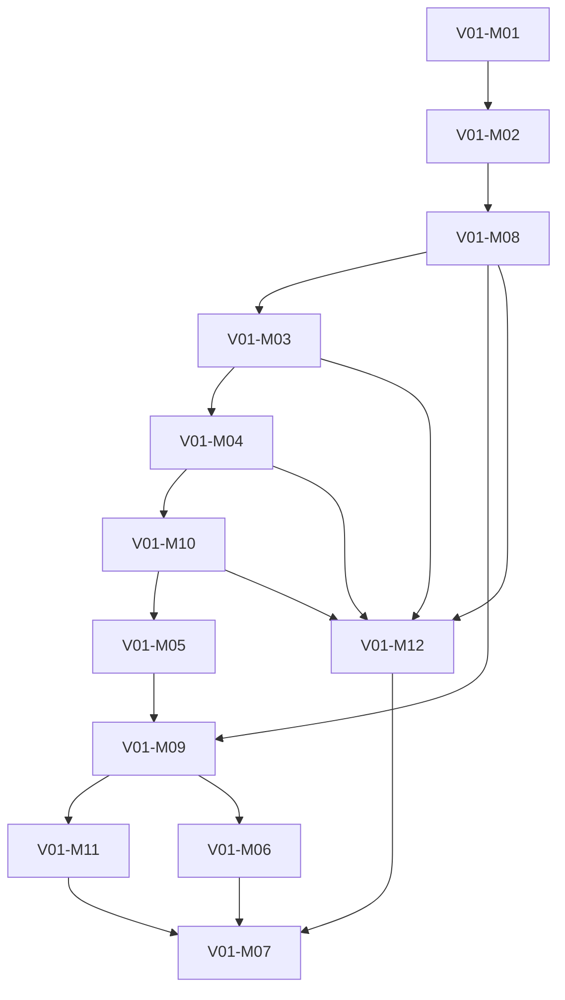

# Programming Fundamentals Academy Module Registry

## Purpose

Aggregate the canonical Chapters and Learning Outcomes into 12 production-ready
Module records.

## Scope

Each record defines identity, purpose, description, core hours, difficulty,
prerequisites, competencies, Chapters, Lesson count, outcomes, Projects, and
assessment architecture. No Module content is generated.

## Ownership

The frozen Blueprint and canonical registries own Module membership and
dependencies. This registry is a derived Academy production view.

## Content

### Module records

| Order | Module | Purpose and description | Core hours | Difficulty | Prerequisites | Competencies | Chapters / Lessons | Outcomes | Projects | Assessments |
| ---: | --- | --- | ---: | --- | --- | --- | --- | --- | --- | --- |
| 1 | `V01-M01` Computational Thinking | Transform ambiguous problems into precise, finite, traceable solution models. | 10 | Beginner | `V00` | problem framing, execution tracing, algorithm design | `C01`-`C04` / 4 | `LO001`-`LO006` | `P01` | Chapter gates, practical evidence, Module trace review |
| 2 | `V01-M02` Data and Expressions | Represent values and state, evaluate expressions, and design bounded data transformations. | 10 | Beginner | `M01` | data modeling, state reasoning, expression evaluation | `C05`-`C08` / 4 | `LO007`-`LO012` | `P02` | Chapter gates, data-flow review |
| 3 | `V01-M08` JavaScript Runtime and Type Semantics | Make runtime, host, tooling, conversion, equality, and execution assumptions explicit. | 8 | Beginner to Intermediate | `M02` | runtime reasoning, expression evaluation | `C38`, `C29` / 2 | `LO047`-`LO048`, `LO065`-`LO066` | `P07` | runtime workflow and type-semantics review |
| 4 | `V01-M03` Control Flow | Design and verify decisions, repetition, and composite execution paths. | 9 | Beginner | `M08`, `M02` | control-flow design, state reasoning | `C09`-`C12` / 4 | `LO013`-`LO018` | `P03` | branch, loop, and control-flow gates |
| 5 | `V01-M04` Functions and Decomposition | Decompose behavior into explicit, testable function contracts. | 10 | Beginner | `M03`, `M01` | functional decomposition, state reasoning | `C13`-`C16` / 4 | `LO019`-`LO024` | `P04` | contract and decomposition review |
| 6 | `V01-M10` Functional JavaScript | Apply higher-order functions, callbacks, closures, and controlled state boundaries. | 8 | Intermediate | `M04` | higher-order reasoning, functional decomposition | `C32`, `C33` / 2 | `LO053`-`LO056` | `P07` | callback-flow and closure-contract review |
| 7 | `V01-M05` Structured Data and Recursion | Process collections, records, recursive structures, and text with explicit invariants. | 12 | Beginner to Intermediate | `M10`, `M04`, `M03` | collection processing, data modeling, algorithm design | `C17`-`C20` / 4 | `LO025`-`LO031` | `P05` | data-model and recursive-trace gates |
| 8 | `V01-M09` JavaScript Objects and Collections | Apply JavaScript identity, mutation, object, array, and pipeline semantics. | 8 | Intermediate | `M05`, `M10`, `M08` | collection processing, data modeling, runtime reasoning | `C30`, `C31` / 2 | `LO049`-`LO052` | `P07` | object/collection integration review |
| 9 | `V01-M11` Numeric and Temporal Computing | Manage numeric precision, safe integers, dates, time zones, and temporal boundaries. | 7 | Intermediate | `M09`, `M08`, `M02` | numeric-temporal reliability | `C34`, `C35` / 2 | `LO057`-`LO060` | `P07` | numeric and temporal boundary review |
| 10 | `V01-M06` Algorithms and Efficiency | Select basic search and sort approaches using correctness, invariants, and cost. | 9 | Intermediate | `M09`, `M05` | algorithm analysis, algorithm design | `C21`-`C23` / 3 | `LO032`-`LO037` | `P06` | algorithm trace and trade-off review |
| 11 | `V01-M12` Errors and Module Boundaries | Design exception contracts and stable ES module boundaries. | 7 | Intermediate | `M03`, `M04`, `M08`, `M10` | failure engineering, program delivery | `C36`, `C37` / 2 | `LO061`-`LO064` | `P08` | error-boundary and module-graph review |
| 12 | `V01-M07` Reliability and Program Design | Integrate failure analysis, debugging, testing, refactoring, and delivery. | 12 | Intermediate | `M06`, `M11`, `M12` and prior gates | failure engineering, verification/refactoring, program delivery | `C24`-`C28` / 5 | `LO038`-`LO046` | `P08`, `CP01` | reliability review, final assessment, technical defense |

All abbreviated IDs in the table inherit the `V01-` prefix.

### Cross-Module dependencies

### Module completion contract

A Module is complete only when every member Chapter outcome has assessment
evidence, the Module review passes, and any associated Project gate is met.
Module hours describe the core guided curriculum, not Project execution time.

## Validation

- Module records: 12.
- Chapter membership: 38 total, no duplicate primary membership.
- Lesson experiences: 38 total, one per Chapter.
- Outcome aggregation: 66 total, no orphan outcome.
- Core hours: 110.
- Module dependency graph: acyclic.

## References

- [Canonical Blueprint](../../../../governance/blueprint-v2/02-canonical-schema.md)
- [Canonical Chapter Registry](../../../../governance/blueprint-v2/04-chapter-registry.md)
- [Canonical Outcome Registry](../../../../governance/blueprint-v2/05-learning-outcome-registry.md)
- [Project Plan](../../projects.md)
