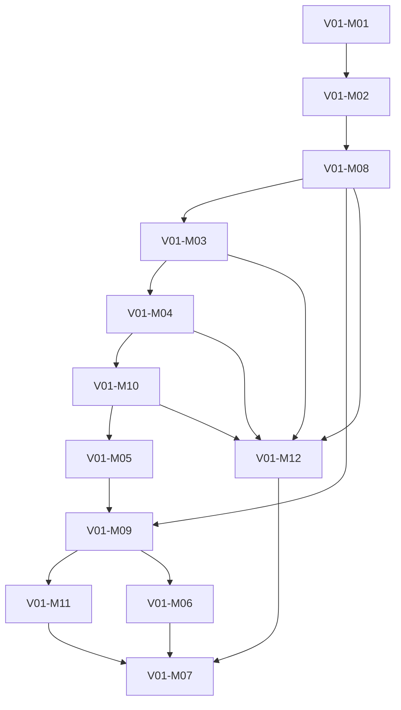

# Programming Fundamentals Academy Dependency Map

## Purpose

Expose the complete canonical prerequisite flow in an Academy production view.

## Scope

The map includes Module and Chapter dependencies. Lesson dependencies are
identical to their parent Chapter dependencies and are not a second edge set.

## Ownership

The canonical Chapter Registry owns direct prerequisite relationships. This
document derives navigation and validation evidence only.

## Content

### Module graph



### Complete Chapter prerequisite map

| Chapter | Direct prerequisites |
| --- | --- |
| `C01` | `V00` |
| `C02` | `C01` |
| `C03` | `C01`, `C02` |
| `C04` | `C03` |
| `C05` | `C02`, `C04` |
| `C06` | `C05` |
| `C07` | `C05`, `C06` |
| `C08` | `C04`, `C07` |
| `C09` | `C07`, `C29` |
| `C10` | `C08`, `C09` |
| `C11` | `C06`, `C09`, `C10` |
| `C12` | `C10`, `C11` |
| `C13` | `C04`, `C12` |
| `C14` | `C07`, `C13` |
| `C15` | `C06`, `C13`, `C14` |
| `C16` | `C03`, `C04`, `C13`, `C14`, `C15` |
| `C17` | `C11`, `C14`, `C15`, `C16`, `C32`, `C33` |
| `C18` | `C05`, `C14`, `C17` |
| `C19` | `C10`, `C13`, `C14`, `C15` |
| `C20` | `C08`, `C14`, `C17` |
| `C21` | `C10`, `C11`, `C17`, `C31` |
| `C22` | `C11`, `C12`, `C17`, `C31` |
| `C23` | `C04`, `C17`, `C21`, `C22` |
| `C24` | `C08`, `C12`, `C15`, `C18`, `C36`, `C37` |
| `C25` | `C02`, `C04`, `C23`, `C24` |
| `C26` | `C10`, `C13`, `C14`, `C15`, `C16`, `C17`, `C18`, `C24`, `C25` |
| `C27` | `C16`, `C23`, `C25`, `C26` |
| `C28` | `C03`-`C27`, `C29`-`C38` |
| `C29` | `C05`, `C07`, `C38` |
| `C30` | `C18`, `C29`, `C33` |
| `C31` | `C17`, `C30`, `C32` |
| `C32` | `C13`, `C14`, `C16` |
| `C33` | `C15`, `C32` |
| `C34` | `C05`, `C07`, `C29`, `C31` |
| `C35` | `C08`, `C34` |
| `C36` | `C10`, `C13`, `C15`, `C29` |
| `C37` | `C16`, `C33`, `C36` |
| `C38` | `C02`, `C08` |

All abbreviated Chapter IDs inherit the `V01-` prefix.

### Gate flow

```text
V00
-> foundational problem and data gates
-> JavaScript runtime/type gate
-> control and function gates
-> functional/data-model gates
-> numeric/algorithm/module gates
-> reliability gate
-> V01-CP01
```

### Dependency rules

- Every Chapter has exactly one primary Module.
- `C01` is the only Chapter consuming the external `V00` root directly.
- `C28` is the terminal integration node.
- Lesson views cannot define independent dependencies.
- Project dependencies are defined by the canonical Project Plan.

## Validation

- Chapter nodes: 38.
- Missing dependency targets: 0.
- Duplicate direct references: 0.
- Orphan Chapters: 0.
- Circular dependencies: 0.
- Topological coverage: 38 of 38.

## References

- [Canonical Dependency Graph](../../../../governance/blueprint-v2/06-dependency-graph.md)
- [Canonical Chapter Registry](../../../../governance/blueprint-v2/04-chapter-registry.md)
- [Learning Path](./02-learning-path.md)
