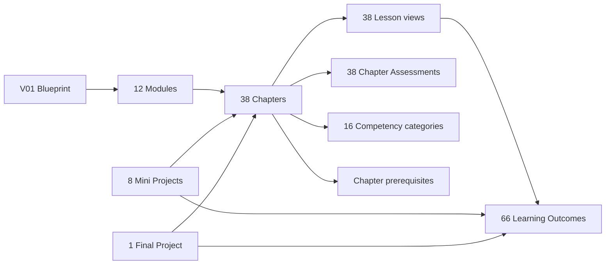

# Programming Fundamentals Academy Knowledge Graph

## Purpose

Define the complete curriculum-level graph joining Modules, Chapters, Lesson
views, Learning Outcomes, competencies, dependencies, and Projects.

## Scope

This graph describes curriculum architecture. It does not replace the atomic
KOS Concept Knowledge Graph and does not create Concepts, Claims, Evidence, or
Sources.

## Ownership

Each edge is derived from a named canonical or Academy registry. This document
owns the joined graph view and its validation contract only.

## Content

### Graph model



### Node catalog

| Node role | Count | Identity source |
| --- | ---: | --- |
| Blueprint | 1 | `V01-BP01` |
| Modules | 12 | `V01-M01`-`V01-M12` |
| Chapters | 38 | `V01-C01`-`V01-C38` |
| Lesson views | 38 | Parent Chapter identity and version |
| Learning Outcomes | 66 | `V01-LO001`-`V01-LO066` |
| Competency categories | 16 | Local keys in `09-competency-framework.md` |
| Mini Projects | 8 | `V01-P01`-`V01-P08` |
| Final Project | 1 | `V01-CP01` |

There are 141 unique curriculum identities/keys. Lesson views add 38 delivery
roles but do not add canonical identities.

### Edge catalog

| Relation | Complete mapping owner |
| --- | --- |
| Blueprint `contains` Module | [Module Registry](./03-module-registry.md) |
| Module `contains` Chapter | [Module Registry](./03-module-registry.md) |
| Chapter `renders-as` Lesson | [Lesson Registry](./05-lesson-registry.md) |
| Lesson `supports` Learning Outcome | [Learning Outcome Map](./06-learning-outcomes.md) |
| Chapter `depends-on` Chapter | [Dependency Map](./07-dependency-map.md) |
| Chapter `develops` Competency | [Competency Framework](./09-competency-framework.md) |
| Chapter `measured-by` Assessment | [Assessment Framework](./10-assessment-framework.md) |
| Project `integrates` Module/Chapter/Lesson/Outcome | [Project Framework](./11-project-framework.md) |

### Module-to-project integration

| Module | Project integration |
| --- | --- |
| `M01` | `P01`, `CP01` |
| `M02` | `P02`, `CP01` |
| `M08` | `P07`, `P08`, `CP01` |
| `M03` | `P03`, `CP01` |
| `M04` | `P04`, `CP01` |
| `M10` | `P07`, `CP01` |
| `M05` | `P05`, `CP01` |
| `M09` | `P07`, `CP01` |
| `M11` | `P07`, `CP01` |
| `M06` | `P06`, `CP01` |
| `M12` | `P08`, `CP01` |
| `M07` | `P08`, `CP01` |

All abbreviated IDs inherit the `V01-` prefix.

### Graph traversal contract

The following query must always resolve:

```text
Project
-> required Chapter
-> parent Module
-> Lesson view
-> Learning Outcome
-> planned Assessment
-> competency category
```

The reverse query from any Learning Outcome must resolve to exactly one parent
Chapter/Lesson, one parent Module, at least one assessment, and at least one
Academy competency.

## Validation

- Module nodes: 12.
- Chapter nodes: 38.
- Lesson roles: 38.
- Outcome nodes: 66.
- Competency keys: 16.
- Project nodes: 9.
- Orphan outcomes: 0.
- Missing parent relations: 0.
- Broken dependency targets: 0.
- Duplicate canonical identities introduced: 0.

## References

- [Canonical Blueprint](../../../../governance/blueprint-v2/02-canonical-schema.md)
- [Canonical Dependency Graph](../../../../governance/blueprint-v2/06-dependency-graph.md)
- [KOS Knowledge Graph Registry](../../../knowledge/knowledge-graph-registry.md)
- [Project Framework](./11-project-framework.md)
