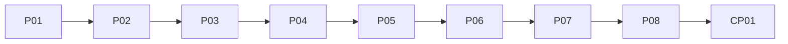

# Programming Fundamentals Academy Project Framework

## Purpose

Expose the canonical eight-Mini-Project and one-Final-Project architecture as
a complete Academy integration map.

## Scope

This framework maps Projects to Modules, Chapters, Lesson views, Learning
Outcomes, prerequisites, and assessment gates. It does not add project briefs,
requirements, solutions, code, or learner instructions.

## Ownership

The canonical Project Plan owns Project names, scope, durations, prerequisites,
and completion criteria. This document owns only the derived Academy mapping.

## Content

### Mini Project strategy

Projects progress from guided concept integration to independent,
failure-resilient program design. Every Project uses only competencies taught
by its prerequisite Chapters.

### Complete Project map

| Project | Modules | Chapters and Lesson identities | Outcomes | Duration | Gate |
| --- | --- | --- | --- | --- | --- |
| `V01-P01` Instruction Simulator | `M01` | `C01`-`C04` | `LO001`-`LO006` | 5-7 h | Deterministic traces and bounded instruction behavior |
| `V01-P02` Data Transformation Console | `M02` | `C05`-`C08` | `LO007`-`LO012` | 6-8 h | Validated transformation boundary |
| `V01-P03` Rule-Based Workflow | `M03` | `C09`-`C12` | `LO013`-`LO018` | 7-9 h | Complete branches and terminating repetition |
| `V01-P04` Function-Based Utility Toolkit | `M04` | `C13`-`C16` | `LO019`-`LO024` | 8-10 h | Explicit contracts and independent verification |
| `V01-P05` Structured Data Processor | `M05` | `C17`-`C20` | `LO025`-`LO031` | 9-12 h | Valid-state data processing and edge cases |
| `V01-P06` Algorithm Workbench | `M06` | `C21`-`C23` | `LO032`-`LO037` | 9-12 h | Correct traces and justified trade-offs |
| `V01-P07` JavaScript Data Reliability Integrator | `M08`, `M09`, `M10`, `M11` | `C29`-`C35`, `C38` | `LO047`-`LO060`, `LO065`-`LO066` | 14-18 h | Practical integration review and technical defense |
| `V01-P08` Modular Failure-Resilient Program Design | `M12`, `M07` | `C24`-`C27`, `C36`-`C38` | `LO038`-`LO045`, `LO061`-`LO066` | 16-20 h | Independent project, repository, and technical review |

All abbreviated IDs inherit the `V01-` prefix. Each Chapter identity in this
table also identifies its Lesson view.

### Final Project strategy

| Field | Contract |
| --- | --- |
| Final Project | `V01-CP01` Reliable Command-Line Problem Solver |
| Required Modules | `V01-M01`-`V01-M12` in canonical learning order |
| Required Chapters/Lessons | `V01-C01`-`V01-C38` |
| Required Projects | `V01-P01`-`V01-P08` |
| Primary outcome | `V01-LO046` |
| Supporting outcomes | `LO005`, `LO006`, `LO012`, `LO018`, `LO024`, `LO027`, `LO037`-`LO045` |
| Duration | 25-30 hours |
| Final evidence | Requirements, design, implementation, tests, debug record, review, documentation, retrospective, technical defense |

### Project progression

The diagram expresses integration order. Canonical Chapter prerequisites and
the detailed Project prerequisites remain authoritative in the Project Plan.

### Project workload

| Category | Range |
| --- | ---: |
| Mini Projects `P01`-`P06` | 44-58 hours |
| Mini Projects `P07`-`P08` | 30-38 hours |
| Final Project `CP01` | 25-30 hours |
| **Total** | **99-126 hours** |

## Validation

- Mini Projects: 8.
- Final Projects: 1.
- Duplicate Project IDs: 0.
- Projects without Module mapping: 0.
- Projects without Chapter/Lesson mapping: 0.
- Projects without outcome mapping: 0.
- Project content generated: 0.

## References

- [Canonical Project Plan](../../projects.md)
- [Module Registry](./03-module-registry.md)
- [Learning Outcome Map](./06-learning-outcomes.md)
- [Completion Requirements](./15-completion-requirements.md)
