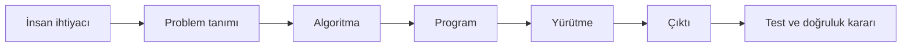
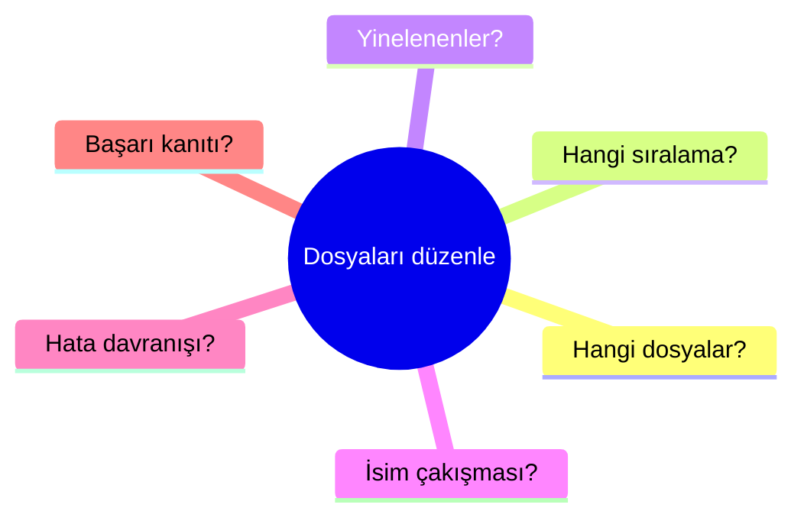

# Görselleştirme Notları: Programlama Nedir?

## Purpose

C01'in soyut kavramlarını dekoratif olmayan, öğrenme çıktısına bağlı ve
erişilebilir görsellerle desteklemek.

## Scope

Bu belge üretilecek diyagram, karşılaştırma kartı ve etkileşimli modellerin
tasarım sözleşmesidir; tamamlanmış SVG veya web bileşeni değildir.

## Ownership

- Görsel öğrenme modeli: Learning Experience Designer
- Teknik doğruluk: Subject-Matter Reviewer
- Erişilebilirlik: Accessibility Reviewer

## Content

### Görsel 1 — Niyetten doğrulamaya

Metin alternatifi: İhtiyaç önce ölçülebilir probleme, sonra çözüm yöntemine ve
program temsiline dönüşür; yürütme çıktı üretir, test çıktıyı gereksinimle
karşılaştırır.

### Görsel 2 — Kavram karşılaştırma kartları

Dört yan yana kart tasarlanır: algoritma, program, yürütme ve çıktı. Her kart
“nedir?”, “ne değildir?” ve “kanıtı nedir?” alanlarını taşır. Renk tek ayırıcı
olmaz; ikon, başlık ve biçim birlikte kullanılır.

### Görsel 3 — Belirsizlik merceği

“Dosyaları düzenle” ifadesinin üzerine açılan dallar gösterilir:

### Etkileşim 1 — İnsan yorumlayıcı

Öğrenci bir talimatı kartlar hâlinde yazar. İkinci öğrenci yalnız kartları
uygular. Her sapmada talimat, varsayım veya sıra hatası işaretlenir. Web
sürümünde klavye ile kart taşıma ve metin tabanlı sıralama alternatifi gerekir.

### Etkileşim 2 — Çalışıyor mu, doğru mu?

Öğrenciye çalışan üç program ve üç farklı gereksinim gösterilir. Öğrenci
çalışma sonucu ile doğruluk kararını ayrı seçer ve gerekçesini test kanıtına
bağlar.

## Validation

- Her görsel en az bir öğrenme çıktısına bağlıdır.
- Her diyagramın metin alternatifi tanımlanmıştır.
- Bilgi yalnız renk veya hareketle aktarılmaz.
- Etkileşimler için klavye ve statik alternatif gereksinimi vardır.

## References

- [Ana Ders](../../../chapters/01-what-is-programming.md)
- [Legacy Visualization Notes](../../content/lesson-01/visualization-notes.md)
- [C02 Future Work Register](../v01-c02/sonrasinda-yapilacaklar.txt)
