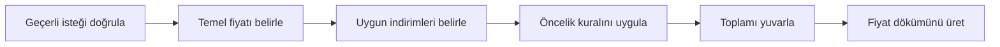

# Bilet Fiyatlandırma Problemini Ayrıştırma Laboratuvarı

## Amaç

Belirsiz bir bilet fiyatlandırma isteğini; paydaşları, girdileri, çıktıları,
kısıtları, varsayımları, sınır durumları ve bağımlılıkları belirlenmiş,
doğrulanabilir bir problem sözleşmesine dönüştürmek.

Bu laboratuvarda kod yazılmaz. Başarı, doğru teknolojiyi seçmekle değil,
kodlanmaya hazır problem sınırları üretmekle ölçülür.

## Senaryo

Bir etkinlik şirketi şu isteği gönderir:

> “Bilet fiyatlarını otomatik hesaplayalım. Öğrenci ve erken alanlar daha az
> ödesin. Yoğun günlerde fiyat farklı olabilir. Sistem haksız fiyat
> üretmemeli.”

Ekip sizden hemen fiyat hesaplama kodu istemektedir. Ancak indirimlerin kimlere
uygulanacağı, birlikte kullanılıp kullanılamayacağı, “erken” ve “yoğun”
kavramlarının sınırları, para yuvarlama yöntemi ve hata davranışı açıklanmamıştır.

## Çalışma Ortamı

Gerekli araçlar:

- bir metin düzenleyici,
- Markdown önizleme desteği,
- zaman tutucu,
- isteğe bağlı olarak Git.

Bir çalışma klasörü oluşturun:

```text
v01-c03-ticket-pricing-lab/
├── 01-raw-request.md
├── 02-stakeholders.md
├── 03-problem-contract.md
├── 04-scenario-matrix.md
├── 05-decomposition.md
├── 06-ai-audit.md
└── 07-defense-notes.md
```

Git biliyorsanız başlangıç ve AI karşılaştırması öncesinde ayrı commit alın.
Henüz Git bilmiyorsanız dosyaların üstüne tarih-saat ve sürüm numarası yazarak
ilk çözümünüzü koruyun.

## Gereksinimler

Tesliminiz en az şunları içermelidir:

- üç paydaş ve her birinin karar alanı,
- altı girdi ve üç çıktı,
- üç kısıt ve üç varsayım,
- sekiz iş kuralı veya açık soru,
- normal, sınır ve geçersiz sınıflarından toplam en az on iki senaryo,
- üç seviyeli ve en az on yapraklı sorumluluk ağacı,
- en az altı yönlü bağımlılık,
- sekiz kabul ölçütü,
- AI çıktısında en az üç denetim bulgusu,
- beş dakikalık teknik savunma notu.

## Görevler

### Görev 1 — Ham isteği koruyun

İsteği `01-raw-request.md` içine değiştirmeden yazın. Bilinenleri,
bilinmeyenleri ve metnin önerdiği fakat doğrulamadığı çözümleri üç ayrı listede
toplayın.

**Kontrol noktası:** Ham istek ile sizin yorumunuz birbirine karışmamalıdır.

### Görev 2 — Paydaş ve amaç haritası çıkarın

`02-stakeholders.md` içinde en az şu rolleri değerlendirin:

- etkinlik katılımcısı,
- gişe veya operasyon çalışanı,
- ürün sahibi,
- finans veya muhasebe temsilcisi,
- kampanya yöneticisi.

Her rol için hedef, kaygı, verebileceği bilgi ve karar yetkisini yazın. Yetkisi
bilinmeyen rolleri açık soru olarak işaretleyin.

### Görev 3 — Problem sözleşmesini yazın

`03-problem-contract.md` şu başlıkları içermelidir:

1. Problem bildirimi
2. Başarı tanımı
3. Aktörler
4. Girdiler
5. Çıktılar
6. İş kuralları
7. Kısıtlar
8. Varsayımlar
9. Kapsam içi
10. Kapsam dışı
11. Açık sorular
12. Kabul ölçütleri

Her varsayım için sahip, risk ve doğrulama yöntemi ekleyin. İndirimlerin
birleşme sırası, tarih-saat sınırları, para birimi ve yuvarlama özellikle
incelenmelidir.

### Görev 4 — Senaryo matrisi oluşturun

`04-scenario-matrix.md` içinde şu sütunları kullanın:

| Senaryo ID | Sınıf | Girdiler | İlgili kural | Beklenen sonuç | Açık nokta |
|---|---|---|---|---|---|

En az:

- dört normal,
- dört sınır,
- dört geçersiz

senaryo yazın. Tam indirim başlangıcı/bitişi, birden fazla indirim, eksik öğrenci
kanıtı, negatif fiyat ve desteklenmeyen para birimini değerlendirin.

### Görev 5 — Sorumluluk ağacı ve bağımlılık grafiği üretin

`05-decomposition.md` içinde problemi en az üç seviyede ayrıştırın. Her yaprak:

- tek bir sorumluluk taşımalı,
- bir girdi ve çıktı sınırına sahip olmalı,
- bağımsız doğrulanabilmeli,
- teknoloji adı yerine davranış ifade etmelidir.

Ardından yönlü bağımlılık grafiği çizin. Mermaid kullanabilirsiniz:



Bu örneği kopyalamak yerine kendi problem sözleşmenize göre genişletin.

### Görev 6 — İlk çözümü kilitleyin

AI kullanmadan hazırladığınız dosyalara `student-v1` etiketi verin. Git
kullanıyorsanız commit alın; kullanmıyorsanız salt okunur bir kopya oluşturun.
Bu kanıt olmadan AI denetimi puanlanmaz.

### Görev 7 — AI karşılaştırması yapın

Yapay zekâdan aynı ham isteği ayrıştırmasını isteyin. `06-ai-audit.md` içine:

- kullandığınız istemi,
- aracın çıktısını veya bağlantısını,
- iki güçlü noktayı,
- en az üç hata, eksik veya kaynaksız kabulü,
- kabul ettiğiniz ve reddettiğiniz önerileri,
- her kararın kanıtını

yazın. Kişisel veri, şirket sırrı veya erişim anahtarı paylaşmayın.

### Görev 8 — Teknik savunma hazırlayın

`07-defense-notes.md` içinde beş dakikada şu soruları yanıtlayacak bir anlatım
hazırlayın:

1. Problem aslında neydi?
2. En riskli üç belirsizlik neydi?
3. Ayrıştırma ağacınız neden bu sınırları kullanıyor?
4. Hangi senaryo tasarımınızı değiştirdi?
5. AI önerilerinden hangisini neden reddettiniz?

## Bonus Challenge

Ürün sahibi “İndirimler birleşebilir”, finans temsilcisi ise “En fazla tek
indirim uygulanabilir” diyor. İki alternatif kararın etkisini ayrı senaryo
matrisleriyle gösterin. Karar vermeyin; karar sahibini, son karar tarihini ve
bloklanan alt problemleri kaydedin.

## Teslim Edilecekler

- Belirtilen yedi Markdown dosyası
- İlk çözümün zaman damgası veya Git commit kanıtı
- En az on iki satırlı senaryo matrisi
- Sorumluluk ağacı ve bağımlılık grafiği
- AI denetim kaydı
- Beş dakikalık teknik savunma notu

## Değerlendirme Ölçütleri

| Boyut | Puan |
|---|---:|
| Problem sözleşmesinin doğruluğu ve kapsamı | 25 |
| Kısıt, varsayım ve açık soruların ayrımı | 15 |
| Senaryo ve sınır analizi | 20 |
| Ayrıştırma ağacı ve bağımlılık grafiği | 20 |
| AI çıktısının kanıt temelli denetimi | 10 |
| İzlenebilirlik, açıklık ve teknik savunma | 10 |
| **Toplam** | **100** |

Başarı için en az 80 puan ve “Problem sözleşmesi” boyutundan en az 18 puan
alınmalıdır. Ayrıntılı seviyeler [assessment rubric](./assessment-rubric.md)
belgesinde tanımlanır.

## Temizlik ve Gizlilik

- İstemlerden kişisel verileri ve erişim bilgilerini kaldırın.
- AI hizmetine yüklediğiniz metnin paylaşım politikasını kontrol edin.
- Geçici dışa aktarımları teslim sonrasında silin.
- Ham istek ve öğrenci çözümünü değiştirmeden saklayın.

## Yansıma

1. İlk bakışta gerçek sandığınız hangi varsayım geçersiz çıktı?
2. Hangi sınır senaryosu problem sözleşmesini değiştirdi?
3. Ayrıştırma ağacında en zor sınır nerede oluştu?
4. AI çıktısı hangi noktada ikna edici ama kanıtsızdı?
5. Bir sonraki problem analizinde ilk olarak neyi farklı yapacaksınız?

## Kaynaklar

- [Ana ders](../../../chapters/03-problem-tanimi-ve-ayristirma.md)
- [Alıştırmalar](./exercises.md)
- [AI Mentor paketi](./ai-mentor.md)
- [Değerlendirme rubriği](./assessment-rubric.md)
