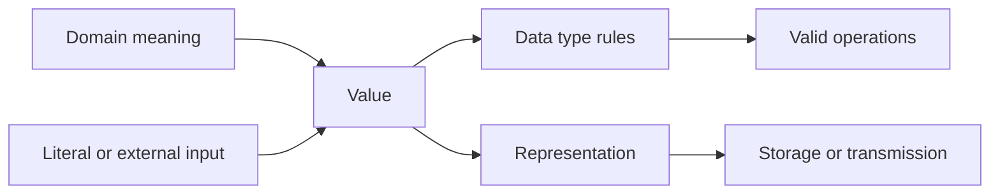
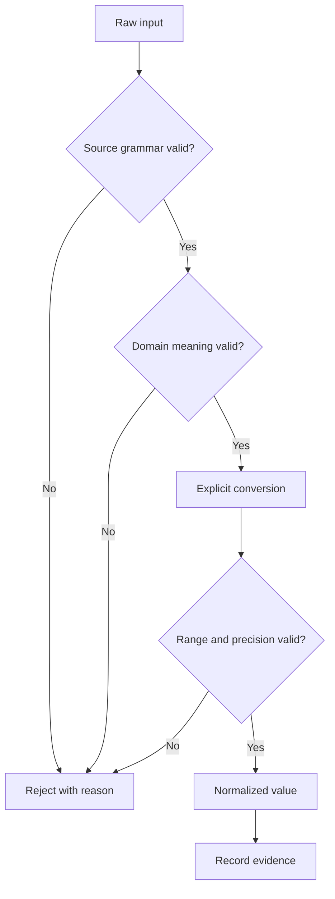
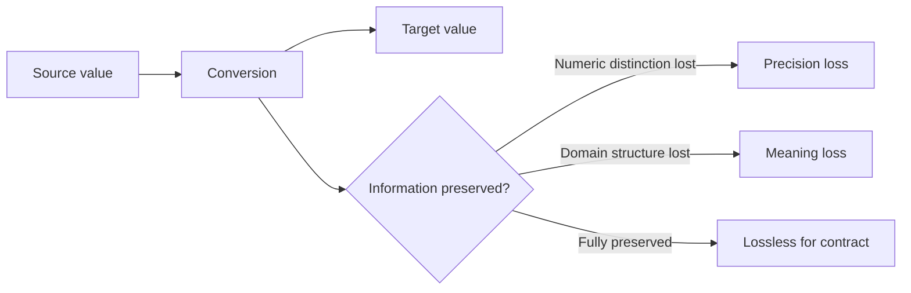

# V01-C05 Visualization Notes

## Diagram 1 — Value Model

Metin alternatifi: domain anlamı program value’suna modellenir; value bir type’ın
kurallarına tabidir ve bir representation ile saklanır/iletilir. Literal veya external
input value üretme yollarıdır.

## Diagram 2 — Safe Conversion Boundary

Metin alternatifi: ham girdi önce source grammar ve domain meaning açısından doğrulanır;
sonra açık dönüşüm uygulanır; result range/precision kontrolünden geçerse kabul edilir.

## Diagram 3 — Loss Types

## Future Rich Visuals

- Interactive card: domain meaning/type/representation layers can be toggled.
- Safe integer slider: values around `2^53-1` show representability collisions.
- Conversion playground: input, parser choice, result and loss warning displayed together.
- Unicode explorer: glyph, code points and UTF-16 units shown without claiming grapheme simplicity.

All animations require pause, keyboard access, static alternative and reduced-motion mode.
