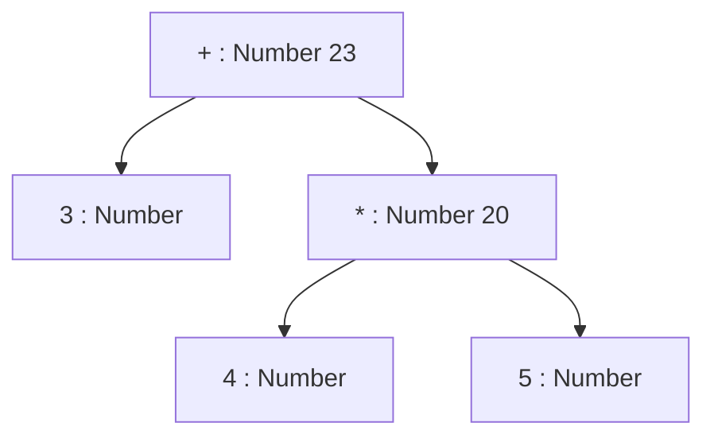
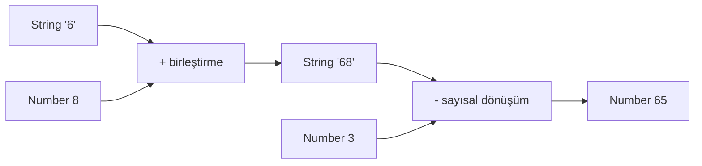

# Görselleştirme Notları

## Görsel 1 — İfade Ağacı

Amaç: `3 + 4 * 5` ifadesinde önceliğin soldan sağa basit yürütme olmadığını göstermek.

## Görsel 2 — Tür Dönüşümü Akışı

## Görsel 3 — Öncelik ve Değerlendirme Sırası

İki paralel şerit kullanılmalı: üst şerit soldan sağa `A → B → C` çağrı zaman çizelgesini,
alt şerit `B * C → A + sonuç` işleç uygulama ağacını göstermeli. Böylece iki kavram aynı görselde
karışmadan karşılaştırılır.

## Görsel 4 — Expression Audit Table

Etkileşimli sürümde öğrenci kodu çalıştırmadan tahmin, tür ve kural hücrelerini doldurmalı;
“Çalıştır” sonrasında gerçek sonuç açılmalıdır. Cevap anahtarı ilk denemeden önce görünmemelidir.

## Erişilebilirlik

- Renk tek başına anlam taşımamalıdır.
- Number, String ve Boolean düğümleri metin etiketiyle belirtilmelidir.
- Mermaid diyagramlarının altında düz metin açıklaması bulunmalıdır.
- Animasyon durdurulabilir ve adım adım ilerletilebilir olmalıdır.
