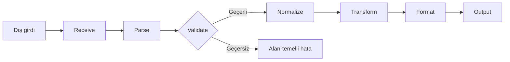
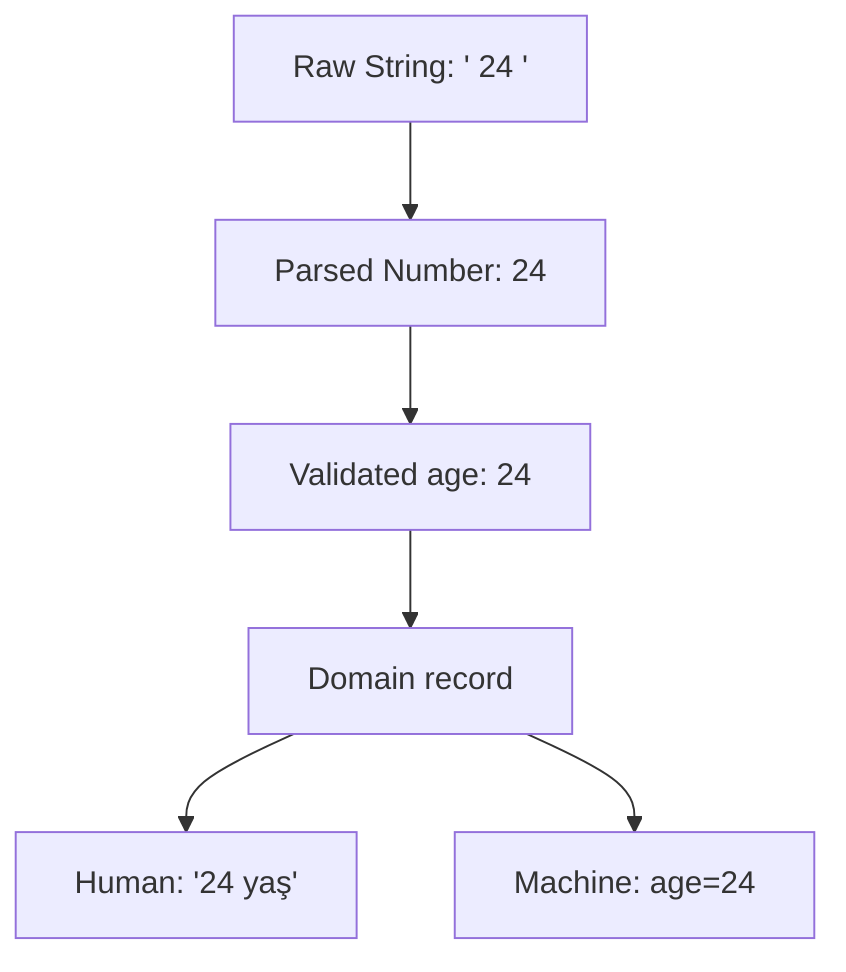

# Görselleştirme Notları

## Pipeline Görseli

Metin alternatifi: Dış veri alınır, parse edilir ve doğrulanır; geçersizse alan hatası, geçerliyse
normalize/transform/format aşamalarından sonra çıktı üretilir.

## Temsil Merdiveni

## Error Dalı

Bir stage timeline üzerinde parse failure, field validation failure ve record validation failure
farklı shapes ile gösterilmeli. Renk yanında icon ve metin label kullanılmalı.

## Etkileşim Önerisi

Öğrenci raw input'u seçer, her stage output'unu tahmin eder; “Çalıştır” sonrasında actual
type/value/error açılır. Cevap ilk tahminden önce görünmez.

## Erişilebilirlik

- Renk tek başına durum göstermemeli.
- Her node representation/type etiketi taşımalı.
- Diyagram altında metin alternatifi bulunmalı.
- Animasyon durdurulabilir ve klavyeyle adımlanabilir olmalı.
