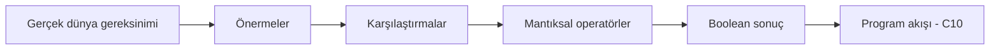
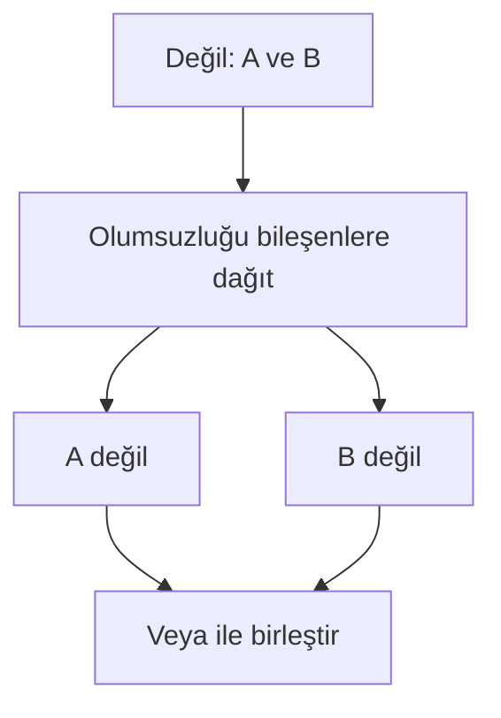

# Boolean Mantığı ve Doğruluk Görselleştirme Notları

## Görsel 1 — Karar Boru Hattı



Amaç, mantıksal sonucun ham veriden doğrudan çıkmadığını; gereksinim ve karşılaştırma katmanlarından geçtiğini göstermektir.

## Görsel 2 — VE ve VEYA Kapıları

İki yan yana kart kullanılmalı. VE kartında yalnız “doğru/doğru” satırı yeşil; VEYA kartında yalnız “yanlış/yanlış” satırı kırmızı gösterilmelidir. Renk tek bilgi taşıyıcısı olmamalı; metin ve simge de kullanılmalıdır.

## Görsel 3 — De Morgan Dönüşümü



Görselin yanında `!(A && B) === (!A || !B)` gösterilmeli; bunun atama veya gerçek JavaScript eşitlik testi değil, öğretim amaçlı eşdeğerlik anlatımı olduğu açıklanmalıdır.

## Görsel 4 — Kısa Devre Akışı

```mermaid
flowchart TD
    A[Sol işleneni değerlendir] --> B{Operatör && mi?}
    B -->|Evet| C{Sol yanlış mı?}
    C -->|Evet| D[Sol işleneni döndür]
    C -->|Hayır| E[Sağ işleneni değerlendir ve döndür]
    B -->|Hayır: ||| F{Sol doğru mu?}
    F -->|Evet| G[Sol işleneni döndür]
    F -->|Hayır| H[Sağ işleneni değerlendir ve döndür]
```

## Görsel 5 — Üç Girdili Tablo Üretimi

A sütunu dört satırda, B iki satırda, C her satırda değişecek biçimde animasyon önerilir. Öğrenci “sonraki satır” düğmesiyle birleşimlerin hiçbirinin atlanmadığını gözlemlemelidir.

## Erişilebilirlik Notları

- Doğru/yanlış ayrımı yalnız yeşil/kırmızı renge bırakılmamalıdır.
- Tablolarda sütun başlıkları ekran okuyucular için açık olmalıdır.
- Animasyon durdurulabilir ve adım adım kullanılabilir olmalıdır.
- Kod ile görselde aynı değişken adları korunmalıdır.
