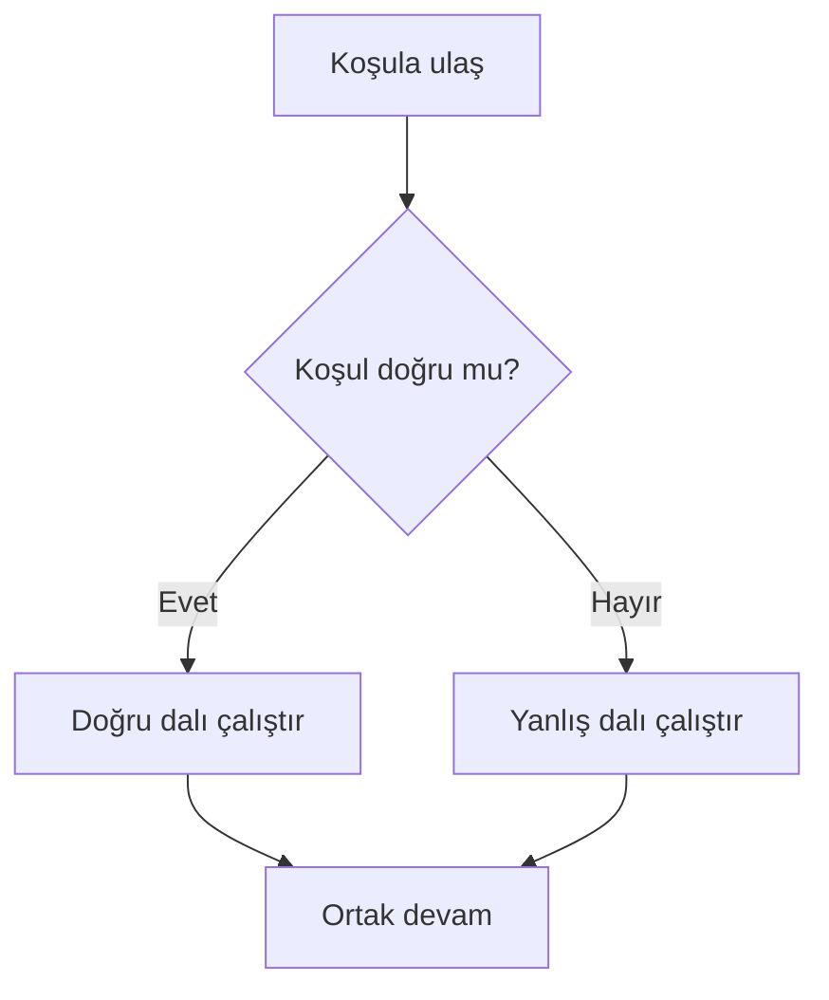
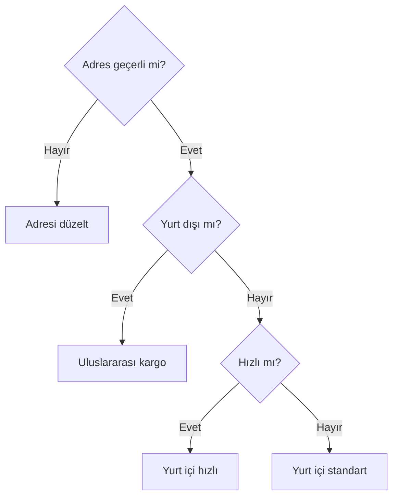

# Koşullu Yürütme Görselleştirme Notları

## Seçim Akışı

## Kargo Akışı

## Erişilemez Dal Görseli

Genel koşulun bütün girdileri önce yakaladığı ve özel dalın giriş oku alamadığı karşılaştırmalı iki akış çizilmelidir.

## Erişilebilirlik

Renk tek işaret olmamalı; dal adları, Evet/Hayır etiketleri ve desenler kullanılmalıdır. Her Mermaid diyagramının altında düz metin yürütme sırası bulunmalıdır.
