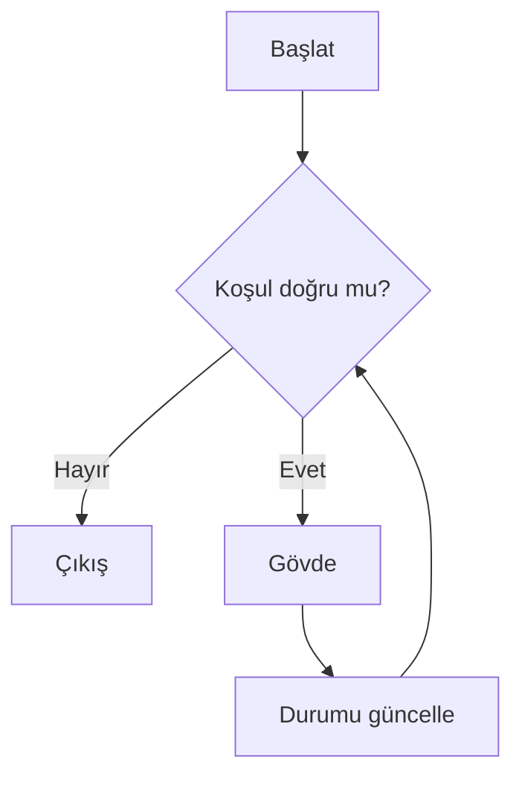
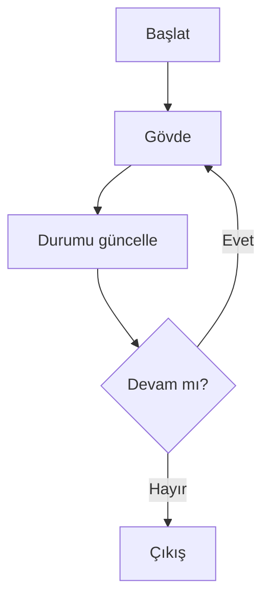

# Yineleme ve Döngüler Görselleştirme Notları

## Temel Akış

## `do...while` Farkı

## Durum Animasyonu

Her turda `index`, `current`, `total` ve `remaining` ayrı kartlarda önce/sonra olarak gösterilmelidir. Renk tek bilgi taşıyıcısı olmamalı; ok ve metin etiketi bulunmalıdır.

## Sonlanma Görseli

`length - index` mesafesinin 4, 3, 2, 1, 0 olarak azaldığı basamak görseli; yanında düz metin açıklaması bulunmalıdır.
