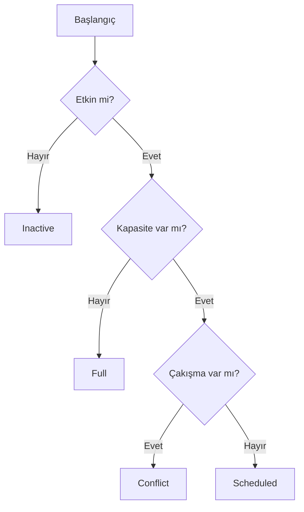
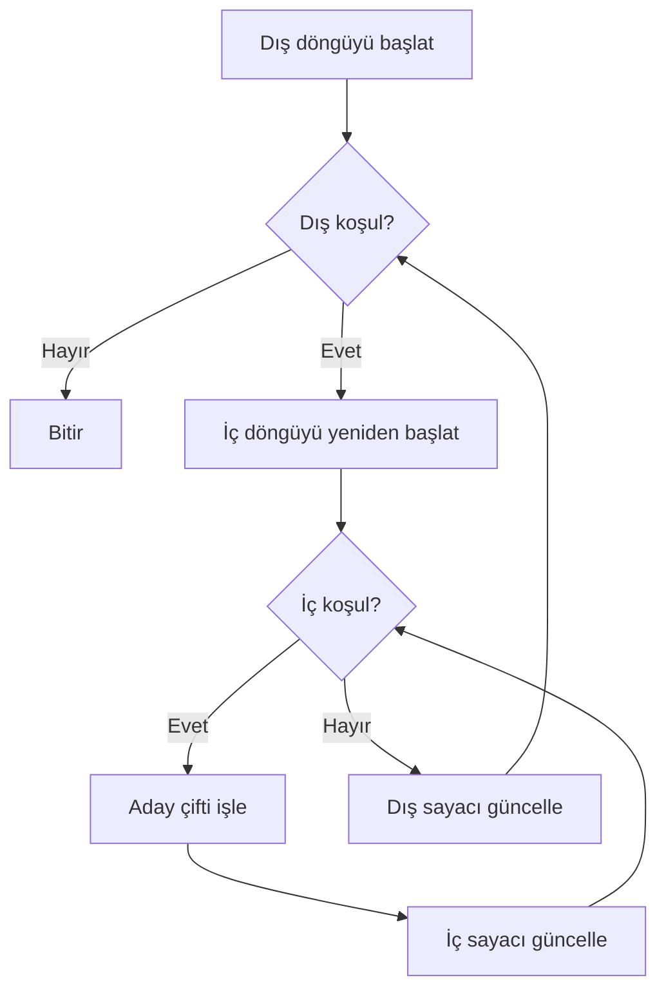
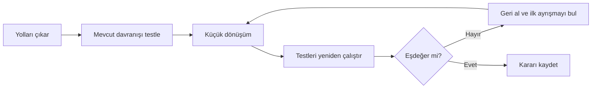

# Görselleştirme Notları

## İç İçe Karar Yolu

Metin karşılığı: Her iç karara yalnız önceki dış kararın “Evet” dalından ulaşılır; her ret dalı ayrı sonuç üretir.

## İç İçe Döngü

Metin karşılığı: İç başlangıç, her dış turda yeniden yapılır. İç döngü bittiğinde dış güncelleme gerçekleşir.

## Davranış Koruma Akışı

## Tasarım Gereksinimleri

- Renk tek başına anlam taşımamalı; ok etiketleri kullanılmalı.
- Animasyonda dış ve iç tur sayaçları aynı anda görünmeli.
- `break` oku iç çıkışa, dış devam ayrı oka bağlanmalı.
- Guard sürümü ve derin sürüm aynı karar tablosuna bağlanmalı.
- Her görselin erişilebilir metin açıklaması bulunmalı.
