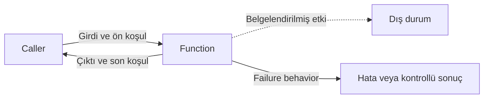
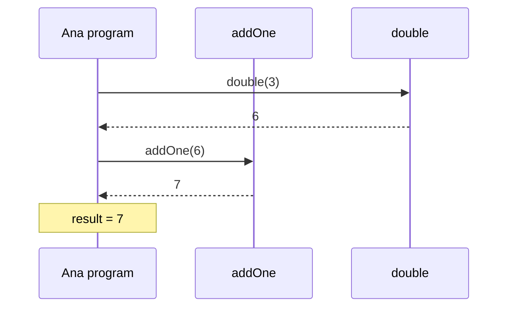
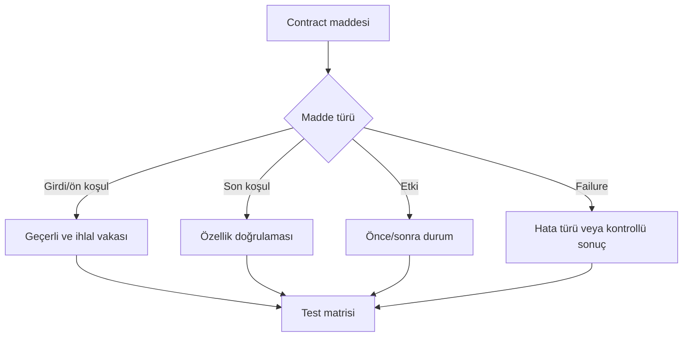

# Görselleştirme Notları

## Caller–Callee Contract

Metin karşılığı: Caller geçerli girdiyi sağlar; fonksiyon normal dönüşte sonucu garanti eder, etkisini ve başarısızlığı ayrıca bildirir.

## İç İçe Çağrı Yığını

Metin karşılığı: `double(3)` dış çağrının argümanını üretmek için önce tamamlanır; ardından `addOne(6)` çalışır.

## Contract-to-Test Akışı

## Tasarım Gereksinimleri

- Renk tek başına anlam taşımamalı; oklar metinle etiketlenmeli.
- Her frame için girdi, yerel değer ve dönüş noktası görünmeli.
- Normal dönüş ile hata akışı farklı çizgi/etiketle ayrılmalı.
- `console.log` etkisi ile `return` oku ayrı gösterilmeli.
- Animasyonun yanında numaralı metin izi bulunmalı.
