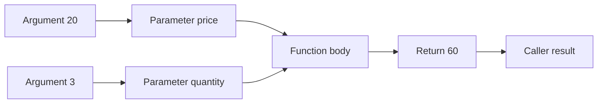
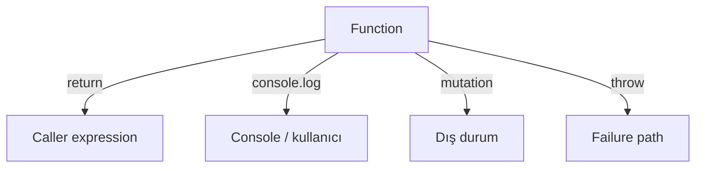
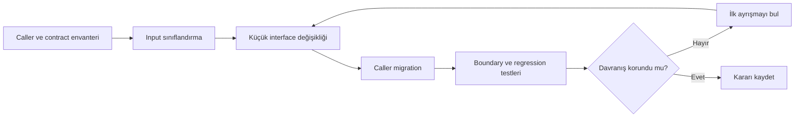

# Görselleştirme Notları

## Parameter–Argument Binding

Metin karşılığı: Argument ifadeleri değerlendirilir, konumlarına göre parameter'lara bağlanır; body sonucu caller'a return eder.

## Output Kanalları

Metin karşılığı: Return, print, mutation ve failure farklı hedeflere gider; contract hepsini ayrı açıklar.

## Interface Refactoring

## Tasarım Gereksinimleri

- Binding animasyonunda argument evaluation sırası numaralı olmalı.
- Primitive reassignment ve object mutation yan yana gösterilmeli.
- Default matrisi omitted, `undefined`, `null`, 0 ve false içermeli.
- Output kanalları renk dışında ok etiketi ve şekille ayrılmalı.
- Her Mermaid görselinin metin karşılığı bulunmalı.
