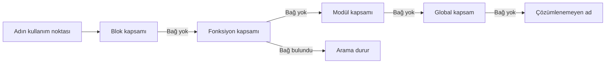
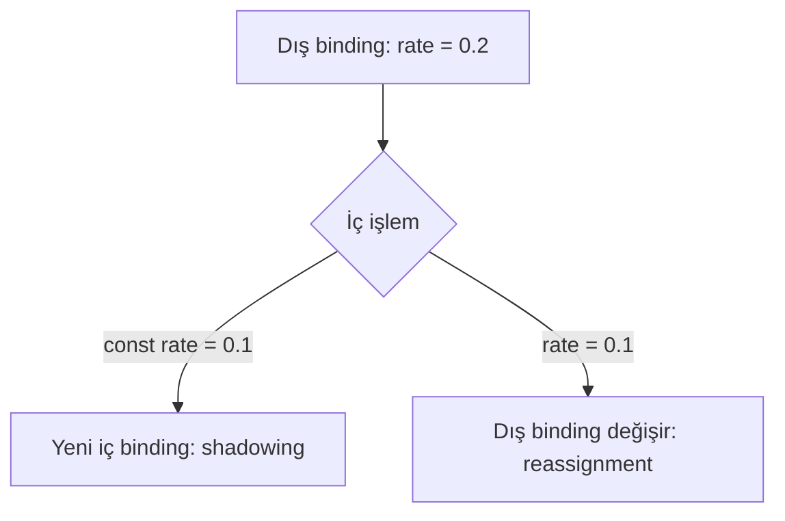
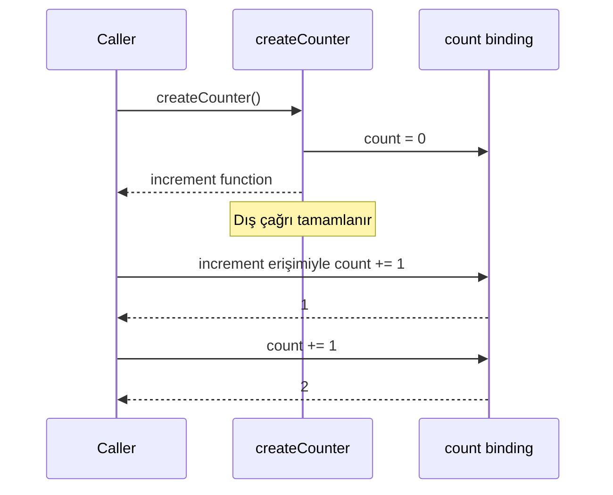
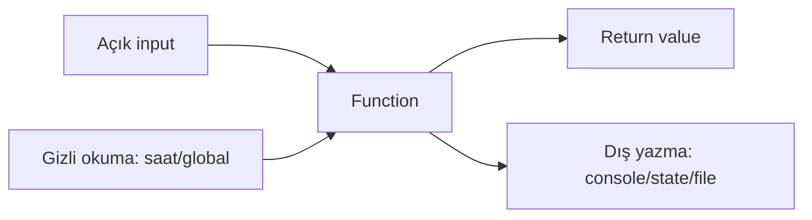

# Görselleştirme Notları

## Görsel 1 — Sözcüksel Kapsam Zinciri

Metinsel alternatif: Arama kullanım noktasından en dar kapsama, oradan dış
kapsamlara ilerler; ilk eşleşmede durur.

## Görsel 2 — Shadowing ve Reassignment

Renk dışında “yeni bağ” ve “aynı bağ” etiketleri kullanılmalıdır.

## Görsel 3 — Closure Yaşam Çizgisi

Metin, fonksiyon çağrısının bitmesiyle bağa bütün erişimin bitmediğini açıklar.

## Görsel 4 — Etki Envanteri

Oklar `read`, `return` ve `write` olarak metinle etiketlenmelidir.

## Görsel 5 — Pure Core ve Effectful Boundary

Saf çekirdek başka renkle gösterilebilir; renk kullanılmasa da kutu adları
ilişkiyi anlatmalıdır.

## Görsel Üretim Kuralları

- Her görsel için numaralı okuma sırası ve metinsel alternatif üretin.
- Binding, value ve object şekillerini farklı ikon/etiketle ayırın.
- Scope kutularını gerçekten iç içe gösterin; call-stack oku kullanmayın.
- GC zamanını kesin bir “silindi” anıyla göstermeyin; “unreachable/eligible” yazın.
- Yan etkileri yalnız kırmızı “kötü” olarak kodlamayın; gerekli boundary etkilerini ayrı sınıflandırın.
