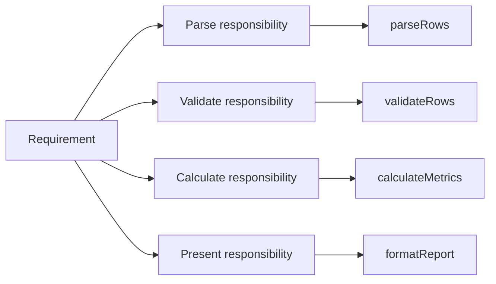
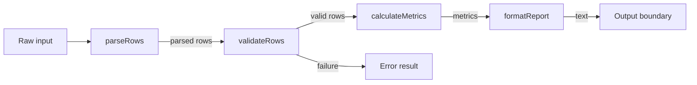
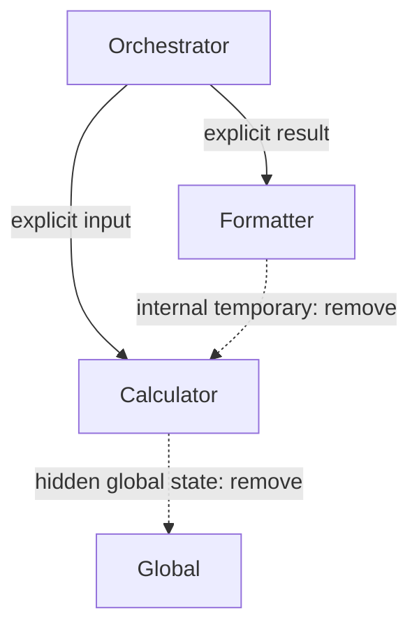
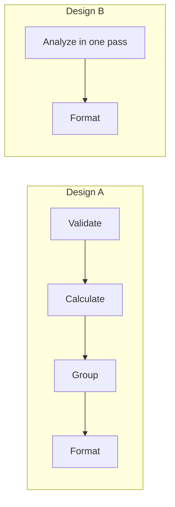

# Görselleştirme Notları

## Görsel 1 — Responsibility to Function Map

## Görsel 2 — Pipeline ve Orchestration

## Görsel 3 — Coupling Inventory

Kesikli oklar undesirable coupling'i ve düzeltme hedefini gösterir; renk tek
anlam taşıyıcısı değildir.

## Görsel 4 — İki Alternative

Altında function count değil, change scenario ve test isolation tablosu bulunmalıdır.

## Görsel Kuralları

- Her arrow data veya failure contract adı taşımalı.
- Orchestrator ile domain functions farklı shapes ve text labels kullanmalı.
- Diagram yanında numbered textual traversal bulunmalı.
- “High cohesion/low coupling” yalnız renkli skorla gösterilmemeli; evidence yazılmalı.
