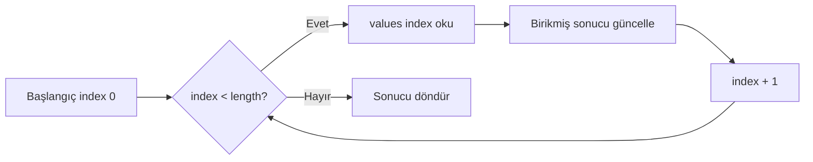
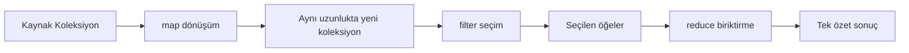

# Görselleştirme Notları

## 1. İndeks Şeridi

Yatay kutularda değerler, üstte indeksler, altta `length`; son indeks ile uzunluk
arasındaki bir fark vurgulanmalıdır. Boş dizi ayrı karede gösterilmelidir.

## 2. Dolaşma İmleci

`index`, işlenmiş önek ve henüz işlenmemiş son ek her turda farklı renkle gösterilir.
Değişmez: “İşlenmiş bölgenin toplamı `total` içindedir.”

## 3. Mutation Tehlikesi

`[2,4,6,7]` üzerinde `2` silindiğinde `4` değerinin sola kaydığı, imlecin ise sağa
ilerlediği animasyonla gösterilmelidir.

## 4. map–filter–reduce

`map` için 1→1, `filter` için n→0..n, `reduce` için n→1 cardinality şeması
oluşturulmalıdır.

## 5. Tek ve Çok Geçiş

Çoklu geçişte üç açık hat, tek geçişte bir ortak biriktirici gösterilmeli; hız
üstünlüğü varsayılmamalı, ölçüm rozetiyle belirtilmelidir.

## Erişilebilirlik

Renk tek anlam taşıyıcısı olmayacak; etiket, desen ve sıra numarası kullanılacaktır.
Her görsel için metin alternatifi ve kodla aynı veri örneği sağlanacaktır.
