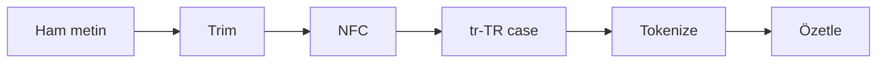

# V01-C20 Görselleştirme Notları

## Pipeline

Her okta ara değer ve tür gösterilmelidir.

## Üç Karakter Düzeyi

Code unit → code point → grapheme hiyerarşisi değildir; farklı ölçüm
gereksinimleridir. Tilki emoji ve birleşik aile emoji yan yana gösterilmeli,
sayım sonuçları metin etiketiyle verilmelidir.

## Empty Input

`"   "` → trim `""` → tokenize `[]` → count `0`. `[""]` yanlış kolu karşı
örnek olarak gösterilir.

## Erişilebilirlik

Renk tek anlam taşımaz; ham/display/search etiketleri yazılıdır. Unicode
örneklerinin code point gösterimi alternatif metinde bulunur.
