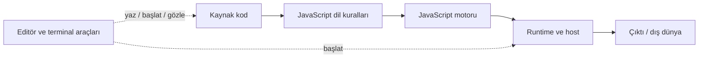

# V01-C38 Görselleştirme Notları

## 1. Yürütme Katmanları

Amaç: Kaynak kod, dil, engine, host ve tool sorumluluklarını ayırmak.

Alternatif metin: Kaynak kod motor tarafından dil kurallarıyla yürütülür;
runtime/host dış dünya imkânlarını, araçlar yazma ve başlatma desteğini sağlar.

## 2. Tarayıcı ve Node.js Karşılaştırması

Ortak merkez: bildirimler, değerler, ifadeler. Tarayıcı tarafı: `document`.
Node.js tarafı: `process`. `console`, iki host'ta yaygın fakat host-provided
olarak işaretlenmelidir. Renk tek anlam taşıyıcısı olmamalı; metinsel etiket
kullanılmalıdır.

## 3. Komut Token Haritası

`node runtime-report.js Ada 85` dört ayrı kutuda; altında sırasıyla Runtime CLI,
Entry point, Argüman 1, Argüman 2 etiketleri. Aynı renk yerine ikon + etiket
birlikte kullanılmalı.

## 4. `process.argv` İzi

Komut token'ları üst satırda, dizi indeksleri alt satırda eşleştirilir. `[0]` ve
`[1]` için gerçek tam yollar bilgisayara göre değişir notu gösterilir.

## 5. Süreç Yaşam Çizgisi

Başlat → dosyayı bul → ayrıştır → satırları yürüt → çıktı → tamamlanma durumu.
Hata dalları dosya bulma, syntax, runtime/host ve girdi davranışı olarak ayrı
duraklara bağlanır.

## 6. Tekrar Üretilebilirlik Kartı

Yedi alan tek kartta: sürüm, OS, cwd, entry point, komut/girdi, beklenen/gerçek
çıktı, exit status. Her alan kopyalanabilir metin olmalıdır.

## Erişilebilirlik

- Terminal çıktıları yalnız renkle başarı/hata göstermemeli.
- Diyagramların altında metin eşdeğeri bulunmalı.
- Komut ve JavaScript kodu görsel başlıkla ayrılmalı.
- Mobil görünüm hedef değil; masaüstünde %200 yakınlaştırmada yatay kaydırma
  yalnız kod bloklarında kalmalı.
