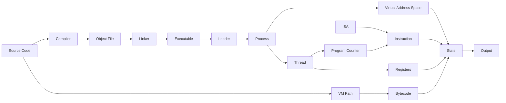

# Concept Graph: How Computers Execute Programs

## Purpose

Bu belge kavramlar arasındaki yönlü ilişkilerin insan tarafından incelenebilir görünümüdür.

## Scope

İlişkiler yalnız mevcut evidence ve knowledge unit'lerden türetilmiştir.

## Ownership

Knowledge Engineer edge provenance'ını; reviewer dependency yönünü doğrular.

## Content

### Relationship Types

`represented-as`, `transformed-by`, `produces`, `consumed-by`, `contains`, `uses`, `targets`, `loads`, `executes`, `owns`, `shares`, `updates`, `selects-next`, `observed-as`, `alternative-to`.

### Relationship Records

| Source | Relationship | Target | Evidence | Confidence |
| --- | --- | --- | --- | --- |
| Program | `represented-as` | Source Code | `EV-001`–`EV-004` | HIGH |
| Source Code | `expressed-in` | Programming Language | `EV-002`, `EV-003` | HIGH |
| Source Code | `transformed-by` | Compiler | `EV-009`–`EV-013` | HIGH |
| Compiler | `produces` | Assembly/Object File | `EV-012`, `EV-013` | HIGH |
| Assembly | `transformed-by` | Assembler | `EV-023` | HIGH |
| Object File | `consumed-by` | Linker | `EV-014`–`EV-016` | HIGH |
| Linker | `produces` | Executable | `EV-014`–`EV-018` | HIGH |
| Loader | `loads` | Executable | `EV-019`–`EV-021` | HIGH |
| Loader | `creates-state-for` | Process | `EV-019`–`EV-022` | HIGH |
| Process | `is-running-instance-of` | Program | `EV-005`, `EV-067` | HIGH |
| Process | `owns` | Virtual Address Space | `EV-053`, `EV-054`, `EV-057` | HIGH |
| Virtual Address Space | `contains-model-of` | Stack/Heap | `EV-058`–`EV-061` | HIGH |
| Thread | `belongs-to` | Process | `EV-068`, `EV-069` | HIGH |
| Thread | `owns` | Program Counter/Register State | `EV-070` | HIGH |
| ISA | `defines` | Instruction/Register/PC | `EV-027`, `EV-030`–`EV-034` | HIGH |
| Machine Code | `targets` | ISA | `EV-025`–`EV-029` | HIGH |
| CPU | `executes` | Machine Code Instruction | `EV-025`, `EV-049` | HIGH |
| Instruction | `updates` | State | `EV-040`–`EV-048` | HIGH |
| Program Counter | `selects-next` | Instruction | `EV-043`, `EV-044`, `EV-047`, `EV-048` | HIGH |
| CPU | `uses-model` | Fetch-Decode-Execute | `EV-089`–`EV-092` | HIGH |
| Virtual Machine | `consumes` | Bytecode | `EV-036`, `EV-073`, `EV-076` | HIGH |
| Virtual Machine | `defines` | Abstract State | `EV-035`, `EV-075`, `EV-081`–`EV-086` | HIGH |
| JIT | `transforms` | Bytecode to Host Machine Code | `EV-074`, `EV-077`, `EV-079` | HIGH/MEDIUM |
| Interpreter Path | `alternative-to` | Native Compilation Path | `EV-024`, `EV-074`, `EV-079` | HIGH/MEDIUM |
| Input | `updates` | Process State | `EV-022`, `EV-066`, `EV-088` | HIGH |
| State | `produces` | Output | `EV-022`, `EV-066`, `EV-088` | HIGH |
| Control Flow | `selects-next` | Instruction | `EV-043`, `EV-048`, `EV-084`, `EV-085` | HIGH |

### Dependency Graph

### Gates

- Bir ilişki evidence taşımıyorsa teaching veya AI Mentor kullanımına alınamaz.
- Bağımlılık yönü prerequisite sırasıyla çelişirse Sprint 07E onayı verilemez.
- Çözülmemiş (`OPEN`) conflict'e dayanan edge yayınlanamaz.

## Validation

- Relationship records: 27.
- Her edge evidence taşır; döngüsel prerequisite üretilmemiştir.

## References

- [Concept Model](./concept-model.md)
- [Machine-Readable Knowledge Graph](./knowledge-graph.md)
