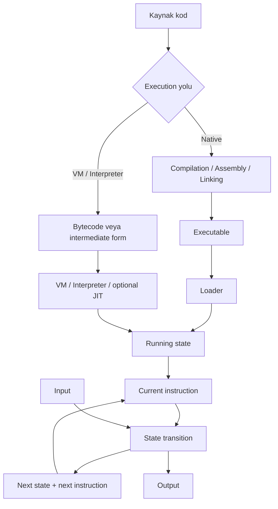

# Canonical Teaching Mental Model: How Computers Execute Programs

## Purpose

Bu belge V01-C02 için başlangıç seviyesinde kullanılacak tek, evidence-bound zihinsel modeli tanımlar.

## Scope

Model mikro mimari zamanlama, engine internals, scheduler ve advanced memory management ayrıntılarını kapsamaz.

## Ownership

Curriculum Designer öğretim sınırını; Technical Reviewer teknik doğruluğu korur.

## Content

### Model Statement

Program pasif bir instruction/data temsilidir. Kaynak kod doğrudan evrensel biçimde CPU'ya verilmez; native toolchain veya VM/interpreter/JIT yolu ile hedef execution modelinin anlayacağı instruction temsiline dönüşür. Loader/runtime çalışan instance'ın memory, stack, I/O ve başlangıç state'ini hazırlar. CPU veya abstract machine her instruction adımında mevcut state'i okur, tanımlı etkiyi uygular, PC/control flow ile sonraki instruction'ı belirler ve yeni state üretir. Input state'i değiştirebilir; output bu yürütümün gözlenebilir sonucudur.

### Two Valid Entry Paths

### Trace Contract

Her adım şu alanlarla izlenir: `step`, `current instruction`, `PC before`, `register/work state before`, `memory/store before`, `input`, `operation`, `PC after`, `state after`, `output`, `next instruction reason`.

### Non-Claims

- Bütün programların tek pipeline kullandığı iddia edilmez.
- Fetch-decode-execute modern CPU'nun fiziksel zamanlaması sayılmaz.
- Virtual address fiziksel RAM konumuyla eşitlenmez.
- Stack/heap bütün runtime'larda aynı biçimde gösterilmez.
- JIT, VM için zorunlu sayılmaz.

## Validation

- Model `LO003` için source/runtime/memory/input/output ilişkisini içerir.
- Model `LO004` için deterministik state-before/state-after trace sözleşmesi sağlar.
- `CF-001`–`CF-010` çözüm sınırları korunmuştur.

## References

- [Knowledge Units](./knowledge-units.md)
- [Conflict Register](./conflict-register.md)
- [Learning Outcome Synthesis](./learning-outcome-synthesis.md)
