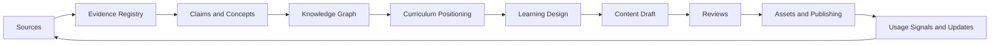

# ASEA Knowledge Operating System Vision

## Purpose

The ASEA Knowledge Operating System (KOS) is the governed system through which researched knowledge becomes traceable, teachable, reviewable, and maintainable software-engineering content. It prevents direct lesson writing by requiring validated evidence, concept models, curriculum placement, and learning design before content production.

## Scope

The KOS governs source collection, evidence records, knowledge extraction, claim validation, concept graphs, curriculum positioning, chapter specifications, asset production, review, publishing, and continuous improvement. It does not replace the [Repository Standard](../standards/repository-standard-v2.md), [Curriculum Standard](../standards/curriculum-standard-v2.md), [Volume Standard](../standards/volume-standard-v2.md), [Chapter Standard](../standards/chapter-standard-v2.md), or governance package.

## Operating Principles

1. Evidence precedes claims.
2. Validated concepts precede learning design.
3. Learning design precedes content production.
4. Every technical claim is traceable to independent evidence.
5. Authoritative registries are distinct from derived views.
6. Human reviewers own promotion decisions.
7. AI may accelerate work but may not act as evidence or approval authority.
8. Published history is immutable; corrections create new versions.
9. Accessibility, pedagogy, and technical correctness are co-equal quality dimensions.
10. Volatile knowledge carries an explicit review date.

## System Architecture

The authoritative path is Source Record → Evidence Record → Claim Record → Concept Record → Graph and Curriculum Mapping → Chapter Production Packet → versioned content. Dashboards, indexes, search results, and visual maps are derived views.

## Roles and Accountability

| Role | Accountable outcome |
|---|---|
| Knowledge Architect | Schemas, IDs, graph integrity, and authoritative registries |
| Researcher | Source discovery, source records, and evidence capture |
| Subject-Matter Reviewer | Claim accuracy, contradictions, and technical scope |
| Curriculum Architect | Prerequisites, progression, and outcome alignment |
| Learning Designer | Chapter sequence, activities, assessment, and accessibility |
| Content Engineer | Traceable content and reproducible assets |
| Repository Reviewer | Metadata, links, versions, and structural compliance |
| Release Owner | Publication decision, manifest, and rollback readiness |

No person may self-approve a Stable release without the independent control required by governance.

## Boundaries

The KOS does not authorize changes to canonical learning outcomes, chapter IDs, or Volume architecture. Those changes follow the existing decision, migration, review, and traceability standards. Community popularity never overrides authoritative evidence. Generated prose never becomes a source record.

## Success Criteria

The system is operational when a contributor can:

- locate the evidence for every material technical claim;
- reproduce a chapter from its production packet without hidden inputs;
- identify prerequisite and next concepts without graph cycles;
- determine content freshness and review ownership;
- regenerate derived assets without altering authoritative records;
- compare releases and recover the exact state of a published chapter.

## Document Map

The package proceeds from knowledge rules and research ([02](./02-knowledge-standards.md)–[06](./06-knowledge-extraction.md)), through graph and learning design ([07](./07-knowledge-graph.md)–[10](./10-content-assets.md)), and into governance, maintenance, automation, lifecycle, and contribution ([11](./11-review-process.md)–[18](./18-contributor-guide.md)).

## References

### Internal Standards

- [ASEA Governance Index](../standards/governance/09-governance-index.md)
- [ASEA Traceability Standard](../standards/governance/03-traceability-standard.md)

### Evidence Sources

- Association for Computing Machinery, IEEE Computer Society, and AAAI,
  *Computer Science Curricula 2023*, 2023:
  <https://csed.acm.org/>
