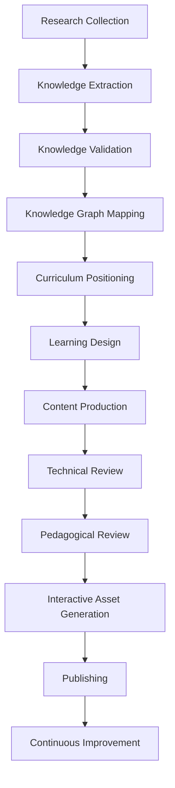

# ASEA Research Pipeline

## Purpose

This standard makes research a mandatory, auditable predecessor of chapter production.

## Lifecycle

Stages cannot be skipped. A failed gate returns work to the stage that owns the defect and records the reason.

## Stage Contracts

| Stage | Required input | Required output | Exit gate |
|---|---|---|---|
| Research Collection | Approved research brief | Verified source records and search log | Required tiers and topic boundaries covered |
| Knowledge Extraction | Active source records | Evidence, claim candidates, concept drafts | Provenance and locators complete |
| Knowledge Validation | Claims and evidence | Scores, contradiction report, decision | Publication thresholds met |
| Knowledge Graph Mapping | Approved concepts | Nodes and validated edges | IDs resolve and prerequisite graph is acyclic |
| Curriculum Positioning | Graph and outcomes | Chapter/module placement | Prerequisites and outcomes approved |
| Learning Design | Positioning record | Chapter production packet | Activities and assessment align to outcomes |
| Content Production | Approved packet | Traceable draft | No unsupported material claims |
| Technical Review | Draft and evidence | Technical review record | Decision is Approved |
| Pedagogical Review | Technically approved draft | Content review record | Decision is Approved |
| Interactive Asset Generation | Approved content specification | Reproducible assets and manifests | Accessibility and behavior checks pass |
| Publishing | Approved content and assets | Versioned release and manifest | Repository and final reviews pass |
| Continuous Improvement | Usage, defects, and source changes | Update requests | Requests triaged with owner and due date |

## Research Brief

Before collection, the Researcher creates a brief containing scope, exclusions, target outcomes, prerequisite concepts, terminology, required source tiers, search queries, volatile topics, expected deliverables, owners, and stop conditions. Scope expansion requires a recorded decision.

## Collection Protocol

1. Search Tier 1 and Tier 2 first.
2. Record successful and unsuccessful queries.
3. Capture canonical source identity before extracting claims.
4. Add Tier 3 evidence for operational practice and trade-offs.
5. Use Tier 4 only for discovery, failure reports, misconceptions, and community signals.
6. Stop when required claims have sufficient independent evidence and new sources no longer materially alter the concept model.

## Gate Ownership

Researchers cannot approve their own contested claims. Subject-matter reviewers own validation; curriculum architects own positioning; learning designers own chapter specifications; release owners require independent final review for Stable publication.
KOS stage labels describe work, not new Review enums. Every formal decision uses
the canonical mapping in [Review Process](./11-review-process.md).

## Rework and Exceptions

Missing authoritative evidence, contradictory specifications, unclear licensing, stale volatile sources, or unresolved graph cycles block promotion. An exception requires a decision record that states scope, expiry date, risk, and compensating control; it never permits fabricated evidence.

## Audit Evidence

Each pipeline run retains the brief, source log, extraction records, validation results, graph change set, production packet, review records, asset manifest, release manifest, and update backlog. IDs link these artifacts end to end.

## Definition of Done

The pipeline is complete only when its release is reproducible from retained inputs and every material content claim resolves to approved evidence.

## References

### Internal Standards

- [Source Priority](./04-source-priority.md)
- [Knowledge Extraction](./06-knowledge-extraction.md)
- [Review Process](./11-review-process.md)
- [Freeze Standard](../standards/governance/05-freeze-standard.md)
