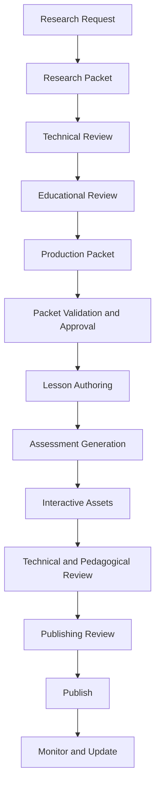

# ASEA Content Production Architecture

## Purpose

This document defines the end-to-end architecture used to transform validated
knowledge into reviewable, traceable, accessible, and publishable educational
assets.

## Scope

The architecture begins with a Research Request and ends with a versioned
publication. It governs research packets, production packets, lesson drafts,
assessments, interactive assets, reviews, and publishing evidence. This sprint
creates no educational content.

## Ownership

- Standards Index v2 and Repository Standard v2 remain the canonical governance
  authority.
- The KOS owns Sources, Evidence, Claims, Concepts, graph records, research
  briefs, and production packets.
- Curriculum and Chapter standards own Learning Outcomes, Assessments, Chapters,
  and learner-facing structure.
- This architecture orchestrates existing owners and creates no second source
  of truth.
- Knowledge Foundation state: Release Candidate 1; not frozen.
- Owner: Content Systems Architect.

## Content

### Production Lifecycle



No stage may infer approval from validation. A failed gate returns the artefact
to the earliest stage that owns the defect.

### Stage Contracts

| Stage | Required input | Required output | Exit gate |
| --- | --- | --- | --- |
| Research Request | Chapter ID, Outcomes, scope, owner | Approved Research Brief | Scope and source strategy accepted |
| Research Packet | Brief and canonical KOS records | Version-pinned packet index | Coverage, provenance, licensing, and terminology complete |
| Technical Review | Research Packet | Canonical Review record | Technical and evidence decision Approved |
| Educational Review | Technically reviewed packet | Learning-design findings | Outcome relevance and teachability Approved |
| Production Packet | Approved research inputs | Schema-valid CPP | All required mappings and output targets complete |
| Packet Approval | CPP and validation report | Approved Content Review | Exact CPP version Authorized |
| Lesson Authoring | Approved CPP | Traceable Chapter draft | Chapter Standard structure complete |
| Assessment Generation | Draft and assessment map | Governed assessment artefacts | Outcome coverage and answer integrity pass |
| Interactive Assets | Approved specifications | Assets and manifests | Accessibility, security, and reproducibility pass |
| Publishing Review | Complete release candidate | Approved Final Review and manifest | No open blocking findings |
| Publish | Approved release package | Immutable release record | Tag, manifest, and release versions reconcile |

### Authority Flow

```text
Canonical knowledge records
  -> Research Packet snapshot
  -> Approved Production Packet
  -> Learner-facing draft
  -> Review evidence
  -> Release manifest
```

Research and Production Packets are production inputs, not replacement
registries. Learner-facing prose may synthesize approved knowledge but must
retain Claim-to-Source navigation.

### Mandatory Gates

1. Research scope and source strategy are explicit.
2. Material Claims resolve to Evidence and Active Sources.
3. Concepts and Claims map to Learning Outcomes.
4. A Production Packet validates and receives an Approved Content Review.
5. The Chapter passes post-draft Technical and Pedagogical Reviews.
6. Assessments and assets pass their specialized gates.
7. Repository and Final Reviews approve the exact release candidate.

### Production Outputs

The architecture supports Lessons, Quizzes, Flashcards, Labs, Coding Exercises,
Interview Questions, Slides, Cheat Sheets, AI Mentor Knowledge, Articles, and
PDF Notes. Each output retains its canonical educational or KOS asset identity.

### Release Candidate Boundary

Knowledge Foundation RC1 may support research and Draft production. It does not
authorize publication of Claims whose review decision is `Changes Required`.
Publishing requires all applicable knowledge and content gates to be Approved.

## Validation

- All ten production stages have defined inputs, outputs, and exit gates.
- Authority remains with existing standards and registries.
- Research and production objects reuse existing KOS contracts.
- No lesson, assessment, lab, or interactive asset was generated.

## References

- [Research Engine](./research-engine.md)
- [Research Packet Standard](./research-packet-standard.md)
- [Production Packet Standard](./production-packet-standard.md)
- [Lesson Authoring Standard](./lesson-authoring-standard.md)
- [Production Workflows](./production-workflows.md)
- [KOS Research Pipeline](../knowledge-operating-system/03-research-pipeline.md)
- [KOS Chapter Production Specification](../knowledge-operating-system/09-chapter-specification.md)
