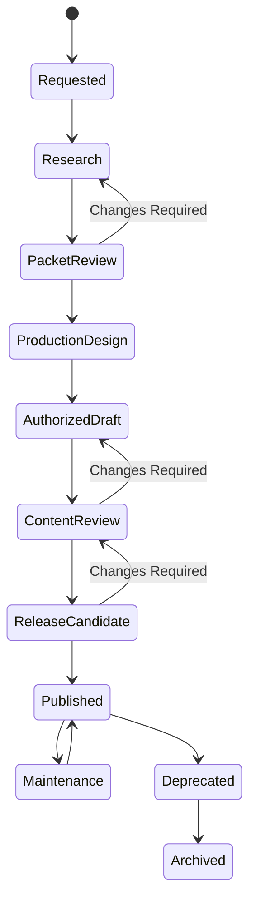

# ASEA Content Production Lifecycle

## Purpose

This document defines how production work progresses from request to published
maintenance and eventual archival.

## Scope

It covers Research Packets, CPPs, Lessons, assessments, assets, and publishing
packages. It maps workflow stages onto existing document status, review,
validation, release, and freeze records rather than creating a new metadata
enum.

## Ownership

- Repository Standard v2 owns document status.
- Review Standard owns decisions.
- Validation Standard owns validation results.
- KOS owns knowledge workflow states.
- Release and Freeze standards own publication boundaries.
- Owner: Content Operations Architect.

## Content

### Lifecycle Model



Diagram labels describe work. Front Matter continues to use only the canonical
document lifecycle:

```text
Draft -> Review -> Stable -> Deprecated -> Archived
```

### Stage Mapping

| Workflow stage | Document status | Required evidence | Promotion condition |
| --- | --- | --- | --- |
| Requested | Draft | Research Brief | Scope accepted |
| Research | Draft | Sources, Evidence, Claims, search log | Stop conditions met |
| Packet Review | Review | Validation and Research Reviews | Decisions Approved |
| Production Design | Draft | CPP | Schema and alignment pass |
| Authorized Draft | Draft | Approved pre-production Content Review | Exact CPP Authorized |
| Content Review | Review | Lesson, assessment, asset, and validation evidence | Required decisions Approved |
| Release Candidate | Review | Manifest and all prior approvals | Final Review Approved |
| Published | Stable | Immutable Release record and tag | Release complete |
| Maintenance | Stable with new Draft successor | Update Request and impact analysis | New version approved |
| Deprecated | Deprecated | Replacement and support window | Deprecation decision recorded |
| Archived | Archived | Retention and migration evidence | Archive conditions met |

### Rework

`Changes Required` sends work to the earliest affected owner:

- provenance defect to Research;
- knowledge defect to KOS validation;
- learning-design defect to CPP design;
- technical or pedagogical defect to authoring;
- asset defect to asset production;
- repository defect to release preparation.

Closed Review decisions are not edited; re-review uses a new Review ID.

### Version Transitions

- A Draft may change until submitted for Review.
- A material change during Review returns the document to Draft.
- Stable publication is immutable; maintenance opens a new Draft version.
- Deprecated content remains addressable and names a replacement.
- Archived content is historical and receives no new use.

### Update Triggers

- specification or official documentation change;
- Source freshness threshold reached;
- contradiction or correctness defect;
- accessibility, security, or licensing issue;
- broken code, link, or dependency;
- learner evidence showing a material misconception;
- curriculum or assessment revision;
- platform output-format change.

### Production Completion

A production run ends only when:

- all required outputs are in the manifest;
- every material Claim and Outcome trace resolves;
- validation passes;
- required Reviews are Approved;
- release ID, version, manifest, and tag reconcile;
- monitoring and maintenance owners are assigned.

## Validation

Every workflow stage maps to existing canonical status and evidence. No new
Front Matter lifecycle enum or freeze state is introduced.

## References

- [Production Architecture](./production-architecture.md)
- [Production Workflows](./production-workflows.md)
- [Production Governance](./production-governance.md)
- [KOS Content Lifecycle](../knowledge-operating-system/17-content-lifecycle.md)
- [Repository Standard v2](../standards/repository-standard-v2.md)
- [Review Standard](../standards/governance/02-review-standard.md)
