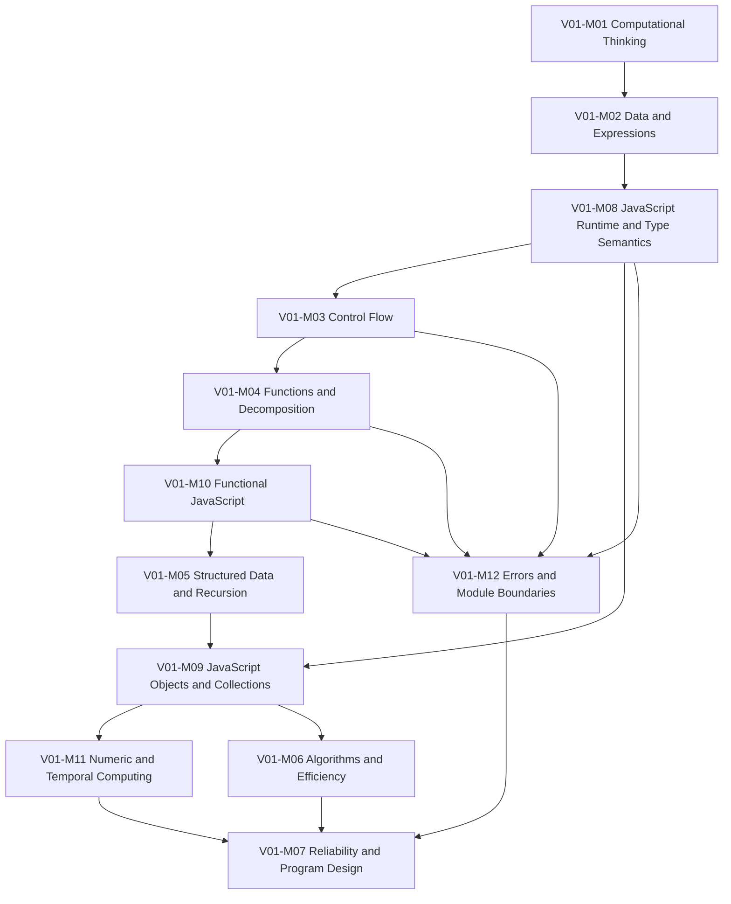

# Volume 01 Blueprint v2 Canonical Dependency Graph

## Purpose

Expose and validate the complete prerequisite graph for the 38-Chapter v2
canonical Blueprint.

## Scope

The graph derives direct edges from the canonical Chapter Registry. It does not
create relationships independently.

## Ownership

- The canonical Chapter Registry owns direct prerequisite relationships.
- This document owns the derived graph and validation evidence.
- The v1 Dependency Map remains immutable archived history.

## Content

### Module graph



### Validated Chapter topological order

```text
V01-C01 -> V01-C02 -> V01-C03 -> V01-C04 -> V01-C05 -> V01-C06
-> V01-C07 -> V01-C08 -> V01-C38 -> V01-C29 -> V01-C09 -> V01-C10
-> V01-C11 -> V01-C12 -> V01-C13 -> V01-C14 -> V01-C15 -> V01-C16
-> V01-C19 -> V01-C36 -> V01-C32 -> V01-C33 -> V01-C17 -> V01-C37
-> V01-C18 -> V01-C20 -> V01-C24 -> V01-C30 -> V01-C31 -> V01-C22
-> V01-C34 -> V01-C21 -> V01-C35 -> V01-C23 -> V01-C25 -> V01-C26
-> V01-C27 -> V01-C28
```

This is one valid topological order. Independent nodes may be scheduled in a
different order if all direct prerequisites remain satisfied.

### Graph contract

| Property | Result |
| --- | ---: |
| Chapter nodes | 38 |
| Module parents | 12 |
| Root prerequisite | `V00` |
| Missing Chapter parents | 0 |
| Missing dependency targets | 0 |
| Duplicate direct references | 0 |
| Orphan Chapters | 0 |
| Circular dependencies | 0 |
| Topologically ordered nodes | 38 |

### Dependency rules

- Every Chapter has one Module parent.
- `V01-C01` consumes the external `V00` prerequisite.
- Every other Chapter has at least one in-Volume prerequisite.
- Existing v1 edges are preserved.
- New edges connect JavaScript-specific competencies to existing concepts.
- `V01-C28` remains the terminal integration gate.
- Reverse children in the Chapter Registry must equal edges derived here.

## Validation

Kahn's topological-sort algorithm processed all 38 nodes. A processed count
equal to the node count proves that no cycle remains in the canonical graph.
All Chapter dependency tokens resolved to `V00` or one of the 38 Chapter IDs.

## References

- [Chapter Registry](./04-chapter-registry.md)
- [Learning Outcome Registry](./05-learning-outcome-registry.md)
- [Current v1 Dependency Map](../../docs/01-programming/dependency-map.md)
- [Validation Standard](../../docs/standards/governance/08-validation-standard.md)
