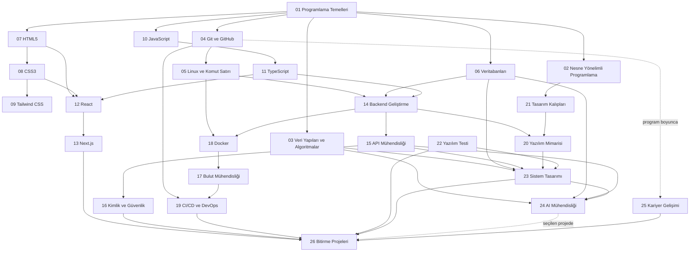

---
document_id: "ASEA-SD-ROAD-001"
document_type: "supporting-document"
supporting_document_type: "Roadmap"
title: "ASEA 26-Academy Curriculum Tree"
version: "0.1.0"
status: "Draft"
scope: "ASEA"
authority: "Informational"
owner: "Curriculum Architect"
language: "tr"
created_at: "2026-07-22"
updated_at: "2026-07-22"
sources:
  - "User-provided 26-academy curriculum outline"
  - "ACM/IEEE-CS/AAAI Computer Science Curricula 2023"
  - "IEEE Computer Society SWEBOK Guide V4.0"
  - "MDN Curriculum"
derived_from: []
---

# ASEA 26 Akademi Eğitim Ağacı

## Purpose

Bu belge, ASEA'nın 26 akademiden oluşan uçtan uca yazılım mühendisliği
müfredatını; akademi, modül, konu ve alt konu düzeyinde tanımlayan araştırma
taslağıdır. Amaç, sıfırdan başlayan bir öğrencinin tek bir tutarlı öğrenme
sistemi içinde profesyonel yazılım geliştirme yetkinliği kazanmasını sağlayacak
kapsamı görünür hâle getirmektir.

Bu belge henüz kanonik müfredat değildir. Mevcut Blueprint ve dondurulmuş
artefaktları değiştirmez. İnceleme, kapsam doğrulaması, saat tahmini ve resmî
onay sonrasında kontrollü müfredat göçüne girdi olabilir.

## Scope

Belge aşağıdakileri kapsar:

- 26 akademinin görevini, ön koşullarını ve mezuniyet çıktısını,
- her akademide işlenecek modülleri, konuları ve alt konuları,
- akademiler arası zorunlu ve önerilen bağımlılıkları,
- proje, değerlendirme ve portföy kanıtlarını,
- kaynak ve kalite stratejisini.

Belge; ayrıntılı ders metinlerini, quiz sorularını, laboratuvar yönergelerini,
AI Mentor istemlerini veya kanonik kimlik atamalarını içermez.

## Ownership

- Sahip: Curriculum Architect
- Teknik inceleme: Software Engineering ve alan uzmanları
- Eğitimsel inceleme: Learning Experience ve ölçme-değerlendirme uzmanları
- Onay makamı: Mevcut ASEA Standards v2 ve Governance Extension içinde
  tanımlanan yetkililer

## Content

### 1. Müfredat Tasarım Kararı

ASEA, “26 ayrı kurs” değil, birbirine izlenebilir biçimde bağlanan tek bir
öğrenme sistemi olmalıdır. Akademi numaraları katalog kimliğidir; öğrencinin
her zaman izleyeceği katı sıra değildir. Git, test, güvenlik, erişilebilirlik,
dokümantasyon ve kariyer çalışmaları tek bir dönemde başlayıp bitmez; program
boyunca artan derinlikle devam eden yatay yetkinliklerdir.

Hiçbir sabit müfredat tek başına herkese “uzman” unvanı garanti edemez.
ASEA'nın gerçekçi hedefi şudur:

1. Temelleri dış eğitim kaynağı gerektirmeyecek açıklıkta öğretmek.
2. Resmî belgeleri birincil kanıt ve ileri okuma kaynağı olarak kullanmayı
   öğretmek.
3. Bilgiyi quiz ile değil; çalışan kod, test, tasarım kararı, inceleme,
   dağıtım ve bakım kanıtlarıyla doğrulamak.
4. Bütün öğrencilerde geniş bir yazılım mühendisliği temeli oluşturmak.
5. Seçilen alanlarda uzun süreli proje ve gerçek dünya pratiğiyle T-biçimli
   uzmanlık geliştirmek.

Her konu şu öğrenme döngüsünden geçmelidir:

```text
Kavram → Zihinsel Model → Rehberli Örnek → Kontrollü Alıştırma
       → Laboratuvar → Bağımsız Görev → Değerlendirme → Yansıtma
       → Aralıklı Tekrar → Projede Kullanım → Kod İncelemesi
```

### 2. Makro Eğitim Ağacı



### 3. Önerilen Öğrenme Evreleri

| Evre | Akademiler | Ana sonuç |
|---|---|---|
| 1. Bilgisayımsal temel | 01, 04, 05 | Program yazma, sürümleme ve çalışma ortamı kullanma |
| 2. Program tasarımı ve veri | 02, 03, 06 | Modeller, algoritmalar ve kalıcı veri tasarlama |
| 3. Web platformu | 07–13 | Erişilebilir, tip güvenli ve üretime uygun web arayüzü |
| 4. Sunucu ve güvenlik | 14–16 | Güvenli servis, API ve kimlik sistemi geliştirme |
| 5. Teslimat altyapısı | 17–19 | Konteynerleme, bulut ve güvenilir teslimat |
| 6. Mühendislik derinliği | 20–23 | Mimari, kalıp, kalite ve ölçeklenebilir sistem tasarımı |
| 7. AI ve profesyonel kanıt | 24–26 | Güvenilir AI özellikleri, kariyer hazırlığı ve capstone |

Yazılım Testi Akademisi 22 numaralı katalog öğesi olsa da test pratiği Akademi
01'de başlar. Kariyer Gelişimi de son ayda başlayan bir CV çalışması değildir;
Akademi 04'ten itibaren GitHub, yazılı iletişim ve proje kanıtlarıyla sürer.

---

### Akademi 01 — Programlama Temelleri

**Amaç:** Bilgisayarın programları nasıl yürüttüğünü, problemlerin nasıl
modellenip algoritmaya dönüştürüldüğünü ve küçük programların nasıl güvenilir
biçimde üretildiğini öğretmek.

**Ön koşul:** Yok. Temel bilgisayar kullanımı yeterlidir.

#### Modül 01 — Bilgisayımsal Düşünme

- Programlama nedir?
  - program, talimat, girdi, işlem, çıktı ve durum
  - kaynak kod, programlama dili ve çalışan program ayrımı
  - otomasyonun olanakları ve sınırları
- Bilgisayar bir programı nasıl yürütür?
  - CPU, bellek, depolama ve giriş/çıkış aygıtları
  - derleme (compilation), yorumlama ve çalışma zamanı
  - makine kodu, işlem sırası ve program sayacı için sezgisel model
- Problem tanımlama
  - amaç, kapsam, kısıt ve kabul ölçütü
  - girdiler, çıktılar ve uç durumlar
  - belirsiz gereksinimleri soru ile netleştirme
- Ayrıştırma ve örüntü tanıma
  - büyük problemi alt problemlere bölme
  - tekrar eden davranışları bulma
  - soyutlama düzeyi seçme
- Algoritma gösterimi
  - doğal dil, sözde kod ve akış diyagramı
  - kuru çalıştırma, izleme tablosu ve durum değişimi
  - sonlanma ve temel doğruluk fikri

#### Modül 02 — Değerler, Türler ve İfadeler

- Değer ve veri türü
  - sayı, metin, mantıksal değer, boşluk ve tanımsızlık
  - ilkel ve bileşik değer ayrımı
  - türün izin verdiği işlemler
- Değişken ve bağlama
  - isim, değer, bellek ve durum için doğru zihinsel model
  - bildirim, ilk değer atama, yeniden atama ve yeniden bildirim
  - `let`, `const` ve tarihsel `var`
- Operatörler ve ifadeler
  - aritmetik, karşılaştırma ve mantıksal operatörler
  - öncelik, kısa devre değerlendirme ve yan etki
  - açık ve örtük tür dönüşümü
- Girdi, çıktı ve veri dönüşümü
  - kullanıcı girdisinin güvenilmezliği
  - doğrulama, normalleştirme ve biçimlendirme
  - ara değerlerle hesaplama hattı

#### Modül 03 — JavaScript Çalışma Zamanı ve Tür Davranışı

- ECMAScript ile host ortamının ayrımı
- Node.js ve tarayıcı konsolunda program çalıştırma
- dosya, süreç, standart giriş/çıkış ve çıkış kodu
- dinamik tür sistemi, `typeof` ve tür sorgulamanın sınırları
- truthy/falsy değerler, eşitlik ve dönüşüm tuzakları
- sayı gösterimi, kayan nokta hassasiyeti ve `NaN`

#### Modül 04 — Kontrol Akışı

- Boole mantığı ve doğruluk tabloları
- `if`, `else if`, `else` ile karar verme
- `switch` ve tablo güdümlü alternatifler
- `for`, `while` ve yineleme seçimi
- sayaç, biriktirici, bayrak ve nöbetçi örüntüleri
- iç içe kontrol akışı ve okunabilirlik maliyeti
- sonsuz döngü, sınır hatası ve erişilemeyen kod

#### Modül 05 — Fonksiyonlar ve Program Ayrıştırma

- fonksiyon sözleşmesi: ad, girdi, çıktı ve yan etki
- bildirim, ifade ve ok fonksiyonu
- parametre, argüman, varsayılan değer ve dönüş değeri
- kapsam, yaşam süresi ve isim çözümleme
- saf fonksiyon, yan etki ve referans şeffaflığına giriş
- sorumluluk ayrımı, tekrarın giderilmesi ve yeniden kullanım
- higher-order fonksiyon ve callback temeli
- closure ve durum kapsülleme için giriş modeli

#### Modül 06 — Yapılandırılmış Veri

- dizi, nesne, küme ve harita seçimi
- indeks, anahtar, özellik ve üyelik
- koleksiyon üzerinde arama, dönüştürme ve süzme
- mutasyon ile değişmez güncelleme arasındaki fark
- metin işleme: Unicode, kod noktası ve temel normalleştirme
- iç içe veri ve güvenli erişim
- JSON serileştirme sınırları
- özyineleme: taban durum, ilerleme ve çağrı yığını

#### Modül 07 — Sayısal ve Zamansal Güvenilirlik

- tamsayı ve kayan nokta davranışı
- yuvarlama, hassasiyet ve para hesabı
- rastgelelik ve tekrar üretilebilirlik
- tarih, saat, zaman dilimi ve UTC
- süre ile takvim zamanının ayrımı
- yerelleştirilmiş sayı ve tarih gösterimi

#### Modül 08 — Temel Algoritmalar

- doğrusal ve ikili arama
- seçme, ekleme ve birleştirmeli sıralama fikri
- zaman ve alan karmaşıklığına giriş
- en iyi, ortalama ve en kötü durum
- doğruluk, okunabilirlik ve performans ödünleşimi
- küçük girdide basit çözüm; büyümede ölçüm

#### Modül 09 — Hatalar, Modüller ve Güvenilirlik

- sözdizimi, çalışma zamanı ve mantık hatası
- istisna fırlatma, yakalama ve anlamlı hata mesajı
- hata türü ve özel hata tasarımı
- ES modülleri, dışa/içe aktarma ve sınır tasarımı
- hata ayıklama: hipotez, yeniden üretim, daraltma ve doğrulama
- otomatik test: örnek, sınır ve hata durumu
- temiz kod, adlandırma ve küçük refaktör
- gereksinimden çalışan teslimata izlenebilirlik

#### Akademi 01 uygulama ve mezuniyet kanıtı

- En az 40 kısa alıştırma, 12 hata ayıklama görevi ve 9 laboratuvar
- Terminal tabanlı kişisel bütçe veya görev takip uygulaması
- Gereksinim, sözde kod, test, README ve Git geçmişi
- Öğrencinin çözüm kararlarını sözlü ve yazılı açıklaması

**Çıkış yetkinliği:** Öğrenci küçük bir problemi bağımsız çözümler, çalışan
JavaScript programına dönüştürür, test eder, hatalarını ayıklar ve çözümünü
açıklayabilir.

---

### Akademi 02 — Nesne Yönelimli Programlama

**Amaç:** Nesne yönelimli programlamayı (Object-Oriented Programming) sınıf
sözdizimi ezberi olarak değil; sorumluluk, değişmez koşul ve davranış modeli
tasarlama yöntemi olarak öğretmek.

**Ön koşul:** Akademi 01; TypeScript bölümleri için Akademi 11'in temel türleri.

#### Modül 01 — Paradigma ve Nesne Modeli

- prosedürel, nesne yönelimli ve fonksiyonel yaklaşımın karşılaştırılması
- nesne; kimlik, durum ve davranış
- sınıf ile örnek ayrımı
- mesaj gönderme, metot çağrısı ve dinamik gönderim
- gerçek dünyayı bire bir kopyalamanın sakıncaları

#### Modül 02 — Sınıflar ve Sorumluluklar

- alan, özellik, metot ve kurucu
- `this` bağlamı ve nesne yaşam döngüsü
- değişmez koşulların kurucuda korunması
- tell-don't-ask ve davranışın doğru yerde tutulması
- veri sınıfı kokusu ve anemik model

#### Modül 03 — Kapsülleme ve Soyutlama

- bilgi gizleme ve değişim yüzeyini azaltma
- erişim seviyeleri ve API sınırı
- soyutlama, sözleşme ve uygulama ayrımı
- arayüzler, soyut sınıflar ve davranış protokolleri
- sızdıran soyutlama ve gereksiz soyutlama

#### Modül 04 — Kalıtım, Alt Tür ve Çok Biçimlilik

- is-a ilişkisi ve alt tür sözleşmesi
- override, overload ve shadowing ayrımı
- Liskov ikame ilkesi
- kalıtım hiyerarşisinin kırılganlığı
- çok biçimli tasarım ve koşul dallarını azaltma

#### Modül 05 — Nesne İlişkileri

- association, aggregation ve composition
- has-a yaklaşımı ve kalıtım yerine bileşim
- bağımlılık yönü ve bağımlılık enjeksiyonu
- entity, value object, kimlik ve eşitlik
- sahiplik, yaşam süresi ve kaynak yönetimi

#### Modül 06 — SOLID ve Tasarım Kalitesi

- tek sorumluluk
- açık/kapalı
- Liskov ikame
- arayüz ayrımı
- bağımlılıkların ters çevrilmesi
- bağlaşım, uyum ve değişim maliyeti

#### Modül 07 — Tip Güvenli Nesne Tasarımı

- generic sınıflar ve koleksiyonlar
- union ve composition ile alternatif modelleme
- hata durumlarını türlerle ifade etme
- null güvenliği ve geçersiz durumları temsil edilemez kılma
- immutable nesneler ve kontrollü durum geçişi

#### Modül 08 — Modelleme, Test ve Refaktör

- UML sınıf, nesne ve sıra diyagramlarının uygun kullanımı
- test edilebilir nesne sınırları ve test doubles
- kod kokuları: god object, feature envy, shotgun surgery
- sorumluluk taşıma, metot çıkarma ve nesne parçalama
- OOP'nin uygun olmadığı durumlar

#### Akademi 02 uygulama ve mezuniyet kanıtı

- Alan modeli: kütüphane, rezervasyon veya sipariş sistemi
- UML, değişmez koşullar, birim testleri ve refaktör günlüğü
- Kalıtım ve bileşim için gerekçeli tasarım karşılaştırması

**Çıkış yetkinliği:** Öğrenci davranış odaklı, kapsüllenmiş ve test edilebilir
nesne modelleri kurar; seçtiği tasarımın maliyetini açıklayabilir.

---

### Akademi 03 — Veri Yapıları ve Algoritmalar

**Amaç:** Veri düzenleme, algoritma doğruluğu ve kaynak maliyetlerini teorik ve
uygulamalı olarak öğretmek; ezberlenmiş mülakat çözümleri yerine aktarılabilir
problem çözme becerisi geliştirmek.

**Ön koşul:** Akademi 01; önerilen Akademi 02.

#### Modül 01 — Matematiksel ve Analitik Temel

- kümeler, bağıntılar, fonksiyonlar ve mantık
- toplamlar, logaritma ve büyüme oranları
- ispat fikri: doğrudan, çelişki ve tümevarım
- algoritma sözleşmesi, değişmez ve sonlanma
- RAM maliyet modeli ve deneysel ölçüm sınırları

#### Modül 02 — Karmaşıklık Analizi

- zaman ve alan karmaşıklığı
- Big O, Big Omega ve Big Theta
- en iyi, ortalama, en kötü ve amortize analiz
- iç içe döngü, özyineleme bağıntısı ve Master yöntemi giriş
- pratik performans, sabit çarpan ve bellek yerelliği

#### Modül 03 — Doğrusal Yapılar

- sabit ve dinamik diziler
- bağlı liste: tek, çift ve dairesel
- yığın, kuyruk ve deque
- iterator ve dolaşım sözleşmesi
- kullanım senaryosu ve ödünleşim matrisi

#### Modül 04 — Anahtarlı Yapılar

- hash fonksiyonu ve dağılım
- çakışma çözümü
- yük faktörü, yeniden boyutlandırma ve amortize maliyet
- map, set ve multiset
- eşitlik, kimlik ve değiştirilebilir anahtar riski

#### Modül 05 — Ağaçlar ve Öncelik Yapıları

- ağaç terminolojisi ve dolaşım
- ikili arama ağacı
- dengeli ağaçların amacı
- heap ve priority queue
- trie ve prefix arama
- union-find ve ayrık kümeler

#### Modül 06 — Graflar

- yönlü/yönsüz, ağırlıklı/ağırlıksız grafik
- adjacency list ve matrix
- BFS ve DFS
- topolojik sıralama ve döngü tespiti
- en kısa yol: Dijkstra ve Bellman-Ford sınırları
- minimum spanning tree fikri

#### Modül 07 — Arama ve Sıralama

- doğrusal ve ikili arama
- selection, insertion, merge, quick ve heap sort
- kararlılık, yerinde çalışma ve karşılaştırma sınırı
- veri dağılımına göre sıralama seçimi
- dilin yerleşik sıralamasını doğru kullanma

#### Modül 08 — Algoritma Tasarım Teknikleri

- brute force ve sistematik arama
- divide and conquer
- greedy seçim ve doğruluk koşulları
- dynamic programming: durum, geçiş ve memoization
- backtracking ve budama
- sliding window, two pointers ve prefix sum

#### Modül 09 — Dizge ve Gerçek Dünya Algoritmaları

- Unicode farkındalığıyla dize işleme
- pattern matching giriş
- arama indeksleri ve autocomplete
- rate limiter, cache ve scheduler içinde veri yapıları
- performans profilleme ve benchmark yanılsamaları

#### Akademi 03 uygulama ve mezuniyet kanıtı

- Veri yapılarının sıfırdan uygulanması ve özellik tabanlı testleri
- En az 80 kademeli problem; her çözümde doğruluk ve karmaşıklık açıklaması
- Rota planlama, arama motoru indeksi veya görev zamanlayıcı projesi

**Çıkış yetkinliği:** Öğrenci problem yapısına uygun veri yapısı ve algoritmayı
seçer, doğruluğunu savunur ve maliyetini analiz eder.

---

### Akademi 04 — Git ve GitHub

**Amaç:** Sürüm kontrolünü komut ezberi olmaktan çıkarıp güvenli değişiklik,
işbirliği, inceleme ve açık kaynak çalışma sistemi olarak öğretmek.

**Ön koşul:** Akademi 01 ile paralel başlayabilir.

#### Modül 01 — Git Zihinsel Modeli

- çalışma ağacı, staging area ve repository
- blob, tree, commit ve object database
- commit DAG'ı, parent ilişkisi ve içerik adresleme
- branch, tag, `HEAD` ve ref
- dağıtık sürüm kontrolünün sonuçları

#### Modül 02 — Günlük Yerel İş Akışı

- kurulum, kimlik ve güvenli yapılandırma
- `init`, `clone`, `status`, `add`, `commit`
- `diff`, `log`, `show` ve geçmiş okuma
- `.gitignore`, dosya yaşam döngüsü ve gizli bilgi riski
- atomik commit ve Conventional Commits

#### Modül 03 — Değişikliği Geri Alma

- `restore`, `revert` ve `reset` farkı
- amend ve interaktif rebase
- reflog ile kurtarma
- paylaşılmış geçmişi yeniden yazmanın riski
- güvenli kurtarma senaryoları

#### Modül 04 — Branch ve Birleştirme

- branch oluşturma ve izleme
- fast-forward ve three-way merge
- merge conflict okuma ve çözme
- rebase ve cherry-pick
- stash ve geçici çalışma

#### Modül 05 — Uzak Repository ve GitHub

- remote, fetch, pull ve push
- upstream tracking ve fork modeli
- SSH/HTTPS kimlik doğrulaması
- issues, labels, milestones ve project boards
- pull request, draft PR ve code review
- protected branch, CODEOWNERS ve merge politikaları

#### Modül 06 — Ekip ve Açık Kaynak Pratiği

- trunk-based development, GitHub Flow ve sürüm dalları
- küçük PR, inceleme adabı ve geri bildirim verme
- semantic versioning, tag, release ve changelog
- CONTRIBUTING, issue/PR template ve lisans
- imzalı commit/tag ve secret scanning
- temel GitHub Actions entegrasyonu

#### Akademi 04 uygulama ve mezuniyet kanıtı

- Gerçek çatışma çözümü, geri alma ve kurtarma laboratuvarları
- En az iki kişilik fork/PR/review simülasyonu
- Belgelenmiş ve sürümlenmiş açık kaynak mini proje

**Çıkış yetkinliği:** Öğrenci değişiklik geçmişini güvenle yönetir, ekip iş
akışına katılır ve incelenebilir katkı üretir.

---

### Akademi 05 — Linux ve Komut Satırı

**Amaç:** Öğrencinin yerel geliştirme, sunucu yönetimi ve üretim sorun çözme
için Linux sistemlerini anlayıp güvenli biçimde kullanmasını sağlamak.

**Ön koşul:** Akademi 01 ve 04.

#### Modül 01 — İşletim Sistemi Temeli

- kernel, user space, system call ve process
- CPU zamanlama, bellek ve sanal bellek için zihinsel model
- dosya tanımlayıcı, standart akışlar ve exit code
- dağıtım, paket, shell ve terminal ayrımı
- yardım sistemi: `man`, `info`, `--help`

#### Modül 02 — Dosya Sistemi ve Metin İşleme

- mutlak/göreli yol ve Linux dizin düzeni
- dosya, dizin, hard link ve symbolic link
- `pwd`, `ls`, `cd`, `cp`, `mv`, `rm`, `mkdir`
- `cat`, `less`, `head`, `tail`, `wc`, `sort`, `uniq`
- `grep`, `find`, `xargs`, `sed` ve `awk`
- yönlendirme, pipe ve command substitution

#### Modül 03 — Shell ve Bash

- quoting, escaping, globbing ve expansion
- environment variable ve process environment
- alias, function ve shell başlangıç dosyaları
- shell script yapısı, koşul, döngü ve fonksiyon
- strict mode, hata yönetimi ve taşınabilirlik
- ShellCheck ve güvenli script yazımı

#### Modül 04 — Kullanıcı, Yetki ve Güvenlik

- kullanıcı, grup, UID/GID ve sahiplik
- read/write/execute ve octal izinler
- umask, sticky bit, setuid/setgid ve ACL
- `sudo`, en az ayrıcalık ve audit izi
- SSH anahtarları, agent ve güvenli uzaktan erişim

#### Modül 05 — Süreç, Servis ve Günlükler

- `ps`, `top`, `pgrep`, `kill` ve signal
- foreground/background, jobs, `nohup` ve session
- systemd unit, service lifecycle ve journal
- cron/timer ve zamanlanmış görev
- log döndürme ve temel olay incelemesi

#### Modül 06 — Depolama ve Paket Yönetimi

- disk, partition, filesystem ve mount
- disk/inode kullanımı ve izin kaynaklı hatalar
- archive ve sıkıştırma
- apt/dnf türü paket sistemleri
- bağımlılık, repository ve güncelleme güvenliği
- yedekleme ve geri yükleme temeli

#### Modül 07 — Ağ ve Sorun Giderme

- IP, subnet, port, socket, DNS ve route
- TCP/UDP ve istemci-sunucu modeli
- `ip`, `ss`, `ping`, `traceroute`, `dig`, `curl`
- firewall ve dinleyen servis
- süreç, ağ, disk, bellek ve izin üzerinden sistematik teşhis
- performans gözlemi ve kaynak darboğazı

#### Akademi 05 uygulama ve mezuniyet kanıtı

- Güvenli kullanıcı ve SSH yapılandırılan Linux sunucusu
- systemd ile yönetilen uygulama, log ve yedekleme scripti
- Bilerek bozulan servis için teşhis ve olay raporu

**Çıkış yetkinliği:** Öğrenci Linux ortamında otomasyon yapar, servis yönetir ve
temel üretim sorunlarını kanıta dayalı biçimde teşhis eder.

---

### Akademi 06 — Veritabanları

**Amaç:** Veriyi doğru modelleme, güvenilir saklama, sorgulama, bütünlük,
performans ve operasyon kararlarını öğretmek.

**Ön koşul:** Akademi 01; önerilen 03 ve 05.

#### Modül 01 — Veri ve Veritabanı Sistemleri

- kalıcı veri, dosya sistemi ve DBMS ayrımı
- ilişkisel, belge, key-value, graph ve zaman serisi modelleri
- OLTP ile OLAP ayrımı
- schema, catalog, table, row ve column
- doğru veri modelini seçme ölçütleri

#### Modül 02 — İlişkisel Modelleme

- entity, attribute, relationship ve cardinality
- primary, foreign, unique ve composite key
- domain, null ve constraint
- kavramsal, mantıksal ve fiziksel model
- ER diyagramı ve gereksinimden şemaya geçiş

#### Modül 03 — SQL Temelleri

- DDL, DML, DQL ve transaction control
- `CREATE`, `ALTER`, `INSERT`, `UPDATE`, `DELETE`
- `SELECT`, filtreleme, sıralama ve sınırlama
- aggregate, grouping ve `HAVING`
- inner/outer/cross join
- subquery, CTE ve set işlemleri

#### Modül 04 — İleri SQL

- window function ve analitik sorgu
- view ve materialized view
- recursive CTE
- function, trigger ve kullanım sınırları
- zaman, JSON ve full-text veri sorgulama
- güvenli parametrik sorgu

#### Modül 05 — Normalizasyon ve Şema Evrimi

- functional dependency
- 1NF, 2NF, 3NF ve BCNF
- denormalizasyonun ölçülmüş gerekçeleri
- migration, seed ve rollback
- geriye uyumlu şema değişikliği
- veri kalitesi ve constraint stratejisi

#### Modül 06 — İşlemler ve Eşzamanlılık

- ACID özellikleri
- transaction sınırı ve birim çalışma
- isolation level ve anomaliler
- MVCC, lock ve deadlock
- optimistic/pessimistic concurrency
- idempotency ve tutarlılık sınırları

#### Modül 07 — İndeks ve Sorgu Performansı

- B-tree, hash ve özel indeksler
- selectivity, cardinality ve composite index sırası
- query planner, statistics ve `EXPLAIN`
- N+1 sorgu problemi
- ölçüm, yavaş sorgu günlüğü ve optimizasyon süreci
- indeks yazma/depolama maliyeti

#### Modül 08 — PostgreSQL ve MySQL Uygulaması

- kullanıcı, rol, database ve schema yönetimi
- veri türleri ve motor özellikleri
- bağlantı havuzu ve oturum yönetimi
- backup, restore ve point-in-time recovery
- replication ve high availability temeli
- PostgreSQL/MySQL davranış farklarını belgeyle doğrulama

#### Modül 09 — NoSQL, MongoDB ve Redis

- belge modelleme, embedding ve referencing
- MongoDB index, aggregation ve transaction sınırları
- Redis veri yapıları, TTL ve cache kullanımı
- cache-aside, invalidation ve stampede
- eventual consistency ve veri sahipliği
- NoSQL'u varsayılan değil gereksinime göre seçme

#### Modül 10 — Operasyon, Güvenlik ve Ölçek

- kimlik doğrulama, yetkilendirme ve least privilege
- şifreleme, hassas veri ve audit
- connection, capacity ve storage planlama
- partitioning, sharding ve replication trade-off'ları
- izleme, bakım, vacuum/compaction kavramları
- felaket kurtarma testi ve veri saklama politikası

#### Akademi 06 uygulama ve mezuniyet kanıtı

- Gereksinimden ilişkisel şema, migration ve seed üretimi
- Zayıf sorguyu `EXPLAIN` kanıtıyla optimize etme
- Yedekleme/geri yükleme tatbikatı ve veri kaybı analizi
- Çok kullanıcılı ürün için PostgreSQL tabanlı veri katmanı

**Çıkış yetkinliği:** Öğrenci veri modelini gerekçelendirir, güvenilir SQL
yazar, işlem ve indeks davranışını açıklar ve veritabanını işletir.

---

### Akademi 07 — HTML5 ve Web Belge Mühendisliği

**Amaç:** HTML'i görsel yerleşim aracı değil; anlam, erişilebilirlik,
etkileşim ve birlikte çalışabilirlik sağlayan web belge dili olarak öğretmek.

**Ön koşul:** Akademi 01'in ilk modülleri; Akademi 04 önerilir.

#### Modül 01 — Web ve Belge Temeli

- internet ile web ayrımı
- URL, HTTP isteği/yanıtı ve tarayıcı işleme hattı
- doctype, `html`, `head` ve `body`
- karakter kodlama, dil ve viewport metadata
- DOM ağacı ve kaynak sırası

#### Modül 02 — Anlamsal İçerik

- başlık hiyerarşisi, paragraf ve vurgu
- liste, açıklama listesi, alıntı ve kod
- `header`, `nav`, `main`, `article`, `section`, `aside`, `footer`
- zaman, adres ve iletişim anlamı
- div/span kullanım sınırları

#### Modül 03 — Bağlantı, Medya ve Gömülü İçerik

- güvenli ve erişilebilir bağlantılar
- görüntü, alternatif metin, figure ve caption
- responsive image: `srcset`, `sizes`, `picture`
- audio, video, track ve caption
- iframe güvenliği, sandbox ve third-party içerik
- SVG ile canvas kullanım sınırları

#### Modül 04 — Tablolar ve Formlar

- veri tablosu, caption, scope ve ilişkilendirme
- form, label, fieldset ve legend
- input türleri, textarea, select ve button
- yerleşik doğrulama, hata mesajı ve autocomplete
- dosya yükleme ve form gönderim semantiği
- istemci doğrulamasının güvenlik sınırı

#### Modül 05 — Erişilebilirlik

- erişilebilir ad, rol, durum ve semantic tree
- klavye kullanımı, odak sırası ve görünür odak
- landmark, heading ve skip link
- native HTML önce; ARIA yalnız gerektiğinde
- ekran okuyucu ve otomatik test sınırları
- WCAG algılanabilirlik, işletilebilirlik, anlaşılabilirlik ve sağlamlık

#### Modül 06 — Metadata, Kalite ve Performans

- title, description, canonical URL ve social metadata
- structured data ve arama motoru sınırları
- progressive enhancement
- HTML validation ve tarayıcı DevTools
- lazy loading, resource hints ve medya performansı
- güvenlik, gizlilik ve üçüncü taraf içerik değerlendirmesi

#### Akademi 07 uygulama ve mezuniyet kanıtı

- Yalnız HTML ile çok sayfalı erişilebilir kurumsal site
- Klavye, ekran okuyucu, validator ve Lighthouse bulguları
- Form ve veri tablosu için manuel erişilebilirlik raporu

**Çıkış yetkinliği:** Öğrenci JavaScript veya CSS olmadan dahi anlamlı,
erişilebilir ve standartlara uygun web belgeleri üretir.

---

### Akademi 08 — CSS3 ve Arayüz Yerleşimi

**Amaç:** Cascade, layout ve responsive tasarımın temel modellerini kullanarak
bakımı yapılabilir, erişilebilir ve performanslı arayüzler geliştirmek.

**Ön koşul:** Akademi 07.

#### Modül 01 — Cascade ve Stil Hesaplama

- stylesheet ekleme ve author/user/user-agent kaynakları
- selector, combinator ve pseudo-class/pseudo-element
- specificity, source order ve inheritance
- cascade origin, importance ve cascade layer
- computed, used ve actual value
- browser DevTools ile cascade teşhisi

#### Modül 02 — Değerler ve Kutu Modeli

- mutlak/göreli birimler ve viewport/container birimleri
- custom properties, fallback ve `calc()`
- content, padding, border ve margin
- `box-sizing`, overflow ve intrinsic sizing
- block, inline ve formatting context
- margin collapsing

#### Modül 03 — Tipografi ve Görsel Sistem

- font ailesi, fallback, web font ve yükleme
- font size, line height, measure ve okunabilirlik
- color spaces, contrast ve transparency
- background, border, shadow ve gradient
- design token ve görsel hiyerarşi
- forced colors ve yüksek kontrast

#### Modül 04 — Konumlandırma ve Katmanlama

- normal flow, relative, absolute, fixed ve sticky
- containing block
- z-index ve stacking context
- floats ve güncel kullanım alanı
- overflow, clipping ve scroll davranışı

#### Modül 05 — Flexbox ve Grid

- flex axis, sizing, wrapping ve alignment
- flexible length ve min-content tuzakları
- grid tracks, lines, areas ve implicit grid
- `minmax`, `auto-fit`, `auto-fill` ve subgrid
- bir boyutlu/iki boyutlu layout seçimi
- içerik sırası ile görsel sıra arasındaki erişilebilirlik

#### Modül 06 — Responsive ve Adaptif Tasarım

- mobile-first ve içerik temelli breakpoint
- media query ve kullanıcı tercihleri
- container query
- responsive typography ve spacing
- aspect ratio, object fit ve responsive media
- zoom, reflow ve dokunma hedefleri

#### Modül 07 — Hareket ve Etkileşim

- transform, transition ve animation
- keyframes, timing ve compositing
- `prefers-reduced-motion`
- hover, focus, active ve disabled durumları
- hareketin kullanılabilirlik ve performans sınırları

#### Modül 08 — CSS Mimarisi ve Kalite

- component scope, utility ve composition yaklaşımları
- BEM, CSS Modules ve cascade layers karşılaştırması
- reset/normalize ve temel stil sözleşmesi
- tekrar, specificity savaşı ve dead CSS
- render performansı ve layout shift
- visual regression ve cross-browser test

#### Akademi 08 uygulama ve mezuniyet kanıtı

- Tasarım dosyasından responsive çok sayfalı arayüz
- Grid/flexbox kararları ve breakpoint gerekçeleri
- Erişilebilirlik, responsive, browser ve görsel regresyon testleri

**Çıkış yetkinliği:** Öğrenci cascade sorunlarını teşhis eder ve farklı ekran,
girdi ve kullanıcı tercihlerine uyum sağlayan CSS sistemi kurar.

---

### Akademi 09 — Tailwind CSS

**Amaç:** Utility-first yaklaşımı, tasarım token'ları ve bileşen bileşimiyle
tutarlı arayüz üretmek; framework kullanımını CSS bilgisinin yerine koymamak.

**Ön koşul:** Akademi 07 ve 08.

#### Modül 01 — Utility-First Zihinsel Modeli

- utility sınıfı, tasarım kısıtı ve composition
- klasik CSS, CSS Modules ve utility yaklaşımı karşılaştırması
- kurulum, içerik tarama ve üretim hattı
- sınıf sırası, cascade ve conflict davranışı
- Tailwind'in uygun/uygun olmadığı bağlamlar

#### Modül 02 — Temel Tasarım Sistemi

- spacing, sizing, color ve typography ölçekleri
- breakpoint ve responsive variant
- flexbox, grid, position ve container
- border, shadow, radius ve state stilleri
- design token ile keyfi değer arasındaki seçim

#### Modül 03 — Etkileşim ve Varyantlar

- hover, focus-visible, active ve disabled
- group, peer ve descendant state
- dark mode ve color scheme
- reduced motion, contrast ve forced color
- form ve validation durumları

#### Modül 04 — Tema ve Bileşen Mimarisi

- tema değişkenleri ve marka token'ları
- ortak bileşen API'si ve variant tasarımı
- class composition ve koşullu sınıflar
- component extraction ve premature abstraction
- headless component ile stil katmanı ayrımı

#### Modül 05 — Üretim Kalitesi

- build çıktısı ve kullanılmayan sınıflar
- dinamik class adı üretme riski
- eklenti ve özel utility sınırları
- erişilebilirlik, görsel regresyon ve responsive test
- framework sürüm geçişi ve resmi migration rehberleri

#### Akademi 09 uygulama ve mezuniyet kanıtı

- Token tabanlı mini design system
- Açık/koyu tema ve erişilebilir durumlara sahip component library
- Aynı sayfanın saf CSS/Tailwind bakım ve çıktı karşılaştırması

**Çıkış yetkinliği:** Öğrenci Tailwind ile tutarlı ve erişilebilir bir arayüz
sistemi kurar, yaptığı soyutlama ve framework tercihlerini savunabilir.

---

### Akademi 10 — Modern JavaScript

**Amaç:** ECMAScript dilini, tarayıcı çalışma ortamını, asenkron yürütmeyi ve
uygulama tasarım kalıplarını üretim düzeyinde öğretmek.

**Ön koşul:** Akademi 01, 04 ve web uygulamaları için 07–08.

#### Modül 01 — Dil ve Çalışma Ortamı

- ECMAScript specification, engine ve host ayrımı
- parse, execution context ve call stack
- strict mode ve module mode
- lexical grammar, statement ve expression
- tarayıcı, Node.js ve runtime API farkları

#### Modül 02 — Türler ve Değer Semantiği

- primitive ve object değerler
- `undefined`, `null`, `NaN`, `Symbol` ve `BigInt`
- coercion, equality ve sameness algoritmaları
- pass-by-value ve object reference zihinsel modeli
- mutability, copying ve structured clone

#### Modül 03 — Bağlamalar ve Kapsam

- `let`, `const`, `var` ve declaration instantiation
- lexical environment ve environment record
- global, function, module ve block scope
- hoisting teriminin sınırları ve temporal dead zone
- shadowing, redeclaration ve closure

#### Modül 04 — Fonksiyonlar

- declaration, expression, arrow ve method
- parameter, rest, spread ve default
- `this`, call-site, `bind`, `call` ve `apply`
- closure, factory ve private state
- higher-order function, composition ve partial application
- generator ve iterator protokolü

#### Modül 05 — Nesneler ve Prototipler

- property descriptor, getter/setter ve enumeration
- prototype chain ve delegation
- class syntax ve private fields
- inheritance/composition trade-off'u
- `Map`, `Set`, `WeakMap` ve `WeakSet`
- proxy/reflection için kullanım ve riskler

#### Modül 06 — Koleksiyon ve Veri İşleme

- array iteration ve mutating/non-mutating metotlar
- `map`, `filter`, `reduce`, `some`, `every`, `find`
- iterable ve async iterable
- string, Unicode ve regular expression
- JSON, serialization ve circular reference
- date/time ile `Intl`

#### Modül 07 — DOM ve Web API'leri

- DOM seçme, oluşturma ve güncelleme
- event propagation, delegation ve default action
- form, constraint validation ve custom validity
- fetch, Request/Response, headers ve streams
- storage, URL, history ve clipboard
- Web Worker ve ana iş parçacığı sorumluluğu

#### Modül 08 — Asenkron JavaScript

- event loop, task ve microtask
- callback ve hata yayılımı
- Promise state, chaining ve combinator'lar
- async/await ve paralellik kontrolü
- cancellation, timeout ve `AbortController`
- race condition, retry, backoff ve idempotency

#### Modül 09 — Modüller ve Uygulama Tasarımı

- ESM import/export, live binding ve cycle
- package, dependency ve semantic versioning
- boundary, adapter ve dependency inversion
- state management ve immutable update
- error taxonomy ve recovery
- browser security: XSS, same-origin, CORS ve CSP girişi

#### Modül 10 — Performans, Bellek ve Kalite

- garbage collection için ulaşılabilirlik modeli
- memory leak kaynakları ve DevTools profiling
- event listener, timer ve closure yaşam süresi
- render, network ve bundle performansı
- unit/integration/browser testing
- lint, format, debug ve source map

#### Akademi 10 uygulama ve mezuniyet kanıtı

- Framework kullanmadan modüler tek sayfa uygulaması
- Fetch, iptal, hata durumu, erişilebilir DOM ve kalıcı state
- Birim, entegrasyon ve tarayıcı testleri; performans profili

**Çıkış yetkinliği:** Öğrenci JavaScript'in dil ve runtime davranışını açıklar,
asenkron ve modüler web uygulamalarını güvenilir biçimde geliştirir.

---

### Akademi 11 — TypeScript

**Amaç:** Statik tür sistemini yalnız hata susturmak için değil; alan modeli,
API sözleşmesi, güvenli refaktör ve ekip iletişimi için kullanmayı öğretmek.

**Ön koşul:** Akademi 10; önerilen Akademi 02.

#### Modül 01 — TypeScript Zihinsel Modeli

- compile-time ile runtime ayrımı
- structural typing
- type inference ve contextual typing
- transpilation, type erasure ve source map
- `tsconfig`, strict mode ve proje sınırları

#### Modül 02 — Temel Tür Modelleme

- primitive, literal, tuple ve array
- object type, optional/readonly property
- type alias ve interface
- union, intersection ve discriminated union
- `null`, `undefined`, `unknown`, `never` ve `any`

#### Modül 03 — Daraltma ve Güvenli Erişim

- control-flow analysis
- `typeof`, `instanceof`, `in` ve equality narrowing
- user-defined type guard ve assertion function
- exhaustive checking
- type assertion riskleri ve `satisfies`

#### Modül 04 — Fonksiyon ve Generic Tasarımı

- parameter/return türü ve function type
- optional, default ve rest parameter
- overload ve union tabanlı alternatif
- generic function, constraint ve inference
- variance, callback ve API güvenliği

#### Modül 05 — İleri Türler

- `keyof`, `typeof` ve indexed access
- mapped ve conditional type
- distributive conditional type
- template literal type
- utility type tasarımı
- recursive type ve derleyici maliyeti

#### Modül 06 — Sınıf, Modül ve Paketler

- class fields, access modifier ve abstract class
- interface implementation ve composition
- ES module, module resolution ve path alias
- declaration file ve DefinitelyTyped
- library API'si ve `.d.ts` üretimi
- monorepo/project references

#### Modül 07 — Güvenilir Uygulama Sınırları

- dış verinin `unknown` kabul edilmesi
- runtime schema validation
- API request/response ve error union
- branded/opaque types
- domain model ve geçersiz durumların engellenmesi
- environment ve configuration doğrulama

#### Modül 08 — Geçiş, Test ve Bakım

- JavaScript'ten kademeli geçiş
- JSDoc ve `checkJs`
- third-party type sorunu teşhisi
- type test ve runtime test ayrımı
- strictness borcu ve `@ts-expect-error` yönetimi
- derleme performansı ve sürüm yükseltme

#### Akademi 11 uygulama ve mezuniyet kanıtı

- JavaScript uygulamasını strict TypeScript'e kontrollü taşıma
- Doğrulanan dış veri, ayrıştırılmış domain modeli ve tip güvenli API istemcisi
- Kırıcı değişiklikleri yakalayan compile-time ve runtime testleri

**Çıkış yetkinliği:** Öğrenci türleri gereksinim modeli olarak tasarlar ve
runtime sınırlarını doğrulayarak güvenli TypeScript sistemi geliştirir.

---

### Akademi 12 — React

**Amaç:** React'i bileşen ezberi olarak değil; bildirimsel arayüz, durum modeli,
senkronizasyon ve erişilebilir etkileşim sistemi olarak öğretmek.

**Ön koşul:** Akademi 07, 08, 10 ve 11.

#### Modül 01 — React Zihinsel Modeli

- component, element ve render tree
- declarative UI ve purity
- JSX, expression ve composition
- props, children ve tek yönlü veri akışı
- render ile commit aşaması

#### Modül 02 — Arayüz Üretimi

- koşullu render
- listeler, key ve kimlik
- event handling
- erişilebilir native element seçimi
- component API ve composition

#### Modül 03 — Durum ve Güncelleme

- state snapshot ve event handler
- batching ve functional update
- object/array state'i değiştirmeden güncelleme
- state yapısını seçme ve derived state
- state'i kaldırma, koruma ve resetleme

#### Modül 04 — Form ve State Mimarisi

- controlled/uncontrolled input
- validation, error ve submission state
- lifting state up
- reducer ile karmaşık geçişler
- context ve provider sınırları
- finite-state düşüncesine giriş

#### Modül 05 — Effect ve Dış Sistemler

- effect'in senkronizasyon amacı
- dependency ve stale closure
- cleanup ve race condition
- effect gerektirmeyen hesaplamalar
- ref, DOM erişimi ve imperative escape hatch
- custom hook ile davranış paylaşımı

#### Modül 06 — Veri ve Asenkron Arayüz

- loading, error, empty ve success durumları
- server state ile client state ayrımı
- request cancellation ve stale response
- optimistic update ve rollback
- Suspense kavramı ve framework entegrasyonu
- error boundary ve recovery UI

#### Modül 07 — Performans ve Mimari

- React DevTools ve profiler
- gereksiz render nedenleri
- memoization'ın ölçüme dayalı kullanımı
- lazy loading ve code splitting
- feature/component klasör sınırları
- state yönetim aracı seçme ölçütleri

#### Modül 08 — Kalite ve Üretim

- erişilebilir component ve keyboard interaction
- unit, component ve integration test
- React Testing Library kullanıcı odaklı sorgular
- XSS ve güvenli render
- responsive UI ve design system entegrasyonu
- hata izleme ve üretim gözlemi

#### Akademi 12 uygulama ve mezuniyet kanıtı

- Erişilebilir, responsive ve tip güvenli ürün arayüzü
- Form, filtre, optimistic update ve hata kurtarma akışı
- Component testleri, profiler bulguları ve tasarım karar kaydı

**Çıkış yetkinliği:** Öğrenci durum ve veri akışını doğru modelleyen,
erişilebilir ve test edilebilir React uygulaması geliştirir.

---

### Akademi 13 — Next.js

**Amaç:** React tabanlı tam yığın web uygulamalarını güncel App Router modeli,
sunucu/istemci sınırları, performans, güvenlik ve dağıtım sorumluluklarıyla
üretime hazırlamak.

**Ön koşul:** Akademi 06, 11 ve 12; önerilen 15–16 konularıyla eşgüdüm.

#### Modül 01 — Framework ve App Router

- framework'ün derleme, routing ve runtime sorumluluğu
- file-system routing, segment ve dynamic route
- layout, template, page ve route group
- navigation, loading, error ve not-found sınırları
- Pages Router farkındalığı; yeni geliştirmede App Router

#### Modül 02 — Server ve Client Components

- sunucuda/istemcide yürütme sınırı
- serialization ve prop sınırı
- client bundle maliyeti
- composition ve provider yerleşimi
- secret ve sunucu-only kodun korunması

#### Modül 03 — Veri Okuma ve Akış

- server-side data fetching
- paralel ve sıralı istekler
- streaming ve Suspense
- cache, revalidation ve freshness kararı
- request memoization ve veri sahipliği
- hata, boş ve gecikmiş veri durumları

#### Modül 04 — Mutation ve Formlar

- server-side mutation ve action modeli
- form submission, pending ve optimistic state
- validation, authorization ve error mapping
- cache invalidation/revalidation
- idempotency ve çift gönderim
- progressive enhancement

#### Modül 05 — Route Handler ve Entegrasyon

- route handler ve backend-for-frontend sınırı
- HTTP method, status, header ve cookies
- webhook ve signature verification
- dosya yükleme ve stream
- third-party API, timeout ve retry
- Edge/Node runtime seçimi

#### Modül 06 — Kimlik, Yetki ve Güvenlik

- authentication, session ve cookie
- authorization'ın server boundary'de uygulanması
- CSRF, XSS, CSP ve güvenli header
- environment variable ve secret yönetimi
- input validation ve data access layer
- dependency ve supply-chain güvenliği

#### Modül 07 — Web Ürün Kalitesi

- metadata, sitemap, robots ve structured data
- image, font ve script optimizasyonu
- Core Web Vitals ve bundle analizi
- internationalization ve locale routing
- accessibility ve error experience
- analytics, logging ve OpenTelemetry temeli

#### Modül 08 — Test, Dağıtım ve Operasyon

- unit/component/E2E test sınırları
- local, preview ve production ortamları
- build çıktısı ve deployment modeli
- database migration ve release sırası
- serverless/edge davranışı ve maliyet
- rollback, monitoring ve incident readiness

#### Akademi 13 uygulama ve mezuniyet kanıtı

- Kimlik, veritabanı, rol tabanlı yetki ve ödeme benzeri dış servis içeren SaaS
- E2E test, güvenlik kontrolü, performans bütçesi ve gözlemlenebilirlik
- Preview/production dağıtımı, migration ve rollback runbook'u

**Çıkış yetkinliği:** Öğrenci sunucu/istemci sınırlarını doğru kuran, güvenli,
performanslı ve işletilebilir Next.js ürünü teslim eder.

---

### Akademi 14 — Backend Geliştirme

**Amaç:** Ağ üzerinden hizmet veren uygulamaların çalışma zamanı, iş mantığı,
veri, eşzamanlılık, güvenilirlik ve operasyon sınırlarını öğretmek.

**Ön koşul:** Akademi 05, 06, 10 ve 11.

#### Modül 01 — Sunucu ve HTTP Temeli

- istemci-sunucu, süreç, port ve socket
- HTTP mesajı, method, status, header ve body
- stateless iletişim ve request lifecycle
- Node.js event loop, async I/O ve thread pool
- stream, buffer ve backpressure

#### Modül 02 — Uygulama İskeleti

- routing, controller, service ve repository sorumlulukları
- dependency injection ve composition root
- configuration ve environment doğrulama
- request parsing, validation ve serialization
- middleware pipeline ve cross-cutting concern
- modüler monolith başlangıç mimarisi

#### Modül 03 — İş Mantığı ve Veri Erişimi

- domain kuralı ile taşıma katmanı ayrımı
- transaction boundary ve unit of work
- raw SQL, query builder ve ORM trade-off'ları
- connection pool ve timeout
- pagination, filtering ve sorting
- concurrency conflict ve idempotent operation

#### Modül 04 — Hata ve Gözlemlenebilirlik

- operational/programmer error ayrımı
- merkezi hata eşleme ve güvenli hata yanıtı
- structured log ve correlation ID
- metric, trace ve health/readiness endpoint
- timeout, retry, circuit breaker ve bulkhead girişi
- üretim olayını yeniden oluşturma

#### Modül 05 — Asenkron ve Arka Plan İşleri

- queue, job ve worker
- retry/backoff, dead-letter ve poison message
- scheduled job ve distributed lock
- at-least-once delivery ve idempotent consumer
- email, dosya işleme ve bildirim hattı
- event-driven entegrasyonun sınırları

#### Modül 06 — Cache, Dosya ve Dış Servisler

- cache-aside ve invalidation
- Redis kullanımı ve stampede koruması
- object storage, upload ve signed URL
- third-party API adapter
- rate limit ve quota
- failure isolation ve fallback

#### Modül 07 — Güvenlik ve Kalite

- input doğrulama ve output encoding
- authentication/authorization entegrasyonu
- secret, PII ve audit log
- unit, integration ve database test
- API contract ve end-to-end test
- dependency güvenliği ve graceful shutdown

#### Akademi 14 uygulama ve mezuniyet kanıtı

- PostgreSQL, job queue ve dış servis içeren modüler backend
- Migration, seed, test, structured log ve health check
- Load test, failure injection ve operasyon runbook'u

**Çıkış yetkinliği:** Öğrenci güvenilir ve gözlemlenebilir bir backend servisini
tasarlar, test eder, dağıtıma hazırlar ve hata durumlarını yönetir.

---

### Akademi 15 — API Mühendisliği

**Amaç:** API'leri endpoint toplamı değil; yaşam döngüsü, güvenlik, geliştirici
deneyimi ve geriye uyumluluk gerektiren ürün sözleşmeleri olarak tasarlamak.

**Ön koşul:** Akademi 06, 14; önerilen 16 ile eşgüdüm.

#### Modül 01 — HTTP Semantiği

- safe ve idempotent method'lar
- status code, representation ve content negotiation
- header, caching ve conditional request
- URL, resource ve operation modelleme
- HTTP/1.1, HTTP/2 ve HTTP/3 farkındalığı

#### Modül 02 — REST API Tasarımı

- REST kısıtları ve uygulamadaki trade-off'lar
- resource boundary ve aggregate
- request/response schema
- validation ve standard problem details
- pagination: offset, cursor ve keyset
- filtering, sorting, searching ve field selection

#### Modül 03 — Sözleşme ve Evrim

- design-first ve code-first
- OpenAPI document, schema ve reusable component
- documentation, example ve SDK üretimi
- backward compatibility ve tolerant reader sınırı
- versioning, deprecation ve sunset
- consumer-driven contract test

#### Modül 04 — Güvenilirlik

- idempotency key
- retry, exponential backoff ve jitter
- optimistic concurrency ve ETag
- rate limiting, quota ve fair usage
- timeout ve partial failure
- batch operation ve long-running job

#### Modül 05 — Kimlik ve API Güvenliği

- API key, session, token ve OAuth kullanım alanları
- scope, permission ve resource authorization
- OWASP API Security riskleri
- schema/size limit ve abuse prevention
- audit, sensitive field ve data minimization
- gateway ve zero-trust sınırları

#### Modül 06 — Webhook ve Olay Tabanlı API

- webhook subscription ve event envelope
- signature, timestamp ve replay prevention
- delivery retry ve deduplication
- ordering ve eventual consistency
- AsyncAPI/CloudEvents farkındalığı
- queue/stream tabanlı entegrasyon

#### Modül 07 — GraphQL

- schema, type, query, mutation ve subscription
- resolver ve execution
- nullability ve error model
- N+1 ve data loader
- depth/complexity limit ve authorization
- REST/GraphQL seçim ölçütleri

#### Modül 08 — Operasyon ve Geliştirici Deneyimi

- API catalog, ownership ve lifecycle
- sandbox ve örnek istekler
- latency/error/traffic/saturation ölçümleri
- SLI/SLO ve alert
- distributed tracing ve correlation
- API governance ve review checklist

#### Akademi 15 uygulama ve mezuniyet kanıtı

- OpenAPI sözleşmesi, mock, implementation ve generated client
- Idempotent mutation, webhook ve contract tests
- Security/throttling/load testi ve version migration planı

**Çıkış yetkinliği:** Öğrenci güvenli, evrilebilir ve gözlemlenebilir API
sözleşmeleri üretip bunların yaşam döngüsünü yönetir.

---

### Akademi 16 — Kimlik Doğrulama ve Uygulama Güvenliği

**Amaç:** Güvenliği sonradan eklenen özellik değil; tehdit, kimlik, veri,
uygulama ve teslimat yaşam döngüsünün ortak mühendislik sorumluluğu yapmak.

**Ön koşul:** Akademi 05, 13–15; temel ağ ve veritabanı bilgisi.

#### Modül 01 — Güvenlik Temeli

- gizlilik, bütünlük ve erişilebilirlik
- asset, threat, vulnerability, likelihood ve impact
- trust boundary ve attack surface
- defense in depth ve least privilege
- secure by default ve fail secure
- risk acceptance ve residual risk

#### Modül 02 — Kriptografi Zihinsel Modeli

- encoding, hashing, encryption ve signing ayrımı
- symmetric/asymmetric cryptography
- password hashing, salt ve work factor
- TLS ve certificate chain
- key generation, storage, rotation ve revocation
- kendi kripto algoritmasını yazmama ilkesi

#### Modül 03 — Kullanıcı Kimliği

- registration, verification ve account recovery
- password policy, breached password ve rate limit
- MFA, TOTP ve recovery code
- passkey/WebAuthn temeli
- session lifecycle ve secure cookie
- logout, device/session management

#### Modül 04 — Federation ve Token'lar

- token ile session farkı
- JWT yapısı, doğrulama ve sık yanlış kullanım
- OAuth roles, authorization code ve PKCE
- OpenID Connect ve ID token
- access/refresh token rotation
- redirect URI, state ve nonce

#### Modül 05 — Yetkilendirme

- authentication ile authorization ayrımı
- RBAC, ABAC ve ReBAC
- permission, policy ve resource ownership
- deny-by-default ve server-side enforcement
- tenant isolation
- broken object/function level authorization

#### Modül 06 — Web ve API Saldırıları

- injection ve parameterized query
- XSS ve context-aware output encoding
- CSRF, same-site cookie ve token
- CORS ile access control ayrımı
- CSP, clickjacking ve security headers
- SSRF, path traversal, unsafe upload ve deserialization
- API abuse, mass assignment ve excessive data exposure

#### Modül 07 — Tehdit Modelleme ve Güvenli SDLC

- data flow diagram ve trust boundary
- STRIDE ve abuse case
- security requirement ve misuse test
- NIST SSDF pratikleri
- code review, SAST, DAST ve secret scanning
- dependency, SBOM, provenance ve supply chain

#### Modül 08 — Operasyon, Gizlilik ve Olay Müdahalesi

- security logging ve kişisel veri sınırı
- detection, alert ve triage
- incident containment, eradication ve recovery
- audit trail ve forensics readiness
- data classification, minimization ve retention
- backup, restore ve ransomware hazırlığı

#### Akademi 16 uygulama ve mezuniyet kanıtı

- Tehdit modeli ve risk kaydı
- Session/OIDC tabanlı kimlik, çok kiracılı yetkilendirme ve audit
- Bilerek zayıf uygulamaya saldırı/onarım laboratuvarı
- Güvenlik testleri ve olay müdahale tatbikatı

**Çıkış yetkinliği:** Öğrenci tehditleri modelleyip güvenli kimlik ve yetki
akışı kurar, temel zafiyetleri önler ve olaylara hazırlanır.

---

### Akademi 17 — Bulut Mühendisliği

**Amaç:** Bulutu servis ezberiyle değil; paylaşılan sorumluluk, kimlik, ağ,
dayanıklılık, otomasyon, maliyet ve operasyon kararlarıyla öğretmek.

**Ön koşul:** Akademi 05, 06, 14, 16 ve 18.

#### Modül 01 — Bulut Zihinsel Modeli

- IaaS, PaaS, SaaS ve serverless
- region, availability zone ve edge
- control plane ile data plane
- elasticity, scalability ve pay-as-you-go
- shared responsibility model
- vendor lock-in ve portability trade-off'u

#### Modül 02 — Kimlik ve Organizasyon

- account/subscription/project organizasyonu
- human ve workload identity
- role, policy ve least privilege
- federation ve temporary credentials
- organization policy ve guardrail
- secret/key yönetimi

#### Modül 03 — Bulut Ağları

- VPC/VNet, subnet ve route
- public/private network ve NAT
- security group/firewall
- DNS, load balancer ve CDN
- private endpoint ve service connectivity
- hybrid network ve zero trust

#### Modül 04 — Compute ve Konteyner

- virtual machine, autoscaling ve image
- container service ve registry
- serverless function/container
- workload placement ve runtime seçimi
- health check, graceful termination ve rollout
- Kubernetes temel nesnelerine giriş

#### Modül 05 — Depolama ve Veri Servisleri

- object, block ve file storage
- managed relational/NoSQL database
- cache, queue ve event service
- durability, consistency ve locality
- backup, replication ve lifecycle policy
- data transfer ve egress maliyeti

#### Modül 06 — Güvenilirlik ve Felaket Kurtarma

- availability hedefi ve failure domain
- redundancy ve automated recovery
- RTO, RPO, backup ve restore test
- multi-AZ/multi-region trade-off'u
- capacity, load ve chaos test
- graceful degradation

#### Modül 07 — Infrastructure as Code

- declarative infrastructure ve desired state
- plan/apply/state zihinsel modeli
- module ve environment composition
- immutable infrastructure
- drift detection ve policy as code
- Terraform ve provider-native araçların değerlendirilmesi

#### Modül 08 — Operasyon, Güvenlik ve FinOps

- metrics, logs, traces ve audit events
- dashboard, SLO ve alert
- encryption, posture management ve vulnerability scanning
- tagging, budget, forecast ve unit economics
- AWS/Azure/GCP Well-Architected ilkeleri
- sürdürülebilirlik ve kaynak verimliliği

#### Akademi 17 uygulama ve mezuniyet kanıtı

- IaC ile tekrarlanabilir çok katmanlı ortam
- Private network, managed database, secrets ve observability
- Failure drill, backup restore, maliyet raporu ve architecture review
- Aynı kavramların AWS/Azure/GCP hizmet eşleme tablosu

**Çıkış yetkinliği:** Öğrenci güvenli, dayanıklı, gözlemlenebilir ve maliyet
bilinçli bulut mimarisini kodla kurup işletebilir.

---

### Akademi 18 — Docker ve Konteynerler

**Amaç:** Uygulamaları tekrar üretilebilir, küçük ve güvenli konteyner
artefaktlarına dönüştürmek; geliştirme ile üretim sınırlarını öğretmek.

**Ön koşul:** Akademi 05 ve 14.

#### Modül 01 — Konteyner Zihinsel Modeli

- process isolation, namespace ve cgroup
- container ile virtual machine ayrımı
- OCI image/runtime kavramı
- daemon, client ve registry
- container'ın kalıcı sunucu olmadığı gerçeği

#### Modül 02 — Image ve Dockerfile

- layer, manifest, config, tag ve digest
- build context ve `.dockerignore`
- `FROM`, `RUN`, `COPY`, `WORKDIR`, `USER`, `CMD`, `ENTRYPOINT`
- build cache ve deterministic build
- multi-stage build
- minimal base image ve non-root user

#### Modül 03 — Container Çalıştırma

- create/start/stop/remove lifecycle
- environment, port ve resource limit
- signal, PID 1 ve graceful shutdown
- healthcheck
- logs, exec, inspect ve stats
- restart policy

#### Modül 04 — Depolama ve Ağ

- writable layer, volume ve bind mount
- veri sahipliği ve izinler
- bridge network, DNS ve service discovery
- port publish ile expose ayrımı
- host/container network sınırı
- backup ve veri kaybı senaryosu

#### Modül 05 — Docker Compose

- multi-service model
- service, network, volume ve configuration
- dependency ile readiness ayrımı
- profile, override ve environment
- development watch/hot reload yaklaşımı
- local integration test ortamı

#### Modül 06 — Güvenlik ve Tedarik Zinciri

- trusted base image ve version pinning
- vulnerability scanning
- secret'ın image'a gömülmemesi
- capability, read-only filesystem ve seccomp
- SBOM, signing ve provenance
- registry access ve image promotion

#### Modül 07 — Üretim ve Sorun Giderme

- image boyutu ve startup performansı
- container log/metric/trace
- failed build ve runtime teşhisi
- CI'da build/test/push
- Compose ile orchestrator ayrımı
- rolling update ve immutable release girişi

#### Akademi 18 uygulama ve mezuniyet kanıtı

- Frontend, backend, PostgreSQL ve worker içeren Compose ortamı
- Multi-stage, non-root ve taranmış production image
- Healthcheck, volume restore ve failure troubleshooting runbook'u

**Çıkış yetkinliği:** Öğrenci uygulama ve bağımlılıklarını güvenli, tekrar
üretilebilir image'lara paketleyip çok servisli ortamı teşhis eder.

---

### Akademi 19 — CI/CD, DevOps ve Site Güvenilirliği

**Amaç:** Değişikliğin commit'ten üretime güvenli, hızlı, izlenebilir ve geri
alınabilir biçimde ilerlediği otomatik teslimat sistemi kurmak.

**Ön koşul:** Akademi 04, 05, 16–18 ve 22'nin test temelleri.

#### Modül 01 — Sürekli Teslimat Zihinsel Modeli

- DevOps kültürü, ortak sahiplik ve hızlı geri bildirim
- continuous integration, delivery ve deployment ayrımı
- value stream ve deployment lead time
- small batch ve trunk-based development
- pipeline as code ve immutable artifact

#### Modül 02 — Pipeline Kalite Kapıları

- install, lint, typecheck, test ve build
- unit/integration/E2E test yerleşimi
- SAST, dependency, secret ve license scan
- artifact, checksum, SBOM ve provenance
- fail-fast ile güvenilirlik dengesi

#### Modül 03 — GitHub Actions

- workflow, event, job, step ve runner
- permission ve `GITHUB_TOKEN`
- environment, variable ve secret
- matrix, cache ve artifact
- reusable workflow ve composite action
- concurrency, cancellation ve protected environment

#### Modül 04 — Release ve Dağıtım

- SemVer, changelog, tag ve release note
- environment promotion
- rolling, blue-green ve canary
- feature flag ve progressive delivery
- database migration sırası
- rollback ile roll-forward

#### Modül 05 — Infrastructure Delivery

- IaC validate/plan/apply pipeline
- state güvenliği ve approval
- GitOps ve reconciliation
- configuration drift
- policy as code
- temporary preview environments

#### Modül 06 — Gözlemlenebilirlik ve SRE

- metric, log, trace ve event
- SLI, SLO, SLA ve error budget
- golden signals
- actionable alert ve on-call
- dashboard ve release annotation
- synthetic ve real-user monitoring

#### Modül 07 — Olay ve Dayanıklılık

- incident lifecycle ve severity
- containment, communication ve escalation
- rollback, disaster recovery ve game day
- blameless postmortem ve action item
- toil, automation ve capacity planning
- deployment frequency ile change failure rate dengesi

#### Modül 08 — Güvenlik ve Optimizasyon

- least-privilege pipeline identity
- OIDC ve kısa ömürlü cloud credential
- dependency pinning ve untrusted PR riski
- environment protection ve separation of duties
- pipeline performansı, paralellik ve cache doğruluğu
- build/deployment maliyeti

#### Akademi 19 uygulama ve mezuniyet kanıtı

- PR'dan production'a test, scan, build, sign ve deploy pipeline'ı
- Preview, staging, protected production ve automated rollback
- SLO dashboard, alert, incident drill ve postmortem

**Çıkış yetkinliği:** Öğrenci yazılım değişikliğini güvenli ve gözlemlenebilir
bir teslimat hattıyla üretime çıkarıp olaylara müdahale eder.

---

### Akademi 20 — Yazılım Mimarisi

**Amaç:** Mimariyi klasör düzeni veya popüler kalıp seçimi olarak değil;
gereksinimler, kalite nitelikleri, sınırlar ve uzun vadeli değişim maliyetleri
üzerinden verilen doğrulanabilir kararlar bütünü olarak öğretmek.

**Ön koşul:** Akademi 02, 06, 14–16 ve önerilen 21–22.

#### Modül 01 — Mimari Düşünme

- yazılım mimarisi, tasarım ve uygulama ayrımı
- stakeholder, business goal, constraint ve assumption
- functional requirement ve quality attribute
- modifiability, performance, availability, security ve usability
- trade-off, risk, sensitivity point ve fitness function

#### Modül 02 — Modülerlik ve Bağımlılıklar

- cohesion, coupling ve information hiding
- component, module, service ve library
- dependency direction ve stable boundary
- interface, contract ve anti-corruption layer
- package-by-layer ile package-by-feature
- cycle tespiti ve bağımlılık kuralı

#### Modül 03 — Uygulama Mimarileri

- layered architecture
- hexagonal/ports and adapters
- clean/onion architecture
- MVC, MVVM ve presentation patterns
- modular monolith
- plugin ve microkernel
- kalıbı bağlama göre seçme

#### Modül 04 — Domain-Driven Design

- ubiquitous language ve domain expert işbirliği
- subdomain ve bounded context
- context map ve integration relation
- entity, value object, aggregate ve domain service
- repository, factory ve domain event
- strategic DDD ile tactical DDD ayrımı

#### Modül 05 — Dağıtık Mimari Kararları

- monolith, service-oriented ve microservices trade-off'u
- sync/async iletişim
- event-driven architecture
- saga ve distributed transaction seçenekleri
- CQRS ve event sourcing'in uygunluk koşulları
- consistency, ownership ve failure boundary

#### Modül 06 — Veri ve Entegrasyon Mimarisi

- database-per-service ve shared database
- API, message ve batch integration
- schema evolution ve compatibility
- outbox/inbox ve change data capture
- cache ve materialized view
- reporting/analytics sınırları

#### Modül 07 — Kalite Nitelikleriyle Tasarım

- performance model ve capacity
- availability tactics ve graceful degradation
- security architecture ve threat model
- observability ve operability
- testability ve deployability
- privacy, compliance ve sustainability

#### Modül 08 — Mimari Dokümantasyon ve Yönetişim

- C4 context/container/component/code görünümleri
- UML'nin uygun diyagramları
- architecture decision record
- risk ve technical debt register
- architecture review ve evolutionary architecture
- build-time/runtime dependency validation

#### Akademi 20 uygulama ve mezuniyet kanıtı

- Gerçekçi ürün için kalite senaryoları ve trade-off analizi
- C4 görünümleri, ADR seti, threat model ve deployment view
- Mimari prototip, fitness functions ve review savunması

**Çıkış yetkinliği:** Öğrenci gereksinimlerden mimari karar üretir, ödünleşimleri
kanıtla savunur ve mimarinin evrimini yönetir.

---

### Akademi 21 — Tasarım Kalıpları ve Refaktör

**Amaç:** Kalıpları ezberlenip her yere uygulanan şablonlar değil; tekrar eden
tasarım kuvvetlerine ad veren, bağlama bağlı seçenekler olarak öğretmek.

**Ön koşul:** Akademi 02, 10–11 ve en az bir orta ölçekli proje.

#### Modül 01 — Kalıp Dili ve Tasarım İlkeleri

- context, problem, forces, solution ve consequence
- SOLID, composition ve dependency inversion tekrar
- cohesion, coupling ve change axis
- refactoring ile pattern'e ulaşma
- premature abstraction ve pattern fever

#### Modül 02 — Oluşturucu Kalıplar

- Factory Method
- Abstract Factory
- Builder
- Prototype
- Singleton ve global state riskleri
- dependency injection container sınırları

#### Modül 03 — Yapısal Kalıplar

- Adapter
- Bridge
- Composite
- Decorator
- Facade
- Flyweight
- Proxy
- wrapper, delegation ve composition ayrımı

#### Modül 04 — Davranışsal Kalıplar I

- Chain of Responsibility
- Command
- Iterator
- Mediator
- Memento
- Observer
- event emitter ve pub/sub ayrımı

#### Modül 05 — Davranışsal Kalıplar II

- State
- Strategy
- Template Method
- Visitor
- Interpreter
- null object ve specification
- functional composition alternatifleri

#### Modül 06 — Uygulama ve Domain Kalıpları

- Repository ve Unit of Work
- Service Layer ve Transaction Script
- Active Record ile Data Mapper
- DTO, mapper ve anti-corruption layer
- dependency injection ve composition root
- Result/Option ve error-handling patterns

#### Modül 07 — Eşzamanlılık ve Dağıtık Kalıplar

- producer-consumer
- worker pool
- retry, timeout ve circuit breaker
- bulkhead
- saga
- outbox ve idempotent consumer

#### Modül 08 — Anti-Kalıplar ve Değerlendirme

- god object, service locator ve shotgun surgery
- inheritance abuse ve boolean parameter
- premature generalization
- pattern kaldırma ve sadeleştirme
- test edilebilirlik ve ölçülebilir değişim maliyeti
- kalıp karar kaydı

#### Akademi 21 uygulama ve mezuniyet kanıtı

- Kalıpsız başlangıç kodunu davranış korunarak refaktör etme
- En az üç alternatif için trade-off belgesi
- Testlerle korunan plugin veya ödeme entegrasyon sistemi

**Çıkış yetkinliği:** Öğrenci tasarım problemini tanır, en basit uygun kalıbı
seçer ve gereksiz soyutlamayı kaldırabilir.

---

### Akademi 22 — Yazılım Testi ve Kalite Mühendisliği

**Amaç:** Testi hata sonrası kontrol değil; gereksinim, tasarım, hızlı geri
bildirim ve güvenli değişimin yaşam boyu kalite sistemi olarak öğretmek.

**Ön koşul:** Akademi 01; framework bölümleri ilgili akademilerle eşgüdümlü.

#### Modül 01 — Kalite ve Test Stratejisi

- quality assurance, quality control ve testing
- verification ile validation
- risk-based testing
- test level, test type ve test quadrants
- test pyramid/trophy modellerinin bağlama göre kullanımı
- exit criteria ve traceability

#### Modül 02 — Test Tasarım Teknikleri

- equivalence partitioning
- boundary value analysis
- decision table
- state transition
- pairwise/combinatorial testing
- use case ve exploratory testing
- error guessing'in kanıt sınırı

#### Modül 03 — Birim Testi

- arrange-act-assert
- observable behavior ve implementation detail
- deterministic ve isolated test
- test doubles: dummy, stub, spy, mock ve fake
- dependency seam
- Jest/Vitest ile assertion, fixture ve parameterized test

#### Modül 04 — Entegrasyon ve Sözleşme Testi

- database ve transaction testi
- API integration test
- external service fake/sandbox
- consumer/provider contract
- container tabanlı test ortamı
- schema ve migration testi

#### Modül 05 — UI ve Uçtan Uca Test

- component test ve kullanıcı odaklı sorgu
- accessibility test
- Playwright ile browser/E2E
- network, authentication ve test data
- visual regression
- az ama kritik E2E senaryosu

#### Modül 06 — Test Güdümlü Geliştirme

- red-green-refactor
- test-first ile tasarım geri bildirimi
- BDD ve executable specification
- acceptance test-driven development
- characterization test
- legacy code için seam oluşturma

#### Modül 07 — Özel Kalite Testleri

- performance, load, stress ve soak
- security test ve abuse case
- property-based ve fuzz testing
- mutation testing
- compatibility ve localization
- resilience/chaos testing

#### Modül 08 — Test Operasyonu

- coverage metriklerinin sınırları
- flaky test nedenleri ve karantina politikası
- paralel çalışma, zaman ve concurrency
- test data yönetimi ve privacy
- CI kalite kapıları
- defect report, root cause ve escape analysis

#### Akademi 22 uygulama ve mezuniyet kanıtı

- Risk tabanlı test planı ve outcome-test matrisi
- Birim, entegrasyon, contract, component ve E2E paketi
- Flaky test teşhisi, mutation sonucu ve kalite raporu

**Çıkış yetkinliği:** Öğrenci riske uygun otomasyon katmanları kurar, testlerin
güvenilirliğini ölçer ve değişiklik için hızlı geri bildirim sağlar.

---

### Akademi 23 — Sistem Tasarımı ve Dağıtık Sistemler

**Amaç:** Büyük ölçekli sistemleri gereksinim, kapasite, veri, iletişim,
tutarlılık, güvenilirlik, güvenlik ve maliyet boyutlarıyla tasarlamak.

**Ön koşul:** Akademi 03, 05–06, 14–16, 19–22.

#### Modül 01 — Tasarım Görüşmesi ve Gereksinim

- functional/non-functional requirement
- kapsam, assumption ve success metric
- workload, read/write ratio ve traffic shape
- latency, throughput, availability ve durability hedefi
- back-of-the-envelope capacity estimation
- API ve data model başlangıcı

#### Modül 02 — Ağ ve Trafik Katmanı

- DNS, anycast ve CDN
- load balancer L4/L7
- reverse proxy ve API gateway
- connection, keep-alive ve protocol seçimi
- rate limiter algoritmaları
- global routing ve locality

#### Modül 03 — Veri Ölçekleme

- indexing ve query pattern
- replication ve read replica
- partitioning/sharding ve consistent hashing
- leader/follower ve multi-leader
- schema evolution ve online migration
- relational/NoSQL/search store seçimi

#### Modül 04 — Tutarlılık ve Dağıtık İşlemler

- consistency modelleri
- CAP'in doğru kapsamı ve network partition
- PACELC farkındalığı
- quorum, consensus ve leader election girişi
- saga, 2PC trade-off'u ve outbox
- conflict resolution ve idempotency

#### Modül 05 — Mesajlaşma ve Akış

- queue, pub/sub, log ve stream
- delivery semantics
- ordering, partition ve consumer group
- backpressure ve flow control
- retry, dead-letter ve replay
- event schema ve evolution

#### Modül 06 — Cache ve Okuma Modelleri

- client/CDN/application/database cache
- cache-aside, write-through ve write-behind
- invalidation ve consistency
- hot key, stampede ve eviction
- materialized view ve search index
- cache başarısızlığında davranış

#### Modül 07 — Dayanıklılık ve Operasyon

- timeout, retry, jitter ve retry budget
- circuit breaker, bulkhead ve load shedding
- redundancy, failover ve disaster recovery
- graceful degradation
- SLI/SLO, tracing ve capacity planning
- chaos/failure testing

#### Modül 08 — Güvenlik, Çok Kiracılık ve Maliyet

- trust boundary ve service identity
- tenant isolation ve noisy neighbor
- encryption ve data locality
- abuse prevention ve fraud signals
- unit economics ve cost model
- compliance ve audit

#### Modül 09 — Referans Sistemler

- URL shortener ve paste service
- chat ve presence sistemi
- news feed ve notification sistemi
- file storage ve media processing
- search/autocomplete
- e-commerce checkout ve inventory
- ride matching veya delivery tracking
- metric/log ingestion platformu

#### Akademi 23 uygulama ve mezuniyet kanıtı

- En az altı sistem için zaman sınırlı tasarım çalışması
- Bir sistem için prototip, load test ve failure experiment
- Requirement, estimate, API, data, diagram, trade-off ve risk savunması

**Çıkış yetkinliği:** Öğrenci ölçekli sistemleri yapılandırılmış yöntemle
tasarlar, belirsizliği sorularla azaltır ve kararlarını nicel savunur.

---

### Akademi 24 — AI Mühendisliği

**Amaç:** AI özelliklerini demo olmaktan çıkarıp veri, model, değerlendirme,
güvenlik, gözlemlenebilirlik ve insan denetimiyle üretim sistemine dönüştürmek.

**Ön koşul:** Akademi 03, 06, 11, 14–16, 19, 22–23. Temel olasılık ve
istatistik bu akademide köprü modülüyle tamamlanır.

#### Modül 01 — AI ve Makine Öğrenmesi Temeli

- AI, machine learning, deep learning ve generative AI ayrımı
- problem formulation ve baseline
- feature, label, training ve inference
- supervised/unsupervised learning
- train/validation/test split ve data leakage
- classification/regression metrikleri
- bias, variance, overfitting ve generalization

#### Modül 02 — Veri ve Model Yaşam Döngüsü

- veri toplama, provenance ve lisans
- temizleme, labeling ve quality check
- dataset versioning
- experiment tracking ve reproducibility
- deployment, monitoring ve model drift
- human feedback ve rollback

#### Modül 03 — Dil Modeli Temelleri

- tokenization ve context window
- embedding ve representation
- transformer/attention için kavramsal model
- pretraining, instruction tuning ve alignment
- inference, sampling, temperature ve determinism sınırı
- hallucination, calibration ve uncertainty

#### Modül 04 — Model API'leri ve Yapılandırılmış Çıktı

- model/provider seçimi
- request, message ve response yaşam döngüsü
- streaming, tool calling ve structured output
- token/cost/latency bütçesi
- retry, timeout, fallback ve rate limit
- secret, privacy ve data retention

#### Modül 05 — İstem ve Bağlam Mühendisliği

- instruction hierarchy ve context construction
- clear task, constraints ve examples
- few-shot ve decomposition
- output schema ve validation
- prompt versioning
- prompt injection'a dayanıklı tasarım sınırları

#### Modül 06 — Embedding, Arama ve RAG

- embedding similarity ve vector index
- ingestion, parsing ve metadata
- chunking ve overlap
- lexical, vector ve hybrid retrieval
- query transformation ve reranking
- grounded generation ve citation
- freshness, permission-aware retrieval ve deletion

#### Modül 07 — Agent ve Araç Kullanımı

- workflow ile agent ayrımı
- tool schema, permission ve least privilege
- state, memory ve checkpoint
- planning, routing ve handoff
- human approval ve irreversible action
- Model Context Protocol
- sandbox ve untrusted execution

#### Modül 08 — Değerlendirme

- eval objective ve failure taxonomy
- representative dataset ve golden set
- deterministic check ve task metric
- rubric, human review ve model grader
- pairwise/A-B comparison
- retrieval ve groundedness evaluation
- regression gate ve continuous eval

#### Modül 09 — Güvenlik ve Sorumlu AI

- prompt injection ve indirect injection
- data exfiltration ve tool abuse
- unsafe content ve policy enforcement
- bias, fairness ve accessibility
- privacy, copyright ve provenance
- NIST AI RMF: Govern, Map, Measure, Manage
- red teaming ve incident response

#### Modül 10 — Üretim AI Sistemleri

- model gateway ve provider abstraction
- caching, batching ve queue
- trace, feedback ve cost telemetry
- latency/quality/cost trade-off'u
- canary, shadow ve rollback
- fine-tuning, distillation ve RAG seçim ölçütleri
- multimodal input/output

#### Akademi 24 uygulama ve mezuniyet kanıtı

- Kaynak gösteren, permission-aware RAG uygulaması
- Tool kullanan ama kritik işlemde insan onayı isteyen agent workflow
- Eval dataset, automated regression, red-team ve cost/latency dashboard
- Model/system card ve risk register

**Çıkış yetkinliği:** Öğrenci AI destekli bir özelliği ölçülebilir kalite,
güvenlik ve operasyon kontrolleriyle üretime hazırlar.

---

### Akademi 25 — Kariyer ve Profesyonel Mühendislik

**Amaç:** Teknik bilgiyi işbirliği, iletişim, kanıtlanabilir portföy, mülakat ve
sürdürülebilir kariyer yönetimi becerilerine dönüştürmek.

**Ön koşul:** Akademi 04 ile başlar ve program boyunca sürer.

#### Modül 01 — Profesyonel Kimlik ve Hedef

- rol aileleri ve uzmanlık yolları
- beceri envanteri ve kanıt matrisi
- T-shaped gelişim planı
- etik sorumluluk ve profesyonel davranış
- çeyreklik öğrenme hedefi ve geri bildirim sistemi

#### Modül 02 — GitHub ve Portföy

- profil, pinned repository ve güvenilir contribution graph yorumu
- üretim kalitesinde README
- issue, commit, PR ve review kanıtı
- demo, architecture diagram ve live deployment
- project case study: problem, karar, sonuç ve öğrenme
- gizli bilgi, lisans ve üçüncü taraf varlıklar

#### Modül 03 — CV ve Profesyonel Profil

- role göre tek sayfalık CV
- etki ve ölçüm odaklı madde
- ATS uyumu ve keyword stuffing'den kaçınma
- LinkedIn ve teknik profil tutarlılığı
- portföy bağlantısı ve doğrulanabilir iddia
- Türkçe/İngilizce profesyonel sürüm

#### Modül 04 — İş Arama ve İletişim

- şirket/rol araştırması
- ilanı gereksinim ve sinyal olarak okuma
- hedefli başvuru ve takip sistemi
- recruiter/hiring manager iletişimi
- networking ve topluluk katkısı
- reddedilme verisinden öğrenme

#### Modül 05 — Ekip Çalışması

- yazılı ve asenkron iletişim
- stand-up, planning, refinement ve retrospective
- görev parçalama, tahmin ve risk bildirme
- code review alma/verme
- teknik anlaşmazlık ve karar kaydı
- ürün, tasarım, QA ve operasyonla işbirliği

#### Modül 06 — Teknik Mülakat

- problem netleştirme ve düşünceyi seslendirme
- coding interview ve test etme
- JavaScript/TypeScript, web, backend ve database soruları
- algoritma/veri yapısı görüşmesi
- debugging ve code review görüşmesi
- system design görüşmesi
- bilmeme durumunu profesyonel yönetme

#### Modül 07 — Davranışsal Mülakat

- STAR/CAR yapılandırması
- sahiplik, çatışma, hata, belirsizlik ve öğrenme örnekleri
- proje kararlarını sonuçlarla anlatma
- etik ve güvenlik senaryoları
- mock interview, kayıt ve rubric geri bildirimi

#### Modül 08 — Teklif, Freelance ve Uzun Vadeli Gelişim

- teklif bileşenleri ve karşılaştırma
- müzakere ve profesyonel yazışma
- freelance scope, estimate, contract ve change request
- faturalama, teslimat ve müşteri sınırı farkındalığı
- onboarding ve ilk 30/60/90 gün
- mentorluk, açık kaynak ve sürekli öğrenme

#### Akademi 25 uygulama ve mezuniyet kanıtı

- Hedef role göre CV, profil, portföy ve beceri kanıt matrisi
- En az dört teknik ve üç davranışsal mock interview
- Gerçek PR incelemesi ve ekip simülasyonu
- Takip edilen başvuru/geri bildirim deneyleri

**Çıkış yetkinliği:** Öğrenci yetkinliğini dürüst kanıtlarla sunar, teknik ve
davranışsal görüşmeleri yürütür ve ekip ortamına profesyonelce katılır.

---

### Akademi 26 — Capstone ve Gerçek Dünya Teslimatı

**Amaç:** Öğrencinin bir ürünü problem keşfinden üretim operasyonuna kadar
bağımsız ve ekip içinde teslim edebildiğini bütünleşik kanıtlarla doğrulamak.

**Ön koşul:** İlgili bütün temel akademiler; capstone kapsamına göre Akademi 24.

#### Modül 01 — Hazırlık Kapıları

- outcome ve competency gap analizi
- capstone türü ve zorluk seviyesi seçimi
- ekip/rol/sahiplik modeli
- danışman ve review takvimi
- etik, güvenlik ve hukuki sınırlar
- başlamama/geri dönme kriterleri

#### Modül 02 — Problem ve Ürün Keşfi

- kullanıcı ve stakeholder araştırması
- problem statement ve value proposition
- alternatif/rekabet analizi
- persona, journey ve use case
- başarı metriği ve baseline
- scope, non-goal ve MVP

#### Modül 03 — Gereksinim ve Plan

- functional/non-functional requirements
- acceptance criteria ve traceability
- risk, assumption ve dependency register
- milestone, issue ve incremental delivery
- estimate ve capacity
- Definition of Ready/Done

#### Modül 04 — Tasarım ve Mimari

- UX flow, wireframe ve accessibility plan
- domain/data model
- API/event contracts
- C4 diagrams ve deployment architecture
- ADR seti ve trade-off
- threat model, privacy ve abuse cases
- test ve observability strategy

#### Modül 05 — Uygulama ve İşbirliği

- vertical slice ve working increment
- branch, commit, PR ve code review
- coding standards ve refactoring
- database migration ve seeded environments
- third-party integration
- düzenli demo ve stakeholder feedback

#### Modül 06 — Kalite ve Güvenlik

- unit/integration/contract/E2E test
- accessibility ve cross-browser test
- load/performance ve capacity test
- SAST/dependency/secret/container scan
- manual exploratory ve abuse testing
- defect triage ve release criteria

#### Modül 07 — Teslimat ve Operasyon

- container ve IaC
- CI/CD ve protected environments
- database release/rollback
- metrics/logs/traces, dashboard ve SLO
- backup/restore ve disaster drill
- incident simulation ve postmortem
- cost and capacity report

#### Modül 08 — Dokümantasyon ve Savunma

- kullanıcı ve geliştirici dokümantasyonu
- API reference ve architecture guide
- operations runbook
- security/privacy açıklaması
- canlı demo ve teknik savunma
- case study, retrospective ve bakım planı
- devir ve açık kaynak hazırlığı

#### Capstone seçenekleri

- E-ticaret ve sipariş platformu
- Çok kiracılı SaaS yönetim platformu
- Gerçek zamanlı işbirliği veya mesajlaşma sistemi
- Öğrenme yönetim sistemi
- İş/aday eşleştirme platformu
- Sağlık randevu ve kayıt sistemi (gerçek kişisel veri olmadan)
- Fintech bütçe ve işlem simülatörü (gerçek para işlemi olmadan)
- Sosyal içerik ve moderation platformu
- AI destekli doküman araştırma ve çalışma asistanı
- Developer tooling, CI analiz veya gözlemlenebilirlik ürünü

Öğrenci bütün projeleri yüzeysel yapmak yerine bir amiral gemisi capstone'u
derinlemesine tamamlar; ayrıca en az iki ekip projesinde farklı roller üstlenir.

#### Mezuniyet savunması

- çalışan ve erişilebilir üretim dağıtımı
- gerçek Git/PR/review geçmişi
- test, güvenlik, performans ve gözlemlenebilirlik raporları
- mimari kararlar ve alternatifler
- olay/rollback tatbikatı
- bağımsız jüri teknik savunması
- outcome ve competency bazlı portföy matrisi

**Çıkış yetkinliği:** Öğrenci üretim benzeri koşullarda sürdürülebilir bir ürünü
tasarladığını, geliştirdiğini, test ettiğini, güvenli dağıttığını ve işlettiğini
kanıtlar.

---

### 4. Program Boyunca Zorunlu Yatay Yetkinlikler

Bu alanlar tek bir akademiye hapsedilmez:

| Yatay yetkinlik | Başlangıç | Derinleşme | Mezuniyet kanıtı |
|---|---|---|---|
| Teknik İngilizce ve resmî belge okuma | 01 | Tüm akademiler | Specification/documentation tabanlı karar |
| Git ve işbirliği | 01/04 | Tüm projeler | İncelenebilir commit ve PR geçmişi |
| Hata ayıklama | 01 | Runtime, backend, cloud | Hipotez ve kanıt içeren incident/debug raporu |
| Test | 01 | 12–16, 22 | Katmanlı otomatik test paketi |
| Güvenlik ve gizlilik | 01 | 13–19, 24 | Threat model ve security validation |
| Erişilebilirlik | 07 | 08–13, 26 | Otomatik ve manuel erişilebilirlik raporu |
| Performans | 03 | 06, 08, 10, 13–24 | Ölçüm öncesi/sonrası performans kanıtı |
| Dokümantasyon | 01 | Tüm projeler | README, ADR, API belgesi ve runbook |
| AI ile çalışma | 01'de etik yardımcı kullanım | 24'te sistem geliştirme | AI katkısının doğrulanması ve provenance |
| Kariyer kanıtı | 04 | 25–26 | Portföy, görüşme ve ekip çalışması kanıtı |

### 5. Standart Chapter Üretim Modeli

Her chapter dış kaynağa ihtiyaç bırakmayacak ana anlatımı içerirken öğrenciyi
resmî kaynak okuyabilen bağımsız mühendise dönüştürmelidir. Standart üretim
paketi şunlardan oluşur:

1. Ön koşul tanılama ve önceki bilgiyi etkinleştirme
2. Açık, ölçülebilir öğrenme çıktıları
3. “Neden var?” sorusuyla başlayan motivasyon
4. Zihinsel model ve sınırları
5. Kitap kalitesinde teori
6. Geçerli diyagram ve görsel açıklamalar
7. Basitten üretim benzerine ilerleyen çalışan örnekler
8. Karşı örnek, yaygın hata ve hata ayıklama senaryosu
9. Kontrollü alıştırmalar
10. Bağımsız coding challenge
11. Gerçekçi laboratuvar
12. Chapter mini project
13. Active recall quiz ve açıklamalı cevap anahtarı
14. Aralıklı tekrar için flashcards
15. Mülakat soruları ve değerlendirme ölçütleri
16. AI Mentor Socratic destek paketi
17. Özet, not çıkarma şablonu ve yansıtma soruları
18. Kaynak-evidence-claim-outcome-assessment izlenebilirliği

### 6. Değerlendirme ve Ustalık Sistemi

#### Chapter düzeyi

- Ön test: yanlış güveni ve eksik ön koşulu belirler.
- Hatırlama testi: temel terim ve kuralları ölçer.
- Açıklama görevi: öğrencinin “neden”i kendi diliyle anlatmasını ister.
- Kod okuma: mevcut davranışı tahmin ve izleme becerisini ölçer.
- Kod yazma: verilen sözleşmeyi karşılayan çözüm üretir.
- Hata ayıklama: kusuru yeniden üretir, kök nedeni ve düzeltmeyi kanıtlar.
- Laboratuvar: araçları ve kavramları gerçekçi bağlamda birleştirir.
- Transfer görevi: görülmemiş probleme uygular.

#### Akademi düzeyi

- Tüm zorunlu learning outcome'larda kanıt
- En az bir bağımsız ve bir ekip projesi
- Kod, test, dokümantasyon ve güvenlik incelemesi
- Teknik savunma ve akran incelemesi
- Kalıcılık kontrolü için gecikmeli yeniden değerlendirme

#### Program düzeyi

- Portföyde çalışan ürünler ve üretim dağıtımları
- Git/PR/review işbirliği kanıtı
- Sistem tasarımı ve mimari karar savunması
- Olay müdahalesi ve rollback tatbikatı
- Mülakat simülasyonu
- Capstone jüri onayı

“İzledi”, “okudu” veya “quiz'i bir kez geçti” tamamlanma kanıtı değildir.
Ustalık; bağımsız üretim, açıklama, transfer, bakım ve geri bildirim sonrası
iyileştirme ile gösterilir.

### 7. Öğrenme Yolları

#### Ortak profesyonel çekirdek

01 → 04 → 05 → 02 → 03 → 06 → 07 → 08 → 10 → 11 → 22

#### Frontend uzmanlığı

Ortak çekirdek → 09 → 12 → 13 → 15 → 16 → 19 → 20 → 23 → 26

#### Backend ve platform uzmanlığı

Ortak çekirdek → 14 → 15 → 16 → 18 → 17 → 19 → 20 → 21 → 23 → 26

#### Full-stack uzmanlığı

Frontend yolu + Backend yolu → 20–23 → 26

#### AI uygulama mühendisliği uzmanlığı

Backend/platform yolu + 03 + 06 + 22 → 24 → 26

Akademi 25 bütün yollarla paralel ilerler. Bir öğrenci 26 akademiyi de
tamamlayabilir; ancak uzmanlık iddiası seçtiği iki veya üç yolda daha derin
laboratuvar, açık kaynak katkısı ve capstone kanıtı gerektirir.

### 8. Kapsam Analizi ve Taslaktan Giderilen Boşluklar

Kullanıcı tarafından sağlanan 26 akademilik taslak güçlü bir full-stack omurga
sunuyordu; ancak tek başına uzmanlık hedefi için aşağıdaki alanlar yeterince
görünür değildi. Bu eğitim ağacı, yeni akademi eklemeden bunları mevcut 26
akademinin içine yerleştirdi:

- ayrık matematik, algoritma doğruluğu ve karmaşıklık,
- işletim sistemi, süreç, bellek ve temel ağ modelleri,
- web standartları, erişilebilirlik ve tarayıcı performansı,
- veritabanı işlemleri, eşzamanlılık, recovery ve operasyon,
- threat modeling, secure SDLC ve software supply chain,
- infrastructure as code, Kubernetes farkındalığı, observability ve SRE,
- dağıtık sistemlerde consistency, messaging ve failure handling,
- AI/ML temeli, evaluation, safety ve production operations,
- teknik iletişim, ürün düşüncesi, ekip çalışması ve bakım sorumluluğu.

### 9. Müfredatın Üretime Alınma Sırası

Bu belgenin tamamını bir kerede lesson üretimine çevirmek kaliteyi düşürür.
Kontrollü sıra şöyledir:

1. Her akademi için modül/chapter kimlikleri ve ölçülebilir outcomes tasarlanır.
2. Dependency ve competency graph doğrulanır.
3. Akademi başına saat, laboratuvar ve assessment kapasitesi hesaplanır.
4. Alan uzmanları kapsam ve güncellik incelemesi yapar.
5. Bir referans chapter araştırma → lesson → assets → EQA → AI Mentor → release
   hattından geçirilir.
6. Üretim standardı bu pilotun bulgularıyla netleştirilir.
7. Chapter'lar dependency sırasıyla, küçük partiler hâlinde üretilir.
8. Her release'te kaynak güncelliği, broken link, code execution,
   accessibility ve outcome coverage otomatik doğrulanır.

### 10. Tahmini Program Büyüklüğü

Nihai chapter sayısı ayrıntılı outcome tasarımından önce dondurulmamalıdır.
Bu taslağın derinliği yaklaşık şu büyüklüğü işaret eder:

- 26 akademi
- yaklaşık 200–230 modül
- yaklaşık 550–750 chapter
- 2.500–4.000 saat yönlendirilmiş çalışma
- buna ek olarak 2.000+ saat bağımsız proje, tekrar ve gerçek ekip pratiği
- en az 26 akademi projesi, 2 ekip projesi ve 1 amiral gemisi capstone

Bu değerler taahhüt değil kapasite tahminidir. Pilot chapter'lardan elde edilen
gerçek okuma, alıştırma ve proje süreleriyle yeniden kalibre edilmelidir.

## Validation

### Kapsam doğrulaması

| Kontrol | Sonuç | Not |
|---|---|---|
| 26 akademinin tamamı tanımlı | PASS | Her akademide amaç, modül ağacı ve çıkış yetkinliği var |
| Temel → ileri bağımlılık akışı | PASS | Zorunlu ön koşullar ve uzmanlık yolları tanımlı |
| CS2023 ana bilgi alanları | PASS | Algoritma, sistem, ağ, güvenlik, SE, AI, veri ve insan boyutu kapsanıyor |
| SWEBOK yazılım mühendisliği kapsamı | PASS | Gereksinim, tasarım, yapım, test, bakım, kalite ve yönetim ağaca dağıtıldı |
| Modern web platform kapsamı | PASS | Semantik, erişilebilirlik, JS, framework, performans ve güvenlik mevcut |
| Üretim ve operasyon kapsamı | PASS | Linux, Docker, cloud, CI/CD, observability, SRE ve incident mevcut |
| AI mühendisliği yaşam döngüsü | PASS | Veri, RAG, agents, eval, safety ve production kapsanıyor |
| Tekrarsızlık | REVIEW | Yatay konular bilinçli olarak spiral ilerler; chapter tasarımında seviye farkı açık yazılmalı |
| Saat ve iş yükü doğrulaması | PENDING | Pilot üretim verisi gerekir |
| Alan uzmanı onayı | PENDING | Her akademi için uzman review gerekir |
| Kanonik geçiş | NOT STARTED | Bu belge Draft ve Informational durumdadır |

### Bilinen riskler

- Teknoloji sürümleri değiştiği için framework chapter'ları versioned ve düzenli
  güncellenen source registry ile yönetilmelidir.
- “Tek kaynak” hedefi, öğrenciyi resmî belge okumaktan uzaklaştırmamalıdır;
  ASEA ana öğretim kaynağı, resmî belgeler ise doğrulama ve mesleki bağımsızlık
  aracıdır.
- 26 akademinin tamamının yüzeysel tamamlanması uzmanlık değildir. Derinlik,
  değerlendirme ve gerçek dünya kanıtları release kriteri olmalıdır.
- Siber güvenlik, cloud ve AI alanlarında ayrı uzman incelemesi olmadan Stable
  içerik yayınlanmamalıdır.
- Mevcut dondurulmuş Blueprint üzerinde doğrudan değişiklik yapılmamalı; onaylı
  migration süreci uygulanmalıdır.

## References

### Müfredat ve mesleki bilgi gövdeleri

- ACM, IEEE Computer Society ve AAAI, [Computer Science Curricula 2023](https://csed.acm.org/)
- ACM/IEEE-CS, [Software Engineering 2014 Curriculum Guidelines](https://www.acm.org/binaries/content/assets/education/se2014.pdf)
- IEEE Computer Society, [Guide to the Software Engineering Body of Knowledge, Version 4.0](https://www.computer.org/education/bodies-of-knowledge/software-engineering)
- NIST, [NICE Workforce Framework for Cybersecurity](https://www.nist.gov/publications/workforce-framework-cybersecurity-nice-framework)

### Dil ve web platformu

- Ecma International, [ECMAScript Language Specification](https://tc39.es/ecma262/)
- MDN, [MDN Curriculum](https://developer.mozilla.org/en-US/curriculum/)
- WHATWG, [HTML Living Standard](https://html.spec.whatwg.org/)
- W3C, [Web Content Accessibility Guidelines](https://www.w3.org/TR/WCAG22/)
- TypeScript, [The TypeScript Handbook](https://www.typescriptlang.org/docs/handbook/intro.html)
- React, [React Documentation](https://react.dev/learn)
- Next.js, [Next.js Documentation](https://nextjs.org/docs)

### Sistem, veri ve teslimat

- Git, [Pro Git](https://git-scm.com/book/en/v2.html)
- PostgreSQL, [PostgreSQL Documentation](https://www.postgresql.org/docs/current/)
- Docker, [Docker Documentation](https://docs.docker.com/get-started/)
- GitHub, [GitHub Actions Documentation](https://docs.github.com/en/actions)
- OpenAPI Initiative, [OpenAPI Specification](https://spec.openapis.org/oas/latest.html)
- GraphQL Foundation, [GraphQL Specification](https://spec.graphql.org/)
- Object Management Group, [Unified Modeling Language](https://www.omg.org/uml/)

### Güvenlik, bulut ve AI

- OWASP, [OWASP Top 10](https://owasp.org/Top10/)
- OWASP, [OWASP API Security Top 10](https://owasp.org/API-Security/)
- NIST, [Secure Software Development Framework](https://csrc.nist.gov/projects/ssdf)
- AWS, [AWS Well-Architected Framework](https://wa.aws.amazon.com/)
- Microsoft, [Azure Well-Architected Framework](https://learn.microsoft.com/en-us/azure/well-architected/)
- Google Cloud, [Google Cloud Well-Architected Framework](https://docs.cloud.google.com/architecture/framework)
- Cloud Native Computing Foundation, [Cloud Native Curriculum](https://github.com/cncf/curriculum)
- Google, [Machine Learning Crash Course](https://developers.google.com/machine-learning/crash-course)
- NIST, [AI Risk Management Framework](https://www.nist.gov/itl/ai-risk-management-framework)
- OpenAI, [OpenAI API Documentation](https://platform.openai.com/docs/overview)
- Model Context Protocol, [MCP Documentation](https://modelcontextprotocol.io/docs/getting-started/intro)

Kaynaklar, bu taslağın kapsam doğrulamasında kullanılmıştır. Her chapter'ın
üretiminde ilgili specification bölümü, güncel sürüm, erişim tarihi, evidence
ve claim eşlemesi ayrıca kaydedilmelidir.
