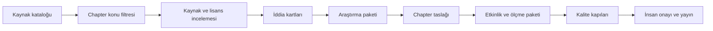

# Kaynaklardan Chapter Üretimine Entegrasyon Planı

## Amaç

Kaynak kataloğu ile ders üretimi aynı veri değildir. Arama motoru keşif ve erişim
sağlar; chapter üretimi ise doğrulanmış iddiaları, pedagojik sırayı ve özgün ASEA
anlatımını gerektirir. Bu plan iki sistemi kontrollü bir boru hattıyla bağlar.

## Chapter Düzeyi Eşleme

Bir kaynak chapter'a doğrudan yalnız şu koşullarda bağlanır:

- `academy_ids` ilgili akademiyi içerir;
- `chapter_ids` veya `topic_ids` chapter kapsamıyla kesişir;
- kaynak, chapter'ın giriş düzeyine uygundur veya yalnız ileri okuma olarak
  işaretlenmiştir;
- doğrulanacak iddia ve kullanılacak bölüm bellidir;
- erişim ve lisans politikası kayıtlıdır.

Kaynak chapter kapsamına uyuyor fakat başlangıç düzeyini aşıyorsa ana anlatı yerine
`Further Reading` alanına taşınır.

## Üretim Artefact'ları

Her yeni chapter aşağıdaki paketi üretmelidir:

| Artefact | İşlev |
|---|---|
| `research-packet.md` | Kanonik kaynaklar, iddialar, kavram sınırları |
| `research-validation.md` | Otorite, kapsam, çelişki ve lisans kontrolü |
| ana chapter | Sıfırdan öğrenen öğrenci için özgün ders |
| `examples.md` | Tahmin–izleme–açıklama örnekleri |
| `exercises.md` | Kademeli bağımsız pratik |
| `debugging.md` | Belirti–neden–kanıt–düzeltme |
| `lab.md` | Çalışan teslimat ve test kanıtı |
| `challenge.md` | Daha az yönlendirmeli transfer görevi |
| `quiz.md` ve cevap anahtarı | Kavram, iz sürme ve hata tanısı |
| `interview.md` | Sözlü teknik düşünme |
| `flashcards.md` | Geri çağırma |
| `ai-mentor.md` | Önce ipucu, sonra kavramsal açıklama |
| `english-terms.json` | Sağ panel İngilizce Terimler kartı |
| `visualization-notes.md` | Zorunlu ve amaçlı görseller |
| `project-increment.md` | Akademinin sürekli ana projesine küçük ek |
| `assessment-rubric.md` | Outcome düzeyi başarı kanıtı |

## Türk Öğrenci İçin Yazım Sözleşmesi

- Bilinmeyen kavram varsayılmaz; ön koşul bilgisi kısa tanı testiyle etkinleştirilir.
- Teknik terim ilk kullanımda Türkçe ve İngilizce birlikte verilir.
- İngilizce terim, birebir çeviriden çok kod ve dokümantasyonda nasıl görüldüğüyle
  açıklanır.
- Ton samimi bir öğretmen tonudur; doğruluk ve terminoloji gevşetilmez.
- Uzunluk üst sınırı yoktur; her bölüm yalnız outcome'a hizmet ettiği kadar uzar.
- Her ana kavram normal, sınır ve hata örneğiyle görünür hâle gelir.
- Çözüm anahtarlarında yalnız sonuç değil, adım adım gerekçe bulunur.

## Kalite Kapıları

1. Kaynak kapısı: en az iki bağımsız ve en az bir birincil kaynak.
2. Kapsam kapısı: blueprint dışı yeni teknoloji zorunlu değildir.
3. Yapı kapısı: Chapter Standard v2.0'ın 15 H2 başlığı doğru sıradadır.
4. Kod kapısı: örnekler çalıştırılır; beklenen sonuç ve hata davranışı kontrol edilir.
5. Öğretim kapısı: bilinmeyen terim, açıklamasız adım ve amaçsız görsel yoktur.
6. Ölçme kapısı: her learning outcome en az iki farklı kanıtla ölçülür.
7. Erişilebilirlik kapısı: başlık, tablo, renk dışı durum işareti ve klavye akışı
   gözden geçirilir.
8. Son kapı: otomatik kontrollerden sonra chapter kullanıcı onayına sunulur.

## Uygulama Sırası

İlk pilot `V01-C19` olacaktır. Pilot; ana ders, tam etkinlik paketi, İngilizce
Terimler kart verisi, zorunlu görseller ve proje artışıyla hazırlanır. Sonuç
onaylandıktan sonra aynı standart yeni chapter'lara uygulanır. Mevcut C01–C18'in
toplu yeniden standardizasyonu ayrı sonraki aşamada yapılacaktır; yalnız eksik C18
paketi şimdi tamamlanır.
